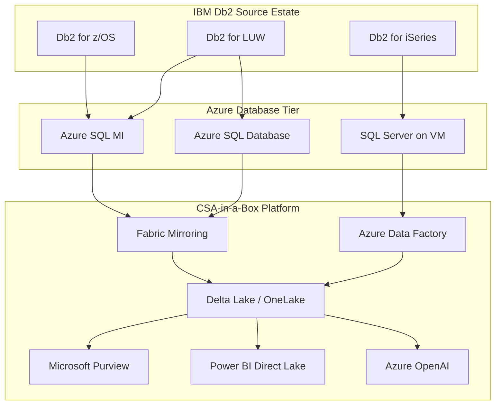

# IBM Db2 to Azure SQL Migration Center

**The definitive resource for migrating from IBM Db2 -- whether on z/OS mainframes, LUW servers, or IBM i -- to Microsoft Azure SQL Database, Azure SQL Managed Instance, or SQL Server on Azure VMs.**

---

## Who this is for

This migration center serves federal CIOs, CDOs, Chief Data Architects, database administrators, platform engineers, COBOL developers, and application teams who are evaluating or executing a migration from IBM Db2 to Azure SQL. Whether you are responding to mainframe hardware refresh costs, IBM license audit exposure, workforce retirement risk as Db2/mainframe talent ages out, or a strategic modernization mandate, these resources provide the evidence, patterns, and step-by-step guidance to execute confidently.

### Audience by role

| Role                          | Start here                                              | Key concern                                               |
| ----------------------------- | ------------------------------------------------------- | --------------------------------------------------------- |
| CIO / CDO / Executive sponsor | [Why Azure over Db2](why-azure-over-db2.md)             | Strategic rationale, workforce risk, innovation velocity  |
| CFO / Procurement             | [TCO Analysis](tco-analysis.md)                         | MIPS-based licensing elimination, 5-year projections      |
| Enterprise Architect          | [Feature Mapping](feature-mapping-complete.md)          | Capability parity, gap analysis, platform decisions       |
| DBA / Database Engineer       | [Schema Migration](schema-migration.md)                 | Data type mapping, SQL syntax conversion, index migration |
| Application Developer         | [Application Migration](application-migration.md)       | JDBC/ODBC changes, embedded SQL, connection strings       |
| COBOL / Mainframe Engineer    | [Mainframe Considerations](mainframe-considerations.md) | EBCDIC conversion, CICS replacement, JCL modernization    |
| Stored Procedure Developer    | [Stored Procedure Migration](stored-proc-migration.md)  | SQL PL to T-SQL, condition handlers, dynamic SQL          |
| Security / Compliance         | [Federal Migration Guide](federal-migration-guide.md)   | FedRAMP, FISMA, CUI, data residency                       |

---

## Quick-start decision matrix

| Your situation                           | Start here                                                             |
| ---------------------------------------- | ---------------------------------------------------------------------- |
| Executive evaluating Db2 displacement    | [Why Azure over Db2](why-azure-over-db2.md)                            |
| Need cost justification for migration    | [Total Cost of Ownership Analysis](tco-analysis.md)                    |
| Need a feature-by-feature comparison     | [Complete Feature Mapping (40+ features)](feature-mapping-complete.md) |
| Db2 LUW, standard OLTP workloads         | [Tutorial: SSMA Migration](tutorial-ssma-migration.md)                 |
| Db2 LUW, need SQL Agent / linked servers | [Tutorial: Azure SQL MI](tutorial-azure-sql-mi.md)                     |
| Db2 on z/OS mainframe                    | [Mainframe Considerations](mainframe-considerations.md)                |
| Need SQL PL to T-SQL conversion patterns | [Stored Procedure Migration](stored-proc-migration.md)                 |
| Need data type and SQL syntax mapping    | [Schema Migration](schema-migration.md)                                |
| Planning data movement strategy          | [Data Migration](data-migration.md)                                    |
| Updating Java/COBOL applications         | [Application Migration](application-migration.md)                      |
| Federal/government-specific requirements | [Federal Migration Guide](federal-migration-guide.md)                  |
| Want assessment methodology              | [Best Practices](best-practices.md)                                    |
| Ready to plan full migration             | [Migration Playbook](../db2-to-azure-sql.md)                           |

---

## Target platform comparison

The first decision is which Azure SQL deployment model to target. Db2 workloads typically land on one of three targets.

| Criterion                   | Azure SQL Database                   | Azure SQL Managed Instance                    | SQL Server on Azure VM                         |
| --------------------------- | ------------------------------------ | --------------------------------------------- | ---------------------------------------------- |
| **Best for**                | Simple OLTP, web apps, microservices | Enterprise OLTP, batch, complex Db2 workloads | Legacy apps needing full OS/SQL Server control |
| **License cost**            | Included in service (vCore or DTU)   | Included in service (vCore)                   | SQL Server license (AHB eligible)              |
| **SQL PL conversion**       | SSMA (automated 70-85%)              | SSMA (automated 70-85%)                       | SSMA (automated 70-85%)                        |
| **SQL Agent jobs**          | No (use Elastic Jobs)                | Yes                                           | Yes                                            |
| **Linked servers**          | No                                   | Yes                                           | Yes                                            |
| **Cross-database queries**  | Elastic query                        | Native cross-database                         | Native cross-database                          |
| **CLR support**             | Limited                              | Yes                                           | Yes                                            |
| **Service Broker**          | No                                   | Yes (deprecated features)                     | Yes                                            |
| **High availability**       | Built-in (99.995% SLA)               | Built-in (99.99% SLA)                         | Always On (customer-managed)                   |
| **Max database size**       | 128 TB (Hyperscale)                  | 16 TB                                         | VM disk limits                                 |
| **Managed service**         | Yes (PaaS)                           | Yes (PaaS)                                    | No (IaaS)                                      |
| **Fabric Mirroring**        | GA                                   | GA                                            | Via ADF pipelines                              |
| **Gov region availability** | GA in Azure Gov                      | GA in Azure Gov                               | GA in Azure Gov                                |
| **Migration complexity**    | Low-Medium                           | Medium                                        | Medium                                         |

### When to choose each target

**Azure SQL Database** -- Choose when the Db2 workload is a straightforward OLTP database with no dependency on SQL Agent jobs, linked servers, or cross-database queries. Best for departmental Db2 LUW databases backing web applications or microservices.

**Azure SQL Managed Instance** -- The default recommendation for most Db2 migrations. Provides the broadest T-SQL surface area including SQL Agent, linked servers, cross-database queries, CLR, and Service Broker. Handles the batch job patterns that are common in Db2 environments. Recommended for Db2 for z/OS workloads that have been decoupled from CICS/IMS.

**SQL Server on Azure VMs** -- Choose when you need full OS-level control, custom SQL Server configurations, or third-party tools that require direct installation on the SQL Server host. Also appropriate when running a legacy application that has been tested only against a specific SQL Server version.

---

## How CSA-in-a-Box fits

Regardless of which Azure SQL target you choose, CSA-in-a-Box serves as the unified analytics, governance, and AI platform that consumes data from migrated Db2 workloads. The migration is not just a database lift -- it is a modernization into a cloud-native analytics ecosystem.

**Key integration points:**

- **Fabric Mirroring** replicates Azure SQL MI and Azure SQL Database into OneLake in near-real-time, landing the data as Delta tables ready for analytics, ML, and reporting.
- **Azure Data Factory** uses the Db2 connector during migration to move data from source Db2 instances and continues to serve as the orchestration layer for incremental loads.
- **Microsoft Purview** scans the migrated databases, classifies sensitive columns (PII, PHI, CUI), and provides lineage from original Db2 source through to Power BI reports.
- **Power BI Direct Lake** mode queries the Delta tables directly without import, giving sub-second performance over the migrated data.
- **Azure OpenAI** enables natural-language queries, document analysis, and intelligent automation over data that was previously locked in batch-oriented Db2 processing.

---

## Strategic resources

These documents provide the business case, cost analysis, and strategic framing for decision-makers.

| Document                                                | Audience                    | Description                                                                                                                                         |
| ------------------------------------------------------- | --------------------------- | --------------------------------------------------------------------------------------------------------------------------------------------------- |
| [Why Azure over Db2](why-azure-over-db2.md)             | CIO / CDO / Board           | Executive white paper covering mainframe modernization, workforce risk, T-SQL talent pool advantages, and honest assessment of migration complexity |
| [Total Cost of Ownership Analysis](tco-analysis.md)     | CFO / CIO / Procurement     | Detailed MIPS-based and PVU-based IBM licensing models vs Azure consumption pricing, 5-year projections, mainframe decommission economics           |
| [Complete Feature Mapping](feature-mapping-complete.md) | CTO / Platform Architecture | 40+ Db2 features mapped to Azure SQL equivalents with migration complexity ratings and gap analysis                                                 |

---

## Migration guides

Domain-specific deep dives covering every aspect of a Db2-to-Azure SQL migration.

| Guide                                                   | Db2 capability                           | Azure destination                                   |
| ------------------------------------------------------- | ---------------------------------------- | --------------------------------------------------- |
| [Schema Migration](schema-migration.md)                 | Data types, SQL syntax, table structures | T-SQL schema, data types, filegroups                |
| [Data Migration](data-migration.md)                     | EXPORT/LOAD utilities, large tables      | SSMA data migration, ADF, BCP, bulk insert          |
| [Stored Procedure Migration](stored-proc-migration.md)  | SQL PL procedures, functions, triggers   | T-SQL procedures, TRY/CATCH, functions              |
| [Application Migration](application-migration.md)       | JDBC/ODBC, embedded SQL, COBOL           | ADO.NET, JDBC for SQL Server, parameterized queries |
| [Mainframe Considerations](mainframe-considerations.md) | z/OS, EBCDIC, CICS/IMS, JCL, VSAM        | Unicode, REST APIs, ADF, Azure Batch, Blob Storage  |

---

## Tutorials

Step-by-step walkthroughs for hands-on migration execution.

| Tutorial                                                        | Duration  | Description                                                                                                                 |
| --------------------------------------------------------------- | --------- | --------------------------------------------------------------------------------------------------------------------------- |
| [SSMA Migration (Db2 to Azure SQL)](tutorial-ssma-migration.md) | 4-6 hours | Install SSMA for Db2, connect to source, assess, convert schema, remediate, migrate data, validate                          |
| [Db2 LUW to Azure SQL MI](tutorial-azure-sql-mi.md)             | 6-8 hours | End-to-end migration of a Db2 LUW database to Azure SQL MI including stored procedures, batch jobs, and application cutover |

---

## Government and federal

| Document                                              | Description                                                                                                                                                  |
| ----------------------------------------------------- | ------------------------------------------------------------------------------------------------------------------------------------------------------------ |
| [Federal Migration Guide](federal-migration-guide.md) | Mainframe modernization in federal agencies (IRS, SSA, DoD, VA), Azure SQL in Gov regions, FedRAMP High, FISMA, data residency for CUI, acquisition strategy |

---

## Best practices and methodology

| Document                            | Description                                                                                                                                             |
| ----------------------------------- | ------------------------------------------------------------------------------------------------------------------------------------------------------- |
| [Best Practices](best-practices.md) | Assessment methodology, complexity tiers, COBOL dependency analysis, batch workload modernization, testing strategy, CSA-in-a-Box analytics integration |

---

## Migration timeline estimates

Migration timelines vary significantly based on the Db2 platform and workload complexity.

| Db2 source                                | Complexity   | Typical duration | Key risk factors                                 |
| ----------------------------------------- | ------------ | ---------------- | ------------------------------------------------ |
| Db2 LUW, single database, no stored procs | Simple       | 4-8 weeks        | Data volume, application testing                 |
| Db2 LUW, multiple databases, stored procs | Moderate     | 12-20 weeks      | SQL PL conversion, batch jobs                    |
| Db2 LUW, complex enterprise workload      | Complex      | 20-36 weeks      | Cross-database dependencies, integration testing |
| Db2 for z/OS, decoupled from CICS         | Complex      | 24-40 weeks      | EBCDIC conversion, batch replacement             |
| Db2 for z/OS, coupled with CICS/IMS/COBOL | Very complex | 36-52+ weeks     | Full mainframe modernization program             |

---

## Db2 platform-specific entry points

### Db2 for LUW (Linux/UNIX/Windows)

Most Db2 LUW migrations follow a well-established path through SSMA for Db2. The tooling is mature, and the SQL dialect differences between Db2 LUW SQL and T-SQL are manageable. Start with [Tutorial: SSMA Migration](tutorial-ssma-migration.md) for the end-to-end workflow.

### Db2 for z/OS (mainframe)

Db2 for z/OS migrations are fundamentally mainframe modernization projects. The database migration itself is one workstream within a larger program that includes CICS/IMS replacement, JCL batch modernization, COBOL code conversion, and EBCDIC-to-Unicode transformation. Start with [Mainframe Considerations](mainframe-considerations.md) for the full picture.

### Db2 for iSeries (IBM i / AS/400)

Db2 for iSeries (now Db2 for i) presents unique challenges around RPG program dependencies and integrated file system (IFS) considerations. The SQL dialect is close to Db2 LUW, and SSMA for Db2 can connect to iSeries databases via DRDA. Application modernization typically involves replacing RPG programs with modern APIs.

---

## Frequently asked questions

**How long does a typical Db2 migration take?**

It depends on the Db2 platform and complexity. A simple Db2 LUW database with no stored procedures takes 4-8 weeks. A complex enterprise Db2 LUW workload with stored procedures and batch jobs takes 20-36 weeks. Db2 for z/OS with CICS/IMS coupling is a 36-52+ week program. See the [timeline estimates](#migration-timeline-estimates) above for detailed breakdowns.

**Does SSMA for Db2 support Db2 for z/OS?**

Yes. SSMA connects to Db2 for z/OS via the DRDA protocol. You need network connectivity (typically port 446) from the SSMA workstation to the z/OS DRDA listener. The SSMA assessment and schema conversion work the same way regardless of whether the source is z/OS or LUW.

**What about Db2 features that Azure SQL does not support?**

See the [Complete Feature Mapping](feature-mapping-complete.md) for the full gap analysis. The most significant gaps are BEFORE triggers (convert to INSTEAD OF), SQL PL condition handlers (convert to TRY/CATCH), and DECFLOAT data types (convert to DECIMAL). None of these gaps are migration blockers; all have documented workarounds.

**Can I migrate just the data without migrating the applications?**

Yes. Azure Data Factory's Db2 connector can replicate data from Db2 (z/OS or LUW) into Azure SQL or directly into Fabric. This is a common first step: replicate data for analytics before modernizing applications. See the [best practices](best-practices.md) section on hybrid approaches.

**Is Azure SQL MI available in Azure Government?**

Yes. Azure SQL Managed Instance is GA in all Azure Government regions (US Gov Virginia, US Gov Texas, US Gov Arizona, US DoD Central, US DoD East) with FedRAMP High authorization. See the [Federal Migration Guide](federal-migration-guide.md) for compliance details.

**What happens to my COBOL programs?**

COBOL programs with embedded SQL (EXEC SQL) require modernization or emulation. Options include rewriting in Java/.NET, running on Micro Focus Enterprise Server on Azure VMs, or wrapping as APIs. See [Mainframe Considerations](mainframe-considerations.md) for detailed COBOL migration patterns.

---

## Related resources

- **Migration playbook:** [Db2 to Azure SQL Playbook](../db2-to-azure-sql.md) -- the condensed end-to-end guide
- **Companion database migrations:** [Oracle to Azure](../oracle-to-azure/index.md) | [SQL Server to Azure](../sql-server-to-azure/index.md) | [SAP to Azure](../sap-to-azure/index.md)
- **CSA-in-a-Box platform:**
    - `csa_platform/unity_catalog_pattern/` -- OneLake + Unity Catalog
    - `csa_platform/csa_platform/governance/purview/` -- Purview automation, classifications
    - `csa_platform/ai_integration/` -- AI Foundry / Azure OpenAI
    - `csa_platform/data_marketplace/` -- Data product registry
- **Compliance matrices:**
    - `docs/compliance/nist-800-53-rev5.md` / `csa_platform/csa_platform/governance/compliance/nist-800-53-rev5.yaml`
    - `docs/compliance/cmmc-2.0-l2.md` / `csa_platform/csa_platform/governance/compliance/cmmc-2.0-l2.yaml`
    - `docs/compliance/hipaa-security-rule.md` / `csa_platform/csa_platform/governance/compliance/hipaa-security-rule.yaml`

---

**Maintainers:** csa-inabox core team
**Last updated:** 2026-04-30
