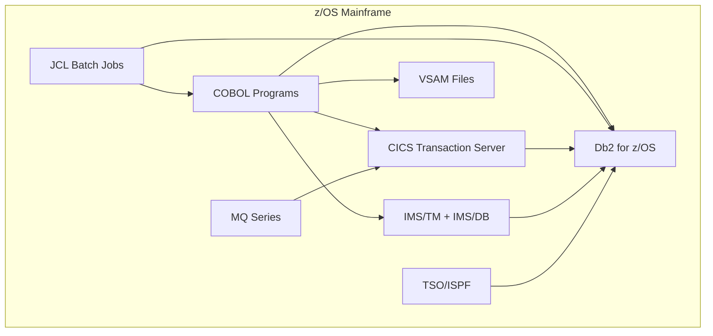
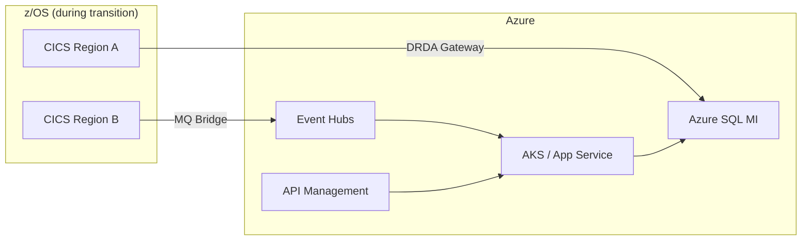
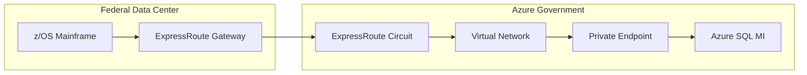

# Mainframe Considerations -- Db2 for z/OS Migration

**Audience:** Mainframe Engineers, z/OS System Programmers, Enterprise Architects
**Purpose:** Comprehensive guide for Db2 for z/OS-specific migration challenges including EBCDIC-to-Unicode conversion, CICS/IMS integration patterns, JCL batch replacement, VSAM file migration, and mainframe networking.

---

## Overview

Migrating Db2 for z/OS to Azure SQL is fundamentally a mainframe modernization project. The database migration is one workstream within a larger program that addresses the tightly coupled z/OS ecosystem. This guide covers the z/OS-specific concerns that do not apply to Db2 for LUW migrations.

### z/OS ecosystem dependencies



Each of these components requires a migration strategy. Migrating Db2 in isolation, without addressing CICS, COBOL, JCL, and VSAM, leaves the mainframe running without its primary database -- which is rarely a viable outcome.

---

## 1. EBCDIC to Unicode conversion

### The encoding challenge

Db2 for z/OS stores character data in EBCDIC (Extended Binary Coded Decimal Interchange Code), using Coded Character Set Identifiers (CCSIDs) to define the encoding. Azure SQL stores all character data in Unicode (UTF-16 for NCHAR/NVARCHAR, UTF-8 optional for CHAR/VARCHAR).

Common z/OS CCSIDs:

| CCSID | Name                 | Usage                             |
| ----- | -------------------- | --------------------------------- |
| 037   | EBCDIC US/Canada     | Most US federal systems           |
| 500   | EBCDIC International | Multi-national organizations      |
| 1140  | EBCDIC US with Euro  | Updated version of 037            |
| 1047  | EBCDIC Open Systems  | Unix System Services on z/OS      |
| 1208  | UTF-8                | z/OS Unicode (rare in legacy Db2) |

### Conversion approach

**SSMA for Db2** handles EBCDIC-to-Unicode conversion automatically for standard CCSIDs when connecting via DRDA. The DRDA protocol negotiates character conversion between the z/OS Db2 subsystem and the SSMA client.

**Potential issues:**

1. **Custom EBCDIC characters:** Some agencies use custom code pages with organization-specific characters (e.g., special symbols for forms processing). These characters may not have Unicode mappings and will appear as the Unicode replacement character (U+FFFD).

2. **Mixed EBCDIC/ASCII columns:** Some z/OS applications store ASCII data in EBCDIC columns (e.g., data received from distributed systems and stored without conversion). These columns will be double-converted -- EBCDIC-to-Unicode conversion will corrupt the already-ASCII data.

3. **Packed decimal in character fields:** Legacy COBOL programs sometimes store packed decimal values in CHAR columns. These are binary data, not text, and must be identified and handled separately.

4. **GRAPHIC/VARGRAPHIC DBCS data:** Double-byte character set data (Japanese, Chinese, Korean) stored in GRAPHIC columns requires careful CCSID mapping to ensure correct Unicode conversion.

### Validation strategy

After conversion, run validation queries to detect encoding issues:

```sql
-- Azure SQL: detect Unicode replacement characters
SELECT table_name, column_name, pk_value
FROM (
    -- Generate for each character column in migrated tables
    SELECT 'CUSTOMERS' AS table_name, 'NAME' AS column_name,
           customer_id AS pk_value
    FROM CUSTOMERS
    WHERE NAME LIKE '%' + NCHAR(0xFFFD) + '%'
) encoding_issues;
```

```sql
-- Azure SQL: detect control characters that may indicate binary data in char columns
SELECT customer_id, name
FROM CUSTOMERS
WHERE name LIKE '%[' + CHAR(0) + '-' + CHAR(31) + ']%';
```

### EBCDIC sort order differences

EBCDIC and Unicode have different collation orders. In EBCDIC, lowercase letters sort before uppercase (a < A). In Unicode/ASCII, uppercase sorts before lowercase (A < a). This affects:

- ORDER BY results
- Comparison operations (WHERE name > 'M')
- Index range scans

**Mitigation:** Use an explicit collation in Azure SQL that matches your application's expectations:

```sql
-- Use case-insensitive collation to minimize sort-order impact
ALTER DATABASE FinanceDB COLLATE SQL_Latin1_General_CP1_CI_AS;
```

---

## 2. CICS integration patterns

### CICS transaction replacement

CICS (Customer Information Control System) is the primary transaction monitor on z/OS. CICS regions host online transaction programs (OLTPs) that process user requests in real time. These programs typically:

1. Receive a request via a 3270 terminal or MQ message
2. Execute Db2 SQL within a CICS unit of work
3. Return results to the terminal or queue

### Migration paths for CICS transactions

| Approach                                    | Description                                                                                    | Best for                             | Effort    |
| ------------------------------------------- | ---------------------------------------------------------------------------------------------- | ------------------------------------ | --------- |
| **REST API modernization**                  | Rewrite CICS transactions as REST APIs (Java/Spring Boot, .NET, or Node.js) on Azure           | New development, cloud-native target | Very high |
| **Azure API Management + backend**          | Expose modernized services via APIM; implement backend in Azure Functions, AKS, or App Service | API-first architecture               | High      |
| **Micro Focus Enterprise Server**           | Run COBOL/CICS programs unchanged on Azure VMs with ODBC connectivity to Azure SQL             | Risk-averse, short timeline          | Medium    |
| **Hybrid: CICS on mainframe, Db2 on Azure** | Keep CICS on z/OS, route Db2 requests to Azure SQL via DRDA gateway or linked server           | Phased modernization                 | Medium    |

### CICS-to-Azure architecture pattern



### CICS EXEC SQL to modern data access

```cobol
* COBOL/CICS embedded SQL
       EXEC SQL
           SELECT ACCT_NAME, ACCT_BAL
           INTO :WS-ACCT-NAME, :WS-ACCT-BAL
           FROM ACCOUNTS
           WHERE ACCT_ID = :WS-ACCT-ID
       END-EXEC

       IF SQLCODE = 0
           EXEC CICS SEND MAP('ACCTMAP') MAPSET('ACCTSET')
               FROM(ACCT-OUTPUT-MAP)
           END-EXEC
       ELSE IF SQLCODE = 100
           MOVE 'ACCOUNT NOT FOUND' TO WS-ERROR-MSG
       END-IF
```

The modernized equivalent would be a REST API:

```java
// Modern Java/Spring Boot equivalent
@GetMapping("/api/accounts/{accountId}")
public ResponseEntity<Account> getAccount(@PathVariable int accountId) {
    Account account = accountRepository.findById(accountId)
        .orElseThrow(() -> new AccountNotFoundException(accountId));
    return ResponseEntity.ok(account);
}
```

---

## 3. IMS integration patterns

### IMS/DB (hierarchical database)

IMS/DB is a hierarchical database that coexists with Db2 on many mainframes. Applications may read from IMS/DB and write to Db2, or vice versa. IMS/DB data must be migrated separately.

| IMS/DB component                        | Azure migration target              | Notes                                                 |
| --------------------------------------- | ----------------------------------- | ----------------------------------------------------- |
| IMS segments/hierarchies                | Azure SQL relational tables         | Flatten hierarchical structure into relational tables |
| IMS PCBs (Program Communication Blocks) | ADO.NET/JDBC connections            | Application data access layer replacement             |
| IMS DBDs (Database Descriptions)        | SQL Server schema                   | DDL conversion from hierarchical to relational        |
| IMS PSBs (Program Specification Blocks) | SQL permissions + stored procedures | Security and access patterns                          |

### IMS/TM (Transaction Manager)

IMS/TM serves a similar role to CICS for IMS-connected programs. Migration follows the same patterns as CICS replacement -- REST API modernization, Micro Focus emulation, or hybrid operation.

---

## 4. JCL batch job replacement

### Understanding JCL batch architecture

z/OS batch processing uses JCL (Job Control Language) to define jobs, steps, datasets, and program execution:

```jcl
//DAILYJOB JOB (ACCT),'DAILY PROCESSING',CLASS=A,MSGCLASS=X
//STEP01   EXEC PGM=IKJEFT01
//SYSTSIN  DD *
  DSN SYSTEM(DB2P)
  RUN PROGRAM(DAILYRPT) PLAN(DAILYRPT) -
      PARMS('20260430')
  END
//SYSPRINT DD SYSOUT=*
//STEPLIB  DD DSN=DB2.SDSNLOAD,DISP=SHR
```

### JCL replacement options on Azure

| JCL pattern                | Azure replacement                   | When to use                                          |
| -------------------------- | ----------------------------------- | ---------------------------------------------------- |
| Single SQL step            | **Azure SQL MI SQL Agent job**      | Simple SQL execution with scheduling                 |
| Multi-step processing      | **ADF pipeline**                    | Complex orchestration with dependencies              |
| Long-running compute       | **Azure Batch**                     | CPU-intensive processing (equivalent to batch class) |
| File-based processing      | **Azure Functions** + Blob triggers | Event-driven file processing                         |
| Job scheduling (CA-7, TWS) | **ADF triggers** + **Logic Apps**   | Calendar-based and event-based scheduling            |

### ADF pipeline replacing a JCL job stream

```json
{
    "name": "DailyProcessingPipeline",
    "properties": {
        "activities": [
            {
                "name": "Step01_ExtractData",
                "type": "Copy",
                "typeProperties": {
                    "source": {
                        "type": "AzureSqlSource",
                        "sqlReaderQuery": "EXEC sp_extract_daily_data @date = '@{pipeline().parameters.processDate}'"
                    },
                    "sink": { "type": "DelimitedTextSink" }
                }
            },
            {
                "name": "Step02_TransformData",
                "type": "SqlServerStoredProcedure",
                "dependsOn": [
                    {
                        "activity": "Step01_ExtractData",
                        "dependencyConditions": ["Succeeded"]
                    }
                ],
                "typeProperties": {
                    "storedProcedureName": "sp_daily_transform",
                    "storedProcedureParameters": {
                        "processDate": {
                            "value": "@pipeline().parameters.processDate"
                        }
                    }
                }
            },
            {
                "name": "Step03_GenerateReport",
                "type": "SqlServerStoredProcedure",
                "dependsOn": [
                    {
                        "activity": "Step02_TransformData",
                        "dependencyConditions": ["Succeeded"]
                    }
                ],
                "typeProperties": {
                    "storedProcedureName": "sp_generate_daily_report"
                }
            }
        ],
        "parameters": {
            "processDate": {
                "type": "String",
                "defaultValue": "@utcnow('yyyy-MM-dd')"
            }
        }
    }
}
```

### JCL condition code to ADF error handling

JCL condition codes (COND parameter) control step execution based on return codes:

```jcl
//STEP03   EXEC PGM=RPTGEN,COND=(4,LT,STEP01)
```

In ADF, this maps to dependency conditions:

- `COND=(0,EQ)` -> `dependencyConditions: ["Succeeded"]`
- `COND=(4,LT)` -> `dependencyConditions: ["Succeeded"]` with error threshold in stored procedure
- `COND=(8,LT)` -> `dependencyConditions: ["Completed"]` (run regardless of prior failure)

---

## 5. VSAM file migration

### VSAM to Azure Storage mapping

| VSAM type                  | Description                  | Azure target                                  | Notes                                                       |
| -------------------------- | ---------------------------- | --------------------------------------------- | ----------------------------------------------------------- |
| **KSDS** (Key-Sequenced)   | Indexed records by key       | Azure SQL table with primary key              | Most common; relational mapping is natural                  |
| **ESDS** (Entry-Sequenced) | Sequential append-only       | Azure Blob Storage (append blob) or Azure SQL | Log-like data; consider Blob for archive, SQL for queryable |
| **RRDS** (Relative Record) | Fixed-length records by slot | Azure SQL table with INT identity             | Slot-based access maps to identity column                   |
| **LDS** (Linear Data Set)  | Byte-range addressable       | Azure Blob Storage (page blob)                | Rarely used; map to page blob or restructure                |

### VSAM-to-SQL conversion pattern

```cobol
* COBOL reading VSAM KSDS
       OPEN INPUT ACCT-FILE
       MOVE WS-ACCT-KEY TO ACCT-KEY
       READ ACCT-FILE
           INVALID KEY
               MOVE 'NOT FOUND' TO WS-STATUS
       END-READ
```

Becomes:

```sql
-- SQL query replacing VSAM READ
SELECT acct_name, acct_balance, acct_status
FROM accounts
WHERE acct_key = @acct_key;
```

### Bulk VSAM extraction

Use IBM's IDCAMS REPRO to extract VSAM data to sequential format, then convert and load:

```jcl
//EXTRACT  EXEC PGM=IDCAMS
//SYSPRINT DD SYSOUT=*
//INFILE   DD DSN=PROD.ACCT.VSAM,DISP=SHR
//OUTFILE  DD DSN=PROD.ACCT.EXTRACT,DISP=(NEW,CATLG),
//            SPACE=(CYL,(100,50),RLSE),
//            DCB=(RECFM=VB,LRECL=500,BLKSIZE=32760)
//SYSIN    DD *
  REPRO INFILE(INFILE) OUTFILE(OUTFILE)
/*
```

Transfer the extracted sequential file to Azure (via SFTP, Connect:Direct, or Sterling File Gateway), convert the fixed/variable-length records to CSV using a conversion utility, and load into Azure SQL via BULK INSERT or ADF.

---

## 6. Mainframe networking (SNA to TCP/IP)

### Current state: SNA and 3270

Many mainframe environments still use SNA (Systems Network Architecture) for connectivity:

- **3270 terminals** connect via TN3270 (TCP/IP encapsulated SNA)
- **LU 6.2** (APPC) for program-to-program communication
- **VTAM** manages SNA network resources
- **DRDA** (Distributed Relational Database Architecture) for remote Db2 access over TCP/IP

### Target state: TCP/IP-native

| Mainframe protocol       | Azure replacement               | Notes                                    |
| ------------------------ | ------------------------------- | ---------------------------------------- |
| TN3270 terminal access   | Web browser + Azure App Service | Modernize terminal UI to web application |
| LU 6.2 / APPC            | REST APIs / gRPC                | Program-to-program becomes API-to-API    |
| VTAM                     | Azure Virtual Network           | Network management is software-defined   |
| DRDA (Db2 remote access) | TDS (SQL Server protocol)       | Native TCP/IP; standard port 1433        |
| MQ Series (z/OS)         | Azure Service Bus or Event Hubs | Message queueing replacement             |
| FTP/SFTP (file transfer) | AzCopy / Azure Blob Storage     | File transfer to cloud storage           |

### Network connectivity during migration

During the transition period, establish connectivity between the mainframe and Azure:

1. **ExpressRoute** -- dedicated private connection from the data center to Azure Government. Recommended for production traffic and data migration.
2. **Site-to-Site VPN** -- encrypted tunnel over the internet. Acceptable for development/test and low-volume data transfer.
3. **DRDA Gateway** -- if CICS/IMS programs must access Azure SQL during the transition, configure a DRDA gateway that translates DRDA protocol to TDS (SQL Server wire protocol).

### Connectivity architecture



---

## 7. z/OS Db2 subsystem migration checklist

- [ ] Inventory all Db2 subsystems (production, QA, DR)
- [ ] Document CCSID configuration for each subsystem (EBCDIC code pages)
- [ ] Catalog all bound packages and plans (BIND/REBIND inventory)
- [ ] Map CICS regions to Db2 subsystems (which CICS regions use which Db2)
- [ ] Map IMS regions to Db2 subsystems
- [ ] Inventory all JCL job streams that access Db2
- [ ] Identify VSAM files that interact with Db2 (cross-reference in batch jobs)
- [ ] Document MQ Series queues that trigger Db2 transactions
- [ ] Identify DRDA connections from distributed systems to z/OS Db2
- [ ] Map TSO/ISPF usage patterns (developer/DBA access)
- [ ] Document SMF recording configuration (audit trail preservation)
- [ ] Identify Db2 utilities scheduled in the batch window (REORG, RUNSTATS, COPY, RECOVER)
- [ ] Assess COBOL program inventory (count programs with EXEC SQL)
- [ ] Evaluate vendor products with Db2 dependencies (BMC, CA/Broadcom, Compuware)

---

## 8. Mainframe LPAR capacity reduction planning

After migrating Db2 workloads to Azure, the mainframe LPAR capacity allocated to Db2 can be reduced, yielding immediate MLC (Monthly License Charge) savings for all z/OS software products.

### Capacity reduction timeline

| Milestone                    | Action                                      | MLC impact               |
| ---------------------------- | ------------------------------------------- | ------------------------ |
| Pilot database migrated      | No LPAR change yet                          | None                     |
| 25% of Db2 workload migrated | Reduce Db2 LPAR WLM service class           | 5-10% MLC reduction      |
| 50% of Db2 workload migrated | Reduce Db2 LPAR defined capacity            | 15-25% MLC reduction     |
| 75% of Db2 workload migrated | Consolidate remaining Db2 into smaller LPAR | 30-45% MLC reduction     |
| 100% Db2 migrated            | Decommission Db2 LPAR entirely              | Full Db2 MLC elimination |

**Important:** Coordinate LPAR capacity changes with IBM's sub-capacity reporting cycle (SCRT) to realize MLC savings in the next billing period.

---

## Related resources

- [Schema Migration](schema-migration.md) -- data type conversion (including EBCDIC types)
- [Data Migration](data-migration.md) -- z/OS data extraction and transfer
- [Application Migration](application-migration.md) -- COBOL embedded SQL patterns
- [Federal Migration Guide](federal-migration-guide.md) -- federal mainframe modernization context
- [Best Practices](best-practices.md) -- complexity assessment for mainframe workloads

---

**Maintainers:** csa-inabox core team
**Last updated:** 2026-04-30
