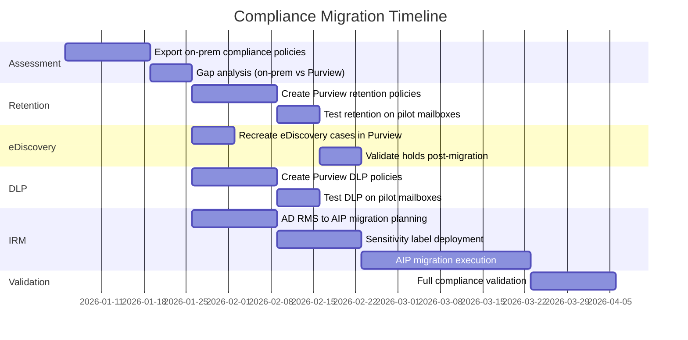

# Compliance Migration: Exchange On-Premises to Exchange Online

**Status:** Authored 2026-04-30
**Audience:** Compliance officers, Exchange administrators, and M365 architects ensuring regulatory continuity during Exchange Online migration.
**Scope:** Retention policies, eDiscovery, DLP, journaling, Information Rights Management, sensitivity labels, and Microsoft Purview integration for unified compliance.

---

## Overview

Compliance migration is the most overlooked and most critical workstream in an Exchange Online migration. Mailbox data moves with the mailbox, but compliance policies, holds, and governance rules do not automatically translate from on-premises Exchange to their cloud equivalents. Failure to migrate compliance settings can result in:

- **Regulatory violations** if retention policies are not applied post-migration.
- **Litigation exposure** if legal holds are not preserved.
- **Data loss** if DLP policies are not enforced during the transition.
- **Audit failures** if journaling rules stop functioning.

This document maps every on-premises compliance feature to its Exchange Online / Microsoft Purview equivalent and provides migration steps.

---

## 1. Retention policies: MRM to Purview retention

### On-premises: Messaging Records Management (MRM)

Exchange on-premises uses MRM with three components:

- **Retention tags** (Default Policy Tags, Retention Policy Tags, Personal Tags).
- **Retention policies** (collections of tags applied to mailboxes).
- **Managed Folder Assistant** (processes mailboxes and enforces retention).

### Exchange Online: Microsoft Purview retention

Purview retention replaces MRM with a unified model that covers email, SharePoint, OneDrive, Teams, and Yammer.

| MRM concept                            | Purview equivalent                                | Migration notes                                                 |
| -------------------------------------- | ------------------------------------------------- | --------------------------------------------------------------- |
| Default Policy Tag (DPT)               | Org-wide retention policy                         | `New-RetentionCompliancePolicy` + `New-RetentionComplianceRule` |
| Retention Policy Tag (RPT)             | Per-label retention policy                        | Map each RPT to a Purview retention label                       |
| Personal Tag                           | Retention label (user-applied)                    | Users apply labels in Outlook instead of personal tags          |
| Retention policy (assigned to mailbox) | Purview retention policy (scoped to users/groups) | Scope by user, group, or entire org                             |
| Delete action                          | Delete after retention period                     | Same behavior                                                   |
| Move to Archive action                 | Auto-expanding archive + retention                | Archive policy continues to function in EXO                     |
| Managed Folder Assistant               | Purview retention processing                      | Automatic; no admin configuration                               |

### Migration steps

```powershell
# Step 1: Export current MRM policies
Get-RetentionPolicy | Format-List Name, RetentionPolicyTagLinks
Get-RetentionPolicyTag | Select-Object Name, Type, AgeLimitForRetention, RetentionAction |
    Export-Csv C:\Migration\retention-tags.csv -NoTypeInformation

# Step 2: Create Purview retention policies (Security & Compliance PowerShell)
Connect-IPPSSession -UserPrincipalName admin@domain.com

# Example: Create org-wide 7-year retention policy for email
New-RetentionCompliancePolicy -Name "Email-7Year-Retain" `
    -ExchangeLocation "All" `
    -Enabled $true

New-RetentionComplianceRule -Policy "Email-7Year-Retain" `
    -Name "Retain email 7 years" `
    -RetentionDuration 2555 `
    -RetentionComplianceAction Keep `
    -RetentionDurationDisplayHint Days

# Example: Create retention label for user-applied classification
New-ComplianceTag -Name "Confidential-5Year" `
    -RetentionAction Keep `
    -RetentionDuration 1825 `
    -RetentionType CreationAgeInDays

# Publish the label to users
New-RetentionCompliancePolicy -Name "Confidential-Label-Policy" `
    -ExchangeLocation "All"
# Add the label to the policy via Purview compliance portal
```

!!! info "MRM continues to work in Exchange Online"
Existing MRM retention policies continue to function in Exchange Online. You do not need to migrate immediately. However, Purview retention is the strategic platform and provides cross-workload coverage. Plan to transition from MRM to Purview retention within 6--12 months of migration.

### CSA-in-a-Box integration

CSA-in-a-Box extends Purview retention beyond email:

- **Unified retention policies** apply to email, SharePoint (data lake documentation), and Teams (collaboration).
- **Purview Data Lifecycle Management** governs both email retention and data lake table retention.
- **Compliance dashboards** in Power BI show retention policy coverage across the entire organization --- email and data assets together.

---

## 2. eDiscovery: In-Place eDiscovery to Purview eDiscovery

### On-premises: In-Place eDiscovery

Exchange on-premises provides In-Place eDiscovery for searching mailboxes and placing them on hold. This feature is **deprecated** and has been replaced by Purview eDiscovery.

### Exchange Online: Microsoft Purview eDiscovery

| On-prem capability         | Purview eDiscovery equivalent                                            | License |
| -------------------------- | ------------------------------------------------------------------------ | ------- |
| In-Place eDiscovery search | Purview Content Search                                                   | E3/G3   |
| In-Place Hold              | Purview eDiscovery hold (case-based)                                     | E3/G3   |
| Discovery mailbox          | Not needed (export to PST or review set)                                 | E3/G3   |
| Multi-mailbox search       | Purview eDiscovery Standard                                              | E3/G3   |
| Advanced analytics         | Purview eDiscovery Premium (predictive coding, near-duplicate detection) | E5/G5   |
| Review sets                | Purview eDiscovery Premium review sets                                   | E5/G5   |
| Legal hold notification    | Purview eDiscovery Premium custodian management                          | E5/G5   |

### Migration steps

```powershell
# Step 1: Export current In-Place eDiscovery searches and holds
Get-MailboxSearch | Select-Object Name, SourceMailboxes, SearchQuery, InPlaceHoldEnabled |
    Export-Csv C:\Migration\ediscovery-searches.csv -NoTypeInformation

# Step 2: Create Purview eDiscovery cases (Security & Compliance PowerShell)
Connect-IPPSSession -UserPrincipalName admin@domain.com

# Create an eDiscovery case
New-ComplianceCase -Name "Case-2026-001" -Description "Litigation hold for Smith v. Acme"

# Add a hold to the case
New-CaseHoldPolicy -Case "Case-2026-001" `
    -Name "Smith-Hold" `
    -ExchangeLocation "user@domain.com","user2@domain.com"

New-CaseHoldRule -Policy "Smith-Hold" `
    -Name "SmithHoldRule" `
    -ContentMatchQuery "subject:project-alpha OR from:external@partner.com"

# Step 3: Verify holds are active
Get-CaseHoldPolicy -Case "Case-2026-001" | Format-List Name, ExchangeLocation, Enabled
```

!!! warning "Preserve existing holds during migration"
If mailboxes have In-Place Holds or Litigation Holds on-premises, these holds **migrate with the mailbox** during a hybrid move. Verify holds are intact post-migration with `Get-Mailbox -Identity user@domain.com | Select-Object LitigationHoldEnabled, InPlaceHolds`.

---

## 3. DLP: Transport rules to Microsoft Purview DLP

### On-premises: Transport rule DLP

Exchange on-premises provides basic DLP through transport rules that inspect message content for sensitive information patterns (SSN, credit card numbers).

### Exchange Online: Microsoft Purview DLP

Purview DLP is vastly more capable than transport rule DLP:

| Capability              | On-prem transport rule DLP | Purview DLP                                             |
| ----------------------- | -------------------------- | ------------------------------------------------------- |
| Sensitive info types    | ~40 built-in               | 300+ built-in + custom                                  |
| Detection method        | Regex pattern matching     | ML classifiers + fingerprinting + exact data match      |
| Scope                   | Email only                 | Email, Teams, SharePoint, OneDrive, endpoints, Power BI |
| User notification       | NDR or disclaimer          | Policy tip in Outlook, Teams, SharePoint                |
| Override                | Not supported              | User can override with justification                    |
| Incident reports        | Email notification         | Purview DLP Activity Explorer + alerts                  |
| False positive handling | Manual                     | Adaptive Protection adjusts based on risk               |

### Migration steps

```powershell
# Step 1: Export transport rule DLP policies
Get-TransportRule | Where-Object {$_.Mode -eq "Enforce" -and $_.MessageContainsDataClassifications -ne $null} |
    Select-Object Name, Priority, MessageContainsDataClassifications, Actions |
    Export-Csv C:\Migration\dlp-transport-rules.csv -NoTypeInformation

# Step 2: Create Purview DLP policies (Security & Compliance PowerShell)
Connect-IPPSSession -UserPrincipalName admin@domain.com

# Example: Create DLP policy for US SSN and credit card numbers
New-DlpCompliancePolicy -Name "PII-Protection" `
    -ExchangeLocation "All" `
    -SharePointLocation "All" `
    -OneDriveLocation "All" `
    -Mode Enable

New-DlpComplianceRule -Policy "PII-Protection" `
    -Name "Block-SSN-External" `
    -ContentContainsSensitiveInformation @{Name="U.S. Social Security Number (SSN)"; minCount="1"} `
    -BlockAccess $true `
    -NotifyUser "SiteAdmin","LastModifier" `
    -GenerateIncidentReport "SiteAdmin"
```

### CSA-in-a-Box DLP integration

Purview DLP policies created for email extend automatically to CSA-in-a-Box workloads:

- **Same DLP policy** detects PII in email AND in data lake tables scanned by Purview.
- **Purview Data Map** classifies data assets with the same sensitive info types used in email DLP.
- **Unified DLP alerts** across email and data platform in the Purview compliance portal.

---

## 4. Journaling

### On-premises: SMTP journaling

Exchange on-premises uses SMTP-based journal rules to copy messages to a journal mailbox or third-party archive.

### Exchange Online: Journaling options

| Option                        | Description                                 | Use case                       |
| ----------------------------- | ------------------------------------------- | ------------------------------ |
| Exchange Online journal rules | SMTP-based journaling (same as on-prem)     | Third-party archive compliance |
| Purview retention             | Retain all email for compliance period      | Most regulatory requirements   |
| Purview eDiscovery holds      | Preserve specific content for legal matters | Litigation preservation        |
| Microsoft 365 audit log       | Audit trail of all mailbox activities       | Audit compliance               |

### Migration steps

```powershell
# Step 1: Export journal rules
Get-JournalRule | Select-Object Name, Recipient, JournalEmailAddress, Scope, Enabled |
    Export-Csv C:\Migration\journal-rules.csv -NoTypeInformation

# Step 2: Create journal rules in Exchange Online (if continuing SMTP journaling)
Connect-ExchangeOnline -UserPrincipalName admin@domain.com

New-JournalRule -Name "All-Internal-Journal" `
    -JournalEmailAddress "journal@archive-provider.com" `
    -Scope Internal `
    -Recipient $null `
    -Enabled $true

# Alternative: Use Purview retention instead of journaling
# (See retention section above)
```

---

## 5. Information Rights Management (IRM) to sensitivity labels

### On-premises: AD RMS

Exchange on-premises integrates with Active Directory Rights Management Services (AD RMS) for Information Rights Management (IRM). AD RMS encrypts email and applies usage restrictions (no forward, no print, expiration).

### Exchange Online: Azure Information Protection + sensitivity labels

| AD RMS concept      | Purview equivalent                        | Notes                                           |
| ------------------- | ----------------------------------------- | ----------------------------------------------- |
| RMS templates       | Sensitivity labels with encryption        | `New-Label` in Security & Compliance PowerShell |
| Do Not Forward      | "Do Not Forward" built-in template        | Available by default in EXO                     |
| IRM-protected email | Sensitivity-labeled email with encryption | Users apply labels in Outlook                   |
| Transport rule IRM  | Purview auto-labeling policies            | ML-based automatic label application            |
| AD RMS server       | Azure Rights Management (Azure RMS)       | Cloud-hosted; no on-premises server needed      |

### Migration from AD RMS to Azure Information Protection

```powershell
# Step 1: Prepare AD RMS for migration
# Export AD RMS configuration and templates
# See: https://learn.microsoft.com/azure/information-protection/migrate-from-ad-rms-to-azure-rms

# Step 2: Activate Azure RMS
Connect-AipService
Enable-AipService

# Step 3: Import AD RMS templates as sensitivity labels
# Create equivalent labels in Purview
Connect-IPPSSession -UserPrincipalName admin@domain.com

New-Label -Name "Confidential" `
    -DisplayName "Confidential" `
    -Tooltip "Apply to sensitive business information" `
    -ContentType "File, Email"

# Step 4: Configure encryption for the label
Set-Label -Identity "Confidential" `
    -EncryptionEnabled $true `
    -EncryptionProtectionType "Template" `
    -EncryptionDoNotForward $false `
    -EncryptionRightsDefinitions "domain.com:VIEW,VIEWRIGHTSDATA,DOCEDIT,EDIT,PRINT,EXTRACT,REPLY,REPLYALL,FORWARD"
```

!!! warning "AD RMS to AIP migration is complex"
AD RMS migration to Azure Information Protection requires careful planning. Protected content encrypted with AD RMS keys must be re-protected with Azure RMS keys, or a migration key must be configured. Plan 4--8 weeks for the migration with extensive testing.

---

## 6. Compliance migration checklist

- [ ] **Retention policies:** Export MRM tags/policies; create Purview retention policies.
- [ ] **eDiscovery:** Export In-Place eDiscovery searches/holds; recreate as Purview eDiscovery cases.
- [ ] **Litigation Holds:** Verify holds migrate with mailbox move; confirm post-migration.
- [ ] **DLP:** Export transport rule DLP; create Purview DLP policies (broader scope).
- [ ] **Journaling:** Export journal rules; recreate in EXO or replace with Purview retention.
- [ ] **IRM / AD RMS:** Plan AD RMS to Azure Information Protection migration; create sensitivity labels.
- [ ] **Audit logging:** Enable Unified Audit Log in M365; configure audit log retention (E5: 10 years).
- [ ] **Communication compliance:** Evaluate Purview Communication Compliance for new regulatory requirements.
- [ ] **Insider risk:** Evaluate Purview Insider Risk Management for behavioral monitoring.
- [ ] **CSA-in-a-Box integration:** Configure Purview Data Map scans for email content alongside data lake assets.

---

## 7. Compliance timeline



---

**Maintainers:** csa-inabox core team
**Last updated:** 2026-04-30
