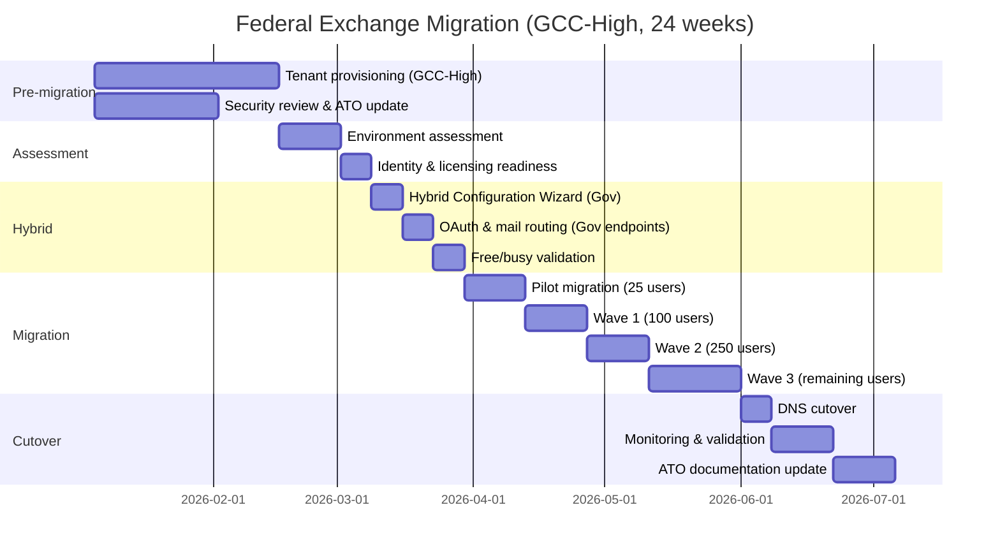

# Federal Migration Guide: Exchange Online GCC/GCC-High/DoD

**Status:** Authored 2026-04-30
**Audience:** Federal IT managers, Exchange administrators, and compliance officers migrating on-premises Exchange to Exchange Online in GCC, GCC-High, or DoD tenants.
**Scope:** Tenant provisioning, compliance boundaries, data residency, FastTrack for government, hybrid configuration in government clouds, and FIPS endpoint requirements.

---

## Overview

Exchange Online for US government is available in three cloud environments, each with increasing security and compliance controls:

| Environment                          | Authorization              | Data residency            | Isolation                           | Typical customer                                                   |
| ------------------------------------ | -------------------------- | ------------------------- | ----------------------------------- | ------------------------------------------------------------------ |
| **GCC (Government Community Cloud)** | FedRAMP High               | US datacenters            | Logical separation from commercial  | Federal civilian agencies, state/local government, tribal entities |
| **GCC-High**                         | FedRAMP High + DoD SRG IL4 | US sovereign datacenters  | Physically separated infrastructure | DoD contractors (ITAR/EAR), CUI, CJIS                              |
| **DoD**                              | FedRAMP High + DoD SRG IL5 | DoD-exclusive datacenters | Dedicated infrastructure            | Department of Defense                                              |

---

## 1. Tenant provisioning

### GCC tenant

GCC tenants are provisioned through standard Microsoft government sales channels:

1. **Eligibility verification:** Government entity validation required (federal, state, local, tribal).
2. **Licensing:** Microsoft 365 G3 or G5 licenses.
3. **Provisioning:** Standard M365 tenant provisioning with GCC designation.
4. **Timeline:** 1--2 weeks for provisioning after contract execution.

```powershell
# Verify GCC tenant
Connect-ExchangeOnline -UserPrincipalName admin@domain.us -ExchangeEnvironmentName O365USGovGCCHigh
# For GCC (standard), use default connection:
Connect-ExchangeOnline -UserPrincipalName admin@domain.gov

Get-OrganizationConfig | Select-Object Name, IsGovernmentCloud
```

### GCC-High tenant

GCC-High tenants require additional validation and provisioning:

1. **Eligibility verification:** Must handle ITAR, EAR, CUI, or CJIS data.
2. **Background screening:** Microsoft performs additional vetting.
3. **Licensing:** Microsoft 365 G3/G5 GCC-High licenses.
4. **Domain registration:** Domains registered in the `.us` government cloud.
5. **Entra ID:** Separate GCC-High Entra ID tenant (not connected to commercial Entra).
6. **Timeline:** 4--8 weeks for provisioning.

```powershell
# Connect to GCC-High Exchange Online
Connect-ExchangeOnline -UserPrincipalName admin@domain.us `
    -ExchangeEnvironmentName O365USGovGCCHigh

# Verify GCC-High environment
Get-OrganizationConfig | Select-Object Name
```

### DoD tenant

DoD tenants are provisioned through DISA:

1. **Sponsorship:** Must be sponsored by a DoD component.
2. **DISA approval:** Defense Information Systems Agency approves provisioning.
3. **Licensing:** Microsoft 365 G5 DoD licenses.
4. **Timeline:** 8--16 weeks (security review and provisioning).

```powershell
# Connect to DoD Exchange Online
Connect-ExchangeOnline -UserPrincipalName admin@domain.mil `
    -ExchangeEnvironmentName O365USGovDoD
```

---

## 2. Compliance boundaries

### Data residency

| Environment | Mailbox data location               | Encryption at rest                                   | Encryption in transit          |
| ----------- | ----------------------------------- | ---------------------------------------------------- | ------------------------------ |
| GCC         | US datacenters                      | AES-256 (Microsoft-managed keys)                     | TLS 1.2                        |
| GCC-High    | US sovereign datacenters (isolated) | AES-256 (Microsoft-managed or customer-managed keys) | TLS 1.2 (FIPS 140-2 validated) |
| DoD         | DoD-exclusive datacenters           | AES-256 (customer-managed keys supported)            | TLS 1.2 (FIPS 140-2 validated) |

### Feature availability by environment

| Feature                            | Commercial | GCC | GCC-High            | DoD                 |
| ---------------------------------- | ---------- | --- | ------------------- | ------------------- |
| Exchange Online Protection (EOP)   | Yes        | Yes | Yes                 | Yes                 |
| Defender for Office 365 P1/P2      | Yes        | Yes | Yes                 | Yes                 |
| Microsoft Purview DLP              | Yes        | Yes | Yes                 | Yes                 |
| Microsoft Purview eDiscovery       | Yes        | Yes | Yes                 | Yes                 |
| Sensitivity labels                 | Yes        | Yes | Yes                 | Yes                 |
| Copilot for M365                   | Yes        | Yes | Limited             | Limited             |
| Microsoft Teams integration        | Yes        | Yes | Yes                 | Yes                 |
| Consumer interop (Skype, consumer) | Yes        | Yes | No                  | No                  |
| Third-party app marketplace        | Yes        | Yes | Limited             | Limited             |
| Power Automate connectors          | Yes        | Yes | Limited             | Limited             |
| Microsoft Graph API                | Yes        | Yes | Yes (gov endpoints) | Yes (gov endpoints) |
| Hybrid Configuration Wizard        | Yes        | Yes | Yes (gov endpoints) | Yes (gov endpoints) |
| FastTrack migration assistance     | Yes        | Yes | Yes (gov FastTrack) | Limited             |

!!! warning "Feature parity delays"
GCC-High and DoD environments typically receive new Exchange Online features 3--6 months after commercial availability. Plan for feature parity delays when evaluating migration timelines.

---

## 3. Hybrid configuration in government clouds

### GCC hybrid

GCC hybrid configuration uses the standard Hybrid Configuration Wizard with GCC-specific service endpoints:

```powershell
# GCC hybrid uses standard HCW
# Download from https://aka.ms/HybridWizard

# Key differences from commercial:
# - EOP endpoints: *.protection.outlook.com (same as commercial for GCC)
# - Autodiscover: autodiscover.outlook.com (same as commercial for GCC)
# - MX record: domain-com.mail.protection.outlook.com

# Verify hybrid configuration
Get-OrganizationRelationship | Format-List Name, DomainNames, TargetAutodiscoverEpr
Get-IntraOrganizationConfiguration | Format-List
```

### GCC-High hybrid

GCC-High hybrid requires government-specific endpoints:

```powershell
# GCC-High HCW differences:
# - Download HCW for GCC-High (same installer, detects environment)
# - EOP endpoint: *.protection.office365.us
# - Autodiscover: autodiscover.office365.us
# - MX record: domain-com.mail.protection.office365.us
# - OAuth endpoints: login.microsoftonline.us

# GCC-High MX record:
# @ MX 0 domain-com.mail.protection.office365.us

# GCC-High SPF:
# @ TXT "v=spf1 include:spf.protection.office365.us -all"

# GCC-High Autodiscover:
# autodiscover CNAME autodiscover.office365.us

# Connect to GCC-High for hybrid validation
Connect-ExchangeOnline -UserPrincipalName admin@domain.us `
    -ExchangeEnvironmentName O365USGovGCCHigh

Get-OrganizationRelationship | Format-List
Test-OAuthConnectivity -Service EWS `
    -TargetUri https://outlook.office365.us/ews/exchange.asmx `
    -Mailbox admin@domain.us
```

### DoD hybrid

DoD hybrid uses DoD-exclusive endpoints:

```powershell
# DoD endpoints:
# - EOP: *.protection.office365.us (DoD-specific infrastructure)
# - Autodiscover: autodiscover.office365.us
# - OAuth: login.microsoftonline.us
# - FIPS 140-2 validated TLS required end-to-end

# Connect to DoD environment
Connect-ExchangeOnline -UserPrincipalName admin@domain.mil `
    -ExchangeEnvironmentName O365USGovDoD
```

---

## 4. FastTrack for government

### GCC FastTrack

- **Availability:** Full FastTrack services available for GCC tenants with 150+ seats.
- **Engagement:** Standard FastTrack request process via [FastTrack portal](https://www.microsoft.com/fasttrack).
- **Services:** Migration planning, hybrid configuration, mailbox migration, DNS guidance.
- **Cost:** Included with M365 G3/G5 licenses.

### GCC-High FastTrack

- **Availability:** FastTrack available through government-specific engagement model.
- **Engagement:** Requires pre-authorization; contact your Microsoft government account team.
- **Services:** Same as GCC but with security-cleared engineers.
- **Restrictions:** FastTrack engineers must have appropriate clearances.

### DoD FastTrack

- **Availability:** Limited FastTrack availability.
- **Engagement:** Coordinated through DISA and Microsoft DoD account team.
- **Services:** Planning and configuration guidance; migration execution may be customer-responsible.
- **Restrictions:** Cleared personnel required for all interactions.

---

## 5. FIPS 140-2 requirements

### GCC-High and DoD FIPS compliance

GCC-High and DoD environments require FIPS 140-2 validated cryptographic modules for all data encryption in transit and at rest:

| Component                      | FIPS requirement     | Implementation                                  |
| ------------------------------ | -------------------- | ----------------------------------------------- |
| TLS for mail flow              | FIPS 140-2 validated | TLS 1.2 with FIPS-validated cipher suites       |
| TLS for client connections     | FIPS 140-2 validated | Outlook, OWA, ActiveSync use FIPS-validated TLS |
| Encryption at rest             | FIPS 140-2 validated | AES-256 with FIPS-validated key management      |
| S/MIME                         | FIPS 140-2 validated | Certificate-based encryption                    |
| Azure RMS (sensitivity labels) | FIPS 140-2 validated | Azure RMS uses FIPS-validated modules           |

### Connector TLS configuration

```powershell
# GCC-High outbound connector with FIPS-validated TLS
New-OutboundConnector -Name "Partner - GCC-High" `
    -RecipientDomains "partner.gov" `
    -SmartHosts "mail.partner.gov" `
    -TlsSettings CertificateValidation `
    -TlsDomain "mail.partner.gov" `
    -Enabled $true

# Verify TLS version on connectors
Get-InboundConnector | Format-List Name, TlsSenderCertificateName, RequireTls
Get-OutboundConnector | Format-List Name, TlsSettings, TlsDomain
```

---

## 6. Cross-premises in government

### GCC-to-commercial interop

GCC tenants can exchange email with commercial M365 tenants and external organizations. Free/busy sharing with commercial tenants requires explicit organization relationship configuration.

### GCC-High isolation

GCC-High tenants are isolated from commercial Microsoft 365:

- **No consumer interop:** Cannot federate with consumer Skype or Teams.
- **No commercial tenant federation by default:** Cross-tenant federation requires explicit configuration.
- **GCC-High to GCC-High:** Federation between GCC-High tenants is supported.
- **GCC-High to commercial:** Requires explicit external domain configuration and may not support all coexistence features.

### DoD isolation

DoD tenants have the strictest isolation:

- **DoD-to-DoD:** Full interop between DoD tenants.
- **DoD-to-GCC-High:** Limited interop; requires explicit configuration.
- **DoD-to-commercial:** Not supported for most scenarios.

---

## 7. Migration timeline for government



---

## 8. ATO (Authority to Operate) considerations

Moving to Exchange Online changes the ATO boundary:

| ATO component             | On-premises                                           | Exchange Online (GCC/GCC-High)                          |
| ------------------------- | ----------------------------------------------------- | ------------------------------------------------------- |
| System boundary           | On-prem servers, network, facilities                  | Microsoft cloud + customer configuration                |
| Inherited controls        | None (all customer-managed)                           | FedRAMP High (inherited from Microsoft)                 |
| Customer-managed controls | All 325+ NIST 800-53 controls                         | ~50--80 customer-responsible controls                   |
| Assessment scope          | Full stack (hardware through application)             | Customer configuration, identity, policies              |
| POAM items                | Patching, vulnerability management, physical security | Configuration management, identity management           |
| Continuous monitoring     | Customer-managed vulnerability scanning               | Microsoft continuous monitoring + customer config audit |

### ATO documentation updates

After migration, update your System Security Plan (SSP) to reflect:

1. **System boundary change:** Exchange servers removed from boundary; Exchange Online added as external cloud service.
2. **Inherited controls:** Document FedRAMP High inherited controls from Microsoft.
3. **Customer-responsible controls:** Document configuration controls (DLP, retention, access policies).
4. **Interconnection Security Agreement (ISA):** Update ISAs for the Exchange Online connection.
5. **POAM updates:** Remove on-prem Exchange patching POAMs; add cloud configuration management POAMs.

---

## 9. CSA-in-a-Box federal integration

CSA-in-a-Box extends Exchange Online migration value for federal organizations:

- **Purview compliance:** Same Purview instance governs email (Exchange Online) and data platform (CSA-in-a-Box). Single compliance boundary for both workloads.
- **FedRAMP evidence:** CSA-in-a-Box ships FedRAMP High control mappings in `csa_platform/csa_platform/governance/compliance/nist-800-53-rev5.yaml`. Email compliance integrates with these control mappings.
- **Audit consolidation:** Exchange Online audit logs and CSA-in-a-Box audit logs flow to Azure Monitor, providing a unified audit trail for FedRAMP continuous monitoring.
- **CMMC alignment:** Email DLP and sensitivity labels satisfy CMMC 2.0 Level 2 controls for CUI protection. CSA-in-a-Box maps these controls in `csa_platform/csa_platform/governance/compliance/cmmc-2.0-l2.yaml`.

---

## 10. Government-specific troubleshooting

| Issue                                 | Environment  | Resolution                                                                                                                                                                                                |
| ------------------------------------- | ------------ | --------------------------------------------------------------------------------------------------------------------------------------------------------------------------------------------------------- |
| HCW fails to connect to GCC-High      | GCC-High     | Verify HCW is targeting `.office365.us` endpoints                                                                                                                                                         |
| OAuth test fails in GCC-High          | GCC-High     | Verify auth server uses `login.microsoftonline.us`                                                                                                                                                        |
| DKIM setup fails in GCC-High          | GCC-High     | Use GCC-High specific CNAME records (`.office365.us`)                                                                                                                                                     |
| FastTrack engagement delayed          | GCC-High/DoD | Contact Microsoft government account team directly                                                                                                                                                        |
| Feature not available in GCC-High     | GCC-High     | Check [Microsoft 365 Government service description](https://learn.microsoft.com/office365/servicedescriptions/office-365-platform-service-description/office-365-us-government/office-365-us-government) |
| TLS cipher suite mismatch             | GCC-High/DoD | Ensure FIPS 140-2 validated cipher suites on on-prem connectors                                                                                                                                           |
| Entra Connect sync issues in GCC-High | GCC-High     | Verify Entra Connect targets GCC-High Entra endpoint                                                                                                                                                      |

---

**Maintainers:** csa-inabox core team
**Last updated:** 2026-04-30
