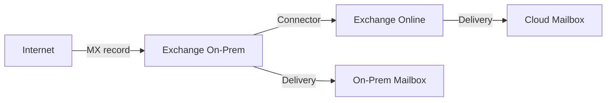
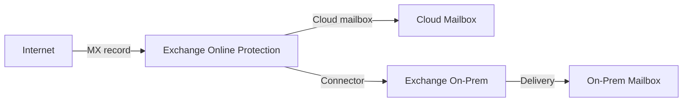

# Hybrid Migration: Full Hybrid Deployment

**Status:** Authored 2026-04-30
**Audience:** Exchange administrators and M365 architects deploying full hybrid Exchange for coexistence and phased mailbox migration.
**Scope:** Exchange 2013/2016/2019 hybrid with Exchange Online --- Hybrid Configuration Wizard, mail routing, free/busy sharing, cross-premises permissions, OAuth, and mailbox moves.

---

## Overview

Full hybrid is the recommended migration path for organizations with Exchange 2013 SP1+, Exchange 2016, or Exchange 2019 that need coexistence between on-premises and Exchange Online during migration. Hybrid deployment provides:

- **Seamless mail flow** between on-prem and cloud mailboxes.
- **Free/busy sharing** for calendar availability across environments.
- **Cross-premises permissions** (delegate access, shared calendars).
- **Online mailbox moves** with near-zero downtime (users keep working during migration).
- **Unified GAL** (Global Address List) across on-prem and cloud.
- **Single namespace** (users cannot tell whether a mailbox is on-prem or in the cloud).

---

## Prerequisites

### Exchange Server requirements

| Exchange version | Minimum CU            | Notes                                                         |
| ---------------- | --------------------- | ------------------------------------------------------------- |
| Exchange 2013    | SP1 (CU4) + latest CU | End of support April 2023 --- plan to upgrade or decommission |
| Exchange 2016    | CU23 + latest SU      | Recommended hybrid endpoint                                   |
| Exchange 2019    | CU14 + latest SU      | Preferred hybrid endpoint                                     |

!!! warning "Exchange 2013 hybrid"
Exchange 2013 reached end of support. While hybrid configuration still functions, Microsoft does not support troubleshooting Exchange 2013 hybrid issues. Upgrade to Exchange 2016/2019 before configuring hybrid if possible.

### Infrastructure requirements

- [ ] Microsoft Entra Connect deployed and synchronizing.
- [ ] UPN suffixes verified in M365 tenant.
- [ ] Exchange hybrid server accessible from the internet (port 443).
- [ ] Valid third-party SSL certificate with SAN entries for `mail.domain.com` and `autodiscover.domain.com`.
- [ ] Firewall allows Exchange Online IPs to connect to the hybrid server.
- [ ] DNS: Autodiscover CNAME or SRV record in place.
- [ ] Exchange organization relationship configured (or will be configured by HCW).

---

## Hybrid Configuration Wizard (HCW)

The Hybrid Configuration Wizard automates the setup of hybrid deployment. It configures:

1. Organization relationships (on-prem ↔ EXO).
2. Send and receive connectors for hybrid mail flow.
3. OAuth authentication for cross-premises permissions.
4. Certificate selection for TLS-secured mail flow.
5. Mail routing (centralized vs decentralized).
6. Free/busy sharing configuration.

### Running HCW

```powershell
# Download HCW from https://aka.ms/HybridWizard
# Run on an Exchange 2016/2019 server with internet access

# Pre-check: verify Exchange organization health
Get-ExchangeServer | Format-Table Name, ServerRole, AdminDisplayVersion
Get-ExchangeCertificate | Where-Object {$_.Services -match "IIS"} | Format-List Subject, CertificateDomains, NotAfter

# Verify Entra Connect sync status
Get-ADSyncScheduler
Get-ADSyncConnectorRunStatus
```

### HCW configuration choices

| Choice             | Option A                                      | Option B                         | Recommendation                          |
| ------------------ | --------------------------------------------- | -------------------------------- | --------------------------------------- |
| **Topology**       | Full hybrid                                   | Minimal hybrid (express)         | Full hybrid for coexistence > 30 days   |
| **Mail routing**   | Centralized (all mail routes through on-prem) | Decentralized (MX points to EXO) | Decentralized for most organizations    |
| **Transport**      | Exchange Classic Hybrid                       | Exchange Modern Hybrid           | Modern Hybrid for Exchange 2016+        |
| **Certificate**    | Existing SAN certificate                      | New certificate                  | Use existing if it covers required SANs |
| **Edge Transport** | Include Edge servers                          | Skip Edge servers                | Skip if Edge Transport is not deployed  |

---

## Mail routing

### Centralized mail routing

All inbound internet mail flows through the on-premises Exchange servers, then routes to Exchange Online for cloud mailboxes.



**When to use:** Required when on-premises compliance scanning, archiving, or third-party DLP must inspect all mail before delivery. Common in organizations with regulatory requirements that mandate on-premises mail inspection during migration.

**Drawback:** On-premises Exchange must remain operational and sized for full mail flow until migration completes.

### Decentralized mail routing

MX record points to Exchange Online Protection (EOP). Cloud mailboxes receive mail directly. On-premises mailboxes receive mail via the hybrid connector.



**When to use:** Most organizations. Provides immediate security benefit (EOP scans all mail) and reduces dependency on on-premises infrastructure.

**Recommendation:** Switch MX to EOP early in the migration. This immediately protects all mail flow with EOP/Defender for Office 365, regardless of mailbox location.

---

## Free/busy sharing (OAuth)

Hybrid deployment configures OAuth authentication for cross-premises free/busy (calendar availability) sharing. Users on-premises can see cloud users' calendar availability and vice versa.

### Validate OAuth

```powershell
# On-premises Exchange Management Shell
Test-OAuthConnectivity -Service EWS -TargetUri https://outlook.office365.com/ews/exchange.asmx -Mailbox admin@domain.com -Verbose

# Expected result: ResultType = Success

# Test free/busy from on-premises
Get-AvailabilityConfig | Format-List
Get-OrganizationRelationship | Format-List Name, DomainNames, FreeBusyAccessEnabled, FreeBusyAccessLevel
```

### Troubleshooting free/busy

| Symptom                                             | Likely cause                               | Resolution                                                         |
| --------------------------------------------------- | ------------------------------------------ | ------------------------------------------------------------------ |
| Free/busy shows "no information"                    | OAuth token failure                        | Re-run HCW; verify OAuth certificate is valid                      |
| Free/busy shows "tentative" for all slots           | Organization relationship misconfigured    | `Set-OrganizationRelationship -FreeBusyAccessLevel LimitedDetails` |
| Intermittent free/busy failures                     | Autodiscover misconfigured                 | Verify Autodiscover SCP and DNS records                            |
| Free/busy works on-prem→cloud but not cloud→on-prem | Firewall blocking EXO→on-prem connectivity | Open port 443 from EXO IPs to hybrid endpoint                      |

---

## Cross-premises permissions

Hybrid deployment supports cross-premises delegate access:

- **Full Access** (open another user's mailbox).
- **Send on Behalf** (send email on behalf of another user).
- **Send As** (send email as another user).
- **Calendar delegate** (manage calendar appointments).

### Requirements for cross-premises permissions

1. OAuth authentication configured (done by HCW).
2. Mailboxes must be in the same Exchange organization (hybrid).
3. Outlook 2016+ (modern auth capable).
4. Both mailboxes must be discoverable via Autodiscover.

### Limitations

- Cross-premises Full Access requires explicit permission grants; auto-mapping does not work cross-premises.
- Public folder access across premises has limitations (see [Public Folder Migration](public-folder-migration.md)).
- Room mailbox booking across premises works but may have latency.

---

## Mailbox moves in hybrid

Hybrid deployment enables **online mailbox moves** --- the user continues working in Outlook while the mailbox migrates in the background. At completion, Outlook reconnects to Exchange Online automatically.

### Migration batch workflow

```powershell
# Connect to Exchange Online PowerShell
Connect-ExchangeOnline -UserPrincipalName admin@domain.com

# Create a migration batch
New-MigrationBatch -Name "Wave1-Finance" `
    -SourceEndpoint "Hybrid Migration Endpoint - EWS (Default Web Site)" `
    -TargetDeliveryDomain "domain.mail.onmicrosoft.com" `
    -CSVData ([System.IO.File]::ReadAllBytes("C:\Migration\wave1-finance.csv")) `
    -AutoStart -AutoComplete

# CSV format:
# EmailAddress
# user1@domain.com
# user2@domain.com
# user3@domain.com

# Monitor progress
Get-MigrationBatch "Wave1-Finance" | Format-List Status, TotalCount, SyncedCount, FinalizedCount
Get-MoveRequest | Get-MoveRequestStatistics | Format-Table DisplayName, StatusDetail, PercentComplete
```

### Migration batch states

| State      | Description                                   | Action                                                      |
| ---------- | --------------------------------------------- | ----------------------------------------------------------- |
| Syncing    | Initial sync of mailbox data                  | Wait; monitor progress                                      |
| Synced     | Initial sync complete; waiting for completion | Schedule completion window                                  |
| Completing | Final delta sync and switchover               | Users may experience brief disconnection                    |
| Completed  | Mailbox is in Exchange Online                 | Verify Outlook reconnects; validate                         |
| Failed     | Migration failed                              | Check `Get-MoveRequestStatistics -IncludeReport` for errors |
| Stalled    | Migration stalled (large item, corrupt item)  | Check bad item limit; increase if needed                    |

### Performance tuning

```powershell
# Increase concurrent migrations (default 20 per batch)
Set-MigrationEndpoint "Hybrid Migration Endpoint - EWS (Default Web Site)" `
    -MaxConcurrentMigrations 50

# Increase bad item limit for problematic mailboxes
Set-MoveRequest -Identity user@domain.com -BadItemLimit 100 -AcceptLargeDataLoss

# Check migration throughput
Get-MoveRequestStatistics -Identity user@domain.com | Format-List BytesTransferred, PercentComplete, TotalMailboxSize
```

---

## Decommissioning hybrid

After all mailboxes are migrated to Exchange Online, the hybrid configuration can be simplified but not fully removed if you need:

- **Entra Connect** for directory synchronization.
- **Recipient management** for mail-enabled objects (unless using cloud-only management).
- **SMTP relay** for on-premises applications.

### Minimal hybrid footprint

Keep one Exchange 2019 (or Exchange Server SE) server for:

1. Recipient management (creating/modifying mail-enabled objects in on-prem AD that sync to Entra ID).
2. Entra Connect attribute management.
3. SMTP relay for legacy applications.

!!! info "Exchange Server SE for hybrid management"
Microsoft has announced Exchange Server Subscription Edition (SE) as a long-term hybrid management endpoint. Plan to deploy SE when available if you need a permanent on-premises Exchange presence for directory management.

### Full decommission (cloud-only)

If all recipient management moves to the cloud (Entra ID + Exchange Online PowerShell), the on-premises Exchange server can be fully decommissioned:

1. Uninstall Exchange Server from all nodes.
2. Clean up Exchange attributes in AD (schema extensions remain).
3. Remove Exchange-related DNS records (internal only; external already point to EXO).
4. Decommission Entra Connect **only** if moving to cloud-only identity (most hybrid orgs keep Entra Connect).

---

## Federal hybrid considerations

### GCC hybrid

- HCW for GCC uses standard endpoints.
- Exchange Online Protection endpoints are GCC-specific.
- FastTrack available for hybrid configuration assistance.

### GCC-High hybrid

- HCW must target GCC-High endpoints.
- Organization relationship configured to `*.protection.office365.us`.
- OAuth tokens issued from GCC-High Entra ID endpoints.
- Connectors must use GCC-High-specific smart hosts.

### DoD hybrid

- HCW targets DoD-specific endpoints.
- FIPS 140-2 validated TLS required.
- Mail flow connectors restricted to DoD Exchange Online Protection endpoints.

---

## Next steps

1. **Run the Hybrid Configuration Wizard:** See [Tutorial: Hybrid Setup](tutorial-hybrid-setup.md) for step-by-step with PowerShell.
2. **Plan your migration batches:** See [Tutorial: Mailbox Move](tutorial-mailbox-move.md) for batch creation and monitoring.
3. **Migrate public folders:** See [Public Folder Migration](public-folder-migration.md).
4. **Migrate compliance policies:** See [Compliance Migration](compliance-migration.md).

---

**Maintainers:** csa-inabox core team
**Last updated:** 2026-04-30
