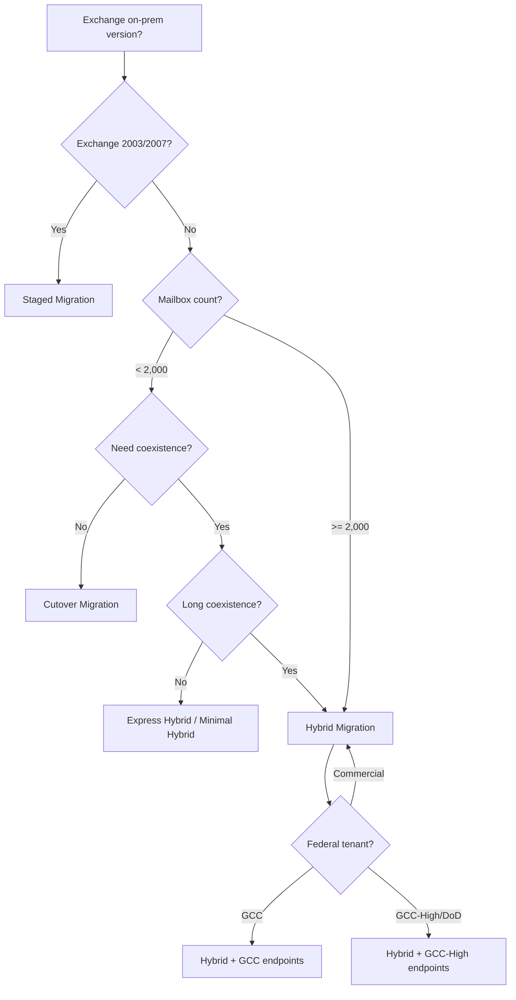
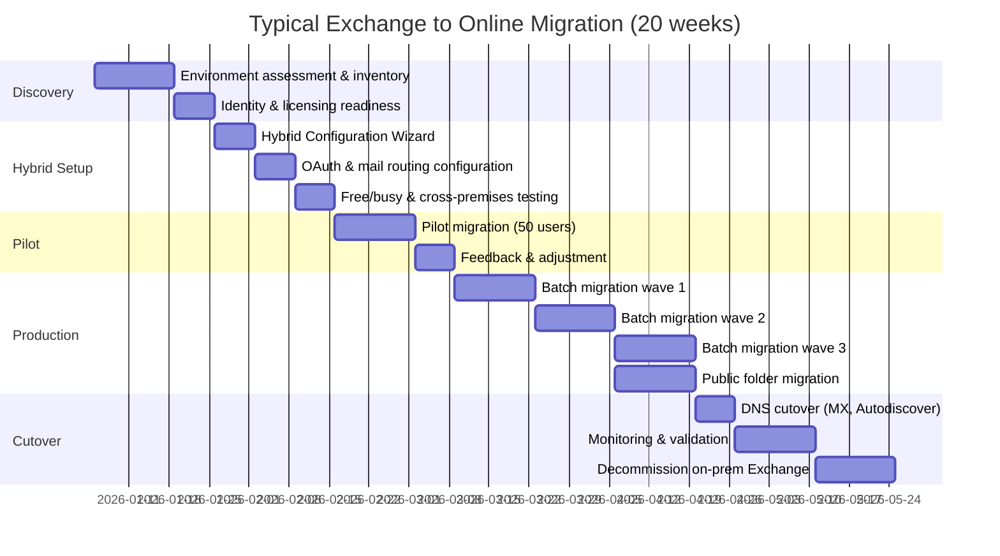

# Exchange to Online Migration Center

**The definitive resource for migrating from Exchange Server on-premises to Exchange Online, with Microsoft Purview integration for unified compliance and CSA-in-a-Box analytics.**

---

## Who this is for

This migration center serves Exchange administrators, M365 architects, IT managers, federal CIOs, and compliance officers who are planning or executing a migration from Exchange Server (2013, 2016, 2019) to Exchange Online. Whether you are responding to a security mandate after Hafnium/ProxyShell, consolidating messaging onto Microsoft 365, enabling Copilot for Outlook and Teams, or meeting FedRAMP/GCC-High/DoD compliance requirements, these resources provide the evidence, patterns, and step-by-step guidance to execute confidently.

---

## Quick-start decision matrix

| Your situation                                   | Start here                                              |
| ------------------------------------------------ | ------------------------------------------------------- |
| Executive evaluating the move to Exchange Online | [Why Exchange Online](why-exchange-online.md)           |
| Need cost justification for migration            | [Total Cost of Ownership Analysis](tco-analysis.md)     |
| Need a feature-by-feature comparison             | [Complete Feature Mapping](feature-mapping-complete.md) |
| Ready to plan a migration                        | [Migration Playbook](../exchange-to-online.md)          |
| < 2,000 mailboxes, want a quick cutover          | [Cutover Migration](cutover-migration.md)               |
| Exchange 2003/2007, need staged approach         | [Staged Migration](staged-migration.md)                 |
| Exchange 2013+, need long coexistence            | [Hybrid Migration](hybrid-migration.md)                 |
| Migrating public folders                         | [Public Folder Migration](public-folder-migration.md)   |
| Migrating compliance policies                    | [Compliance Migration](compliance-migration.md)         |
| Migrating transport rules and security           | [Security Migration](security-migration.md)             |
| Federal/government-specific requirements         | [Federal Migration Guide](federal-migration-guide.md)   |

---

## Migration path comparison

Choosing the right migration path is the most consequential decision in an Exchange Online migration. The wrong path creates weeks of unnecessary complexity; the right path compresses the timeline.

### Decision tree



### Path comparison table

| Attribute                 | Cutover                  | Staged                           | Hybrid                   | Express Hybrid           |
| ------------------------- | ------------------------ | -------------------------------- | ------------------------ | ------------------------ |
| **Exchange versions**     | 2007+                    | 2003, 2007                       | 2013, 2016, 2019         | 2016, 2019               |
| **Mailbox limit**         | < 2,000                  | Unlimited                        | Unlimited                | Unlimited                |
| **Coexistence**           | None (all-at-once)       | Temporary                        | Long-term supported      | Short-term               |
| **Free/busy sharing**     | No (post-migration only) | No                               | Yes (OAuth)              | Yes (OAuth)              |
| **Directory sync**        | Not required during      | Required (DirSync/Entra Connect) | Required (Entra Connect) | Required (Entra Connect) |
| **Public folder support** | Limited                  | Limited                          | Full hybrid PF           | Full hybrid PF           |
| **Typical timeline**      | 1--3 days                | 4--12 weeks                      | 8--24 weeks              | 2--6 weeks               |
| **Complexity**            | Low                      | Medium                           | High                     | Medium                   |
| **FastTrack eligible**    | Yes                      | Yes                              | Yes                      | Yes                      |
| **GCC-High/DoD support**  | Yes                      | Limited                          | Yes                      | Yes                      |

---

## Strategic resources

These documents provide the business case, cost analysis, and strategic framing for decision-makers.

| Document                                                | Audience                        | Description                                                                                                                                                      |
| ------------------------------------------------------- | ------------------------------- | ---------------------------------------------------------------------------------------------------------------------------------------------------------------- |
| [Why Exchange Online](why-exchange-online.md)           | CIO / CISO / Board              | Executive brief covering security risks (Hafnium, ProxyShell), managed service benefits, Copilot enablement, compliance advantages, and FastTrack free migration |
| [Total Cost of Ownership Analysis](tco-analysis.md)     | CFO / CIO / Procurement         | Detailed pricing model comparing on-prem Exchange (hardware, licensing, admin FTE, DR) against Exchange Online (E3/E5/F1/G3/G5), with 5-year projections         |
| [Complete Feature Mapping](feature-mapping-complete.md) | Exchange Admin / M365 Architect | 50+ Exchange features mapped from on-prem to cloud equivalents with migration complexity ratings and gap analysis                                                |

---

## Migration guides

Domain-specific deep dives covering every aspect of an Exchange Online migration.

| Guide                                                 | Source capability                                    | Cloud destination                                |
| ----------------------------------------------------- | ---------------------------------------------------- | ------------------------------------------------ |
| [Hybrid Migration](hybrid-migration.md)               | Exchange 2013/2016/2019 full hybrid                  | Hybrid Configuration Wizard, OAuth, mail routing |
| [Cutover Migration](cutover-migration.md)             | Exchange 2007+ (< 2,000 mailboxes)                   | One-time migration, DNS cutover                  |
| [Staged Migration](staged-migration.md)               | Exchange 2003/2007                                   | Batched migration with directory sync            |
| [Public Folder Migration](public-folder-migration.md) | On-prem public folders                               | EXO public folders or M365 Groups                |
| [Compliance Migration](compliance-migration.md)       | Retention, DLP, eDiscovery, journaling, IRM          | Microsoft Purview unified compliance             |
| [Security Migration](security-migration.md)           | Transport rules, connectors, anti-spam, anti-malware | EOP, Defender for Office 365, DKIM/DMARC/SPF     |

---

## Tutorials

Step-by-step walkthroughs with PowerShell examples.

| Tutorial                                          | What you will build                                                   |
| ------------------------------------------------- | --------------------------------------------------------------------- |
| [Hybrid Setup Tutorial](tutorial-hybrid-setup.md) | Run HCW, configure OAuth, test free/busy, move pilot mailboxes        |
| [Mailbox Move Tutorial](tutorial-mailbox-move.md) | Create migration batch, move mailboxes, monitor, complete, update DNS |

---

## Technical references

| Document                                                | Description                                                                                                                           |
| ------------------------------------------------------- | ------------------------------------------------------------------------------------------------------------------------------------- |
| [Complete Feature Mapping](feature-mapping-complete.md) | Every Exchange on-prem feature mapped to its Exchange Online equivalent with migration complexity and CSA-in-a-Box integration points |
| [Migration Playbook](../exchange-to-online.md)          | The end-to-end migration playbook with decision matrix, phased project plan, and compliance mapping                                   |

---

## Government and federal

| Document                                              | Description                                                                                                                           |
| ----------------------------------------------------- | ------------------------------------------------------------------------------------------------------------------------------------- |
| [Federal Migration Guide](federal-migration-guide.md) | GCC/GCC-High/DoD tenant provisioning, compliance boundaries, data residency, FastTrack for GCC, FIPS endpoints, cross-premises in Gov |

---

## How CSA-in-a-Box fits

CSA-in-a-Box is the **analytics and governance destination** that extends the value of an Exchange Online migration beyond messaging. Exchange Online migration connects to CSA-in-a-Box in three dimensions:

- **Microsoft Purview as the unified compliance plane.** When email moves to Exchange Online, Purview governs email, SharePoint, Teams, and the CSA-in-a-Box data platform through a single set of DLP policies, sensitivity labels, retention policies, and eDiscovery cases. The compliance silo between messaging and analytics disappears. CSA-in-a-Box ships Purview automation (`csa_platform/csa_platform/governance/purview/`) that extends email compliance into the data lake.

- **Copilot for Microsoft 365.** Exchange Online is a prerequisite for Copilot in Outlook and Teams. CSA-in-a-Box integrates Azure OpenAI and AI Foundry for the data platform; Copilot for M365 extends AI to email, calendar, and collaboration. Together, they deliver AI across the full organizational surface.

- **Email analytics in the data lake.** Exchange Online message trace logs, mail flow reports, and compliance audit logs can flow into the CSA-in-a-Box analytics estate via Azure Monitor, Event Hubs, or the Microsoft Graph API. This enables email governance dashboards in Power BI alongside data platform governance --- a single pane of glass for all organizational data.

- **Infrastructure as Code.** CSA-in-a-Box deploys via Bicep with FedRAMP High control mappings. Exchange Online configuration (transport rules, connectors, DLP policies) can be codified alongside the data platform using Exchange Online PowerShell and Microsoft Graph, ensuring consistent governance across the stack.

---

## Migration timeline overview



---

## Prerequisites checklist

Before starting any migration path:

- [ ] Microsoft 365 tenant provisioned (commercial, GCC, GCC-High, or DoD).
- [ ] Microsoft Entra Connect deployed and synchronizing identities.
- [ ] UPN suffixes match verified domains in M365.
- [ ] Exchange on-premises at minimum supported CU (Exchange 2016 CU23+, 2019 CU14+).
- [ ] Outlook desktop clients at minimum Outlook 2016 (modern auth capable).
- [ ] Microsoft 365 licenses assigned to pilot users.
- [ ] Network connectivity validated to Exchange Online endpoints.
- [ ] DNS records documented (MX, Autodiscover, SPF, DKIM, DMARC).
- [ ] Third-party integrations inventoried (archiving, DLP, anti-spam gateways).
- [ ] Backup and rollback plan documented.

---

## Related resources

- **Migration index:** [docs/migrations/README.md](../README.md)
- **Companion playbooks:** [SQL Server to Azure](../sql-server-to-azure.md), [VMware to Azure](../vmware-to-azure.md)
- **Microsoft Learn:** [Exchange Online migration methods](https://learn.microsoft.com/exchange/mailbox-migration/mailbox-migration)
- **FastTrack:** [FastTrack for Microsoft 365](https://www.microsoft.com/fasttrack/microsoft-365)
- **CSA-in-a-Box Purview modules:** `csa_platform/csa_platform/governance/purview/`
- **Compliance matrices:** `docs/compliance/nist-800-53-rev5.md`, `docs/compliance/cmmc-2.0-l2.md`

---

## Document map

```
docs/migrations/exchange-to-online.md          # Top-level playbook (you are here: Migration Center)
docs/migrations/exchange-to-online/
  index.md                                     # This hub page
  why-exchange-online.md                       # Executive brief
  tco-analysis.md                              # Total cost of ownership
  feature-mapping-complete.md                  # 50+ feature mapping
  hybrid-migration.md                          # Full hybrid deployment
  cutover-migration.md                         # Cutover migration (<2K)
  staged-migration.md                          # Staged migration (2003/2007)
  public-folder-migration.md                   # Public folder strategies
  compliance-migration.md                      # Compliance continuity
  security-migration.md                        # Security and mail flow
  tutorial-hybrid-setup.md                     # Tutorial: hybrid setup
  tutorial-mailbox-move.md                     # Tutorial: mailbox move
  federal-migration-guide.md                   # GCC/GCC-High/DoD
  benchmarks.md                                # Performance benchmarks
  best-practices.md                            # Migration best practices
```

---

**Maintainers:** csa-inabox core team
**Last updated:** 2026-04-30
