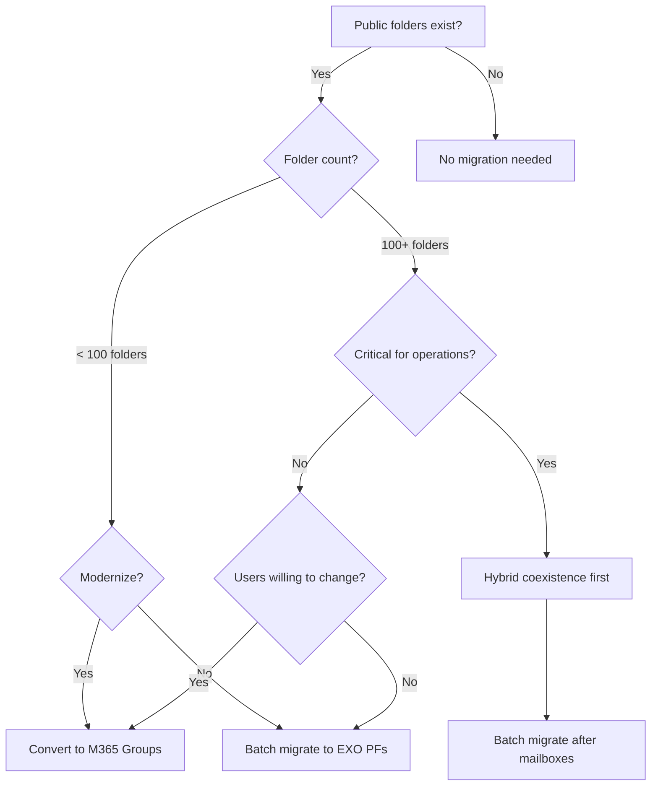

# Public Folder Migration to Exchange Online

**Status:** Authored 2026-04-30
**Audience:** Exchange administrators migrating on-premises public folders to Exchange Online or M365 Groups.
**Scope:** Public folder migration strategies, batch migration, hybrid public folder coexistence, and M365 Groups modernization.

---

## Overview

Public folders are one of the most complex components of an Exchange migration. They often contain decades of organizational data --- shared calendars, contact lists, project files, and departmental email. Three migration strategies are available:

| Strategy                                  | Description                                                                  | Best for                                                         |
| ----------------------------------------- | ---------------------------------------------------------------------------- | ---------------------------------------------------------------- |
| **Batch migration to EXO public folders** | Migrate the entire public folder hierarchy to Exchange Online public folders | Organizations that want to preserve the public folder experience |
| **Migration to M365 Groups**              | Convert public folders to M365 Groups (Teams-enabled)                        | Organizations modernizing collaboration, moving to Teams         |
| **Hybrid public folder coexistence**      | Keep public folders on-premises, accessible from Exchange Online mailboxes   | Interim state during phased migration                            |

---

## Pre-migration assessment

### Inventory public folders

```powershell
# On-premises Exchange Management Shell
# Get public folder hierarchy
Get-PublicFolder -Recurse -ResultSize Unlimited |
    Select-Object Identity, Name, FolderType, HasSubFolders |
    Export-Csv C:\Migration\pf-hierarchy.csv -NoTypeInformation

# Get public folder statistics (sizes)
Get-PublicFolder -Recurse -ResultSize Unlimited |
    Get-PublicFolderStatistics |
    Select-Object Name, FolderPath, TotalItemSize, ItemCount |
    Sort-Object TotalItemSize -Descending |
    Export-Csv C:\Migration\pf-statistics.csv -NoTypeInformation

# Get mail-enabled public folders
Get-MailPublicFolder -ResultSize Unlimited |
    Select-Object Name, PrimarySmtpAddress, EmailAddresses |
    Export-Csv C:\Migration\pf-mail-enabled.csv -NoTypeInformation

# Get total public folder size
$pfStats = Get-PublicFolder -Recurse -ResultSize Unlimited | Get-PublicFolderStatistics
$totalMB = ($pfStats | ForEach-Object {
    $_.TotalItemSize.Value.ToMB()
} | Measure-Object -Sum).Sum
Write-Host "Total public folder data: $totalMB MB ($([math]::Round($totalMB/1024, 2)) GB)"

# Count folders
Write-Host "Total folders: $($pfStats.Count)"
```

### Public folder limits in Exchange Online

| Limit                                 | Value                     | Notes                                     |
| ------------------------------------- | ------------------------- | ----------------------------------------- |
| Maximum public folder mailboxes       | 1,000                     | Each PF mailbox can hold multiple folders |
| Maximum size per PF mailbox           | 100 GB (E3) / 100 GB (E5) | Auto-split distributes content            |
| Maximum total PF data                 | 100 TB                    | Aggregate across all PF mailboxes         |
| Maximum items per public folder       | 1,000,000                 | Per individual folder                     |
| Maximum public folder hierarchy items | 1,000,000 folders         | Total folder count                        |
| Maximum sub-folders                   | Unlimited                 | Nested depth limited by path length       |

---

## Strategy 1: Batch migration to Exchange Online public folders

### Step 1: Generate migration scripts

Microsoft provides migration scripts for public folder batch migration. Download from the Exchange documentation:

```powershell
# On-premises: Generate the folder-to-mailbox mapping
# Download scripts from Microsoft Learn

# Step 1: Create the CSV mapping file
.\Export-PublicFolderStatistics.ps1 `
    -ExportFile C:\Migration\pf-stats-export.csv `
    -ImportFile C:\Migration\pf-folder-to-mailbox.csv

# Step 2: Review and adjust the folder-to-mailbox mapping
# The script distributes folders across target public folder mailboxes
# in Exchange Online based on size

# Step 3: Create the migration request
```

### Step 2: Lock public folders (pre-migration)

```powershell
# Lock public folders to prevent changes during final sync
# This creates a brief period of read-only access

# Set the organization to migration mode
Set-OrganizationConfig -PublicFoldersLockedForMigration $true

# Verify
Get-OrganizationConfig | Select-Object PublicFoldersLockedForMigration
```

!!! warning "Public folder lock"
Locking public folders prevents users from making changes. Plan this for a maintenance window. The lock should be in place only during the final migration sync, typically 1--4 hours depending on delta size.

### Step 3: Create migration batch

```powershell
# Connect to Exchange Online PowerShell
Connect-ExchangeOnline -UserPrincipalName admin@domain.com

# Create public folder migration batch
New-MigrationBatch -Name "PFMigration" `
    -SourceEndpoint "HybridEndpoint" `
    -CSVData ([System.IO.File]::ReadAllBytes("C:\Migration\pf-folder-to-mailbox.csv")) `
    -PublicFolderToUnifiedGroup:$false `
    -SourcePublicFolderDatabase "PF-Database-01"

# Start the batch
Start-MigrationBatch -Identity "PFMigration"

# Monitor progress
Get-MigrationBatch "PFMigration" | Format-List Status, TotalCount, SyncedCount
```

### Step 4: Complete the migration

```powershell
# After sync completes, finalize
Complete-MigrationBatch -Identity "PFMigration"

# Unlock public folders
Set-OrganizationConfig -PublicFoldersLockedForMigration $false

# Set Exchange Online as the public folder source
Set-OrganizationConfig -PublicFolderMigrationComplete $true

# Verify public folders in EXO
Get-PublicFolder -Recurse -ResultSize 100 | Format-Table Name, FolderType
Get-PublicFolderMailboxDiagnostics -Identity "PFMailbox01" | Format-List
```

### Post-migration validation

```powershell
# Verify mail-enabled public folders
Get-MailPublicFolder -ResultSize Unlimited | Format-Table Name, PrimarySmtpAddress

# Verify permissions
Get-PublicFolderClientPermission -Identity "\Marketing" | Format-Table User, AccessRights

# Verify content
Get-PublicFolderStatistics -Identity "\Marketing" | Format-List ItemCount, TotalItemSize

# Test access from Outlook
# Users should see public folders in Outlook after Outlook restarts
```

---

## Strategy 2: Migration to M365 Groups

Converting public folders to M365 Groups modernizes collaboration by integrating with Teams, SharePoint, Planner, and Power Automate.

### Assessment: which folders to convert

| Folder type                 | M365 Groups equivalent         | Recommended?                        |
| --------------------------- | ------------------------------ | ----------------------------------- |
| Department email folders    | M365 Group with shared mailbox | Yes                                 |
| Project folders             | M365 Group + Teams channel     | Yes                                 |
| Shared calendars            | M365 Group calendar            | Yes                                 |
| Shared contacts             | M365 Group contacts (limited)  | Maybe (contacts experience differs) |
| Forms/templates             | SharePoint document library    | Yes                                 |
| Legacy archives (read-only) | SharePoint site or keep as PF  | Depends on access patterns          |

### Migration steps

```powershell
# Step 1: Map public folders to M365 Groups
# Create a CSV mapping file:
# FolderPath, TargetGroupMailbox
# \Marketing, marketing@domain.com
# \Sales, sales@domain.com
# \Finance, finance@domain.com

# Step 2: Create M365 Groups
New-UnifiedGroup -DisplayName "Marketing" -Alias "marketing" -AccessType Public
New-UnifiedGroup -DisplayName "Sales" -Alias "sales" -AccessType Private
New-UnifiedGroup -DisplayName "Finance" -Alias "finance" -AccessType Private

# Step 3: Run the public folder to Groups migration
# Use the batch migration with -PublicFolderToUnifiedGroup
New-MigrationBatch -Name "PFtoGroups" `
    -CSVData ([System.IO.File]::ReadAllBytes("C:\Migration\pf-to-groups.csv")) `
    -PublicFolderToUnifiedGroup `
    -SourceEndpoint "HybridEndpoint"

Start-MigrationBatch -Identity "PFtoGroups"
```

### Post-conversion: Teams integration

After converting public folders to M365 Groups, Teams channels can be created for each group:

1. Open Microsoft Teams.
2. Create a Team from the existing M365 Group.
3. Content migrated to the Group mailbox is accessible in the Team.
4. Files can be uploaded to the SharePoint document library associated with the Group.

---

## Strategy 3: Hybrid public folder coexistence

During a phased migration, Exchange Online mailboxes can access on-premises public folders. This provides an interim state where mailboxes migrate to the cloud while public folders remain on-premises.

### Configuration

```powershell
# On-premises Exchange Management Shell
# Create mail-enabled public folder objects that sync to EXO
# This allows cloud mailboxes to resolve public folder addresses

# Step 1: Sync public folder mail objects to Entra ID
.\Sync-MailPublicFolders.ps1 `
    -Credential (Get-Credential) `
    -CsvSummaryFile C:\Migration\pf-sync-summary.csv

# Step 2: Configure EXO to use on-premises public folders
Set-OrganizationConfig -PublicFoldersEnabled Remote `
    -RemotePublicFolderMailboxes "PFMailbox01","PFMailbox02"

# Step 3: Verify access
# Cloud users should see on-premises public folders in Outlook
```

### Hybrid public folder limitations

| Limitation                    | Impact                                                    |
| ----------------------------- | --------------------------------------------------------- |
| Outlook on the web (OWA)      | Cannot access on-premises public folders from OWA in EXO  |
| Mobile devices                | Limited or no access to on-premises public folders        |
| Performance                   | Cross-premises access may be slower than native           |
| Modern public folder features | Auto-split, modern hierarchy not available for hybrid PFs |
| Outlook for Mac               | Limited support for cross-premises public folders         |

---

## Public folder migration decision tree



---

## Troubleshooting

| Issue                                           | Cause                                        | Resolution                                                |
| ----------------------------------------------- | -------------------------------------------- | --------------------------------------------------------- |
| Migration batch fails to start                  | PF database not specified correctly          | Verify database name with `Get-PublicFolderDatabase`      |
| Folder permissions not migrating                | Orphaned permissions                         | Clean up orphaned SIDs before migration                   |
| Mail-enabled PF mail flow stops                 | Mail contact objects not synced              | Re-run `Sync-MailPublicFolders.ps1`                       |
| Users cannot see PFs in Outlook after migration | Outlook cache                                | Close and reopen Outlook; clear Outlook cache             |
| Large folders fail to migrate                   | Exceeds single PF mailbox size               | Adjust folder-to-mailbox mapping to distribute load       |
| Hybrid PFs not visible from EXO                 | `RemotePublicFolderMailboxes` not configured | Run `Set-OrganizationConfig -PublicFoldersEnabled Remote` |

---

**Maintainers:** csa-inabox core team
**Last updated:** 2026-04-30
