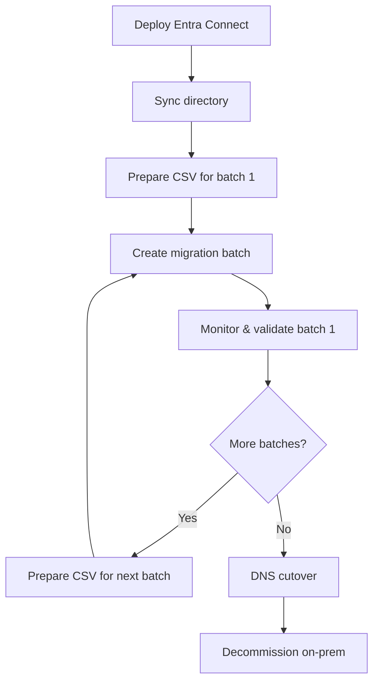

# Staged Migration: Exchange 2003/2007 to Exchange Online

**Status:** Authored 2026-04-30
**Audience:** Exchange administrators migrating legacy Exchange 2003 or Exchange 2007 environments to Exchange Online using the staged migration method.
**Scope:** Staged migration planning, directory synchronization, migration batches, mailbox moves, and post-migration tasks.

---

## Overview

Staged migration is designed for organizations running **Exchange 2003 or Exchange 2007** that need to migrate to Exchange Online in batches over weeks or months. Unlike cutover migration, staged migration moves mailboxes in groups (batches) while directory synchronization keeps the on-premises and cloud directories in sync.

### When to use staged migration

- Exchange Server 2003 or Exchange Server 2007.
- Any mailbox count (no upper limit).
- Need to migrate in phases over weeks or months.
- Cannot perform a single cutover weekend.

### When NOT to use staged migration

- Exchange 2010, 2013, 2016, or 2019 --- use [hybrid migration](hybrid-migration.md) or [cutover migration](cutover-migration.md).
- Need full coexistence (free/busy sharing, cross-premises delegate access) --- staged migration does not provide these. Use hybrid migration with Exchange 2013+ upgrade.

!!! warning "Exchange 2003/2007 end of support"
Exchange 2003 and Exchange 2007 are long past end of support. Staged migration is a legacy path. If possible, upgrade to Exchange 2016/2019 first and use hybrid migration for a better experience. Staged migration is documented here for organizations that cannot upgrade before migrating.

---

## Prerequisites

- [ ] Microsoft 365 tenant provisioned with Exchange Online licenses.
- [ ] **Directory synchronization** deployed (Entra Connect or legacy DirSync).
- [ ] Exchange on-premises Outlook Anywhere (RPC over HTTP) enabled.
- [ ] Valid SSL certificate for Outlook Anywhere endpoint.
- [ ] Admin credentials with Organization Management role on-premises.
- [ ] Microsoft 365 Global Administrator credentials.
- [ ] M365 licenses assigned to users in the first migration batch.
- [ ] CSV files prepared with mailbox lists for each batch.

---

## How staged migration works

Staged migration uses a different workflow than cutover or hybrid:

1. **Deploy directory synchronization** --- Entra Connect synchronizes on-premises AD users to Entra ID. This creates mail-enabled users (MEUs) in Exchange Online.
2. **Create migration batches** --- CSV files list the mailboxes to migrate in each wave.
3. **Run migration batch** --- Exchange Online connects to the on-premises server via Outlook Anywhere and copies mailbox data.
4. **Convert MEUs to mailboxes** --- After the migration batch completes, the mail-enabled users become full mailboxes in Exchange Online.
5. **Repeat for each batch** --- Continue with subsequent batches until all mailboxes are migrated.
6. **DNS cutover** --- Update MX and Autodiscover records to point to Exchange Online.



---

## Step 1: Deploy directory synchronization

```powershell
# Install and configure Microsoft Entra Connect
# Download from https://www.microsoft.com/en-us/download/details.aspx?id=47594

# Verify sync is working
Get-MsolCompanyInformation | Select-Object DirectorySynchronizationEnabled
Get-MsolUser -MaxResults 10 | Format-Table DisplayName, UserPrincipalName, isLicensed

# Verify Exchange attributes are syncing
Get-MsolUser -UserPrincipalName user@domain.com | Select-Object ProxyAddresses, ImmutableId
```

!!! info "Entra Connect Exchange hybrid mode"
Even for staged migration, Entra Connect should be configured with the Exchange hybrid deployment option enabled. This ensures Exchange-specific attributes (proxyAddresses, msExchMailboxGuid, etc.) synchronize correctly.

---

## Step 2: Prepare migration CSV files

Create a CSV file for each migration batch. The CSV must contain the `EmailAddress` column:

```csv
EmailAddress
user1@domain.com
user2@domain.com
user3@domain.com
user4@domain.com
user5@domain.com
```

### Batch planning guidelines

| Batch   | Description     | Size           | Timing    |
| ------- | --------------- | -------------- | --------- |
| Batch 0 | IT team (pilot) | 10--20 users   | Week 1    |
| Batch 1 | Early adopters  | 50--100 users  | Week 2    |
| Batch 2 | Department A    | 100--500 users | Week 3--4 |
| Batch 3 | Department B    | 100--500 users | Week 5--6 |
| Batch N | Remaining users | Varies         | Week 7+   |

### Batch sequencing best practices

- Start with IT and early adopters who can tolerate issues.
- Group users by department or office location.
- Keep managers and their direct reports in the same batch (shared calendar access).
- Migrate shared mailboxes in the same batch as their users.
- Save the largest mailboxes for later batches (they take longest and benefit from lessons learned).

---

## Step 3: Create migration endpoint and batch

```powershell
# Connect to Exchange Online PowerShell
Connect-ExchangeOnline -UserPrincipalName admin@domain.com

# Create migration endpoint
New-MigrationEndpoint -ExchangeOutlookAnywhere `
    -Name "StagedEndpoint" `
    -ExchangeServer mail.domain.com `
    -Credentials (Get-Credential) `
    -EmailAddress admin@domain.com

# Create staged migration batch
New-MigrationBatch -Name "Batch1-IT" `
    -SourceEndpoint "StagedEndpoint" `
    -TargetDeliveryDomain "domain.mail.onmicrosoft.com" `
    -CSVData ([System.IO.File]::ReadAllBytes("C:\Migration\batch1-it.csv"))

# Start the batch
Start-MigrationBatch -Identity "Batch1-IT"
```

---

## Step 4: Monitor migration progress

```powershell
# Check batch status
Get-MigrationBatch "Batch1-IT" |
    Select-Object Status, TotalCount, SyncedCount, FinalizedCount, FailedCount

# Check individual users
Get-MigrationUser -BatchId "Batch1-IT" |
    Format-Table Identity, Status, ErrorSummary

# Get detailed statistics
Get-MigrationUserStatistics -Identity "user@domain.com" |
    Select-Object Identity, Status, EstimatedTotalTransferSize, BytesTransferred, PercentComplete

# List failed users
Get-MigrationUser -BatchId "Batch1-IT" -Status Failed |
    Format-Table Identity, ErrorSummary
```

---

## Step 5: Complete the batch

```powershell
# Complete the migration batch (finalizes mailbox move)
Complete-MigrationBatch -Identity "Batch1-IT"

# Verify completion
Get-MigrationBatch "Batch1-IT" | Format-List Status, TotalCount, FinalizedCount

# Verify mailboxes are in Exchange Online
Get-Mailbox -Identity "user@domain.com" | Format-List RecipientTypeDetails, Database
```

After completing a batch:

1. **Verify Outlook connectivity** --- Users open Outlook; it should auto-reconfigure via Autodiscover.
2. **Verify mobile devices** --- ActiveSync devices should reconnect. Some may require profile recreation.
3. **Verify mail flow** --- Send test emails to and from migrated users.
4. **Assign licenses** --- Ensure all migrated users have M365 licenses.

---

## Step 6: Repeat for remaining batches

```powershell
# Create next batch
New-MigrationBatch -Name "Batch2-EarlyAdopters" `
    -SourceEndpoint "StagedEndpoint" `
    -TargetDeliveryDomain "domain.mail.onmicrosoft.com" `
    -CSVData ([System.IO.File]::ReadAllBytes("C:\Migration\batch2-earlyadopters.csv"))

Start-MigrationBatch -Identity "Batch2-EarlyAdopters"

# Continue monitoring and completing batches...
```

---

## Step 7: DNS cutover

After all batches are complete, update DNS records to point to Exchange Online:

```
# MX record
@ MX 0 domain-com.mail.protection.outlook.com

# Autodiscover CNAME
autodiscover CNAME autodiscover.outlook.com

# SPF record
@ TXT "v=spf1 include:spf.protection.outlook.com -all"
```

!!! tip "Reduce TTL before cutover"
Reduce the TTL on MX and Autodiscover records to 300 seconds (5 minutes) at least 48 hours before the DNS cutover. This ensures rapid propagation when you make the change.

---

## Step 8: Decommission on-premises Exchange

After DNS cutover and a validation period (2--4 weeks):

1. Verify all mail flows through Exchange Online.
2. Remove the staged migration batches: `Remove-MigrationBatch`.
3. Uninstall Exchange Server 2003/2007.
4. Continue running Entra Connect for directory synchronization.

---

## Staged migration limitations

| Limitation                              | Impact                                                         | Workaround                                                           |
| --------------------------------------- | -------------------------------------------------------------- | -------------------------------------------------------------------- |
| No free/busy sharing during coexistence | Users cannot see calendar availability across on-prem/cloud    | Communicate to users; schedule meetings via phone/email confirmation |
| No cross-premises delegate access       | Delegates on cloud cannot open on-prem mailboxes               | Migrate managers and delegates in same batch                         |
| Outlook Anywhere required               | Exchange 2003/2007 must have Outlook Anywhere configured       | Enable RPC over HTTP on Exchange 2003/2007                           |
| No public folder migration              | Public folders remain on-premises during staged migration      | Migrate public folders separately after all mailboxes move           |
| No unified GAL during migration         | GAL shows all users but mailbox location is invisible to users | Communicate which users have migrated                                |
| Outlook must be reconfigured            | Users may need to recreate Outlook profiles                    | Provide instructions; use automated profile tools                    |

---

## Troubleshooting

| Issue                                      | Cause                                   | Resolution                                                                |
| ------------------------------------------ | --------------------------------------- | ------------------------------------------------------------------------- |
| Entra Connect sync errors                  | Attribute conflicts, UPN mismatch       | Run `IdFix` tool; resolve duplicate or invalid attributes                 |
| Migration batch fails to start             | Outlook Anywhere not configured         | Enable RPC/HTTP on Exchange 2003/2007; verify SSL certificate             |
| Individual mailbox migration fails         | Corrupted items                         | Increase `BadItemLimit` on the migration user                             |
| Users cannot receive email after migration | Entra Connect not updating mail routing | Force Entra Connect delta sync: `Start-ADSyncSyncCycle -PolicyType Delta` |
| Outlook prompts for credentials            | Autodiscover returning old server       | Update Autodiscover DNS; clear credential manager                         |
| Mobile devices stop working                | ActiveSync profile cached to old server | Remove and re-add Exchange account on device                              |

---

**Maintainers:** csa-inabox core team
**Last updated:** 2026-04-30
