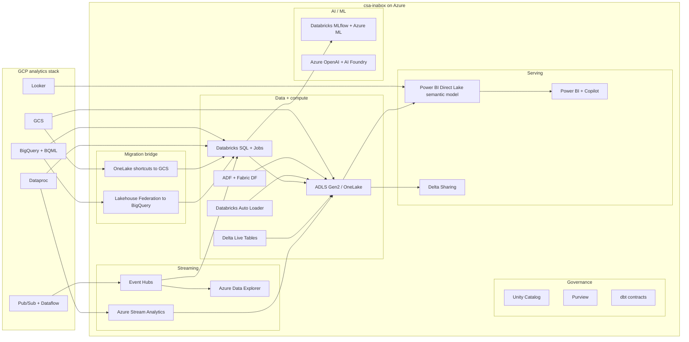

# Migrating from Google Cloud Analytics to csa-inabox on Azure

**Status:** Authored 2026-04-19
**Audience:** Federal CIO / CDO / Chief Data Architect running a GCP analytics estate (BigQuery, Dataproc, GCS, Looker) and moving to Azure — commercial or Azure Government.
**Scope:** BigQuery (warehouse + BigQuery ML + Omni + scheduled queries + materialized views), Dataproc (managed Spark/Presto/Flink), GCS (data-lake substrate), Looker (semantic layer + modeling + BI). Ancillary services (Dataflow, Pub/Sub, Cloud Composer, Vertex AI) are addressed where they touch the above.

---

## 1. Executive summary

Google Cloud is a strong analytics platform. For federal customers, the move to Azure is usually driven by a combination of **GCP's relatively narrow Assured Workloads for Government coverage**, procurement consolidation toward a single hyperscaler for the mission, a need for services or compliance tiers that sit on Azure Government but not on GCP Assured Workloads today, or a partner/prime requirement. The technical migration itself is well-understood: BigQuery is a close conceptual cousin of Databricks SQL + Delta Lake, Dataproc is Spark-on-managed-VM (Databricks is the target), GCS behaves like S3 or ADLS Gen2 for migration purposes, and Looker's semantic model is a cleaner port to Power BI than most teams expect.

csa-inabox on Azure inherits **FedRAMP High** through Azure Government (`docs/compliance/nist-800-53-rev5.md`, `governance/compliance/nist-800-53-rev5.yaml`), **CMMC 2.0 Level 2** (`governance/compliance/cmmc-2.0-l2.yaml`), and **HIPAA Security Rule** (`governance/compliance/hipaa-security-rule.yaml`), and every row of every capability-mapping table in this playbook cites a real file in the repo.

This playbook is honest. BigQuery's separation of storage and slot-based compute is genuinely elegant; BigQuery ML inline SQL feels simpler than Databricks + MLflow on day one; Looker's LookML-as-code discipline is something Power BI is still maturing on. The migration's payoff is **FedRAMP High + IL4/IL5 coverage, consumption-priced compute that scales to zero, and an open storage format (Delta on ADLS Gen2)**, not a per-feature win. For a federal tenant whose mission requires those properties, the trade-offs documented below are worth making.

### Federal considerations — GCP vs csa-inabox

| Consideration | GCP (Assured Workloads for Government, today) | csa-inabox on Azure Gov | Notes |
|---|---|---|---|
| FedRAMP High | **Limited service coverage** via Assured Workloads for Government | Inherited through Azure Gov for most services | Biggest differentiator for federal tenants requiring High across the analytics estate |
| DoD IL4 | Partial (narrow service list) | Broad coverage on Azure Gov | Check service-by-service |
| DoD IL5 | **Limited** | Covered on Azure Gov for most services; Fabric IL5 parity forecast per Microsoft roadmap | See `docs/GOV_SERVICE_MATRIX.md` |
| DoD IL6 | Not covered | **Gap** — out of scope for csa-inabox | Recommend bespoke tenant for IL6 |
| ITAR | Covered in Assured Workloads ITAR | Covered in Azure Government | Parity where both covered |
| CMMC 2.0 Level 2 | Customer-managed mappings; controls available | Controls mapped in `governance/compliance/cmmc-2.0-l2.yaml` | DIB primes inherit on csa-inabox |
| HIPAA Security Rule | Covered with BAA | Covered; mapped in `governance/compliance/hipaa-security-rule.yaml` | See `examples/tribal-health/` |
| Data-residency binding | Assured Workloads region | Azure Government tenant-binding | Azure Gov is a physically separate cloud |
| Storage format | BigQuery managed (Capacitor columnar) + BigQuery-external Parquet | Delta Lake on ADLS Gen2 (open) | Exit cost delta is real |
| Compute model | BigQuery slots (autoscaling + editions commitments) + Dataproc clusters | Databricks SQL (serverless + classic) + Databricks Jobs | Consumption parity at comparable workload |

---

## 2. Capability mapping — GCP → csa-inabox

### 2.1 BigQuery → csa-inabox

| BigQuery capability | csa-inabox equivalent | Mapping notes | Effort | Evidence |
|---|---|---|---|---|
| **BigQuery slots (autoscaling + editions)** | Databricks SQL Warehouses (serverless + classic) | Slots → DBUs; Edition commitments → Databricks reserved-capacity discounts | M | `csa_platform/unity_catalog_pattern/README.md`, ADR-0002 `docs/adr/0002-databricks-over-oss-spark.md`, ADR-0010 `docs/adr/0010-fabric-strategic-target.md` |
| **Partitioned + clustered tables** | Delta Lake partitioning + Z-ordering | Partition column = BigQuery partition; cluster keys = Z-order columns; Delta's stats-based pruning is analogous to BigQuery's block pruning | S | ADR-0003 `docs/adr/0003-delta-lake-over-iceberg-and-parquet.md` |
| **BigQuery ML** (`CREATE MODEL`, `ML.PREDICT`) | Databricks MLflow + Azure ML + Databricks SQL `ai_query()` | Inline SQL ML training → MLflow training notebooks; `ML.PREDICT` → `ai_query()` for hosted models or MLflow-serving UDFs | L | `csa_platform/ai_integration/model_serving/`, `domains/spark/`, ADR-0007 `docs/adr/0007-azure-openai-over-self-hosted-llm.md` |
| **BigQuery Omni** (multi-cloud query) | OneLake shortcuts (GCS/S3) + Databricks Lakehouse Federation | For Azure-side reads over GCS during bridge phase | M | `csa_platform/unity_catalog_pattern/onelake_config.yaml` |
| **Authorized views** | Unity Catalog row filters + fine-grained `GRANT`s + Purview classification-driven access | Authorized view model translates to Unity Catalog security functions; dbt-generated views are still a common pattern | M | `csa_platform/unity_catalog_pattern/unity_catalog/`, `csa_platform/purview_governance/classifications/pii_classifications.yaml` |
| **Scheduled queries** | dbt jobs + ADF schedule triggers + Databricks Workflows | Simple scheduled queries → Databricks Workflow schedules; cross-system orchestration → ADF | S | ADR-0001 `docs/adr/0001-adf-dbt-over-airflow.md`, `domains/shared/pipelines/adf/` |
| **Materialized views** | dbt incremental models + Databricks materialized views + Delta Live Tables | Refresh-on-write MVs → DLT; refresh-on-schedule MVs → dbt incremental | M | `domains/shared/dbt/dbt_project.yml`, `domains/finance/dbt/`, `domains/sales/dbt/` |
| **Table-valued functions + stored procs** | dbt macros + Databricks SQL UDFs + notebook jobs | SQL TVFs → dbt macros or SQL UDFs; imperative SPs → notebooks | M | `domains/shared/dbt/macros/` |
| **Search indexes + vector search** | Azure AI Search + Databricks Vector Search + OneLake vector tables | Inline `SEARCH` SQL → AI Search query via UDF or RAG pipeline | M | `csa_platform/ai_integration/rag/pipeline.py`, `csa_platform/ai_integration/rag/config.py` |
| **Row-level security** | Unity Catalog row filters | Policy function body → UC row filter function | M | `csa_platform/unity_catalog_pattern/unity_catalog/` |
| **Column-level security (policy tags)** | Unity Catalog column masks + Purview classifications | Policy tags map to Purview classifications (PII/PHI/CUI); masking function is a UC column mask | M | `csa_platform/purview_governance/classifications/` (all four taxonomy files) |
| **Data Transfer Service** | ADF + Fabric Data Factory + Databricks Auto Loader | DTS schedules → ADF pipelines; SaaS connectors → ADF native + self-hosted IR where needed | S | `domains/shared/pipelines/adf/`, `docs/SELF_HOSTED_IR.md`, `docs/ADF_SETUP.md` |
| **Streaming inserts + Storage Write API** | Event Hubs + Databricks structured streaming + ADX continuous ingest | Direct streaming-insert → Event Hubs + Databricks structured streaming to Delta | M | ADR-0005 `docs/adr/0005-event-hubs-over-kafka.md`, `examples/iot-streaming/` |
| **Datasets + projects (org hierarchy)** | Entra tenant / Databricks workspace / Unity Catalog catalog / schema | Project → subscription + workspace; dataset → catalog/schema | S | `csa_platform/multi_synapse/rbac_templates/`, `csa_platform/unity_catalog_pattern/unity_catalog/` |
| **INFORMATION_SCHEMA** | Databricks `information_schema` + Unity Catalog system tables | Direct feature parity for catalog metadata queries | XS | `csa_platform/unity_catalog_pattern/` |
| **Audit logs + Data Access logs** | Azure Monitor diagnostic settings + tamper-evident audit (CSA-0016) | Log Analytics receives Databricks + Unity Catalog audit; tamper-evident chain layered on top | M | Audit logger (CSA-0016 implementation), Azure Monitor diagnostic settings in Bicep modules |
| **Analytics Hub / dataset exchange** | Delta Sharing + Purview data products + OneLake shortcuts | Outbound via Delta Sharing; inbound via OneLake shortcuts | L | `csa_platform/data_marketplace/`, `csa_platform/data_marketplace/api/` |

### 2.2 Dataproc → csa-inabox

| Dataproc capability | csa-inabox equivalent | Mapping notes | Effort | Evidence |
|---|---|---|---|---|
| Managed Spark (on GCE) | Azure Databricks | 1:1 functional replacement with better runtime (Photon) | M | `csa_platform/unity_catalog_pattern/`, `domains/shared/notebooks/`, ADR-0002 |
| Dataproc Serverless | Databricks Serverless SQL + Jobs | Job-shaped serverless mapping | S | ADR-0010 |
| Presto / Trino on Dataproc | Databricks SQL | Query federation covered by Lakehouse Federation | M | `csa_platform/unity_catalog_pattern/` |
| Flink on Dataproc | Azure Stream Analytics + Event Hubs + Databricks structured streaming | Stateful streaming → ASA for SQL-first, Databricks for code-first | M | ADR-0005, `examples/iot-streaming/stream-analytics/` |
| Hive metastore (on Dataproc) | Unity Catalog (primary) + external Hive metastore supported | Bridge via external metastore; target is Unity Catalog | M | `csa_platform/unity_catalog_pattern/unity_catalog/` |
| Dataproc Jupyter + component gateway | Databricks Workspace Notebooks + Git integration | 1:1 UX mapping | S | `domains/shared/notebooks/`, `domains/spark/` |
| Dataproc autoscaling | Databricks cluster autoscaling + serverless | Serverless removes tuning burden entirely | XS | ADR-0002 |
| Dataproc workflow templates | Databricks Workflows + ADF pipelines | Job-graph DAGs map to Workflows; cross-system → ADF | M | `domains/shared/pipelines/adf/` |

### 2.3 GCS → csa-inabox

| GCS role | csa-inabox equivalent | Mapping notes | Effort | Evidence |
|---|---|---|---|---|
| Data lake buckets (raw/curated/archive) | ADLS Gen2 containers (bronze/silver/gold) + OneLake workspaces | Medallion mirrors the vertical examples | M | `examples/commerce/`, `examples/noaa/`, `csa_platform/unity_catalog_pattern/onelake_config.yaml` |
| GCS as source-of-truth during migration | OneLake shortcuts (read-only) | Bridge pattern — GCS stays source while Azure warms up | XS | `csa_platform/unity_catalog_pattern/onelake_config.yaml` |
| Object lifecycle policies | ADLS Gen2 lifecycle management | Hot → Cool → Archive translation is 1:1 | XS | Azure Storage policy via Bicep |
| GCS Object Versioning | Soft delete + versioning on ADLS Gen2 | 1:1 for audit/recovery | XS | Azure Storage versioning |
| GCS Retention Policy (WORM) | Immutable storage (time-based) on ADLS Gen2 | 1:1 compliance mapping | XS | Azure Storage immutability |
| Signed URLs | Azure Storage SAS tokens | Direct analog | XS | Azure Storage SAS patterns in Bicep modules |
| Pub/Sub GCS notifications → Cloud Functions | Event Grid `BlobCreated` → Logic Apps / Functions | Fan-out pattern is identical | S | `csa_platform/data_activator/functions/`, Event Grid in Bicep modules |
| Dual-region / multi-region replication | ADLS Gen2 geo-replication + object replication | For DR: `docs/DR.md`, `docs/MULTI_REGION.md` | S | `docs/DR.md`, `docs/MULTI_REGION.md` |

### 2.4 Looker → csa-inabox

| Looker capability | csa-inabox equivalent | Mapping notes | Effort | Evidence |
|---|---|---|---|---|
| LookML models + explores | Power BI semantic model (Direct Lake) + dbt semantic layer | LookML views → Power BI tables; explores → star-schema relationships; measures → DAX | L | `csa_platform/semantic_model/semantic_model_template.yaml`, `csa_platform/semantic_model/scripts/generate_semantic_model.py` |
| LookML PDTs (persistent derived tables) | dbt incremental models + Delta materialized views | PDTs collapse into dbt's normal incremental model pattern | M | `domains/shared/dbt/`, `domains/finance/dbt/` |
| Looks + Dashboards | Power BI reports + dashboards | Visual rebuild required; measures port cleanly once Power BI model is in place | L | `examples/commerce/reports/`, `csa_platform/semantic_model/` |
| Looker Explore UI (ad-hoc) | Power BI Explore + Q&A + Copilot | Native; Copilot handles the "ask a question" surface for users coming from Looker Explore | S | `csa_platform/semantic_model/` |
| Looker scheduled deliveries | Power BI subscriptions + Power Automate | 1:1 feature mapping | XS | `portal/powerapps/` (Power Automate patterns) |
| Content validator + version control | Power BI Git integration + Tabular Editor + deployment pipelines | Power BI now has proper Git integration; validation via CI | S | `.github/workflows/deploy.yml`, `.github/workflows/deploy-portal.yml` |
| Looker Action Hub | Data Activator + Event Grid + Power Automate | Actions fire into Azure Functions / Logic Apps for extensibility | M | `csa_platform/data_activator/rules/`, `csa_platform/data_activator/actions/` |
| Looker embed | Power BI Embedded + Fabric embedded | Direct analog; license model differs | S | `portal/react-webapp/src/` |

---

## 3. Reference architecture



---

## 4. Worked migration example — scheduled BigQuery rollup → dbt-databricks incremental

### 4.1 Starting state (BigQuery)

Daily scheduled query rolling up order lines into a fact table:

```sql
-- BigQuery scheduled query "fact_sales_daily_rollup"
-- Schedule: every day at 02:00 UTC
-- Target: acme-gov.finance.fact_sales_daily (partitioned by sales_date, clustered by region)

CREATE OR REPLACE TABLE `acme-gov.finance.fact_sales_daily`
PARTITION BY sales_date
CLUSTER BY region, product_id
AS
SELECT
  DATE(order_ts) AS sales_date,
  region,
  product_id,
  SUM(quantity) AS units_sold,
  SUM(gross_amount) AS gross_amount
FROM `acme-gov.sales.order_lines`
WHERE DATE(order_ts) BETWEEN DATE_SUB(CURRENT_DATE(), INTERVAL 3 DAY) AND CURRENT_DATE()
GROUP BY 1, 2, 3;
```

- IAM: service account `sa-finance-dbt@acme-gov.iam.gserviceaccount.com` with `BigQuery Data Editor` on `finance` dataset + `BigQuery Job User` at project level.
- Partition retention: 400 days.
- Clustering: `region, product_id`.
- Consumer: Looker explore `finance.sales_explore` over this table.

### 4.2 Target state (csa-inabox / Databricks + dbt)

**dbt incremental model** on `dbt-databricks`:

```sql
-- models/gold/fact_sales_daily.sql
{{ config(
    materialized='incremental',
    unique_key=['sales_date','region','product_id'],
    incremental_strategy='merge',
    partition_by=['sales_date'],
    tblproperties={
      'delta.autoOptimize.autoCompact': 'true',
      'delta.autoOptimize.optimizeWrite': 'true'
    }
) }}

SELECT
  DATE(order_ts) AS sales_date,
  region,
  product_id,
  SUM(quantity) AS units_sold,
  SUM(gross_amount) AS gross_amount
FROM {{ ref('stg_order_lines') }}

WHERE DATE(order_ts) >= DATE_SUB(CURRENT_DATE(), 3)

GROUP BY 1, 2, 3
```

Post-model hook or a separate job adds `OPTIMIZE ... ZORDER BY (region, product_id)` to keep clustering semantics aligned.

Schedule moves from BigQuery Scheduled Queries UI → Databricks Workflow schedule (or ADF trigger if it needs to coordinate with Fabric/Power BI refresh downstream).

### 4.3 StandardSQL → Databricks SQL dialect deltas

The ones that bite:

| BigQuery StandardSQL | Databricks SQL | Notes |
|---|---|---|
| `DATE_SUB(CURRENT_DATE(), INTERVAL 3 DAY)` | `DATE_SUB(CURRENT_DATE(), 3)` | Arg order differs |
| `SAFE_CAST(x AS INT64)` | `TRY_CAST(x AS BIGINT)` | Naming |
| Backticks around fully-qualified names | Back-tick supported; unified three-part catalog.schema.table | Port direct |
| `STRUCT<a INT64, b STRING>` | `STRUCT<a: BIGINT, b: STRING>` or `NAMED_STRUCT('a', a, 'b', b)` | Type-literal syntax differs |
| Arrays via `UNNEST` | `LATERAL VIEW explode()` or `explode()` in SELECT | Different keyword; semantics equal |
| `PARTITION BY ... CLUSTER BY ...` in DDL | `PARTITIONED BY (...)` + `ZORDER BY (...)` | Partitioning in DDL; Z-ordering in `OPTIMIZE` |
| `EXPORT DATA OPTIONS ...` | `COPY INTO` / `df.write.format('delta').save(...)` | Export idiom differs |
| `@@project_id`, `@@dataset_id` session vars | Unity Catalog `current_catalog()`, `current_schema()` | Session context functions |
| BigQuery's implicit commas in `FROM a, b` cross-joins | Explicit `CROSS JOIN` required | Safer but edit-heavy |

### 4.4 IAM → managed identity translation

| GCP | Azure |
|---|---|
| Service account `sa-finance-dbt@...` | User-assigned managed identity `umi-finance-dbt` |
| `BigQuery Data Editor` on dataset | Unity Catalog `MODIFY` on schema + `USE CATALOG` / `USE SCHEMA` |
| `BigQuery Job User` at project | Workspace access + SQL Warehouse `CAN_USE` |
| Workload Identity federation (for CI) | Managed identity federated credentials for GitHub Actions OIDC |
| GCS IAM (`roles/storage.objectViewer`) | RBAC `Storage Blob Data Reader` on container |

### 4.5 Partition spec mapping

| BigQuery | Databricks / Delta |
|---|---|
| `PARTITION BY sales_date` | `PARTITIONED BY (sales_date)` in DDL |
| `CLUSTER BY region, product_id` | `OPTIMIZE table ZORDER BY (region, product_id)` run via post-hook |
| `partition_expiration_days` table option | Delta `VACUUM` schedule + dbt model config or Databricks lifecycle |
| `require_partition_filter` option | Equivalent via Unity Catalog constraints + dbt tests in `contract.yaml` |

### 4.6 Contract + catalog registration

Ship a `contract.yaml` for `fact_sales_daily`; pattern from `domains/finance/data-products/invoices/contract.yaml`. CI runs `.github/workflows/validate-contracts.yml`. Purview auto-scans; the product registers in `csa_platform/data_marketplace/` for portal discovery.

### 4.7 Looker explore → Power BI semantic model

The Looker explore `finance.sales_explore` (which used `fact_sales_daily` as the base table plus joins to `dim_region`, `dim_product`, `dim_date`) becomes a Power BI Direct Lake semantic model with the same star schema:

- `fact_sales_daily` → fact
- `dim_region`, `dim_product`, `dim_date` → dimensions
- LookML measures → DAX measures:
  - LookML `measure: units_sold { type: sum; sql: ${TABLE}.units_sold }` → DAX `Units Sold = SUM(fact_sales_daily[units_sold])`
  - LookML `measure: gross_revenue { type: sum; sql: ${TABLE}.gross_amount }` → DAX `Gross Revenue = SUM(fact_sales_daily[gross_amount])`

The semantic model is authored via `csa_platform/semantic_model/semantic_model_template.yaml` and deployed by `csa_platform/semantic_model/scripts/generate_semantic_model.py`.

---

## 5. Migration sequence (phased project plan)

A realistic mid-to-large federal GCP analytics migration runs 26–34 weeks.

### Phase 0 — Discovery (Weeks 1–2)

- Inventory: BigQuery projects/datasets/tables, scheduled queries, BigQuery ML models, Dataproc clusters + jobs, GCS buckets, Looker instances + LookML projects + Explores, Pub/Sub topics, Dataflow jobs.
- Map service accounts → Entra ID managed identities.
- Identify cross-cloud dependencies (BigQuery Omni queries, GCS shared buckets).
- Pick a pilot domain with one LookML project and a bounded BigQuery workload.

**Success criteria:** 90% inventory coverage; pilot selected; migration risk register published.

### Phase 1 — Landing zones + bridge (Weeks 3–7)

- Deploy DMLZ + first DLZ via Bicep (ADR-0004).
- Unity Catalog metastore + catalogs mirroring BigQuery project/dataset layout.
- Purview provisioned and automated (`csa_platform/purview_governance/purview_automation.py`).
- **OneLake shortcuts to GCS + Lakehouse Federation to BigQuery** for read-only bridge.
- Entra ID groups + managed identities.

**Success criteria:** `make deploy-dev` succeeds; Databricks can query BigQuery via Lakehouse Federation; OneLake shortcuts to GCS resolve.

### Phase 2 — Pilot domain migration (Weeks 6–14)

Port one domain end-to-end:

1. Translate BigQuery schema → Unity Catalog schema; partition/cluster translation per 4.5.
2. Port scheduled queries → dbt incremental models (see Section 4).
3. Port BQML models → MLflow training notebooks + Databricks Model Serving.
4. Port Looker explores → Power BI Direct Lake semantic models (see 4.7).
5. Ship `contract.yaml` per data product.
6. Register data products in `csa_platform/data_marketplace/`.

**Reconciliation:** 2-week dual-run; aggregate-fact parity ≤0.5%.

**Success criteria:** pilot reconciled; Purview lineage end-to-end; pilot Looker dashboards retired.

### Phase 3 — BigQuery migration (Weeks 12–22, overlaps Phase 2)

Wave-based migration of remaining datasets:

- Batch 1: self-contained dbt-style workloads (cleanest ports).
- Batch 2: scheduled-query heavy datasets.
- Batch 3: BQML-heavy datasets (train → register → serve on MLflow).
- Batch 4: cross-project or Omni-dependent datasets (these often require decoupling before migration).

### Phase 4 — Dataproc + streaming (Weeks 14–24, overlapping)

- Dataproc Spark → Databricks Jobs (notebooks + dbt).
- Dataproc Presto → Databricks SQL.
- Flink workloads → ASA (SQL-first) or Databricks structured streaming (code-first).
- Pub/Sub → Event Hubs (Kafka protocol for the Kafka-dialect subscribers; native for the rest). See ADR-0005 `docs/adr/0005-event-hubs-over-kafka.md`.
- Dataflow batch → ADF pipelines + Databricks notebooks.
- Dataflow streaming → Databricks structured streaming or ASA.

### Phase 5 — Looker migration (Weeks 18–28, overlapping Phases 3–4)

- LookML projects ported per 4.7; typical project takes 2–4 weeks for a mid-sized explore-set.
- Looker scheduled deliveries → Power BI subscriptions + Power Automate.
- Looker Action Hub → Data Activator + Event Grid + Azure Functions / Logic Apps.
- Embedded Looker → Power BI Embedded / Fabric Embedded (license-model change; see Section 7).

### Phase 6 — GCS final cutover (Weeks 22–32)

Per-bucket decisions (same pattern as the AWS playbook's S3 phase):

- Archive-only → keep on GCS with Coldline / Archive class.
- Migrate → use `gsutil rsync` or Azure Data Box for large cold volumes; Storage Mover for running migrations; OneLake shortcuts for staged cutover.
- Bridge indefinitely → some datasets reasonably stay on GCS via shortcut if egress cost is favorable.

### Phase 7 — Decommission (Weeks 28–34)

- GCP projects moved to read-only.
- Final cost baseline published.
- Runbook + lessons-learned committed to repo.

---

## 6. Federal compliance considerations

- **FedRAMP High:** the biggest compliance delta. GCP's Assured Workloads for Government has narrower service coverage at FedRAMP High than Azure Government. csa-inabox inherits High across the in-scope analytics services; see `governance/compliance/nist-800-53-rev5.yaml` and `docs/compliance/nist-800-53-rev5.md`.
- **DoD IL4 / IL5:** `docs/GOV_SERVICE_MATRIX.md` is the live reference for Azure Gov coverage. GCP Assured Workloads IL5 is especially narrow; audit both sides before committing.
- **DoD IL6:** out of scope for csa-inabox; out of scope for GCP. If any workload must stay IL6, plan a bespoke Azure Top Secret tenant (not csa-inabox).
- **ITAR:** Azure Government tenant-binding inherits all ITAR defaults.
- **CMMC 2.0 Level 2:** `governance/compliance/cmmc-2.0-l2.yaml` + `docs/compliance/cmmc-2.0-l2.md`. DIB primes inherit directly.
- **HIPAA:** `governance/compliance/hipaa-security-rule.yaml`. See `examples/tribal-health/` for an IHS worked implementation.
- **Audit evidence:** the csa-inabox tamper-evident audit chain (CSA-0016) provides stronger FedRAMP High AU-family evidence than GCP Cloud Audit Logs out of the box.
- **GCP-specific compliance data to archive before decommission:** Cloud Audit Logs (Admin Activity, Data Access), IAM policy history, VPC Service Controls perimeter history. These become evidence in post-migration audits.

---

## 7. Cost comparison

Illustrative. GCP pricing is particularly sensitive to **editions commitments** (Enterprise Plus vs Enterprise vs Standard) and **slot capacity reservations**. A federal tenant running **~$3.5M/year** on the GCP analytics estate typically lands on:

- Databricks SQL + jobs (DBUs): **$900K–$1.3M**
- Storage (OneLake + ADLS Gen2 + GCS archive retained): **$200K–$400K**
- Power BI Premium / Fabric capacity F64/F128 (Looker replacement): **$250K–$500K** (note: Looker user licenses often come in at $3K/seat/year — Power BI PPU is typically cheaper at scale)
- Azure OpenAI / AI Foundry / AI Search: **$150K–$400K**
- Purview + Monitor + Key Vault + Private Endpoints: **$200K–$400K**
- Cross-cloud egress during bridge phase: **$50K–$150K** (one-time, declining)
- **Typical run-rate: $1.7M–$3.0M/year** — a 20–50% savings at comparable workload.

Cost drivers:

- **Looker → Power BI license change** is often the single biggest line-item improvement for federal tenants (Looker seats are material at scale).
- **Fabric capacity sizing** (F-SKU) is the second-largest knob; see `docs/COST_MANAGEMENT.md`.
- **Databricks reserved-capacity commitments** typically land 25–40% discounts over list.
- **Teardown safety:** `scripts/deploy/teardown-platform.sh` (CSA-0011).
- **OneLake shortcuts avoid egress** during bridge; budget final-move transfer separately.

Run `scripts/deploy/estimate-costs.sh` against the target landing-zone configuration.

---

## 8. Gaps and roadmap

| Gap | Description | Tracked finding | Planned remediation |
|---|---|---|---|
| **BigQuery ML inline-SQL simplicity** | `CREATE MODEL` + `ML.PREDICT` inside a SELECT is simpler than Databricks + MLflow on day one | N/A — architectural choice | Databricks AI Functions + `ai_query()` closes most; MLflow is the longer-run win |
| **Looker LookML-as-code discipline** | Power BI Git integration is newer than LookML's version-control maturity | N/A | Feature-gap closing quickly; see Power BI deployment pipelines in `.github/workflows/deploy-portal.yml` |
| **BigQuery Omni cross-cloud query** | OneLake shortcuts + Lakehouse Federation covers the Azure-side read; true multi-cloud BigQuery-like UX not fully matched | N/A | Documented bridge; no roadmap to replicate exactly |
| **IL6 coverage** | Out of scope for csa-inabox | N/A | Recommend bespoke Azure Top Secret tenant |
| **CSA Copilot** | No agent loop / chat UX for NL analysis yet | CSA-0008 (XL) | 6-phase MVP |
| **Framework control matrices** | NIST, CMMC, HIPAA delivered; PCI-DSS, SOC 2, GDPR still pending | CSA-0012 (XL) — in progress | Six YAMLs + narrative pages |

---

## 9. Competitive framing

### Where GCP wins today

- **BigQuery storage/compute separation elegance.** Slot-based pricing with automatic background maintenance is cleaner than Databricks SQL Warehouse management on day one.
- **BigQuery ML inline SQL.** `CREATE MODEL ... OPTIONS ...` + `ML.PREDICT()` is simpler than the MLflow workflow for simple models. Databricks AI Functions is closing this gap.
- **Looker as the enterprise semantic layer.** LookML's version control + modeling discipline is more mature than Power BI's, though Power BI is catching up fast with Git integration + Tabular Editor + Fabric deployment pipelines.
- **Dataproc + open-source ecosystem.** Broader OSS engine selection (Flink, Druid) is easier to host on Dataproc than on Databricks, though Azure has first-party equivalents (ASA, ADX).

### Where csa-inabox wins today

- **FedRAMP High coverage breadth.** GCP Assured Workloads is narrower. This is the material federal differentiator.
- **Azure Government service depth.** Broader IL4/IL5 coverage across analytics services.
- **Open storage format + open serving.** Delta + Parquet + Power BI XMLA is a cleaner exit path than BigQuery's Capacitor + Looker's LookML.
- **Single coherent stack.** Databricks + Delta + Purview + OneLake + Power BI replaces BigQuery + Dataproc + GCS + Looker + Vertex AI with fewer moving parts.
- **Teardown safety.** `scripts/deploy/teardown-platform.sh` (CSA-0011) — hard kill-switch for workshop/dev spend.
- **Federal-tribal reference implementations.** `examples/tribal-health/` and `examples/casino-analytics/`.
- **Commercial → Gov continuum.** Same IaC, same CI/CD, same codebase deploys to Azure Commercial and Azure Government.

### Decision framework

- **Start here for csa-inabox:** FedRAMP High coverage required across the analytics estate, Azure-first mandate, heavy Looker footprint where license-cost compression matters, IL4/IL5 breadth required, mixed-cloud estate being consolidated onto Azure.
- **Stay on GCP:** BigQuery-only footprint with no compliance gap, heavy BQML inline-SQL workload, deep Vertex AI integration, no forcing function to move, cost model locked in on multi-year Enterprise Plus commitment.

Mixed-cloud is also rational. OneLake shortcuts + Lakehouse Federation + Delta Sharing allow BigQuery + Azure coexistence if the mission requires it.

---

## 10. Related resources

- **Migration index:** [docs/migrations/README.md](README.md)
- **Companion playbooks:** [snowflake.md](snowflake.md), [aws-to-azure.md](aws-to-azure.md), [palantir-foundry.md](palantir-foundry.md)
- **Decision trees:**
  - `docs/decisions/fabric-vs-databricks-vs-synapse.md`
  - `docs/decisions/batch-vs-streaming.md`
  - `docs/decisions/delta-vs-iceberg-vs-parquet.md`
  - `docs/decisions/etl-vs-elt.md`
  - `docs/decisions/lakehouse-vs-warehouse-vs-lake.md`
  - `docs/decisions/materialize-vs-virtualize.md`
  - `docs/decisions/rag-vs-finetune-vs-agents.md`
- **ADRs:**
  - `docs/adr/0001-adf-dbt-over-airflow.md`
  - `docs/adr/0002-databricks-over-oss-spark.md`
  - `docs/adr/0003-delta-lake-over-iceberg-and-parquet.md`
  - `docs/adr/0004-bicep-over-terraform.md`
  - `docs/adr/0005-event-hubs-over-kafka.md`
  - `docs/adr/0006-purview-over-atlas.md`
  - `docs/adr/0007-azure-openai-over-self-hosted-llm.md`
  - `docs/adr/0010-fabric-strategic-target.md`
- **Compliance matrices:**
  - `docs/compliance/nist-800-53-rev5.md` / `governance/compliance/nist-800-53-rev5.yaml`
  - `docs/compliance/cmmc-2.0-l2.md` / `governance/compliance/cmmc-2.0-l2.yaml`
  - `docs/compliance/hipaa-security-rule.md` / `governance/compliance/hipaa-security-rule.yaml`
- **Platform modules:**
  - `csa_platform/unity_catalog_pattern/` — OneLake + Unity Catalog + GCS shortcut pattern
  - `csa_platform/semantic_model/` — Direct Lake semantic model (Looker replacement target)
  - `csa_platform/purview_governance/` — catalog + classifications
  - `csa_platform/ai_integration/` — BQML / Vertex replacement primitives
  - `csa_platform/data_marketplace/` — data-product registry (Analytics Hub analogue)
  - `csa_platform/multi_synapse/` — multi-workspace pattern
- **Example verticals:**
  - `examples/commerce/`, `examples/noaa/`, `examples/epa/`, `examples/interior/`, `examples/usda/`, `examples/iot-streaming/`, `examples/tribal-health/`
- **Operational guides:**
  - `docs/QUICKSTART.md`, `docs/ARCHITECTURE.md`, `docs/GOV_SERVICE_MATRIX.md`, `docs/COST_MANAGEMENT.md`, `docs/DATABRICKS_GUIDE.md`

---

**Maintainers:** csa-inabox core team
**Source finding:** CSA-0083 (HIGH, XL) — approved via AQ-0010 ballot B6
**Last updated:** 2026-04-19
