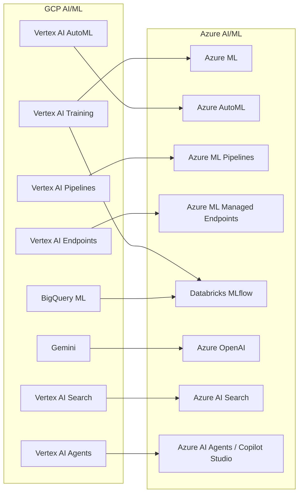

# AI/ML Migration: Vertex AI and BigQuery ML to Azure AI

**A hands-on guide for data scientists and ML engineers migrating from Google Cloud AI/ML services to Azure Machine Learning, Databricks MLflow, Azure OpenAI, and Azure AI Search.**

---

## Scope

This guide covers:

- Vertex AI Training to Azure ML / Databricks ML
- AutoML to Azure AutoML / Databricks AutoML
- Vertex AI Pipelines to Azure ML Pipelines / Prompt Flow
- Vertex AI Endpoints to Azure ML Managed Endpoints
- BigQuery ML to Fabric ML / Databricks MLflow
- Gemini to Azure OpenAI (GPT-4o, o3, o4-mini)
- Vertex AI Search to Azure AI Search
- Vertex AI Agents to Azure AI Agents / Copilot Studio

For compute migration (BigQuery SQL, Dataproc), see [Compute Migration](compute-migration.md).

---

## Architecture overview



---

## Vertex AI Training to Azure ML / Databricks ML

Vertex AI Training provides managed compute for custom model training using TensorFlow, PyTorch, scikit-learn, and XGBoost. The Azure equivalents are Azure ML and Databricks ML.

### Mapping

| Vertex AI concept | Azure ML equivalent | Databricks equivalent | Notes |
|---|---|---|---|
| Custom training job | Azure ML command job | Databricks notebook job | Submit training code to managed compute |
| Training pipeline | Azure ML pipeline | Databricks Workflow | Multi-step training orchestration |
| Managed dataset | Azure ML data asset | Unity Catalog table / volume | Versioned data for training |
| Experiment tracking | Azure ML experiments | MLflow experiments | Metrics, parameters, artifacts |
| Model registry | Azure ML model registry | MLflow Model Registry | Versioned model management |
| Hyperparameter tuning | Azure ML sweep jobs | Optuna / Hyperopt on Databricks | Automated hyperparameter search |
| Distributed training | Azure ML distributed training | Databricks distributed Spark ML | Multi-node training |
| Custom containers | Azure ML environments (Docker) | Databricks cluster libraries | Runtime dependency management |
| TensorBoard | Azure ML TensorBoard integration | MLflow + TensorBoard on Databricks | Training visualization |

### Migration approach

1. **Training code** -- Python training scripts using TensorFlow/PyTorch/scikit-learn transfer with minimal changes. Remove Vertex AI SDK imports (`google.cloud.aiplatform`) and replace with Azure ML SDK (`azure.ai.ml`) or MLflow.
2. **Data access** -- Replace `gs://` paths with `abfss://` paths for ADLS or Delta table references.
3. **Experiment tracking** -- Replace Vertex AI experiment logging with MLflow `log_metric()`, `log_param()`, `log_artifact()`.
4. **Model registry** -- Register trained models in MLflow Model Registry or Azure ML model registry.

**Example: Training script migration**

Vertex AI:

```python
from google.cloud import aiplatform

aiplatform.init(project="acme-gov", location="us-central1")

job = aiplatform.CustomTrainingJob(
    display_name="sales-forecast",
    script_path="train.py",
    container_uri="us-docker.pkg.dev/vertex-ai/training/tf-cpu.2-12:latest",
    requirements=["pandas", "scikit-learn"]
)

model = job.run(
    dataset=dataset,
    model_display_name="sales-forecast-v1",
    args=["--epochs=50", "--batch-size=32"]
)
```

Azure ML:

```python
from azure.ai.ml import MLClient, command, Input
from azure.identity import DefaultAzureCredential

ml_client = MLClient(DefaultAzureCredential(), subscription_id, resource_group, workspace)

job = command(
    code="./src",
    command="python train.py --epochs 50 --batch-size 32",
    environment="AzureML-sklearn-1.0@latest",
    compute="gpu-cluster",
    inputs={"data": Input(type="uri_folder", path="azureml://datastores/training/paths/sales/")}
)

returned_job = ml_client.jobs.create_or_update(job)
```

Databricks MLflow:

```python
import mlflow
import mlflow.sklearn
from sklearn.ensemble import RandomForestRegressor

mlflow.set_experiment("/sales-forecast")

with mlflow.start_run():
    model = RandomForestRegressor(n_estimators=100)
    model.fit(X_train, y_train)

    mlflow.log_param("n_estimators", 100)
    mlflow.log_metric("rmse", rmse)
    mlflow.sklearn.log_model(model, "model", registered_model_name="sales-forecast")
```

---

## AutoML migration

### Vertex AI AutoML to Azure AutoML

| Vertex AI AutoML feature | Azure AutoML equivalent | Notes |
|---|---|---|
| Tabular classification | AutoML classification | Direct equivalent |
| Tabular regression | AutoML regression | Direct equivalent |
| Tabular forecasting | AutoML forecasting | Direct equivalent |
| Image classification | AutoML image classification | Direct equivalent |
| Object detection | AutoML object detection | Direct equivalent |
| Text classification | AutoML NLP | Direct equivalent |
| Video classification | Custom Azure ML | Less automated; use custom pipeline |

### Vertex AI AutoML to Databricks AutoML

Databricks AutoML provides automated ML for tabular data with a notebook-based UI.

| Feature | Vertex AI AutoML | Databricks AutoML | Azure AutoML |
|---|---|---|---|
| Tabular data | Yes | Yes | Yes |
| Image/video | Yes | No | Yes |
| Text/NLP | Yes | No | Yes |
| Explainability | Feature importance | SHAP values | Feature importance + SHAP |
| Model export | TF SavedModel | MLflow model | ONNX / MLflow |
| Code generation | No | Yes (generates notebook) | No |
| Custom preprocessing | Limited | Full notebook control | Featurization config |

**Recommendation:** Use Databricks AutoML for tabular data (it generates editable notebooks). Use Azure AutoML for image, video, and NLP tasks.

---

## Vertex AI Pipelines to Azure ML Pipelines / Prompt Flow

Vertex AI Pipelines uses Kubeflow Pipelines (KFP) DSL. Azure provides two pipeline systems:

### Azure ML Pipelines

For traditional ML workflows (data prep, training, evaluation, deployment).

| KFP concept | Azure ML Pipeline equivalent | Notes |
|---|---|---|
| `@component` decorator | Azure ML component | Reusable pipeline step |
| `@pipeline` decorator | Azure ML pipeline | Pipeline definition |
| `Input` / `Output` | `Input` / `Output` | Data flow between steps |
| `Artifact` | Azure ML data asset | Pipeline artifacts |
| Container component | Azure ML environment | Runtime specification |
| Compiler | `ml_client.jobs.create_or_update()` | Pipeline submission |

### Prompt Flow (Azure AI Foundry)

For LLM-based workflows (RAG, agents, evaluation).

| Vertex AI feature | Prompt Flow equivalent | Notes |
|---|---|---|
| AIP Logic | Prompt Flow DAG | LLM orchestration |
| Chatbot Studio | Copilot Studio | No-code agent builder |
| Vertex AI evaluation | Prompt Flow evaluation | LLM evaluation framework |
| Grounding | Azure AI Search retrieval | RAG pipeline |

---

## Vertex AI Endpoints to Azure ML Managed Endpoints

| Vertex AI Endpoints feature | Azure ML Managed Endpoints | Notes |
|---|---|---|
| Online prediction | Managed online endpoint | Real-time inference |
| Batch prediction | Managed batch endpoint | Batch inference |
| Traffic splitting | Traffic allocation (A/B) | Blue-green deployment |
| Auto-scaling | Instance auto-scaling | Scale based on load |
| Model monitoring | Azure ML model monitoring | Data drift, prediction drift |
| Private endpoint | Private managed endpoint | VNet integration |

**Databricks alternative:** Databricks Model Serving provides a simpler deployment path for models tracked in MLflow.

```python
# Azure ML managed endpoint deployment
from azure.ai.ml.entities import ManagedOnlineEndpoint, ManagedOnlineDeployment

endpoint = ManagedOnlineEndpoint(name="sales-forecast-endpoint", auth_mode="key")
ml_client.online_endpoints.begin_create_or_update(endpoint)

deployment = ManagedOnlineDeployment(
    name="blue",
    endpoint_name="sales-forecast-endpoint",
    model="azureml:sales-forecast:1",
    instance_type="Standard_DS3_v2",
    instance_count=1
)
ml_client.online_deployments.begin_create_or_update(deployment)
```

---

## BigQuery ML to Databricks MLflow

BigQuery ML's `CREATE MODEL` syntax is uniquely simple. The migration to MLflow requires a shift from inline SQL to a notebook-based workflow, but gains the full MLflow lifecycle (experiment tracking, model registry, serving, monitoring).

### Model type mapping

| BigQuery ML model | MLflow / Databricks equivalent | Notes |
|---|---|---|
| `LINEAR_REG` | scikit-learn LinearRegression + MLflow | Standard regression |
| `LOGISTIC_REG` | scikit-learn LogisticRegression + MLflow | Classification |
| `KMEANS` | scikit-learn KMeans + MLflow | Clustering |
| `BOOSTED_TREE_REGRESSOR` | XGBoost / LightGBM + MLflow | Gradient boosting |
| `BOOSTED_TREE_CLASSIFIER` | XGBoost / LightGBM + MLflow | Gradient boosting |
| `RANDOM_FOREST_REGRESSOR` | scikit-learn RandomForest + MLflow | Ensemble |
| `DNN_REGRESSOR` | PyTorch / TensorFlow + MLflow | Deep learning |
| `ARIMA_PLUS` | Prophet / statsmodels + MLflow | Time series |
| `MATRIX_FACTORIZATION` | Surprise / implicit + MLflow | Recommendation |
| `TRANSFORM` (feature eng) | Spark feature engineering / dbt | Preprocessing |

### Migration example

**BigQuery ML:**

```sql
CREATE OR REPLACE MODEL `acme-gov.ml.sales_forecast`
OPTIONS(
  model_type='BOOSTED_TREE_REGRESSOR',
  input_label_cols=['revenue'],
  data_split_method='AUTO_SPLIT'
) AS
SELECT region, product_category, month, revenue
FROM `acme-gov.finance.training_data`;

-- Prediction
SELECT * FROM ML.PREDICT(MODEL `acme-gov.ml.sales_forecast`,
  (SELECT region, product_category, month FROM `acme-gov.finance.scoring_data`));
```

**Databricks MLflow:**

```python
import mlflow
import mlflow.xgboost
import xgboost as xgb
from pyspark.sql import SparkSession

spark = SparkSession.builder.getOrCreate()

# Load training data from Delta
train_df = spark.table("finance.training_data").toPandas()
X = train_df[["region", "product_category", "month"]]
y = train_df["revenue"]

mlflow.set_experiment("/sales-forecast")

with mlflow.start_run():
    model = xgb.XGBRegressor(n_estimators=100, max_depth=6)
    model.fit(X, y)

    mlflow.log_params({"n_estimators": 100, "max_depth": 6})
    mlflow.xgboost.log_model(model, "model", registered_model_name="sales-forecast")

# Prediction using ai_query (Databricks SQL)
# SELECT ai_query('sales-forecast', region, product_category, month) FROM finance.scoring_data;
```

---

## Gemini to Azure OpenAI

| Gemini model | Azure OpenAI equivalent | Notes |
|---|---|---|
| Gemini 2.0 Flash | GPT-4o-mini | Fast, cost-efficient |
| Gemini 2.0 Pro | GPT-4o | Strong general purpose |
| Gemini 1.5 Pro (long context) | GPT-4.1 (long context) | Extended context window |
| Gemini Ultra | o3 / o4-mini | Advanced reasoning |

### API migration

**Vertex AI (Gemini):**

```python
from vertexai.generative_models import GenerativeModel

model = GenerativeModel("gemini-2.0-pro")
response = model.generate_content("Summarize the quarterly report")
print(response.text)
```

**Azure OpenAI:**

```python
from openai import AzureOpenAI

client = AzureOpenAI(
    azure_endpoint="https://acme-gov.openai.azure.com/",
    api_key=os.environ["AZURE_OPENAI_API_KEY"],
    api_version="2024-06-01"
)

response = client.chat.completions.create(
    model="gpt-4o",
    messages=[{"role": "user", "content": "Summarize the quarterly report"}]
)
print(response.choices[0].message.content)
```

---

## Vertex AI Search to Azure AI Search

| Vertex AI Search feature | Azure AI Search equivalent | Notes |
|---|---|---|
| Unstructured search | Full-text search | BM25 ranking |
| Structured search | Faceted search + filters | Rich filtering |
| Hybrid search (semantic + keyword) | Hybrid search (semantic + BM25) | Direct equivalent |
| Vector search | Vector search (HNSW) | Embedding-based retrieval |
| Grounding / RAG | RAG with AI Search retriever | Enterprise RAG pattern |
| Data connectors | Indexers (Blob, SQL, Cosmos DB) | Automated indexing |
| Snippets / extractive answers | Semantic answers | AI-enhanced results |
| Conversation search | Conversational search | Multi-turn queries |

### RAG pipeline migration

Vertex AI Search + Gemini RAG becomes Azure AI Search + Azure OpenAI RAG:

```python
# Azure RAG pattern
from azure.search.documents import SearchClient
from openai import AzureOpenAI

# 1. Retrieve relevant documents
search_client = SearchClient(endpoint, index_name, credential)
results = search_client.search(query, top=5, query_type="semantic")

# 2. Build context from search results
context = "\n".join([r["content"] for r in results])

# 3. Generate answer with context
openai_client = AzureOpenAI(...)
response = openai_client.chat.completions.create(
    model="gpt-4o",
    messages=[
        {"role": "system", "content": f"Answer based on this context:\n{context}"},
        {"role": "user", "content": query}
    ]
)
```

---

## Vertex AI Agents to Azure AI Agents / Copilot Studio

| Vertex AI Agents feature | Azure equivalent | Notes |
|---|---|---|
| Agent Builder (no-code) | Copilot Studio | No-code agent builder |
| Agent Builder (code) | Azure AI Agents (Semantic Kernel) | Code-first agent framework |
| Tool use / function calling | Function calling (Azure OpenAI) | Tool integration |
| Grounding (data store) | Azure AI Search grounding | RAG-based grounding |
| Multi-turn conversation | Copilot Studio / custom agent | Stateful conversation |
| Evaluation | Prompt Flow evaluation | Agent evaluation framework |
| Deployment | Azure AI Foundry deployment | Managed agent hosting |

---

## Migration sequence

1. **Inventory** all Vertex AI models, endpoints, pipelines, and BigQuery ML models
2. **Classify** by type: traditional ML, AutoML, LLM, search, agents
3. **Migrate traditional ML** -- convert training scripts, set up MLflow tracking
4. **Migrate AutoML** -- retrain using Azure AutoML or Databricks AutoML
5. **Migrate BigQuery ML** -- convert `CREATE MODEL` to MLflow-based training
6. **Migrate LLM workloads** -- switch API calls from Gemini to Azure OpenAI
7. **Migrate search/RAG** -- rebuild search indexes in Azure AI Search
8. **Migrate agents** -- rebuild in Copilot Studio or with Semantic Kernel
9. **Validate** model performance parity (metrics comparison)

---

## Validation checklist

After migrating AI/ML:

- [ ] All ML models retrained and registered in MLflow or Azure ML
- [ ] Model performance metrics match or exceed GCP baselines
- [ ] Online endpoints serving predictions with acceptable latency
- [ ] Batch prediction pipelines producing matching output
- [ ] LLM integrations using Azure OpenAI with equivalent quality
- [ ] RAG pipelines returning relevant results from Azure AI Search
- [ ] Agents responding appropriately in Copilot Studio or custom framework
- [ ] Experiment tracking and model versioning operational in MLflow

---

**Last updated:** 2026-04-30
**Maintainers:** CSA-in-a-Box core team
**Related:** [Compute Migration](compute-migration.md) | [Complete Feature Mapping](feature-mapping-complete.md) | [Migration Playbook](../gcp-to-azure.md)
