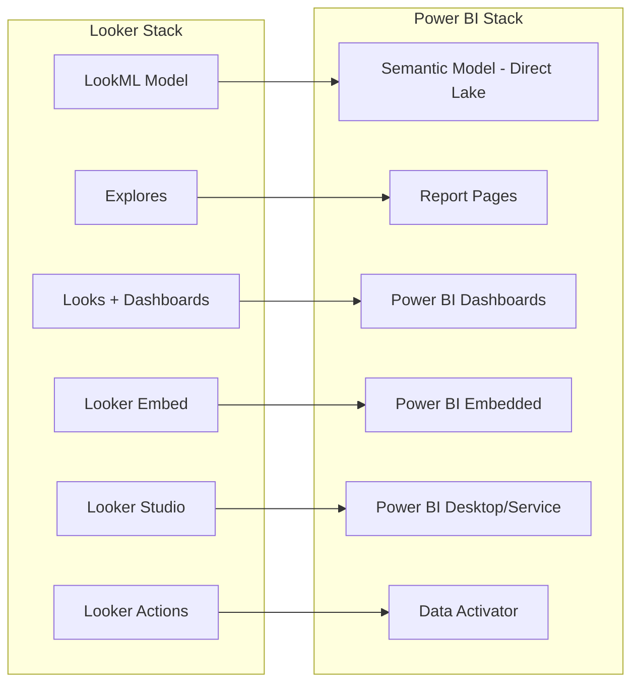

# Analytics Migration: Looker to Power BI

**A hands-on guide for BI developers and analytics engineers migrating from Looker (LookML, Explores, dashboards, embedding) to Power BI, DAX, semantic models, and Power BI Embedded.**

---

## Scope

This guide covers:

- LookML model to Power BI semantic model
- Explores to Power BI report pages
- Looks and dashboards to Power BI visuals and dashboards
- LookML dimensions and measures to DAX
- Looker embedding to Power BI Embedded
- Looker Studio to Power BI Desktop/Service
- Data modeling philosophy comparison

For BigQuery compute migration, see [Compute Migration](compute-migration.md). For the worked example of a Looker explore to Power BI semantic model, see the Migration Playbook Section 4.7.

---

## Architecture overview



---

## Data modeling philosophy comparison

Understanding the philosophical differences between Looker and Power BI is critical for a successful migration.

### Looker (LookML)

- **Model-first:** LookML defines the semantic layer in code (views, explores, measures, dimensions). All downstream analysis flows through LookML.
- **Symmetric aggregation:** LookML's `symmetric_aggregates` feature prevents double-counting across joins automatically.
- **Git-native:** LookML lives in Git repositories. Version control is first-class.
- **Centralized:** One LookML model governs all analysis. Analysts explore within the model's boundaries.
- **SQL-generated:** LookML generates SQL at query time. The semantic layer is an abstraction over SQL.

### Power BI (Tabular Model)

- **Model-first (converging):** Power BI semantic models define relationships, measures, and calculation groups. TMDL (Tabular Model Definition Language) enables Git-based workflows.
- **DAX for measures:** DAX (Data Analysis Expressions) is a formula language for defining measures, calculated columns, and tables.
- **Star schema:** Power BI works best with star schemas (fact + dimension tables). This aligns naturally with the medallion architecture (gold layer = star schema).
- **Direct Lake:** In Fabric, semantic models read Delta Lake files directly without import -- equivalent to Looker querying BigQuery at analysis time.
- **Copilot:** Natural language queries, measure suggestions, and report generation.

### Key differences

| Dimension            | Looker (LookML)               | Power BI                          |
| -------------------- | ----------------------------- | --------------------------------- |
| Semantic definition  | LookML code (views, explores) | Tabular model (TMDL / UI)         |
| Measure language     | LookML measure syntax         | DAX                               |
| Version control      | Git-native (first-class)      | Git integration (maturing)        |
| Query generation     | SQL generated from LookML     | DAX queries against Tabular model |
| Ad-hoc exploration   | Explore UI                    | Power BI Explore + Q&A + Copilot  |
| Symmetric aggregates | Built-in                      | Requires careful DAX modeling     |
| Embedding            | Looker Embed SDK              | Power BI Embedded SDK             |

---

## LookML to Power BI semantic model

### Views to tables

A LookML **view** maps to a **table** in the Power BI semantic model.

```
LookML view: sales.order_lines  -->  Power BI table: order_lines
LookML view: sales.dim_product  -->  Power BI table: dim_product
LookML view: sales.dim_region   -->  Power BI table: dim_region
```

In a Direct Lake semantic model, each table points to a Delta table in OneLake. The LookML SQL definition (`sql_table_name` or derived table SQL) is replaced by a Delta table reference.

### Explores to relationships

A LookML **explore** defines a base table and its joins. In Power BI, this becomes the **relationship model** (star schema).

**LookML explore:**

```lookml
explore: order_lines {
  join: dim_product {
    type: left_outer
    sql_on: ${order_lines.product_id} = ${dim_product.product_id} ;;
    relationship: many_to_one
  }
  join: dim_region {
    type: left_outer
    sql_on: ${order_lines.region_id} = ${dim_region.region_id} ;;
    relationship: many_to_one
  }
  join: dim_date {
    type: left_outer
    sql_on: ${order_lines.order_date} = ${dim_date.date_key} ;;
    relationship: many_to_one
  }
}
```

**Power BI model relationships:**

- `order_lines[product_id]` --> `dim_product[product_id]` (many-to-one)
- `order_lines[region_id]` --> `dim_region[region_id]` (many-to-one)
- `order_lines[order_date]` --> `dim_date[date_key]` (many-to-one)

These relationships are defined in the Power BI model view (UI) or in TMDL (code).

### Dimensions to columns

LookML **dimensions** map to **columns** in Power BI tables. Most require no translation because they are simply column references.

| LookML dimension type                             | Power BI equivalent      | Notes                             |
| ------------------------------------------------- | ------------------------ | --------------------------------- |
| `dimension: id` (primary key)                     | Column (mark as key)     | Set as unique identifier          |
| `dimension: name` (string)                        | Column (text)            | Direct mapping                    |
| `dimension: amount` (number)                      | Column (decimal)         | Direct mapping                    |
| `dimension: created_date` (date)                  | Column (date)            | Direct mapping                    |
| `dimension: tier` (string, with `sql` expression) | Calculated column (DAX)  | Complex logic becomes DAX         |
| `dimension_group: created` (time)                 | Date hierarchy on column | Power BI auto-creates hierarchies |

### Measures to DAX

This is the most labor-intensive part of the migration. Every LookML **measure** becomes a **DAX measure**.

| LookML measure                                                              | DAX equivalent                                                                                             | Notes             |
| --------------------------------------------------------------------------- | ---------------------------------------------------------------------------------------------------------- | ----------------- |
| `measure: count { type: count }`                                            | `Count = COUNTROWS(order_lines)`                                                                           | Row count         |
| `measure: total_revenue { type: sum; sql: ${revenue} }`                     | `Total Revenue = SUM(order_lines[revenue])`                                                                | Sum aggregation   |
| `measure: avg_order_value { type: average; sql: ${revenue} }`               | `Avg Order Value = AVERAGE(order_lines[revenue])`                                                          | Average           |
| `measure: distinct_customers { type: count_distinct; sql: ${customer_id} }` | `Distinct Customers = DISTINCTCOUNT(order_lines[customer_id])`                                             | Count distinct    |
| `measure: max_order_date { type: max; sql: ${order_date} }`                 | `Max Order Date = MAX(order_lines[order_date])`                                                            | Maximum           |
| `measure: revenue_ytd { type: sum; sql: ${revenue}; filters: [...] }`       | `Revenue YTD = TOTALYTD(SUM(order_lines[revenue]), dim_date[date_key])`                                    | Time intelligence |
| `measure: pct_of_total { type: percent_of_total; sql: ${revenue} }`         | `Pct of Total = DIVIDE(SUM(order_lines[revenue]), CALCULATE(SUM(order_lines[revenue]), ALL(order_lines)))` | Percent of total  |

### Filtered measures

LookML measures with `filters` become DAX measures with `CALCULATE` and `FILTER`:

**LookML:**

```lookml
measure: us_revenue {
  type: sum
  sql: ${revenue} ;;
  filters: [dim_region.country: "US"]
}
```

**DAX:**

```dax
US Revenue = CALCULATE(
    SUM(order_lines[revenue]),
    dim_region[country] = "US"
)
```

### LookML persistent derived tables (PDTs)

PDTs are precomputed tables in Looker. They map directly to dbt incremental models in the CSA-in-a-Box pattern.

| PDT type             | dbt equivalent        | Notes                    |
| -------------------- | --------------------- | ------------------------ |
| SQL-based PDT        | dbt table model       | Materialized on schedule |
| Trigger-based PDT    | dbt incremental model | Refreshed incrementally  |
| Native derived table | dbt ephemeral model   | Computed in query        |

---

## Looker dashboards to Power BI

### Visual mapping

| Looker visual     | Power BI visual            | Notes                            |
| ----------------- | -------------------------- | -------------------------------- |
| Single value tile | Card visual                | Direct mapping                   |
| Table             | Table / Matrix             | Matrix for pivot tables          |
| Bar chart         | Clustered bar chart        | Direct mapping                   |
| Line chart        | Line chart                 | Direct mapping                   |
| Area chart        | Area chart                 | Direct mapping                   |
| Scatter plot      | Scatter chart              | Direct mapping                   |
| Pie/donut chart   | Pie / Donut chart          | Direct mapping                   |
| Map (point)       | Map / Azure Map visual     | Azure Map for federal compliance |
| Funnel            | Funnel chart               | Direct mapping                   |
| Waterfall         | Waterfall chart            | Direct mapping                   |
| Text tile         | Text box / Smart narrative | Smart narrative adds AI          |

### Dashboard layout

Looker dashboards use a grid layout. Power BI dashboards use a canvas layout with pinned tiles. For the closest match, create **Power BI reports** (not dashboards) -- reports provide the full canvas layout with interactions, filters, and drill-through that Looker dashboards offer.

**Power BI dashboards** (pinned tiles from multiple reports) are a lighter concept, more similar to Looker's dashboard-level tiles.

### Filters

| Looker filter             | Power BI equivalent          | Notes                               |
| ------------------------- | ---------------------------- | ----------------------------------- |
| Dashboard filter          | Report-level filter / slicer | Visual slicers are more interactive |
| Dashboard filter (linked) | Cross-filter between visuals | Automatic in Power BI model         |
| Explore filter            | Report page filter           | Per-page filtering                  |
| User attribute filter     | Row-level security (RLS)     | Dynamic per-user filtering          |
| Dashboard parameter       | What-if parameter            | Parameterized analysis              |

---

## Looker embedding to Power BI Embedded

| Looker embed feature          | Power BI Embedded equivalent     | Notes                         |
| ----------------------------- | -------------------------------- | ----------------------------- |
| SSO embed URL                 | Power BI Embedded embed token    | Programmatic token generation |
| Embed SDK (JavaScript)        | Power BI Client SDK (JavaScript) | `powerbi-client` npm package  |
| Embed themes                  | Custom themes (JSON)             | Theme customization           |
| Embed events (drill, filter)  | Embed events API                 | Bi-directional communication  |
| Signed embed URL              | Embed token with RLS             | Row-level security in embed   |
| Looker embed domain allowlist | Power BI tenant embed settings   | Security configuration        |

### License model difference

- **Looker:** Embedded analytics requires Looker embed licensing (negotiated)
- **Power BI:** Embedded analytics uses A-SKU (Azure) or F-SKU (Fabric) capacity -- no per-user licensing for embedded consumers

This is often a significant cost advantage for applications with many external users.

---

## Looker Studio to Power BI Desktop/Service

Looker Studio (formerly Data Studio) is Google's free self-service BI tool. Migration to Power BI Desktop is straightforward because both are visual report-building tools.

| Looker Studio feature     | Power BI equivalent              | Notes                           |
| ------------------------- | -------------------------------- | ------------------------------- |
| Data source connector     | Power BI data source             | 100+ connectors                 |
| Calculated field          | DAX measure or calculated column | More powerful in Power BI       |
| Blend (multi-source join) | Model relationship               | Power BI handles joins in model |
| Filter control            | Slicer visual                    | Interactive filtering           |
| Date range control        | Date slicer                      | Date filtering                  |
| Community visualization   | Custom visual (AppSource)        | Extensive marketplace           |
| Sharing (link)            | Publish to Power BI Service      | App workspace sharing           |
| PDF export                | Export to PDF/PowerPoint         | Built-in export                 |

---

## Looker scheduled deliveries to Power BI subscriptions

| Looker delivery      | Power BI equivalent                       | Notes                     |
| -------------------- | ----------------------------------------- | ------------------------- |
| Email (PDF/PNG)      | Power BI email subscription               | Native feature            |
| Email (CSV)          | Power BI subscription + export            | Or Power Automate for CSV |
| Slack delivery       | Power Automate Slack connector            | Teams integration native  |
| Webhook delivery     | Power Automate HTTP action                | Flexible integration      |
| Conditional delivery | Data-driven subscription / Data Activator | Alert-based delivery      |

---

## Looker Action Hub to Data Activator

Looker Action Hub triggers external actions from BI events. The Azure equivalent is **Data Activator** (for alert-based triggers) plus **Power Automate** (for workflow automation) plus **Event Grid** (for event routing).

| Looker Action        | Azure equivalent                           | Notes             |
| -------------------- | ------------------------------------------ | ----------------- |
| Send to Slack        | Power Automate Slack connector             | No-code workflow  |
| Send to email        | Power Automate email action                | Built-in          |
| Send to webhook      | Power Automate HTTP connector              | Flexible endpoint |
| Send to GCS          | Power Automate + Azure Blob                | Storage action    |
| Custom action (code) | Azure Function triggered by Data Activator | Event-driven code |

---

## Migration sequence

1. **Inventory** all LookML projects, explores, looks, dashboards, schedules, and embeds
2. **Prioritize** by business criticality and user count
3. **Build the semantic model** -- translate LookML views to Delta tables (gold layer), define relationships, convert measures to DAX
4. **Rebuild reports** -- recreate dashboards as Power BI reports, visual by visual
5. **Configure subscriptions** -- migrate scheduled deliveries to Power BI subscriptions
6. **Migrate embedding** -- replace Looker embed SDK with Power BI embed SDK
7. **Parallel run** -- run Looker and Power BI side-by-side for 2-4 weeks, validate measure parity
8. **Decommission** -- retire Looker instances after parallel validation

---

## Validation checklist

After migrating analytics:

- [ ] All LookML measures produce matching values in DAX (< 0.5% variance for aggregations)
- [ ] Star schema relationships match LookML explore joins
- [ ] Row-level security matches Looker user attribute filters
- [ ] Dashboard visuals match original Looker dashboards
- [ ] Scheduled subscriptions deliver on the same cadence
- [ ] Embedded analytics render correctly in target application
- [ ] Copilot / Q&A produces reasonable answers for common questions
- [ ] Direct Lake semantic model refreshes on Delta table updates

---

**Last updated:** 2026-04-30
**Maintainers:** CSA-in-a-Box core team
**Related:** [Compute Migration](compute-migration.md) | [ETL Migration](etl-migration.md) | [Complete Feature Mapping](feature-mapping-complete.md) | [Migration Playbook](../gcp-to-azure.md)
