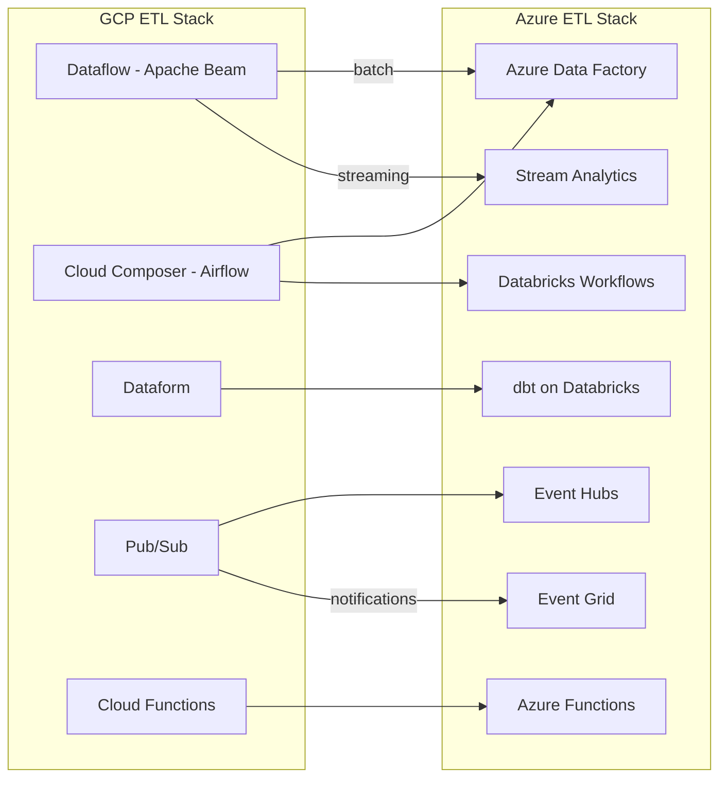

# ETL Migration: Dataflow, Composer, and Pub/Sub to ADF, dbt, and Event Hubs

**A hands-on guide for data engineers migrating GCP ETL and orchestration services to Azure Data Factory, dbt, Databricks Workflows, Event Hubs, and Azure Functions.**

---

## Scope

This guide covers:

- Dataflow (Apache Beam) to ADF + Databricks / Stream Analytics
- Cloud Composer (Airflow) to ADF pipelines or Databricks Workflows
- Dataform to dbt
- Pub/Sub to Event Hubs / Event Grid
- Cloud Functions to Azure Functions

For compute migration (BigQuery, Dataproc), see [Compute Migration](compute-migration.md).

---

## Architecture overview



---

## Dataflow (Apache Beam) to Azure

Dataflow is Google's managed runner for Apache Beam pipelines. The migration path depends on whether the pipeline is batch or streaming.

### Batch Dataflow pipelines

Batch Beam pipelines typically read from GCS or BigQuery, apply transforms, and write to BigQuery or GCS. The Azure equivalent is **ADF pipelines + Databricks notebooks** (or Fabric notebooks).

| Beam concept       | Azure equivalent                 | Notes                   |
| ------------------ | -------------------------------- | ----------------------- |
| Pipeline           | ADF pipeline                     | Orchestration container |
| PCollection        | DataFrame / Delta table          | Data abstraction        |
| ParDo / DoFn       | Databricks notebook cell / UDF   | Custom transform logic  |
| GroupByKey         | SparkSQL GROUP BY / dbt model    | Aggregation             |
| CoGroupByKey       | SparkSQL JOIN                    | Multi-input join        |
| Flatten            | UNION ALL                        | Combine PCollections    |
| Side inputs        | Broadcast variables / temp views | Small lookup datasets   |
| Beam IO (BigQuery) | ADF BigQuery connector           | Source/sink connectors  |
| Beam IO (GCS)      | ADF GCS connector / ADLS         | Source/sink connectors  |

**Migration approach:**

1. **Decompose** the Beam pipeline into logical stages (read, transform, write)
2. **Map reads** to ADF copy activities or Databricks source reads
3. **Map transforms** to dbt models (for SQL-expressible logic) or Databricks notebooks (for Python/Java logic)
4. **Map writes** to ADF sink activities or Delta table writes
5. **Orchestrate** the stages in an ADF pipeline

### Streaming Dataflow pipelines

Streaming Beam pipelines read from Pub/Sub, apply windowed transforms, and write to BigQuery or Pub/Sub. The Azure equivalent depends on complexity:

| Complexity                   | Azure path                      | When to use            |
| ---------------------------- | ------------------------------- | ---------------------- |
| Simple aggregation/filtering | Azure Stream Analytics (ASA)    | SQL-first, low-code    |
| Complex event processing     | Databricks Structured Streaming | Code-first, stateful   |
| Real-time analytics          | Fabric Real-Time Intelligence   | Integrated with Fabric |

**Stream Analytics migration example:**

Beam pipeline that counts events per minute:

```python
# Beam (Dataflow)
(pipeline
  | beam.io.ReadFromPubSub(topic='projects/acme/topics/clicks')
  | beam.WindowInto(window.FixedWindows(60))
  | beam.CombinePerKey(sum)
  | beam.io.WriteToBigQuery('acme.analytics.click_counts'))
```

Azure Stream Analytics equivalent:

```sql
-- ASA query
SELECT
  click_type,
  COUNT(*) AS click_count,
  System.Timestamp() AS window_end
FROM clicks_input TIMESTAMP BY event_time
GROUP BY
  click_type,
  TumblingWindow(minute, 1)
```

**Databricks Structured Streaming equivalent:**

```python
# Databricks notebook
from pyspark.sql.functions import window, count

clicks = (spark.readStream
    .format("eventhubs")
    .options(**eh_conf)
    .load())

counts = (clicks
    .withWatermark("event_time", "1 minute")
    .groupBy(
        window("event_time", "1 minute"),
        "click_type"
    )
    .agg(count("*").alias("click_count")))

(counts.writeStream
    .format("delta")
    .outputMode("append")
    .option("checkpointLocation", "/checkpoints/click_counts")
    .table("analytics.click_counts"))
```

---

## Cloud Composer (Airflow) to ADF and Databricks Workflows

Cloud Composer is managed Apache Airflow. The migration path depends on DAG complexity.

### DAG classification and target mapping

| DAG pattern                      | Azure target                                     | Rationale                         |
| -------------------------------- | ------------------------------------------------ | --------------------------------- |
| Simple schedule + SQL transforms | dbt job on Databricks Workflow                   | dbt manages dependencies natively |
| Multi-step with GCP operators    | ADF pipeline                                     | ADF has 100+ connectors           |
| Python-heavy custom operators    | Databricks notebook workflow                     | Full Python environment           |
| Cross-system orchestration       | ADF pipeline calling Databricks + other services | ADF is the orchestration hub      |
| Sensor-based (file arrival)      | ADF event trigger + Databricks Auto Loader       | Event-driven instead of polling   |

### Airflow operator to ADF activity mapping

| Airflow operator            | ADF activity                                      | Notes                                               |
| --------------------------- | ------------------------------------------------- | --------------------------------------------------- |
| `BigQueryOperator`          | ADF Copy Activity (BigQuery source)               | During migration; post-migration use Databricks SQL |
| `DataprocSubmitJobOperator` | ADF Databricks Notebook activity                  | Submit Spark jobs to Databricks                     |
| `GCSToGCSOperator`          | ADF Copy Activity (GCS to ADLS)                   | File copy between storage                           |
| `PythonOperator`            | ADF Azure Function activity / Databricks notebook | Custom Python logic                                 |
| `BashOperator`              | ADF custom activity / Azure Batch                 | Shell commands                                      |
| `EmailOperator`             | Logic Apps / Power Automate                       | Email notifications                                 |
| `SlackWebhookOperator`      | Logic Apps Slack connector                        | Chat notifications                                  |
| `FileSensor`                | ADF storage event trigger                         | Event-driven, not polling                           |
| `ExternalTaskSensor`        | ADF pipeline dependency                           | Cross-pipeline dependencies                         |
| `BranchPythonOperator`      | ADF If Condition activity                         | Conditional branching                               |

### Worked example: Airflow DAG to ADF pipeline

**Airflow DAG:**

```python
# dag_daily_etl.py (Cloud Composer)
from airflow import DAG
from airflow.providers.google.cloud.operators.bigquery import BigQueryInsertJobOperator
from airflow.providers.google.cloud.operators.dataproc import DataprocSubmitJobOperator

with DAG('daily_etl', schedule_interval='0 2 * * *') as dag:
    extract = BigQueryInsertJobOperator(
        task_id='extract_orders',
        configuration={"query": {"query": "SELECT * FROM sales.orders WHERE ...", "destinationTable": {...}}}
    )
    transform = DataprocSubmitJobOperator(
        task_id='transform_spark',
        job={"sparkJob": {"mainPythonFileUri": "gs://scripts/transform.py"}}
    )
    load = BigQueryInsertJobOperator(
        task_id='load_gold',
        configuration={"query": {"query": "INSERT INTO finance.gold_orders SELECT ..."}}
    )
    extract >> transform >> load
```

**ADF pipeline equivalent:**

1. **Extract:** ADF Copy Activity reading from source to ADLS bronze
2. **Transform:** ADF Databricks Notebook activity running the Spark transform
3. **Load:** dbt model materializing the gold table, triggered by ADF

The ADF pipeline uses schedule triggers set to `0 2 * * *` (same cron). Dependencies are expressed as activity success conditions.

---

## Dataform to dbt

Dataform and dbt are conceptually very close. Both are SQL-first transformation frameworks with dependency management, testing, and documentation.

### Mapping table

| Dataform concept                 | dbt equivalent                             | Notes                   |
| -------------------------------- | ------------------------------------------ | ----------------------- |
| SQLX file                        | SQL model file                             | Nearly identical syntax |
| `config { type: "table" }`       | `{{ config(materialized='table') }}`       | Jinja config block      |
| `config { type: "incremental" }` | `{{ config(materialized='incremental') }}` | Same concept            |
| `config { type: "view" }`        | `{{ config(materialized='view') }}`        | Same concept            |
| `${ref("table_name")}`           | `{{ ref('table_name') }}`                  | Reference syntax        |
| `${self()}`                      | `{{ this }}`                               | Self-reference          |
| `${when(incremental(), "...")}`  | `...`  | Incremental filter      |
| Assertions                       | dbt tests                                  | Testing framework       |
| `dataform.json`                  | `dbt_project.yml`                          | Project configuration   |
| JavaScript transforms            | dbt Python models                          | For non-SQL logic       |
| Compilation                      | `dbt compile`                              | SQL compilation step    |

### Migration steps

1. **Copy** SQLX files to dbt `models/` directory
2. **Replace** `${ref("x")}` with `{{ ref('x') }}`
3. **Replace** `config { type: "..." }` blocks with dbt `{{ config() }}`
4. **Replace** `${when(incremental(), ...)}` with `...`
5. **Convert** assertions to dbt tests in YAML schema files
6. **Run** `dbt compile` to verify syntax
7. **Run** `dbt run` to materialize models

The migration is typically straightforward because Dataform was designed with similar principles to dbt.

---

## Pub/Sub to Event Hubs and Event Grid

### Pub/Sub to Event Hubs

Pub/Sub is Google's managed message queue. Event Hubs is the Azure equivalent with Kafka protocol support.

| Pub/Sub concept       | Event Hubs equivalent             | Notes                                                      |
| --------------------- | --------------------------------- | ---------------------------------------------------------- |
| Topic                 | Event Hub (within a namespace)    | Message channel                                            |
| Subscription          | Consumer group                    | Message consumption                                        |
| Push subscription     | N/A (use Azure Functions trigger) | Event Hubs is pull-based; Functions provide push semantics |
| Pull subscription     | Consumer group + consumer client  | Standard Kafka consumer pattern                            |
| Message ordering      | Partition key ordering            | Per-partition ordering guaranteed                          |
| Dead letter topic     | Dead letter queue (capture)       | Failed message handling                                    |
| Message retention     | 1-90 days (Standard/Premium)      | Configurable retention                                     |
| Exactly-once delivery | At-least-once (consumer manages)  | Use idempotent consumers                                   |
| Schema validation     | Schema Registry                   | Avro/JSON schema enforcement                               |

**Kafka protocol support:** Event Hubs exposes a Kafka endpoint. Existing Pub/Sub consumers that use the Kafka dialect (common for Dataflow/Flink consumers) can connect to Event Hubs by changing the bootstrap server address and authentication.

### Pub/Sub notifications to Event Grid

GCS Pub/Sub notifications (triggered on object create/delete) map to Azure Event Grid blob events.

| GCS notification               | Event Grid equivalent                     | Notes             |
| ------------------------------ | ----------------------------------------- | ----------------- |
| `OBJECT_FINALIZE`              | `Microsoft.Storage.BlobCreated`           | New blob created  |
| `OBJECT_DELETE`                | `Microsoft.Storage.BlobDeleted`           | Blob deleted      |
| `OBJECT_ARCHIVE`               | Tier change event                         | Blob tier changed |
| Notification to Cloud Function | Event Grid subscription to Azure Function | Same pattern      |

---

## Cloud Functions to Azure Functions

Cloud Functions and Azure Functions are both serverless, event-driven compute platforms with similar trigger models.

| Cloud Functions trigger | Azure Functions trigger                 | Notes                  |
| ----------------------- | --------------------------------------- | ---------------------- |
| HTTP trigger            | HTTP trigger                            | Direct replacement     |
| Pub/Sub trigger         | Event Hub trigger / Service Bus trigger | Message-driven         |
| Cloud Storage trigger   | Blob trigger / Event Grid trigger       | File-arrival driven    |
| Firestore trigger       | Cosmos DB trigger                       | Document change driven |
| Scheduler trigger       | Timer trigger                           | Cron-based             |

### Migration steps

1. **Identify** all Cloud Functions and their triggers
2. **Map** GCP triggers to Azure triggers (table above)
3. **Port** function code -- most Python/Node.js logic transfers directly
4. **Replace** GCP SDK calls (`google.cloud.storage`, `google.cloud.bigquery`) with Azure SDK calls (`azure.storage.blob`, `azure.identity`)
5. **Deploy** using Azure Functions Core Tools or GitHub Actions
6. **Test** with representative event payloads

**Example: GCS trigger to Blob trigger**

Cloud Function (Python):

```python
# GCP Cloud Function
from google.cloud import storage

def process_file(event, context):
    bucket = event['bucket']
    name = event['name']
    client = storage.Client()
    blob = client.bucket(bucket).blob(name)
    content = blob.download_as_text()
    # Process content...
```

Azure Function (Python):

```python
# Azure Function
import azure.functions as func
from azure.storage.blob import BlobServiceClient

def main(myblob: func.InputStream):
    content = myblob.read().decode('utf-8')
    blob_name = myblob.name
    # Process content...
```

---

## Orchestration decision tree

For each GCP pipeline, decide on the Azure orchestration pattern:

| Pipeline shape                                | Azure pattern                                  |
| --------------------------------------------- | ---------------------------------------------- |
| Pure SQL transforms with dependencies         | dbt on Databricks Workflow                     |
| SQL transforms + file copies + notifications  | ADF pipeline calling dbt + copy activities     |
| Spark jobs with dependencies                  | Databricks multi-task Workflow                 |
| Event-driven (file arrival, message)          | Event Grid/Hubs trigger + Azure Function + ADF |
| Complex cross-system (APIs, databases, files) | ADF pipeline as orchestrator                   |
| Real-time streaming                           | Event Hubs + ASA or Structured Streaming       |

---

## Validation checklist

After migrating ETL workloads:

- [ ] All Airflow DAGs have equivalent ADF pipelines or Databricks Workflows
- [ ] DAG schedules match original Composer schedules
- [ ] Dataform models converted to dbt and compile/run successfully
- [ ] Pub/Sub topics migrated to Event Hubs with schema compatibility
- [ ] Cloud Functions ported to Azure Functions with matching trigger types
- [ ] Dataflow batch pipelines replaced by ADF + Databricks pipelines
- [ ] Dataflow streaming pipelines replaced by ASA or Structured Streaming
- [ ] End-to-end data pipeline produces matching output
- [ ] Alerting and monitoring configured for all new pipelines

---

**Last updated:** 2026-04-30
**Maintainers:** CSA-in-a-Box core team
**Related:** [Compute Migration](compute-migration.md) | [Storage Migration](storage-migration.md) | [Analytics Migration](analytics-migration.md) | [Migration Playbook](../gcp-to-azure.md)
