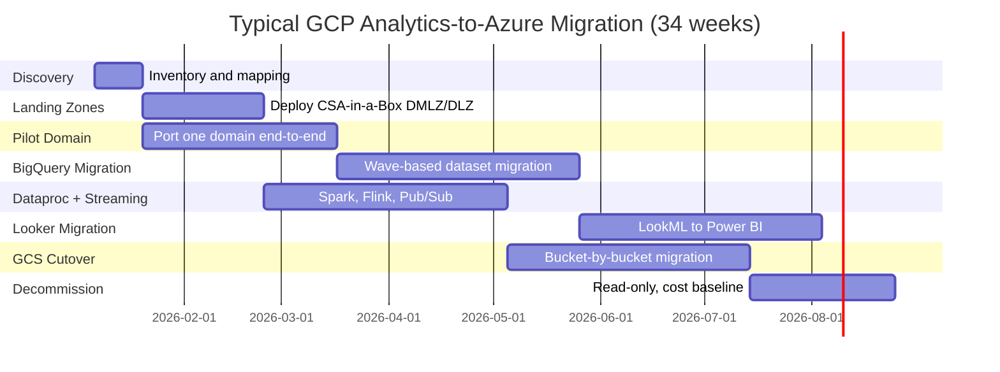

# GCP to Azure Migration Center

**The definitive resource for migrating from Google Cloud Platform analytics to Microsoft Azure, Microsoft Fabric, and CSA-in-a-Box.**

---

## Who this is for

This migration center serves federal CIOs, CDOs, Chief Data Architects, platform engineers, data engineers, and analysts who are evaluating or executing a migration from GCP analytics services (BigQuery, Dataproc, GCS, Looker, Dataflow, Pub/Sub, Cloud Composer, Vertex AI) to Azure-native services. Whether you are responding to an Assured Workloads compliance gap, an IL4/IL5 coverage requirement, a procurement consolidation mandate, or a strategic shift toward open storage formats, these resources provide the evidence, patterns, and step-by-step guidance to execute confidently.

---

## Quick-start decision matrix

| Your situation                             | Start here                                              |
| ------------------------------------------ | ------------------------------------------------------- |
| Executive evaluating Azure vs GCP          | [Why Azure over GCP](why-azure-over-gcp.md)             |
| Need cost justification for migration      | [Total Cost of Ownership Analysis](tco-analysis.md)     |
| Need a feature-by-feature comparison       | [Complete Feature Mapping](feature-mapping-complete.md) |
| Ready to plan a migration                  | [Migration Playbook](../gcp-to-azure.md)                |
| Federal / government-specific requirements | [Federal Migration Guide](federal-migration-guide.md)   |
| Migrating BigQuery or Dataproc             | [Compute Migration](compute-migration.md)               |
| Migrating GCS data                         | [Storage Migration](storage-migration.md)               |
| Migrating Dataflow, Composer, or Pub/Sub   | [ETL Migration](etl-migration.md)                       |
| Migrating Looker or Looker Studio          | [Analytics Migration](analytics-migration.md)           |
| Migrating Vertex AI or BigQuery ML         | [AI/ML Migration](ai-ml-migration.md)                   |
| Migrating IAM, DLP, or Data Catalog        | [Security Migration](security-migration.md)             |

---

## Strategic resources

These documents provide the business case, cost analysis, and strategic framing for decision-makers.

| Document                                              | Audience                 | Description                                                                                                                                                     |
| ----------------------------------------------------- | ------------------------ | --------------------------------------------------------------------------------------------------------------------------------------------------------------- |
| [Why Azure over GCP](why-azure-over-gcp.md)           | CIO / CDO / Board        | Executive white paper covering federal compliance superiority, unified Fabric platform, M365 ecosystem synergy, open Delta Lake format, and talent availability |
| [Total Cost of Ownership Analysis](tco-analysis.md)   | CFO / CIO / Procurement  | BigQuery editions vs Fabric capacity, Looker seat costs vs Power BI, 5-year TCO projections across three federal scenarios, hidden cost analysis                |
| [Federal Migration Guide](federal-migration-guide.md) | CISO / ISSO / Compliance | Assured Workloads vs Azure Government, FedRAMP High coverage gaps, IL4/IL5/IL6 comparison, ITAR, CMMC, agency-specific patterns                                 |

---

## Technical references

| Document                                                | Description                                                                                                                                                |
| ------------------------------------------------------- | ---------------------------------------------------------------------------------------------------------------------------------------------------------- |
| [Complete Feature Mapping](feature-mapping-complete.md) | 50+ GCP services mapped to Azure equivalents across storage, compute, ETL, BI, AI/ML, governance, monitoring, and DevOps with migration complexity ratings |
| [Migration Playbook](../gcp-to-azure.md)                | The original end-to-end migration playbook with capability mapping, worked examples, phased 34-week project plan, and competitive framing                  |

---

## Migration guides

Domain-specific deep dives covering every aspect of a GCP-to-Azure migration.

| Guide                                         | GCP capability                                               | Azure destination                                           |
| --------------------------------------------- | ------------------------------------------------------------ | ----------------------------------------------------------- |
| [Storage Migration](storage-migration.md)     | GCS, BigQuery managed storage, object lifecycle              | ADLS Gen2, OneLake, Delta Lake                              |
| [Compute Migration](compute-migration.md)     | BigQuery SQL/ML, Dataproc Spark, slots, clustering           | Databricks SQL, Fabric, dbt, Direct Lake                    |
| [ETL Migration](etl-migration.md)             | Dataflow, Cloud Composer, Dataform, Pub/Sub, Cloud Functions | ADF, dbt, Databricks Workflows, Event Hubs, Azure Functions |
| [Analytics Migration](analytics-migration.md) | Looker, LookML, Looker Studio, Explores, embedding           | Power BI, DAX, semantic models, Power BI Embedded           |
| [AI/ML Migration](ai-ml-migration.md)         | Vertex AI, AutoML, BigQuery ML, Gemini, AI Search            | Azure ML, Databricks MLflow, Azure OpenAI, AI Search        |
| [Security Migration](security-migration.md)   | Cloud IAM, Data Catalog, DLP, Cloud KMS, VPC SC              | Entra ID, Purview, Key Vault, Private Endpoints, Defender   |

---

## Government and federal

| Document                                              | Description                                                                                                                      |
| ----------------------------------------------------- | -------------------------------------------------------------------------------------------------------------------------------- |
| [Federal Migration Guide](federal-migration-guide.md) | Assured Workloads vs Azure Government, FedRAMP coverage analysis, IL4/IL5/IL6, ITAR, CMMC, procurement, agency-specific patterns |

---

## How CSA-in-a-Box fits

CSA-in-a-Box is the **core migration destination** -- an Azure-native reference implementation providing Data Mesh, Data Fabric, and Data Lakehouse capabilities. It deploys a complete data platform with:

- **Infrastructure as Code** (Bicep across 4 Azure subscriptions)
- **Data governance** (Purview automation, classification taxonomies, data contracts)
- **Data engineering** (ADF pipelines, dbt models, Databricks/Fabric notebooks)
- **Analytics** (Power BI semantic models, Direct Lake, Copilot integration)
- **AI integration** (Azure OpenAI, AI Foundry, RAG patterns)
- **Compliance** (FedRAMP, CMMC, HIPAA machine-readable control mappings)

For capabilities beyond CSA-in-a-Box's current scope (e.g., Copilot Studio agents, Power Apps operational apps, Microsoft Fabric Real-Time Intelligence), this migration center provides direct guidance using the broader Azure and Microsoft ecosystem.

---

## Migration timeline overview

---

**Last updated:** 2026-04-30
**Maintainers:** CSA-in-a-Box core team
