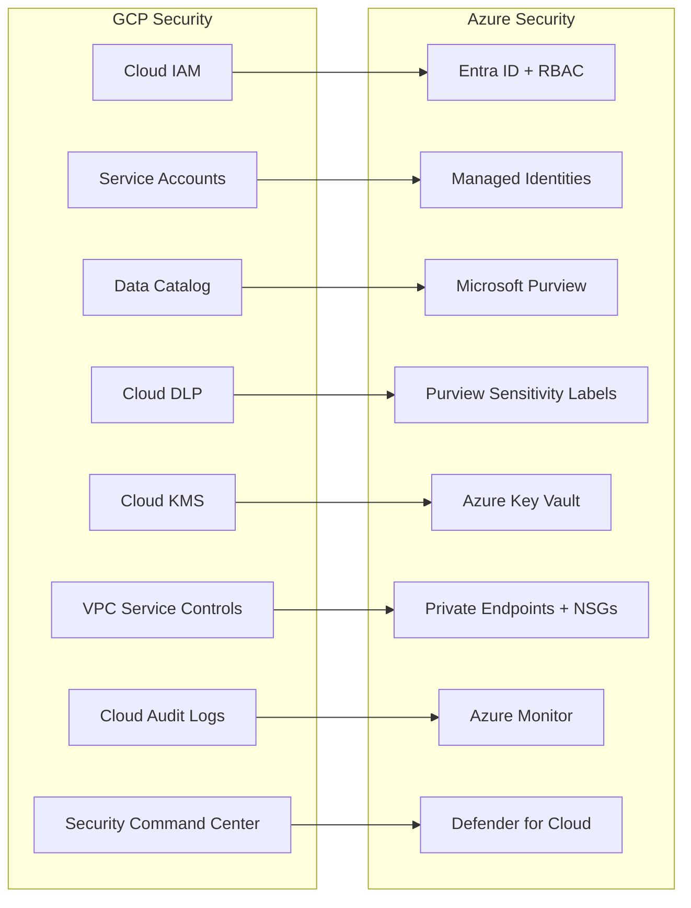

# Security Migration: GCP IAM and Governance to Azure

**A hands-on guide for security architects, ISSOs, and platform engineers migrating GCP identity, governance, encryption, and monitoring services to Azure equivalents.**

---

## Scope

This guide covers:

- Cloud IAM to Entra ID + Azure RBAC
- Service accounts to Managed Identities
- Data Catalog to Purview
- Cloud DLP to Purview sensitivity labels
- Cloud KMS to Key Vault
- VPC Service Controls to Private Endpoints + NSGs
- Cloud Audit Logs to Azure Monitor
- Security Command Center to Defender for Cloud

For federal-specific compliance (FedRAMP, IL4/IL5, CMMC), see [Federal Migration Guide](federal-migration-guide.md).

---

## Architecture overview



---

## Cloud IAM to Entra ID + Azure RBAC

### Conceptual mapping

| GCP IAM concept              | Azure equivalent                 | Notes                               |
| ---------------------------- | -------------------------------- | ----------------------------------- |
| Google Cloud Identity        | Entra ID (Azure AD)              | Identity provider                   |
| GCP Organization             | Azure Management Group           | Top-level hierarchy                 |
| GCP Folder                   | Management Group (nested)        | Organizational hierarchy            |
| GCP Project                  | Subscription + Resource Group    | Resource container                  |
| Principal (user)             | Entra ID user                    | Human identity                      |
| Principal (group)            | Entra ID security group          | Group-based access                  |
| Service account              | Managed Identity (user-assigned) | Non-human identity                  |
| IAM role (predefined)        | Azure built-in role              | Predefined permission set           |
| IAM role (custom)            | Azure custom role                | Custom permission set               |
| IAM policy binding           | Role assignment                  | Role assigned to principal at scope |
| IAM condition                | Azure ABAC (attribute-based)     | Conditional access                  |
| Organization Policy          | Azure Policy                     | Org-wide constraints                |
| Workload Identity Federation | Federated Identity Credential    | Cross-cloud authentication          |

### Role mapping for analytics

| GCP role                     | Azure RBAC role                                 | Scope                       | Notes                                   |
| ---------------------------- | ----------------------------------------------- | --------------------------- | --------------------------------------- |
| `roles/bigquery.dataViewer`  | `Storage Blob Data Reader` + UC `SELECT`        | Storage + Unity Catalog     | Split across storage and compute layers |
| `roles/bigquery.dataEditor`  | `Storage Blob Data Contributor` + UC `MODIFY`   | Storage + Unity Catalog     | Write access to data                    |
| `roles/bigquery.jobUser`     | Databricks SQL Warehouse `CAN_USE`              | Workspace                   | Query execution permission              |
| `roles/bigquery.admin`       | `Contributor` on resource + UC `ALL PRIVILEGES` | Resource Group + Catalog    | Administrative access                   |
| `roles/storage.objectViewer` | `Storage Blob Data Reader`                      | Storage Account / Container | Read access to blobs                    |
| `roles/storage.objectAdmin`  | `Storage Blob Data Owner`                       | Storage Account / Container | Full blob management                    |
| `roles/dataproc.editor`      | `Contributor` on Databricks workspace           | Resource Group              | Cluster and job management              |
| `roles/composer.user`        | `Data Factory Contributor`                      | Resource Group              | Pipeline management                     |
| `roles/viewer` (project)     | `Reader` (subscription)                         | Subscription                | Read-only access                        |
| `roles/editor` (project)     | `Contributor` (subscription)                    | Subscription                | Write access                            |

### IAM migration steps

1. **Export** GCP IAM policy bindings: `gcloud projects get-iam-policy PROJECT_ID --format=json`
2. **Map** GCP principals to Entra ID identities (users, groups, managed identities)
3. **Map** GCP roles to Azure RBAC roles (table above)
4. **Create** Entra ID security groups mirroring GCP group structure
5. **Assign** Azure roles at appropriate scope (management group, subscription, resource group, resource)
6. **Configure** Unity Catalog grants for Databricks-level access
7. **Validate** access with test queries and operations

### Conditional Access (replacing IAM Conditions)

GCP IAM conditions restrict access based on attributes (resource tags, request time, IP). Azure uses Conditional Access policies (for user sign-in) and ABAC (for data plane):

| GCP IAM condition      | Azure equivalent                       | Notes                                 |
| ---------------------- | -------------------------------------- | ------------------------------------- |
| IP address restriction | Conditional Access (named locations)   | Block sign-in from untrusted networks |
| Time-based restriction | Conditional Access (session controls)  | Limit access hours                    |
| Resource tag condition | ABAC (storage blob index tags)         | Attribute-based data access           |
| Device policy          | Conditional Access (device compliance) | Intune-managed device requirement     |

---

## Service accounts to Managed Identities

GCP service accounts are Google-managed identities for non-human workloads. Azure Managed Identities serve the same purpose but eliminate credential management entirely.

| GCP service account pattern                    | Azure Managed Identity pattern                  | Notes                                        |
| ---------------------------------------------- | ----------------------------------------------- | -------------------------------------------- |
| Service account + key file (JSON)              | User-assigned Managed Identity (no key)         | No credential to rotate                      |
| Service account + Workload Identity Federation | Federated Identity Credential                   | Cross-cloud auth (GitHub, AWS, GCP)          |
| Service account impersonation                  | Managed Identity + Azure RBAC                   | Role-based, not impersonation                |
| Per-service account (e.g., `sa-dbt@...`)       | Per-workload Managed Identity (e.g., `umi-dbt`) | Same principle: least-privilege per workload |

### Migration example

**GCP:**

```bash
# Service account with BigQuery access
gcloud iam service-accounts create sa-finance-dbt \
    --display-name="Finance dbt service account"

gcloud projects add-iam-policy-binding acme-gov \
    --member="serviceAccount:sa-finance-dbt@acme-gov.iam.gserviceaccount.com" \
    --role="roles/bigquery.dataEditor"

# Generate key file (security risk: key can be exfiltrated)
gcloud iam service-accounts keys create key.json \
    --iam-account=sa-finance-dbt@acme-gov.iam.gserviceaccount.com
```

**Azure:**

```bash
# User-assigned managed identity (no key file needed)
az identity create \
    --name umi-finance-dbt \
    --resource-group rg-analytics

# Assign Storage Blob Data Contributor role
az role assignment create \
    --assignee $(az identity show --name umi-finance-dbt --resource-group rg-analytics --query principalId -o tsv) \
    --role "Storage Blob Data Contributor" \
    --scope "/subscriptions/.../storageAccounts/stfinance"

# Assign Unity Catalog grants via Databricks SQL
# GRANT MODIFY ON SCHEMA finance TO `umi-finance-dbt`;
```

**Key advantage:** No key file to manage, rotate, or risk leaking. The managed identity authenticates to Azure services automatically.

---

## Data Catalog to Microsoft Purview

GCP Data Catalog provides metadata management and search. Microsoft Purview is significantly richer, covering unified catalog, data governance, sensitivity labeling, lineage, and compliance.

| Data Catalog feature   | Purview equivalent                | Notes                                     |
| ---------------------- | --------------------------------- | ----------------------------------------- |
| Tag templates          | Custom classification rules       | Purview classifications are richer        |
| Policy tags            | Sensitivity labels                | Integrated with M365                      |
| Search                 | Purview Unified Catalog search    | Broader scope (Azure + M365 + multicloud) |
| Lineage                | Purview lineage (auto-discovered) | ADF, Databricks, Fabric lineage           |
| Business glossary      | Purview glossary terms            | Term hierarchies and ownership            |
| Entry groups           | Collections                       | Organizational grouping                   |
| IAM on catalog entries | Purview access policies           | Fine-grained data access                  |

### Migration steps

1. **Export** Data Catalog entries and tag templates
2. **Create** Purview classification rules matching GCP tag templates
3. **Configure** Purview data sources (ADLS, Databricks, Fabric)
4. **Run** automated scans to discover migrated assets
5. **Apply** classifications and glossary terms
6. **Validate** lineage appears for ADF and dbt pipelines

---

## Cloud DLP to Purview sensitivity labels

GCP Cloud DLP inspects and redacts sensitive data. Purview sensitivity labels provide equivalent capabilities plus integration with Microsoft 365.

| Cloud DLP feature   | Purview equivalent                   | Notes                              |
| ------------------- | ------------------------------------ | ---------------------------------- |
| InfoType detectors  | Sensitive information types (SITs)   | 300+ built-in SITs                 |
| Custom InfoTypes    | Custom SITs                          | Regex, keyword, exact match        |
| DLP inspection job  | Purview auto-labeling                | Automated sensitive data discovery |
| Redaction           | Column masks (Unity Catalog)         | Dynamic masking                    |
| De-identification   | Purview sensitivity labels + masking | Label-driven protection            |
| Results to BigQuery | Results to Purview catalog           | Integrated discovery               |

### CSA-in-a-Box classification taxonomies

CSA-in-a-Box ships four classification taxonomies that cover common federal sensitive data types:

- **PII:** `csa_platform/csa_platform/governance/purview/classifications/pii_classifications.yaml`
- **PHI:** `csa_platform/csa_platform/governance/purview/classifications/phi_classifications.yaml`
- **Government:** `csa_platform/csa_platform/governance/purview/classifications/gov_classifications.yaml`
- **Financial:** `csa_platform/csa_platform/governance/purview/classifications/financial_classifications.yaml`

Map GCP DLP InfoTypes to these taxonomies:

| GCP InfoType                | CSA-in-a-Box classification | Notes              |
| --------------------------- | --------------------------- | ------------------ |
| `PERSON_NAME`               | PII - Full Name             | PII taxonomy       |
| `EMAIL_ADDRESS`             | PII - Email Address         | PII taxonomy       |
| `PHONE_NUMBER`              | PII - Phone Number          | PII taxonomy       |
| `US_SOCIAL_SECURITY_NUMBER` | PII - SSN                   | PII taxonomy       |
| `CREDIT_CARD_NUMBER`        | Financial - Credit Card     | Financial taxonomy |
| `US_BANK_ROUTING_MICR`      | Financial - Bank Routing    | Financial taxonomy |
| `MEDICAL_RECORD_NUMBER`     | PHI - Medical Record Number | PHI taxonomy       |

---

## Cloud KMS to Azure Key Vault

| Cloud KMS feature                      | Key Vault equivalent                        | Notes                          |
| -------------------------------------- | ------------------------------------------- | ------------------------------ |
| Key ring                               | Key Vault instance                          | Container for keys             |
| Crypto key                             | Key (RSA, EC)                               | Encryption key                 |
| Symmetric key                          | Key (AES)                                   | Symmetric encryption           |
| Key version                            | Key version                                 | Automatic versioning           |
| Key rotation                           | Auto-rotation policy                        | Configurable rotation schedule |
| CMEK (customer-managed encryption key) | Customer-managed key for storage/Databricks | Same concept                   |
| Cloud HSM                              | Key Vault HSM (Premium SKU)                 | FIPS 140-2 Level 3             |
| Cloud EKM                              | Bring Your Own Key (BYOK)                   | External key management        |
| IAM on keys                            | Key Vault access policy or RBAC             | Role-based key access          |

### Migration steps

1. **Inventory** all KMS key rings, keys, and their usage
2. **Create** Key Vault instances (one per environment or workload)
3. **Generate** equivalent keys in Key Vault
4. **Update** storage account encryption to use Key Vault keys (CMEK)
5. **Update** Databricks workspace to use Key Vault for encryption
6. **Configure** auto-rotation policies
7. **Decommission** GCP KMS keys after confirming all data re-encrypted

---

## VPC Service Controls to Private Endpoints + NSGs

GCP VPC Service Controls create a security perimeter around GCP services to prevent data exfiltration. Azure uses a different but equivalent model based on Private Endpoints and Network Security Groups.

| VPC SC concept                  | Azure equivalent                     | Notes                         |
| ------------------------------- | ------------------------------------ | ----------------------------- |
| Service perimeter               | Private Endpoint + service firewall  | Per-service network isolation |
| Access level                    | Conditional Access + NSG rules       | IP/device-based access        |
| Ingress rule                    | NSG inbound rule + Private Endpoint  | Allow specific traffic in     |
| Egress rule                     | NSG outbound rule + service firewall | Restrict outbound traffic     |
| Bridge (perimeter-to-perimeter) | VNet peering + Private DNS           | Cross-VNet connectivity       |
| Dry-run mode                    | NSG flow logs + diagnostics          | Monitor before enforcing      |

### Implementation pattern

```
Azure VNet
├── Subnet: snet-databricks
│   └── Private Endpoint: pe-databricks
├── Subnet: snet-storage
│   └── Private Endpoint: pe-storage
├── Subnet: snet-keyvault
│   └── Private Endpoint: pe-keyvault
└── NSG: nsg-analytics
    ├── Allow: VNet-to-VNet
    ├── Allow: On-prem VPN
    └── Deny: Internet inbound
```

**Key difference:** VPC SC is perimeter-based (wrap multiple services in one boundary). Azure Private Endpoints are per-service. The Azure model is more granular -- each service has its own network endpoint.

---

## Cloud Audit Logs to Azure Monitor

| Cloud Audit Logs type | Azure Monitor equivalent         | Notes                          |
| --------------------- | -------------------------------- | ------------------------------ |
| Admin Activity logs   | Azure Activity Log               | Resource management operations |
| Data Access logs      | Diagnostic settings (data plane) | Data read/write operations     |
| System Event logs     | Azure Resource Health            | Platform events                |
| Policy Denied logs    | Azure Policy compliance logs     | Policy violations              |

### CSA-in-a-Box audit chain

CSA-in-a-Box implements a tamper-evident audit chain (CSA-0016) that provides stronger FedRAMP High AU-family evidence than GCP Cloud Audit Logs out of the box:

- Immutable log storage with cryptographic chaining
- Cross-service audit correlation
- Automated compliance evidence generation
- NIST 800-53 AU control family coverage

### GCP audit data to preserve

Before decommissioning GCP, export and archive:

- Cloud Audit Logs (Admin Activity, Data Access)
- IAM policy history
- VPC Service Controls perimeter history
- Cloud Monitoring alert history
- Incident response records

These become evidence in post-migration compliance audits.

---

## Security Command Center to Defender for Cloud

| SCC feature                | Defender for Cloud equivalent          | Notes                      |
| -------------------------- | -------------------------------------- | -------------------------- |
| Security Health Analytics  | Defender CSPM (Cloud Security Posture) | Misconfiguration detection |
| Event Threat Detection     | Defender for Cloud threat detection    | Active threat detection    |
| Container Threat Detection | Defender for Containers                | Container security         |
| Web Security Scanner       | Defender for App Service               | Web vulnerability scanning |
| Vulnerability scanning     | Defender vulnerability assessment      | VM and container scanning  |
| Compliance monitoring      | Regulatory compliance dashboard        | NIST, CIS, PCI, FedRAMP    |
| Security findings          | Defender alerts and recommendations    | Actionable findings        |
| Continuous exports         | Continuous export to Log Analytics     | SIEM integration           |

### Multi-cloud advantage

Defender for Cloud supports multi-cloud monitoring, including GCP. During the migration bridge phase, you can monitor both GCP and Azure resources from a single Defender for Cloud dashboard.

---

## Identity federation during migration

During the migration bridge phase, workloads on Azure may need to access GCP resources (and vice versa). Use federated identity:

### Azure to GCP (bridge phase)

```
Azure Managed Identity
  --> Federated Identity Credential (GCP)
    --> GCP Workload Identity Federation
      --> Access GCS / BigQuery during bridge
```

### GCP to Azure (bridge phase)

```
GCP Service Account
  --> Workload Identity Federation (Azure)
    --> Entra ID app registration
      --> Access ADLS / Databricks during bridge
```

---

## Validation checklist

After migrating security:

- [ ] All GCP IAM bindings mapped to Azure RBAC assignments
- [ ] Service accounts replaced with Managed Identities (no key files)
- [ ] Purview scans discovering all migrated assets
- [ ] Sensitivity labels applied to sensitive data (PII, PHI, CUI)
- [ ] Key Vault keys encrypting storage and compute
- [ ] Private Endpoints configured for all data services
- [ ] Azure Monitor receiving diagnostic logs from all services
- [ ] Defender for Cloud showing clean security posture
- [ ] GCP audit logs archived for compliance evidence
- [ ] Unity Catalog grants matching original BigQuery access patterns

---

**Last updated:** 2026-04-30
**Maintainers:** CSA-in-a-Box core team
**Related:** [Federal Migration Guide](federal-migration-guide.md) | [Complete Feature Mapping](feature-mapping-complete.md) | [Migration Playbook](../gcp-to-azure.md)
