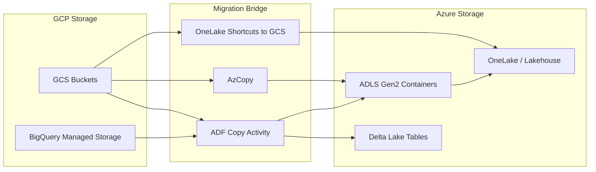

# Storage Migration: GCS to ADLS Gen2 and OneLake

**A hands-on guide for data engineers migrating Google Cloud Storage buckets and BigQuery managed storage to Azure Data Lake Storage Gen2 and OneLake.**

---

## Scope

This guide covers:

- GCS bucket migration to ADLS Gen2 containers
- BigQuery managed storage export to Delta Lake
- Object lifecycle policy translation
- Bridge patterns using OneLake shortcuts
- Worked examples with CLI commands

For BigQuery compute migration (SQL, ML, scheduling), see [Compute Migration](compute-migration.md).

---

## Architecture overview



---

## GCS buckets to ADLS Gen2 containers

### Conceptual mapping

| GCS concept | ADLS Gen2 equivalent | Notes |
|---|---|---|
| Project | Subscription + Resource Group | Organizational container |
| Bucket | Storage Account + Container | ADLS uses hierarchical namespace |
| Object | Blob (with directory structure) | ADLS supports true directories |
| Object prefix (pseudo-folder) | Directory | True directory operations on ADLS |
| Storage class (Standard) | Hot tier | Default access tier |
| Storage class (Nearline) | Cool tier | 30-day minimum |
| Storage class (Coldline) | Cold tier | 90-day minimum (newer than Cool) |
| Storage class (Archive) | Archive tier | Offline retrieval |
| Signed URL | SAS token | Time-limited authenticated access |
| IAM binding | Azure RBAC assignment | `Storage Blob Data Reader/Contributor` |
| Service account | Managed Identity | No credential management needed |

### Naming conventions

GCS bucket names are globally unique. ADLS container names are scoped to the storage account. Translate as follows:

```
GCS:  gs://acme-gov-analytics-raw/
ADLS: https://stacmegov.dfs.core.windows.net/raw/

GCS:  gs://acme-gov-analytics-curated/
ADLS: https://stacmegov.dfs.core.windows.net/curated/

GCS:  gs://acme-gov-analytics-archive/
ADLS: https://stacmegov.dfs.core.windows.net/archive/
```

### Migration method 1: AzCopy (recommended for bulk transfer)

AzCopy supports GCS-to-ADLS direct copy using GCS interoperability credentials (HMAC keys).

**Step 1: Generate GCS HMAC keys**

```bash
# In GCP Console or via gcloud
gcloud storage hmac create sa-migration@acme-gov.iam.gserviceaccount.com
# Note the Access Key and Secret
```

**Step 2: Set environment variables**

```bash
export GOOGLE_APPLICATION_CREDENTIALS=/path/to/service-account.json
export GOOGLE_CLOUD_PROJECT=acme-gov
```

**Step 3: Run AzCopy**

```bash
# Copy entire bucket to ADLS container
azcopy copy \
  "https://storage.cloud.google.com/acme-gov-analytics-raw/" \
  "https://stacmegov.blob.core.windows.net/raw/?<SAS-TOKEN>" \
  --recursive=true \
  --s2s-preserve-properties=false \
  --include-pattern "*.parquet;*.csv;*.json" \
  --log-level=INFO

# Verify transfer
azcopy list "https://stacmegov.blob.core.windows.net/raw/?<SAS-TOKEN>" --machine-readable
```

**Step 4: Validate file counts and sizes**

```bash
# GCS side
gsutil du -s gs://acme-gov-analytics-raw/
gsutil ls -l gs://acme-gov-analytics-raw/ | wc -l

# ADLS side
az storage blob list \
  --account-name stacmegov \
  --container-name raw \
  --auth-mode login \
  --query "[].{name:name, size:properties.contentLength}" \
  --output table | wc -l
```

### Migration method 2: ADF Copy Activity (recommended for ongoing sync)

ADF provides a managed copy pipeline with monitoring, retry, and scheduling.

**Step 1: Create a GCS linked service in ADF**

```json
{
  "name": "ls_gcs_source",
  "type": "GoogleCloudStorage",
  "typeProperties": {
    "accessKeyId": "<HMAC-ACCESS-KEY>",
    "secretAccessKey": {
      "type": "AzureKeyVaultSecret",
      "store": { "referenceName": "ls_keyvault" },
      "secretName": "gcs-hmac-secret"
    }
  }
}
```

**Step 2: Create copy pipeline**

```json
{
  "name": "pl_gcs_to_adls",
  "activities": [
    {
      "name": "CopyFromGCS",
      "type": "Copy",
      "inputs": [{ "referenceName": "ds_gcs_parquet" }],
      "outputs": [{ "referenceName": "ds_adls_parquet" }],
      "typeProperties": {
        "source": {
          "type": "ParquetSource",
          "storeSettings": {
            "type": "GoogleCloudStorageReadSettings",
            "recursive": true,
            "wildcardFolderPath": "*",
            "wildcardFileName": "*.parquet"
          }
        },
        "sink": {
          "type": "ParquetSink",
          "storeSettings": {
            "type": "AzureBlobFSWriteSettings"
          }
        }
      }
    }
  ]
}
```

### Migration method 3: OneLake shortcuts (bridge pattern)

OneLake shortcuts provide zero-copy read access to GCS during the migration bridge phase. No egress charges for reads -- you pay only when data is physically moved.

```
GCS bucket --> OneLake shortcut --> Databricks/Fabric queries
```

This allows Azure workloads to query GCS data without migrating it first. Use this for:

- Parallel validation during migration
- Low-priority datasets that migrate last
- Datasets that may stay on GCS indefinitely

---

## BigQuery managed storage export to Delta Lake

BigQuery stores data in the proprietary Capacitor format. It cannot be read outside BigQuery. You must export before migrating.

### Method 1: BigQuery EXPORT DATA to GCS, then to ADLS

**Step 1: Export from BigQuery to GCS as Parquet**

```sql
EXPORT DATA OPTIONS (
  uri = 'gs://acme-gov-exports/finance/fact_sales_daily/*.parquet',
  format = 'PARQUET',
  overwrite = true,
  compression = 'SNAPPY'
) AS
SELECT * FROM `acme-gov.finance.fact_sales_daily`;
```

**Step 2: Copy from GCS to ADLS using AzCopy**

```bash
azcopy copy \
  "https://storage.cloud.google.com/acme-gov-exports/finance/fact_sales_daily/" \
  "https://stacmegov.blob.core.windows.net/bronze/finance/fact_sales_daily/?<SAS>" \
  --recursive=true
```

**Step 3: Convert Parquet to Delta using Databricks**

```sql
-- In Databricks SQL
CREATE TABLE finance.fact_sales_daily
USING DELTA
LOCATION 'abfss://bronze@stacmegov.dfs.core.windows.net/finance/fact_sales_daily/'
AS SELECT * FROM parquet.`abfss://bronze@stacmegov.dfs.core.windows.net/finance/fact_sales_daily/`;

-- Add partitioning and Z-ordering
ALTER TABLE finance.fact_sales_daily SET TBLPROPERTIES (
  'delta.autoOptimize.autoCompact' = 'true',
  'delta.autoOptimize.optimizeWrite' = 'true'
);

OPTIMIZE finance.fact_sales_daily ZORDER BY (region, product_id);
```

### Method 2: ADF BigQuery connector (direct)

ADF can read BigQuery tables directly and write to ADLS/Delta.

```json
{
  "name": "pl_bigquery_to_delta",
  "activities": [
    {
      "name": "CopyBigQueryTable",
      "type": "Copy",
      "inputs": [{ "referenceName": "ds_bigquery_table" }],
      "outputs": [{ "referenceName": "ds_adls_delta" }],
      "typeProperties": {
        "source": {
          "type": "GoogleBigQueryV2Source",
          "query": "SELECT * FROM `acme-gov.finance.fact_sales_daily`"
        },
        "sink": {
          "type": "ParquetSink",
          "storeSettings": {
            "type": "AzureBlobFSWriteSettings"
          }
        }
      }
    }
  ]
}
```

Follow with the Databricks conversion step to create Delta tables.

### Method 3: Databricks GCS connector (read in place)

Databricks can read GCS directly using the GCS connector, allowing you to create Delta tables without an intermediate ADF step.

```python
# In Databricks notebook
# Configure GCS access
spark.conf.set("fs.gs.project.id", "acme-gov")
spark.conf.set("fs.gs.auth.service.account.enable", "true")
spark.conf.set("fs.gs.auth.service.account.json.keyfile", "/dbfs/secrets/gcs-sa.json")

# Read from GCS, write as Delta
df = spark.read.parquet("gs://acme-gov-exports/finance/fact_sales_daily/")
df.write.format("delta") \
  .mode("overwrite") \
  .partitionBy("sales_date") \
  .save("abfss://gold@stacmegov.dfs.core.windows.net/finance/fact_sales_daily/")
```

---

## Object lifecycle policy translation

### GCS lifecycle rule to ADLS lifecycle management

**GCS lifecycle rule (JSON):**

```json
{
  "lifecycle": {
    "rule": [
      {
        "action": { "type": "SetStorageClass", "storageClass": "NEARLINE" },
        "condition": { "age": 30 }
      },
      {
        "action": { "type": "SetStorageClass", "storageClass": "COLDLINE" },
        "condition": { "age": 90 }
      },
      {
        "action": { "type": "SetStorageClass", "storageClass": "ARCHIVE" },
        "condition": { "age": 365 }
      },
      {
        "action": { "type": "Delete" },
        "condition": { "age": 2555 }
      }
    ]
  }
}
```

**Equivalent ADLS lifecycle policy (Bicep):**

```bicep
resource lifecyclePolicy 'Microsoft.Storage/storageAccounts/managementPolicies@2023-01-01' = {
  name: 'default'
  parent: storageAccount
  properties: {
    policy: {
      rules: [
        {
          name: 'tierToCool'
          type: 'Lifecycle'
          definition: {
            actions: {
              baseBlob: { tierToCool: { daysAfterModificationGreaterThan: 30 } }
            }
            filters: { blobTypes: [ 'blockBlob' ] }
          }
        }
        {
          name: 'tierToArchive'
          type: 'Lifecycle'
          definition: {
            actions: {
              baseBlob: { tierToArchive: { daysAfterModificationGreaterThan: 365 } }
            }
            filters: { blobTypes: [ 'blockBlob' ] }
          }
        }
        {
          name: 'deleteOld'
          type: 'Lifecycle'
          definition: {
            actions: {
              baseBlob: { delete: { daysAfterModificationGreaterThan: 2555 } }
            }
            filters: { blobTypes: [ 'blockBlob' ] }
          }
        }
      ]
    }
  }
}
```

---

## Per-bucket migration decisions

Not every GCS bucket needs to move to ADLS. Use this decision tree:

| Bucket profile | Recommendation | Rationale |
|---|---|---|
| Active analytics data | Migrate to ADLS Gen2 | Needed for Delta Lake + Databricks queries |
| Archive-only (cold storage) | Keep on GCS with Archive class | Avoid egress cost; access via OneLake shortcut if needed |
| Shared with other GCP workloads | OneLake shortcut (bridge) | Zero-copy read access from Azure |
| Large cold volume (100+ TB) | Azure Data Box | Physical transfer avoids egress cost |
| Small active dataset (< 1 TB) | AzCopy direct | Simple, fast, low cost |
| Running pipeline output | Migrate pipeline first, then storage follows | Pipeline determines where data lands |

---

## Validation checklist

After each bucket migration, validate:

- [ ] File count matches between GCS and ADLS
- [ ] Total size matches (accounting for compression differences)
- [ ] Sample file content matches (checksums on random sample)
- [ ] ADLS lifecycle policies are configured
- [ ] RBAC assignments are applied (Storage Blob Data Reader/Contributor)
- [ ] Private endpoint is configured (if required)
- [ ] Delta tables are created and queryable from Databricks
- [ ] Purview scan discovers the new assets

---

**Last updated:** 2026-04-30
**Maintainers:** CSA-in-a-Box core team
**Related:** [Compute Migration](compute-migration.md) | [Complete Feature Mapping](feature-mapping-complete.md) | [Migration Playbook](../gcp-to-azure.md)
