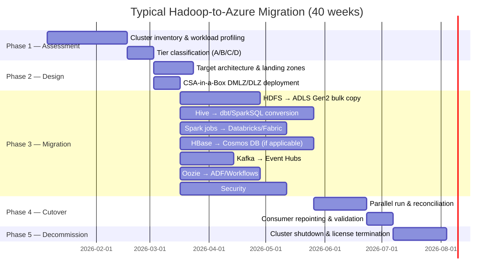

# Hadoop / Hive to Azure Migration Center

**The definitive resource for migrating from Hadoop (Cloudera, Hortonworks, MapR, vanilla Apache) and Hive to Microsoft Azure, Databricks, Microsoft Fabric, and CSA-in-a-Box.**

---

## Who this is for

This migration center serves data platform leaders, Hadoop administrators, data engineers, and architects who are evaluating or executing a migration from on-premises or cloud-hosted Hadoop clusters to Azure-native services. Whether you are responding to end-of-support announcements (Cloudera CDP, HDInsight retirement), rising hardware refresh costs, or a strategic push toward a modern lakehouse, these resources provide the evidence, patterns, and step-by-step guidance to execute confidently.

---

## Quick-start decision matrix

| Your situation | Start here |
|---|---|
| Executive evaluating Azure vs keeping Hadoop | [Why Azure over Hadoop](why-azure-over-hadoop.md) |
| Need cost justification for migration | [Total Cost of Ownership Analysis](tco-analysis.md) |
| Need a component-by-component comparison | [Complete Feature Mapping](feature-mapping-complete.md) |
| Ready to migrate HDFS data | [HDFS to ADLS Gen2](hdfs-migration.md) |
| Ready to migrate Hive workloads | [Hive to dbt / SparkSQL](hive-migration.md) |
| Running Spark on YARN | [Spark Migration](spark-migration.md) |
| Have HBase clusters | [HBase to Cosmos DB](hbase-migration.md) |
| Have Kafka, Oozie, or other supporting services | [Supporting Services Migration](kafka-oozie-migration.md) |
| Need security/governance migration guidance | [Security Migration](security-migration.md) |
| Want hands-on tutorials | [Tutorials](#tutorials) |
| Need performance data | [Benchmarks](benchmarks.md) |
| Want operational best practices | [Best Practices](best-practices.md) |

---

## Strategic resources

These documents provide the business case, cost analysis, and strategic framing for decision-makers.

| Document | Lines | Summary |
|---|---|---|
| [Why Azure over Hadoop](why-azure-over-hadoop.md) | ~400 | Nine evidence-based reasons the Hadoop era is ending and Azure is the successor |
| [TCO Analysis](tco-analysis.md) | ~350 | Five-year cost comparison: bare-metal/IaaS Hadoop vs Azure PaaS lakehouse |
| [Complete Feature Mapping](feature-mapping-complete.md) | ~400 | 35+ Hadoop components mapped to Azure equivalents with migration complexity ratings |

## Component migration guides

Detailed, component-by-component migration playbooks for every major Hadoop service.

| Document | Lines | Summary |
|---|---|---|
| [HDFS to ADLS Gen2](hdfs-migration.md) | ~400 | Storage migration: DistCp, AzCopy, format conversion, small-file compaction |
| [Hive to dbt / SparkSQL](hive-migration.md) | ~400 | Metastore migration, HiveQL conversion, UDF porting, worked examples |
| [Spark on YARN to Databricks/Fabric](spark-migration.md) | ~350 | Spark version migration, job submission, cluster policies, library management |
| [HBase to Cosmos DB](hbase-migration.md) | ~350 | Column-family to document model, coprocessors to Change Feed, API mapping |
| [Kafka, Oozie, and Supporting Services](kafka-oozie-migration.md) | ~350 | Kafka to Event Hubs, Oozie to ADF/Workflows, Sqoop, Flume, ZooKeeper, Pig |
| [Security and Governance](security-migration.md) | ~350 | Ranger/Sentry to Purview, Kerberos to Entra ID, encryption, ACL mapping |

## Tutorials

Hands-on, step-by-step walkthroughs for the most common migration tasks.

| Document | Lines | Summary |
|---|---|---|
| [Tutorial: HDFS to ADLS Gen2](tutorial-hdfs-to-adls.md) | ~350 | End-to-end data migration with format conversion and validation |
| [Tutorial: Hive to dbt on Databricks](tutorial-hive-to-dbt.md) | ~350 | Convert Hive SQL to dbt models, migrate metastore, run first dbt build |

## Operational resources

| Document | Lines | Summary |
|---|---|---|
| [Benchmarks](benchmarks.md) | ~300 | MapReduce vs Spark, HDFS vs ADLS throughput, Hive vs Databricks SQL, cost comparisons |
| [Best Practices](best-practices.md) | ~300 | Cluster decomposition, parallel-run, decommission planning, team retraining |

---

## How CSA-in-a-Box accelerates this migration

CSA-in-a-Box provides Bicep-based landing zones that deploy the Azure target architecture in hours rather than weeks:

- **Data Management Landing Zone (DMLZ):** Purview catalog, Key Vault, shared networking — replaces Atlas, Ranger, and ZooKeeper governance functions
- **Data Landing Zone (DLZ):** ADLS Gen2, Databricks workspace, ADF, Event Hubs — replaces HDFS, Spark-on-YARN, Oozie, and Kafka
- **Compliance YAMLs:** Machine-readable FedRAMP/CMMC/HIPAA control mappings for every deployed resource

For capabilities beyond CSA-in-a-Box's current scope (e.g., Cosmos DB for HBase replacement, Fabric Real-Time Intelligence), this migration center provides direct guidance using the broader Azure ecosystem.

---

## Migration timeline overview

---

## Related

- [Hadoop / Hive Migration Overview](../hadoop-hive.md) — the original single-page guide
- [Migrations — Teradata](../teradata.md) — similar phased pattern for data warehouse migration
- [Migrations — Snowflake](../snowflake.md)
- [Migrations — Informatica](../informatica.md)
- [ADR 0001 — ADF + dbt over Airflow](../../adr/0001-adf-dbt-over-airflow.md)
- [ADR 0006 — Purview over Atlas](../../adr/0006-purview-over-atlas.md)

---

**Last updated:** 2026-04-30
**Maintainers:** CSA-in-a-Box core team
