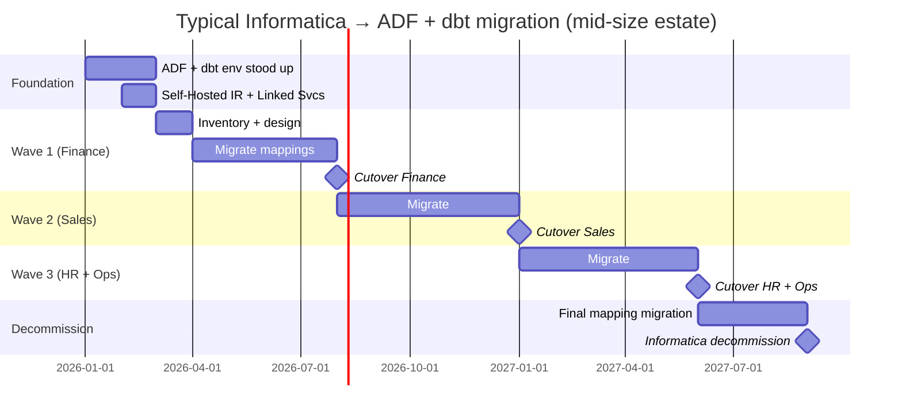

# Migration — Informatica → ADF / Fabric Data Pipelines

> **Audience:** Teams running Informatica PowerCenter, Informatica Cloud (IICS), or Informatica MDM looking at Azure Data Factory, Fabric Data Pipelines, or dbt as the modern replacement.

## Decide first: target architecture

| Source                                          | Best Azure target                                                                                        |
| ----------------------------------------------- | -------------------------------------------------------------------------------------------------------- |
| Informatica PowerCenter (on-prem ETL workflows) | **ADF** (orchestration) + **dbt** (transformations) + **Mapping Data Flows** (visual logic for analysts) |
| IICS / Informatica Intelligent Cloud Services   | **Fabric Data Pipelines** + **dbt-fabric** OR **ADF + dbt**                                              |
| Informatica Data Quality (IDQ)                  | **Microsoft Purview** + **Great Expectations** + **dbt tests**                                           |
| Informatica MDM                                 | **Microsoft Purview** (lineage + classification) + **Azure SQL or Cosmos** (mastering)                   |
| Informatica Enterprise Data Catalog             | **Microsoft Purview** ([ADR 0006](../adr/0006-purview-over-atlas.md))                                    |
| Informatica B2B / EDI                           | **Logic Apps** + **API Management** + **Azure Data Factory** for orchestration                           |

**Key insight:** The modern pattern is **code-first (dbt) for transformations**, **declarative orchestration (ADF/Fabric Data Pipelines)** for movement, and **Purview** for catalog. Informatica's "all in one tool" model is replaced by **specialized best-in-class** services.

## Phase 1 — Assessment (4-8 weeks)

### Inventory

For each Informatica system:

- **Workflows / mappings**: count, complexity (transformations per mapping)
- **Sessions**: schedule, runtime, downstream consumers
- **Connections**: source DBs, target DBs, file systems, APIs
- **Reusable components**: shared mapplets, mapping templates, parameter files
- **Data quality rules** (IDQ): count, complexity
- **MDM matchers / hierarchies** (MDM): count, complexity
- **License + support cost**: annual cost
- **Skill base**: PowerCenter developers vs modern data engineers

### Migration tier

| Tier                      | Description                                    | Action                                               |
| ------------------------- | ---------------------------------------------- | ---------------------------------------------------- |
| **A** Direct re-implement | Simple SQL transformations                     | Convert to dbt models                                |
| **B** Refactor            | Complex mappings with multiple transformations | Decompose into multiple dbt models + ADF pipeline    |
| **C** Re-architect        | DQ rules, MDM, B2B                             | Replace with Purview + GE + APIM                     |
| **D** Decommission        | Stale workflows no longer referenced           | Don't migrate; archive lineage to Purview and delete |

Plan for **20-30% of mappings to be Tier D** — Informatica estates accumulate legacy workflows that consumers stopped using.

## Phase 2 — Design (3-4 weeks)

### Mapping → dbt model translation

```
Informatica mapping                     dbt model
====================================    =================================
Source qualifier (filter, join)         CTE in WITH clause
Aggregator                              GROUP BY
Lookup                                  LEFT JOIN
Expression                              SELECT projection
Router (multiple outputs)               Multiple dbt models, one per output
Sequence generator                      ROW_NUMBER() or surrogate key macro
Update strategy                         dbt incremental materialization
Slowly Changing Dimension (Type 2)      dbt snapshot
Stored procedure call                   dbt operation or pre/post hook
```

### Workflow → ADF pipeline translation

```
Informatica concept              ADF / Fabric Data Pipeline
================================ ====================================
Workflow                         Pipeline
Session                          Activity (Copy, dbt run, Notebook)
Worklet                          Sub-pipeline (Execute Pipeline activity)
Decision (link condition)        If condition / Switch activity
Email task                       Web activity → Logic Apps → Teams
Command task                     Web activity OR Function App
Pre/post-session SQL             dbt pre-hooks / post-hooks
Parameter file                   Pipeline parameters + global parameters
Application connection           Linked service
```

### Connection mapping

| Informatica connection | ADF Linked Service                          |
| ---------------------- | ------------------------------------------- |
| Oracle                 | Azure-SSIS Oracle, or Self-Hosted IR + ODBC |
| SQL Server             | Built-in                                    |
| DB2                    | Self-Hosted IR + ODBC                       |
| Teradata               | Built-in (limited) or Self-Hosted IR + ODBC |
| SAP                    | Built-in SAP CDC, SAP Table, SAP HANA, etc. |
| Salesforce             | Built-in                                    |
| Flat files (FTP/SFTP)  | Built-in FTP/SFTP                           |
| Cloud storage (S3/GCS) | Built-in                                    |
| Web services           | Web activity / REST connector               |

## Phase 3 — Migration (12-36 weeks)

### Wave-based migration

Migrate by **business domain**, not by mapping count:



### dbt migration assistance

- **dbt-codegen**: auto-generate dbt models from existing source tables
- **sqlglot**: SQL dialect translation (Oracle → Spark SQL, etc.)
- **dbt project structure**: one project per business domain; staging / intermediate / marts pattern

### Data quality (IDQ replacement)

- **Great Expectations** suites for column-level rules
- **dbt tests** for relational rules (unique, not_null, accepted_values, custom)
- **Purview classification** for column-level data classification (PII, sensitive, etc.)
- **Custom dbt tests** for any IDQ rule that doesn't fit GE / standard tests

See [`csa_platform/governance/dataquality/`](https://github.com/fgarofalo56/csa-inabox/tree/main/csa_platform/governance/dataquality) for the platform's Great Expectations integration.

### MDM (master data management) replacement

This is the hardest migration. Options:

1. **Profisee on Azure** — purpose-built MDM, native Azure integration; closest commercial replacement
2. **Custom MDM on Azure SQL / Cosmos** — for narrow, well-bounded mastering needs (e.g., customer dedup)
3. **Reltio / Semarchy** — third-party SaaS MDM
4. **Don't replace** — many MDM use cases turn out to be solvable with dbt + good source-of-truth picking

Most enterprise MDM workloads are **over-engineered**; reassess whether you actually need full MDM before committing to a replacement.

## Phase 4 — Cutover (per wave)

For each wave:

- [ ] 14-day parallel run; daily reconciliation report (row counts + key metric values)
- [ ] Downstream BI / API consumers repointed
- [ ] Informatica workflows for the wave set to read-only / paused
- [ ] After 30 days stable, decommission those Informatica components

## Phase 5 — Decommission (final months)

- [ ] All workflows migrated or archived
- [ ] Informatica licenses terminated (typically requires 30-90 day notice)
- [ ] Informatica infrastructure (PowerCenter servers, repositories) decommissioned
- [ ] Lineage from Informatica metadata exported to Purview for historical reference

## Common pitfalls

| Pitfall                                           | Mitigation                                                                                                              |
| ------------------------------------------------- | ----------------------------------------------------------------------------------------------------------------------- |
| **Trying to recreate Informatica's visual UX**    | dbt + ADF UI is different (code-first); don't fight it. Train developers                                                |
| **Using ADF Mapping Data Flows for everything**   | MDF is OK for analyst-friendly visual logic; use dbt for production transformations (better tested, version-controlled) |
| **Leaving DQ rules unimplemented**                | If IDQ caught a problem in source data, GE/dbt tests must catch the same. Inventory rules first                         |
| **Underestimating MDM replacement**               | MDM is 30-50% of project cost on Informatica MDM-heavy estates                                                          |
| **Not training PowerCenter devs in modern stack** | Mid-career PowerCenter devs can become great dbt/Spark engineers in 3-6 months with investment                          |
| **Sequencing by mapping count**                   | Sequence by business domain — keeps cutovers atomic                                                                     |
| **Forgetting B2B/EDI**                            | Often a separate platform; plan Logic Apps + APIM replacement explicitly                                                |

## Trade-offs

✅ **Why modernize off Informatica**

- License cost is the biggest line item in many ETL budgets
- Modern stack (dbt + git + ADF) is **code-first, version-controlled, testable** — vs Informatica's visual XML
- Better cloud-native integration (no Self-Hosted IR for cloud sources)
- Easier hiring — dbt + Spark talent is abundant; Informatica talent is shrinking
- AI / GenAI integration with the same data assets

⚠️ **Why be patient**

- 12-36 month timeline for typical estate
- PowerCenter developers need retraining
- Some workflows (complex MDM, B2B/EDI) need real re-engineering
- DQ rule discovery is tedious and high-risk if rushed

## Related

- [Migrations — Teradata](teradata.md)
- [Migrations — Hadoop / Hive](hadoop-hive.md)
- [Migrations — Snowflake](snowflake.md)
- [ADR 0001 — ADF + dbt over Airflow](../adr/0001-adf-dbt-over-airflow.md)
- [ADR 0013 — dbt as Canonical Transformation](../adr/0013-dbt-as-canonical-transformation.md)
- [ADR 0006 — Purview over Atlas](../adr/0006-purview-over-atlas.md)
- [Best Practices — Data Engineering](../best-practices/data-engineering.md)
- ADF + dbt patterns: https://learn.microsoft.com/azure/data-factory/transform-data-using-dbt
