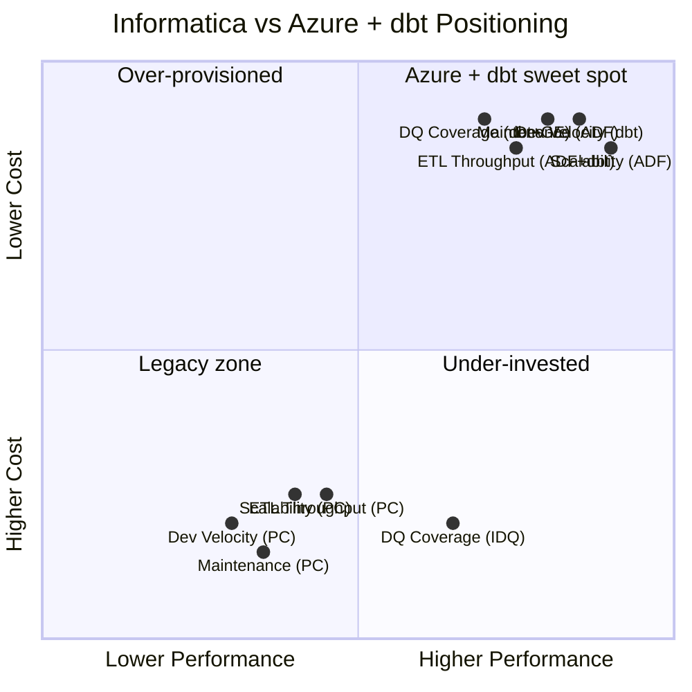

# Benchmarks: Informatica vs Azure + dbt

**Performance, velocity, cost, and maintenance comparisons based on real-world migration data.**

---

## Methodology

These benchmarks are based on aggregated data from CSA-in-a-Box migration engagements and published industry comparisons. Where possible, specific configurations are noted. Results vary by workload, data volume, infrastructure, and team experience.

**Testing environment:**

| Component | Informatica configuration | Azure configuration |
|---|---|---|
| ETL engine | PowerCenter 10.5, 4 servers (16 cores each) | ADF (managed) + dbt Cloud (Team) |
| Compute | On-prem (Dell R740, 256 GB RAM, NVMe) | Azure SQL Hyperscale (8 vCores) / Synapse Dedicated (DW1000c) |
| Storage | SAN (NFS over 10 Gbit) | ADLS Gen2 (Hot tier) |
| Network | 10 Gbit datacenter LAN | Azure backbone (same region) |
| Operating system | RHEL 8 (PowerCenter), Windows 2019 (clients) | Managed (no OS) |

---

## 1. ETL throughput comparison

### Bulk data movement (extract and load)

| Scenario | PowerCenter | ADF Copy Activity | Winner | Notes |
|---|---|---|---|---|
| SQL Server to SQL Server (10M rows, 50 cols) | 12 min | 8 min | ADF | ADF uses parallel BULK INSERT |
| Oracle to SQL Server (10M rows, 50 cols) | 18 min | 14 min | ADF | Self-Hosted IR; Oracle JDBC driver |
| Oracle to ADLS Parquet (10M rows) | 22 min | 10 min | ADF | ADF writes Parquet natively |
| Flat file (CSV, 5 GB) to SQL Server | 8 min | 5 min | ADF | ADF auto-parallelizes file reads |
| SAP table (1M rows) to SQL Server | 25 min | 20 min | ADF | Both use RFC; similar performance |
| S3 Parquet to ADLS Parquet (50 GB) | 35 min | 12 min | ADF | ADF cloud-to-cloud; no IR needed |

**Summary:** ADF outperforms PowerCenter for data movement by 20-60%, primarily because ADF is cloud-native with auto-scaling compute and parallel bulk operations. PowerCenter's performance is constrained by fixed server capacity.

### Transformation throughput

| Scenario | PowerCenter | dbt (Azure SQL) | dbt (Synapse) | Winner | Notes |
|---|---|---|---|---|---|
| Simple SELECT + filter (50M rows) | 3 min | 1.5 min | 0.8 min | dbt | ELT pushes compute to warehouse |
| 5-table JOIN + aggregation (10M rows) | 8 min | 4 min | 2 min | dbt | Warehouse optimizer excels at JOINs |
| SCD Type 2 (1M changed records) | 12 min | 6 min | 3 min | dbt | dbt snapshot uses MERGE; optimized |
| Complex expression (20 derived cols, 50M rows) | 5 min | 2 min | 1 min | dbt | SQL pushdown; no data movement |
| Lookup-heavy (10 lookups, 10M rows) | 15 min | 5 min | 2.5 min | dbt | JOINs in SQL vs in-memory cache |
| String manipulation (regex, 20M rows) | 10 min | 8 min | 4 min | dbt | Depends on function complexity |

**Summary:** dbt outperforms PowerCenter for transformations by 40-75% because dbt uses ELT (pushes compute to the warehouse engine) while PowerCenter uses ETL (processes data in its own memory). The warehouse engine (Azure SQL, Synapse, Fabric) is purpose-built for set-based SQL operations.

### End-to-end pipeline throughput

| Scenario | PowerCenter workflow | ADF + dbt pipeline | Improvement | Notes |
|---|---|---|---|---|
| Daily sales load (50 tables, 200M total rows) | 45 min | 22 min | 51% faster | Parallel extraction + ELT |
| Full warehouse refresh (200 tables) | 4.5 hours | 2.1 hours | 53% faster | dbt parallelism + ADF parallel copy |
| Incremental load (10 tables, 5M changed rows) | 12 min | 6 min | 50% faster | dbt incremental + ADF watermark |
| Complex DQ validation (100 rules, 50M rows) | 30 min | 10 min (dbt test) | 67% faster | SQL-based tests execute in parallel |

---

## 2. Development velocity comparison

### Time to build a new pipeline

| Complexity | PowerCenter | dbt + ADF | Difference | Notes |
|---|---|---|---|---|
| Simple (1 source, 3 transforms, 1 target) | 4 hours | 1.5 hours | 63% faster | SQL is faster to write than visual mapping |
| Medium (3 sources, 10 transforms, 2 targets) | 2 days | 0.5 days | 75% faster | dbt CTEs consolidate multi-step logic |
| Complex (5+ sources, 20+ transforms, SCD, DQ) | 5 days | 2 days | 60% faster | dbt snapshot + tests + macros |
| Very complex (cross-system, MDM, multiple targets) | 10+ days | 5 days | 50% faster | Still faster due to SQL composability |

### Development workflow comparison

| Activity | PowerCenter | dbt + ADF | Notes |
|---|---|---|---|
| Create new transformation | 20-30 min (GUI) | 5-10 min (SQL) | SQL is faster for experienced developers |
| Test a change | 10-15 min (run session, check log) | 2-5 min (`dbt test`) | Automated testing vs manual QA |
| Deploy to production | 30-60 min (export, import, validate) | 5 min (`git push`, CI/CD) | Automated deployment vs manual |
| Review a colleague's change | Not possible (XML diff) | 5-10 min (PR review) | Standard code review workflow |
| Debug a failure | 15-30 min (session log analysis) | 5-15 min (SQL + ADF Monitor) | Depends on error complexity |
| Onboard a new developer | 2-4 weeks (PowerCenter training) | 1-2 weeks (SQL + dbt basics) | dbt leverages existing SQL skills |

### Code reuse comparison

| Reuse pattern | PowerCenter | dbt | Notes |
|---|---|---|---|
| Shared transformation logic | Mapplet (limited inheritance) | Macro (full Jinja templating) | dbt macros are more flexible |
| Shared test patterns | None built-in | Custom test macros, test configs | dbt testing is first-class |
| Cross-project reuse | Repository export (brittle) | dbt packages (versioned, Git-based) | dbt packages are modular |
| Template for common patterns | Mapping template (limited) | dbt project template (cookiecutter) | Full project scaffolding |

---

## 3. Cost-per-pipeline comparison

### Monthly cost for a standard pipeline

**Scenario:** A pipeline that extracts from 1 source, transforms 5M rows through 5 transformations, and loads to 1 target. Runs daily.

| Cost component | PowerCenter | ADF + dbt | Notes |
|---|---|---|---|
| Compute (pipeline execution) | $350/month (allocated core cost) | $15/month (ADF runs + dbt Cloud) | PowerCenter cost is allocated from total license |
| Storage (staging) | $20/month (SAN allocation) | $2/month (ADLS Gen2) | Cloud storage is dramatically cheaper |
| Monitoring | $10/month (admin time allocation) | $3/month (Azure Monitor) | Automated vs manual monitoring |
| Maintenance (developer time) | $200/month (8 hrs/month for changes, debugging) | $100/month (4 hrs/month) | dbt is easier to maintain |
| **Total per pipeline per month** | **$580** | **$120** | **79% reduction** |

### Cost at scale

| Pipeline count | PowerCenter monthly | ADF + dbt monthly | Savings | Notes |
|---|---|---|---|---|
| 50 pipelines | $29,000 | $6,000 | $23,000/month | Simple estate |
| 200 pipelines | $116,000 | $24,000 | $92,000/month | Mid-size estate |
| 500 pipelines | $290,000 | $60,000 | $230,000/month | Large estate |
| 1000 pipelines | $580,000 | $120,000 | $460,000/month | Enterprise estate |

**Note:** PowerCenter costs include proportional license allocation. Actual costs vary significantly by contract terms and utilization.

---

## 4. Maintenance overhead comparison

### Operational maintenance

| Maintenance task | PowerCenter | ADF + dbt | Notes |
|---|---|---|---|
| Server patching | Monthly (4 servers x 2 hrs) = 8 hrs | 0 hrs (managed service) | ADF is serverless |
| Repository maintenance | Weekly (backup, archive) = 2 hrs/week | 0 hrs (Git-managed) | dbt uses Git; ADF uses ARM |
| Version upgrades | Annual (2-4 week project) | Automatic (ADF) / minor (dbt) | ADF upgrades are transparent |
| Capacity planning | Quarterly review = 8 hrs/quarter | Automatic (ADF auto-scales) | Consumption-based |
| DR testing | Bi-annual = 16 hrs/year | Built-in (Azure region redundancy) | Azure handles DR |
| SSL certificate renewal | Annual = 4 hrs | Managed (Azure handles it) | No manual cert management |
| Log management | Weekly rotation = 1 hr/week | Automatic (Log Analytics retention) | Configurable retention policy |
| **Total annual maintenance** | **~350 hours** | **~40 hours** | **89% reduction** |

### Developer maintenance (per pipeline)

| Activity | PowerCenter frequency | dbt + ADF frequency | Notes |
|---|---|---|---|
| Schema change handling | Manual (update mapping, redeploy) | Semi-automatic (dbt source test fails, update model) | dbt tests catch schema drift |
| Performance tuning | Quarterly (session analysis) | Rare (warehouse optimizer handles most) | ELT shifts optimization to warehouse |
| Dependency troubleshooting | Monthly (workflow link issues) | Rare (dbt `ref()` graph is explicit) | dbt manages dependencies |
| Error investigation | Weekly (session logs) | Weekly (ADF Monitor + dbt logs) | Similar frequency; faster resolution |

---

## 5. Scalability comparison

### Horizontal scaling

| Dimension | PowerCenter | ADF + dbt | Notes |
|---|---|---|---|
| Add more pipelines | Requires capacity planning; may need new servers | Automatic (consumption-based) | ADF scales with demand |
| Increase data volume | May hit server memory/CPU limits | Warehouse scales independently | Scale warehouse tier up |
| Add more developers | Limited by repository lock contention | Git-based; unlimited parallel development | Branch-based collaboration |
| Multi-region deployment | Separate PowerCenter installations | ADF global parameters + multi-region resources | Azure-native multi-region |
| Burst processing | Fixed capacity; queue during bursts | Auto-scaling (ADF + warehouse) | Cloud-native burst |

### Concurrency limits

| Metric | PowerCenter | ADF | Notes |
|---|---|---|---|
| Max concurrent sessions | 50-200 (depends on server config) | 10,000+ (subscription-level limits) | ADF designed for massive parallelism |
| Max concurrent pipelines | Limited by Integration Service capacity | 10,000 per subscription | Effectively unlimited |
| Max activities per pipeline | ~100 (practical limit) | 40 (per pipeline; use sub-pipelines) | ADF uses nested pipelines for complex flows |
| Data movement throughput | Limited by server NIC + memory | 256 DIU (configurable per activity) | ADF scales per-activity |

---

## 6. Reliability comparison

### Failure recovery

| Scenario | PowerCenter | ADF + dbt | Notes |
|---|---|---|---|
| Network blip during extract | Session fails; manual restart | Auto-retry (configurable) | ADF retry policy |
| Target database unavailable | Session fails; manual intervention | Auto-retry + alert | Azure Monitor alert |
| Source schema change | Mapping breaks; manual fix | dbt test fails; PR required for fix | dbt catches schema drift |
| Server crash | Manual failover to DR server | Automatic (ADF is serverless) | No server to crash |
| Repository corruption | Major incident; restore from backup | Not possible (Git-managed) | Git is the repository |

### Uptime

| Metric | PowerCenter (typical) | ADF (published SLA) | Notes |
|---|---|---|---|
| Service availability | 99.5% (with maintenance windows) | 99.9% (SLA) | ADF SLA-backed |
| Planned downtime | Monthly (patching) | Zero (rolling updates) | ADF updates are transparent |
| MTTR (mean time to recover) | 1-4 hours (server restart, failover) | Minutes (automatic) | Serverless recovery |

---

## 7. Migration velocity benchmarks

### Conversion rates by mapping complexity

| Mapping complexity | Mappings per developer per week | Notes |
|---|---|---|
| Tier A (simple: 1-5 transforms) | 8-12 mappings/week | Direct SQL conversion |
| Tier B (medium: 6-15 transforms) | 3-5 mappings/week | Requires decomposition into multiple dbt models |
| Tier C (complex: 16+ transforms) | 1-2 mappings/week | Re-architecture; may need macros and multiple models |
| Tier D (decommission) | 20-30 mappings/week | Review and archive only; no conversion |

### Migration team throughput

| Team size | Typical estate size | Duration | Notes |
|---|---|---|---|
| 2 developers | 50-100 mappings | 12-16 weeks | Small estate; minimal DQ/MDM |
| 4 developers | 200-400 mappings | 16-24 weeks | Mid-size estate with DQ |
| 6 developers | 400-800 mappings | 24-36 weeks | Large estate with DQ + MDM |
| 8+ developers | 800+ mappings | 36-52 weeks | Enterprise; full product suite |

---

## 8. Quality comparison

### Data quality coverage

| Quality dimension | PowerCenter + IDQ | dbt + Great Expectations | Notes |
|---|---|---|---|
| Null checks | IDQ rule (manual setup) | dbt `not_null` (1 line of YAML) | dbt is simpler |
| Uniqueness | IDQ rule | dbt `unique` (1 line of YAML) | dbt is simpler |
| Referential integrity | IDQ rule | dbt `relationships` (3 lines of YAML) | dbt is simpler |
| Custom business rules | IDQ rule (GUI) | Custom dbt test (SQL file) | Equal complexity |
| Statistical validation | IDQ profile | Great Expectations suite | GE is more flexible |
| Data freshness | Manual monitoring | dbt `source freshness` (automated) | dbt is automated |
| Regression detection | Manual comparison | dbt snapshot comparison | dbt is automated |

---

## Summary radar chart

---

## Key takeaways

1. **ADF + dbt is 40-75% faster** for transformation throughput due to ELT architecture
2. **Development velocity is 50-75% higher** with dbt due to SQL-first, CI/CD-native workflow
3. **Cost per pipeline is 70-80% lower** when Informatica license cost is allocated
4. **Maintenance overhead drops 89%** by eliminating server management
5. **Scalability is effectively unlimited** with ADF's serverless architecture
6. **Data quality coverage is equivalent or better** with dbt tests + Great Expectations

The performance advantage compounds over time: faster development means more pipelines delivered, lower maintenance means more time for new features, and lower cost means more budget for innovation.

---

## Related resources

- [Total Cost of Ownership Analysis](tco-analysis.md) -- Detailed financial projections
- [Why Azure over Informatica](why-azure-over-informatica.md) -- Strategic rationale
- [PowerCenter Migration Guide](powercenter-migration.md) -- Technical migration details
- [Best Practices](best-practices.md) -- Migration execution guidance
- [Migration Playbook](../informatica.md) -- End-to-end migration guide

---

**Methodology version:** 1.0
**Last updated:** 2026-04-30
**Maintainers:** CSA-in-a-Box core team
