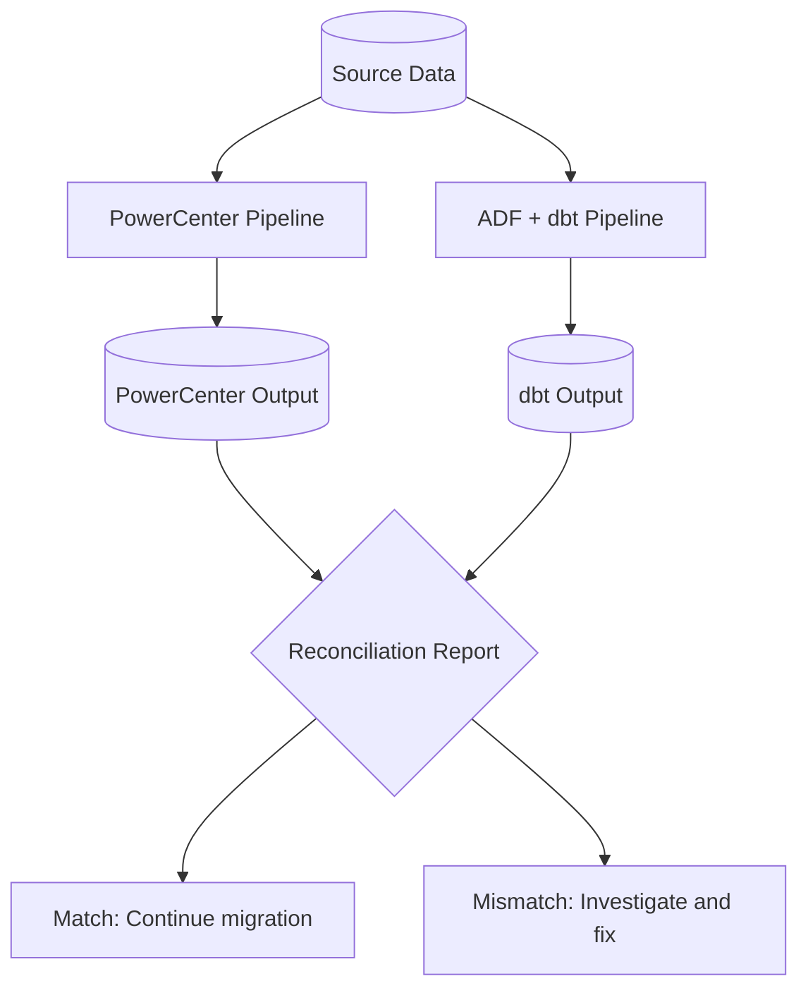

# Migration Best Practices: Informatica to Azure

**Lessons learned, common pitfalls, and proven patterns for successful Informatica-to-Azure migrations.**

---

## Pre-migration assessment checklist

Before committing to a migration, complete this assessment to scope the effort accurately and identify risks early.

### Informatica inventory

- [ ] **Mappings:** Count and categorize by complexity (simple, medium, complex)
- [ ] **Workflows:** Count, document dependencies, schedule frequency
- [ ] **Sessions:** Map each session to its mapping and workflow
- [ ] **Connections:** List all source and target connections with database types
- [ ] **Reusable components:** Inventory all shared mapplets, mapping templates, and parameter files
- [ ] **Transformations:** Count by type (Expression, Lookup, Joiner, Router, Custom Java, etc.)
- [ ] **IDQ rules:** Count and categorize data quality rules by complexity
- [ ] **IDQ profiles:** List all active profiles and their source tables
- [ ] **IDQ scorecards:** Document all scorecard reports and their consumers
- [ ] **MDM entities:** List all mastered entities (customer, product, vendor, etc.)
- [ ] **MDM match rules:** Document all match/merge rules and thresholds
- [ ] **MDM hierarchies:** Map all hierarchy types and their management processes
- [ ] **EDC catalogs:** List all cataloged data sources and lineage coverage
- [ ] **B2B/EDI:** Inventory EDI trading partner integrations
- [ ] **License cost:** Document current annual license + maintenance + infrastructure cost
- [ ] **Team skills:** Assess team SQL proficiency, cloud experience, and willingness to adopt code-first
- [ ] **Downstream consumers:** Map all reports, APIs, and applications that consume pipeline outputs

### Complexity scoring

Score each mapping on a 1-5 scale for each dimension:

| Dimension                | 1 (Simple) | 3 (Medium)       | 5 (Complex)                  |
| ------------------------ | ---------- | ---------------- | ---------------------------- |
| Transformation count     | 1-3        | 4-10             | 11+                          |
| Source count             | 1          | 2-3              | 4+                           |
| Lookup count             | 0          | 1-3              | 4+                           |
| Custom code (Java/SQL)   | None       | Some expressions | Custom Java/Python           |
| SCD handling             | None       | Type 1           | Type 2 or 3                  |
| Error handling           | None       | Basic            | Complex (router, error rows) |
| Reusable components      | None       | Uses mapplets    | Creates/modifies mapplets    |
| Data volume (daily rows) | <1M        | 1-50M            | >50M                         |

**Total score interpretation:**

| Score range | Tier             | Migration action         | Estimated effort |
| ----------- | ---------------- | ------------------------ | ---------------- |
| 8-12        | A (Simple)       | Direct convert to dbt    | 1-2 days         |
| 13-24       | B (Medium)       | Decompose and refactor   | 3-7 days         |
| 25-35       | C (Complex)      | Re-architect             | 7-20 days        |
| Any         | D (Decommission) | Archive metadata, delete | 0.5 days         |

### Risk register template

| Risk                                                 | Likelihood | Impact | Mitigation                                                                |
| ---------------------------------------------------- | ---------- | ------ | ------------------------------------------------------------------------- |
| PowerCenter developers resist code-first approach    | High       | High   | Invest in training early; pair programming with dbt-experienced engineers |
| MDM replacement takes longer than estimated          | High       | High   | Start MDM track independently; consider Profisee as interim               |
| IDQ rule discovery is incomplete                     | Medium     | High   | Parallel run for 6+ weeks with comprehensive reconciliation               |
| ADF Self-Hosted IR performance issues                | Medium     | Medium | Size IR VMs appropriately; test with production data volumes              |
| License termination penalties                        | Medium     | Medium | Review contract terms; negotiate with Informatica early                   |
| Downstream consumer disruption                       | High       | High   | Communicate early; provide parallel run period                            |
| Data format differences (Oracle vs Azure SQL)        | Medium     | Low    | Test data type conversions; document edge cases                           |
| Network latency (on-prem sources via Self-Hosted IR) | Low        | Medium | Deploy IR close to source; optimize query pushdown                        |

---

## Conversion priority strategy

### Principle: Simple first, complex last

Migrate in order of complexity, not business importance. This builds team confidence and establishes patterns before tackling hard problems.


### Wave planning by business domain

Within each tier, organize by business domain for atomic cutovers:

| Wave      | Business domain         | Tier A mappings | Tier B mappings | Tier C mappings | Duration    |
| --------- | ----------------------- | --------------- | --------------- | --------------- | ----------- |
| 1 (Pilot) | Finance (GL, AP)        | 15              | 5               | 2               | 8-10 weeks  |
| 2         | Sales (Orders, Revenue) | 20              | 10              | 5               | 10-14 weeks |
| 3         | HR + Operations         | 25              | 15              | 5               | 12-16 weeks |
| 4         | DQ + Governance         | -               | 10              | 15              | 10-14 weeks |
| 5         | MDM (if applicable)     | -               | -               | 10              | 16-24 weeks |

### What to migrate first within each wave

1. **Reference data pipelines** -- lookups, dimension loads (lowest risk, highest reuse)
2. **Simple fact loads** -- extract, transform, load (establish the pattern)
3. **Incremental loads** -- establish watermark and incremental patterns
4. **Complex transformations** -- multi-source joins, SCD, business logic
5. **DQ rules** -- after data flows are migrated, apply quality checks
6. **MDM workflows** -- last, after all source pipelines are stable

---

## IICS vs PowerCenter: migration differences

### Key differences in migration approach

| Aspect              | PowerCenter migration                      | IICS migration                 |
| ------------------- | ------------------------------------------ | ------------------------------ |
| Infrastructure      | Decommission servers, DR, network          | Cancel SaaS subscription       |
| Complexity          | Higher (on-prem, more legacy)              | Lower (already cloud)          |
| Agent migration     | N/A (PowerCenter uses Integration Service) | Secure Agent -> Self-Hosted IR |
| Deployment model    | Repository export -> Git + CI/CD           | Org export -> Git + CI/CD      |
| Typical estate age  | 10-20 years                                | 3-8 years                      |
| Legacy accumulation | High (many Tier D candidates)              | Lower (newer estate)           |
| Team readiness      | Often needs more retraining                | Often closer to cloud-ready    |
| Timeline            | 12-36 months                               | 8-24 months                    |

### IICS-specific considerations

1. **IPU analysis first.** Analyze actual IPU consumption to right-size Azure resources
2. **Connector mapping.** IICS premium connectors may have free ADF equivalents
3. **CLAIRE AI features.** Some IICS-specific AI recommendations have no direct equivalent; document which you rely on
4. **Application Integration.** IICS CAI -> Logic Apps requires architecture redesign, not just mapping
5. **Data Integration Elastic.** Elastic mappings on Spark may need Databricks, not just dbt

---

## Parallel-run validation

### Why parallel run is mandatory

Parallel run is the highest-confidence validation strategy. Both platforms run the same logic; you compare outputs.

### Parallel-run setup



### Reconciliation checks

| Check                            | SQL pattern                                                             | Tolerance                     |
| -------------------------------- | ----------------------------------------------------------------------- | ----------------------------- |
| Row count match                  | `SELECT COUNT(*) FROM pc_output EXCEPT SELECT COUNT(*) FROM dbt_output` | 0 rows difference             |
| Sum of numeric columns           | `SELECT ABS(SUM(pc.amount) - SUM(dbt.amount)) FROM ...`                 | < $0.01 (rounding)            |
| Distinct key count               | `SELECT COUNT(DISTINCT key) FROM ...`                                   | 0 difference                  |
| NULL distribution                | `SELECT COUNT(*) WHERE col IS NULL FROM ...`                            | 0 difference                  |
| Date range coverage              | `SELECT MIN(date), MAX(date) FROM ...`                                  | Identical ranges              |
| String value comparison (sample) | `SELECT TOP 100 pc.val, dbt.val FROM ... WHERE pc.val != dbt.val`       | 0 differences (or documented) |

### Automated reconciliation dbt test

```sql
-- tests/reconciliation/assert_daily_sales_matches.sql
WITH pc AS (
    SELECT
        order_date,
        COUNT(*) AS row_count,
        SUM(order_amount) AS total_amount
    FROM {{ source('powercenter', 'fact_daily_sales_pc') }}
    GROUP BY order_date
),

dbt_output AS (
    SELECT
        order_date,
        COUNT(*) AS row_count,
        SUM(order_amount) AS total_amount
    FROM {{ ref('fct_daily_sales') }}
    GROUP BY order_date
)

SELECT
    COALESCE(pc.order_date, d.order_date) AS order_date,
    pc.row_count AS pc_rows,
    d.row_count AS dbt_rows,
    pc.total_amount AS pc_amount,
    d.total_amount AS dbt_amount,
    ABS(COALESCE(pc.total_amount, 0) - COALESCE(d.total_amount, 0)) AS amount_diff
FROM pc
FULL OUTER JOIN dbt_output d ON pc.order_date = d.order_date
WHERE pc.row_count != d.row_count
   OR ABS(COALESCE(pc.total_amount, 0) - COALESCE(d.total_amount, 0)) > 0.01
```

### Parallel-run duration guidelines

| Migration complexity       | Recommended parallel-run duration | Notes                                   |
| -------------------------- | --------------------------------- | --------------------------------------- |
| Simple pipelines (Tier A)  | 7-14 days                         | Quick validation                        |
| Medium pipelines (Tier B)  | 14-21 days                        | Ensure edge cases are covered           |
| Complex pipelines (Tier C) | 21-30 days                        | Cover month-end, quarter-end cycles     |
| DQ rules                   | 30 days                           | Must cover all rule trigger conditions  |
| MDM workflows              | 45-60 days                        | Golden record reconciliation takes time |

---

## Team retraining: from GUI to code-first

### The skill transition

| PowerCenter skill                     | dbt equivalent            | Training path                       |
| ------------------------------------- | ------------------------- | ----------------------------------- |
| PowerCenter Designer (visual mapping) | dbt model (SQL file)      | SQL fundamentals + dbt tutorial     |
| Workflow Manager (GUI orchestration)  | ADF pipeline (JSON/Bicep) | ADF portal tutorial + Bicep basics  |
| Session log analysis                  | dbt logs + ADF Monitor    | Azure Monitor training              |
| Repository management                 | Git (branch, commit, PR)  | Git fundamentals (1-2 days)         |
| Informatica Admin Console             | Azure Portal + dbt Cloud  | Azure fundamentals + dbt Cloud tour |

### Training program structure

| Week | Topic                  | Activities                                       | Outcome                                        |
| ---- | ---------------------- | ------------------------------------------------ | ---------------------------------------------- |
| 1    | SQL refresher          | SQL exercises on real data                       | Comfortable with CTEs, JOINs, window functions |
| 2    | dbt fundamentals       | dbt tutorial (https://courses.getdbt.com)        | Build first dbt project                        |
| 3    | dbt intermediate       | Incremental models, snapshots, macros, tests     | Convert first Tier A mapping                   |
| 4    | ADF fundamentals       | ADF portal + pipeline creation                   | Build first ADF pipeline                       |
| 5    | Git workflow           | Branch, commit, PR, code review                  | Complete first PR-based deployment             |
| 6    | Paired conversion      | Convert Tier A/B mappings with mentor            | Build confidence and speed                     |
| 7-8  | Independent conversion | Convert mappings independently; mentor available | Fully productive                               |

### Common retraining challenges

| Challenge                             | Solution                                                                                                |
| ------------------------------------- | ------------------------------------------------------------------------------------------------------- |
| "I can't see the data flow visually"  | Use dbt docs graph + CTRL+click through `ref()` chains; ADF pipeline view provides visual orchestration |
| "How do I debug without session log?" | `dbt debug` + `{{ log() }}` + Azure SQL query profiler + ADF Monitor                                    |
| "I miss drag-and-drop"                | ADF Mapping Data Flows provide visual interface for cases that need it; dbt is faster for most work     |
| "Git is confusing"                    | Start with GitHub Desktop (GUI); transition to CLI later                                                |
| "I don't know SQL well enough"        | SQL is the foundation; invest 1-2 weeks in intensive SQL training before dbt                            |
| "Testing feels like extra work"       | Tests save time in production; demonstrate with a caught-by-test example                                |

### Success metrics for retraining

| Metric                      | Target                     | Measurement            |
| --------------------------- | -------------------------- | ---------------------- |
| Time to first dbt model     | < 1 week                   | Tracked per developer  |
| Mappings converted per week | 3-5 (Tier A) by week 4     | Weekly sprint velocity |
| dbt test coverage           | > 80% of models have tests | `dbt test` output      |
| Code review turnaround      | < 24 hours                 | PR metrics             |
| Developer satisfaction      | > 70% positive             | Monthly survey         |

---

## Common pitfalls and how to avoid them

### 1. Trying to recreate PowerCenter's visual UX in dbt

**Problem:** Teams spend weeks trying to build visual mapping tools on top of dbt or using ADF Mapping Data Flows for everything.

**Solution:** Accept the paradigm shift. dbt is code-first. The visual UX is `dbt docs generate` (for documentation) and ADF pipeline designer (for orchestration). Use Mapping Data Flows only for flows that require a visual interface (analyst-built, non-production).

### 2. Migrating everything at once (big bang)

**Problem:** Attempting to migrate the entire Informatica estate in one release. Massive risk, long stabilization period, overwhelmed team.

**Solution:** Wave-based migration by business domain. Each wave has its own parallel run, cutover, and stabilization. Never more than one wave in flight.

### 3. Leaving DQ rules unimplemented

**Problem:** PowerCenter mappings are migrated but IDQ rules are deferred. Data quality issues surface in production weeks later.

**Solution:** For every mapping migrated, migrate its associated DQ rules at the same time. Use dbt tests as the primary mechanism. Never cut over a pipeline without its DQ tests in place.

### 4. Underestimating MDM replacement

**Problem:** MDM is treated as "just another migration" and scoped at 4-6 weeks. It invariably takes 4-6 months.

**Solution:** Scope MDM as a separate workstream with its own timeline. Consider Profisee as a purpose-built replacement. Assess whether full MDM is actually needed (often it is not).

### 5. Not training PowerCenter developers

**Problem:** PowerCenter developers are expected to write dbt models without training. They struggle, become frustrated, and resist the migration.

**Solution:** Invest 2-4 weeks in structured training before starting conversion work. Pair experienced dbt developers with PowerCenter developers. Budget 15-20% of migration cost for training.

### 6. Sequencing by mapping count instead of business domain

**Problem:** Team migrates the "easiest" mappings first regardless of business domain. This means no domain can fully cut over until all domains' easiest mappings are done.

**Solution:** Sequence by business domain. Migrate ALL of Finance (simple through complex) before starting Sales. This enables atomic domain cutover.

### 7. Forgetting B2B/EDI

**Problem:** B2B Data Exchange and EDI integrations are discovered late in the migration and require separate architecture (Logic Apps + APIM).

**Solution:** Inventory B2B/EDI in the assessment phase. Plan Logic Apps + APIM replacement explicitly. B2B is often a separate team and a separate workstream.

### 8. Not planning for license termination

**Problem:** Migration completes but Informatica license auto-renews because no one sent the termination notice (typically 90-day notice required).

**Solution:** Review Informatica contract terms during assessment. Send termination notice at the start of the last wave, timed to expire after parallel run completes.

### 9. Ignoring the repository metadata

**Problem:** PowerCenter repository metadata (lineage, mapping history, session statistics) is deleted when servers are decommissioned. Historical lineage is lost.

**Solution:** Export PowerCenter repository metadata to Purview before decommission. Use Purview's custom lineage API to preserve historical data flow documentation.

### 10. Over-engineering the target architecture

**Problem:** Team designs a complex multi-service architecture (ADF + Databricks + Synapse + Fabric + dbt) when a simpler stack would suffice.

**Solution:** Start with ADF + dbt + Azure SQL. Add Databricks only for Spark workloads. Add Synapse only for very large analytical queries. Add Fabric only for specific Fabric features (Direct Lake, mirroring). Keep it simple.

---

## Team structure recommendations

### Core migration team (mid-sized engagement)

| Role                       | Count | Responsibility                                                   |
| -------------------------- | ----- | ---------------------------------------------------------------- |
| Migration lead / architect | 1     | Overall architecture, risk management, stakeholder communication |
| dbt developer (senior)     | 1-2   | Establish patterns, macros, project structure; mentor others     |
| dbt developer (converting) | 2-4   | Convert mappings to dbt models; former PowerCenter developers    |
| ADF developer              | 1     | Pipeline creation, Linked Services, IR configuration, triggers   |
| DQ engineer                | 1     | Convert IDQ rules to dbt tests + Great Expectations              |
| Platform engineer          | 1     | Bicep IaC, CI/CD, Azure Monitor, Purview automation              |
| Change management          | 0.5   | Training, communication, user feedback                           |
| PowerCenter SME            | 1     | Knowledge transfer, mapping analysis, validation                 |

### Timeline estimation guidelines

| Estate size | Mappings | Workflows | IDQ rules | MDM | Estimated duration |
| ----------- | -------- | --------- | --------- | --- | ------------------ |
| Small       | 50-100   | 10-30     | 0-50      | No  | 12-16 weeks        |
| Medium      | 100-300  | 30-100    | 50-200    | No  | 16-28 weeks        |
| Medium + DQ | 100-300  | 30-100    | 200+      | No  | 24-36 weeks        |
| Large       | 300-800  | 100-300   | 200+      | Yes | 36-52 weeks        |
| Enterprise  | 800+     | 300+      | 500+      | Yes | 52-78 weeks        |

Multiply by 1.2x for federal/government deployments (compliance overhead).

---

## Success criteria

Define clear, measurable success criteria before starting:

| Criterion               | Target                              | How to measure                                |
| ----------------------- | ----------------------------------- | --------------------------------------------- |
| Data accuracy           | 100% match with PowerCenter output  | Reconciliation tests (automated)              |
| Pipeline reliability    | 99.5% success rate (30-day rolling) | ADF Monitor metrics                           |
| Performance             | Equal or better than PowerCenter    | Execution time comparison                     |
| Cost                    | 60%+ reduction in year 1            | Azure Cost Management vs Informatica invoices |
| Developer velocity      | 2x improvement by month 6           | Pipelines delivered per sprint                |
| Test coverage           | 80%+ of models have automated tests | dbt test output                               |
| Team satisfaction       | 70%+ positive by month 3            | Monthly survey                                |
| Downtime during cutover | < 4 hours per wave                  | Measured per cutover                          |

---

## Related resources

- [PowerCenter Migration Guide](powercenter-migration.md) -- Detailed PowerCenter-specific guidance
- [IICS Migration Guide](iics-migration.md) -- IICS-specific migration
- [Data Quality Migration Guide](data-quality-migration.md) -- IDQ replacement patterns
- [MDM Migration Guide](mdm-migration.md) -- MDM replacement architecture
- [Benchmarks](benchmarks.md) -- Performance comparisons
- [Migration Playbook](../informatica.md) -- End-to-end migration guide

---

**Last updated:** 2026-04-30
**Maintainers:** CSA-in-a-Box core team
**Related:** [Migration Playbook](../informatica.md) | [Tutorials](index.md#tutorials) | [Benchmarks](benchmarks.md)
