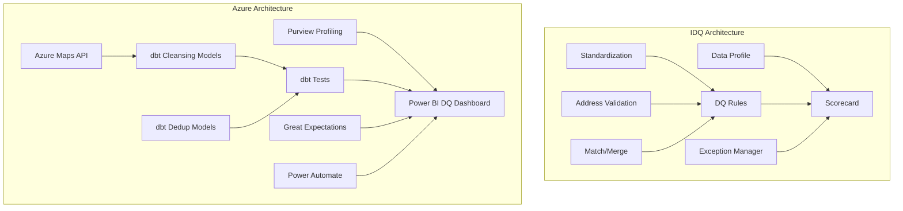

# Data Quality Migration Guide: IDQ to Great Expectations + dbt Tests + Purview

**A comprehensive guide for migrating Informatica Data Quality (IDQ) profiles, scorecards, rules, and standardization to Azure-native data quality tools.**

---

## Overview

Informatica Data Quality (IDQ) is a mature data quality platform offering profiling, standardization, matching, address validation, scorecards, and exception management. The Azure-native replacement is a combination of purpose-built tools, each handling a specific aspect of data quality:

| IDQ capability            | Azure replacement                                      | Role                                                  |
| ------------------------- | ------------------------------------------------------ | ----------------------------------------------------- |
| Data profiling            | Purview data profiling + Great Expectations profiler   | Automated column statistics and distribution analysis |
| Data quality rules        | dbt tests (schema + custom) + Great Expectations       | Rule-as-code with CI/CD integration                   |
| Scorecards                | dbt test results + Power BI dashboard                  | Custom dashboards on test metadata                    |
| Standardization           | dbt models (SQL-based cleansing)                       | SQL transformations for format normalization          |
| Address validation        | Azure Maps API or third-party (Melissa, SmartyStreets) | API-based validation                                  |
| Duplicate detection       | dbt dedup models + Azure ML (fuzzy matching)           | SQL-based or ML-based                                 |
| Reference data management | dbt seeds + Azure SQL reference tables                 | CSV-based or database-based reference data            |
| Exception management      | dbt test failures + Power Automate workflows           | Automated exception routing                           |

---

## Architecture comparison



---

## IDQ profiles to Purview + Great Expectations

### What IDQ profiling provides

IDQ profiles analyze source data to produce:

- Column-level statistics (null count, unique count, min, max, mean, standard deviation)
- Value frequency distributions
- Pattern analysis (format detection)
- Data type inference
- Cross-column dependency analysis

### Purview data profiling

Purview automated scanning includes profiling capabilities:

```
Purview Scan -> Data Map -> Column Statistics
  - Null percentage
  - Distinct value count
  - Min / Max values
  - Value distribution (sample)
  - Data classification (PII, financial, health)
```

**Setup:** Configure a Purview scan rule set to enable profiling:

1. Navigate to Purview Studio -> Data Map -> Scan rule sets
2. Create a custom scan rule set with profiling enabled
3. Assign the rule set to your data source scan
4. Schedule the scan (daily or weekly)

### Great Expectations profiling

For deeper profiling beyond Purview's capabilities, use Great Expectations:

```python
# Generate an automated expectation suite from data profile
import great_expectations as gx

context = gx.get_context()
datasource = context.sources.add_or_update_sql(
    name="azure_sql",
    connection_string="mssql+pyodbc://...",
)

# Profile a table
suite = context.assistants.onboarding.run(
    datasource_name="azure_sql",
    data_asset_name="stg_customers",
)

# Generates expectations like:
# - expect_column_values_to_not_be_null (for columns with 0% null in profile)
# - expect_column_values_to_be_unique (for columns with 100% distinct)
# - expect_column_values_to_be_between (for numeric columns with min/max)
# - expect_column_value_lengths_to_be_between (for string columns)
```

### Migration approach

| IDQ profile element     | Azure equivalent                                                  | Implementation                                 |
| ----------------------- | ----------------------------------------------------------------- | ---------------------------------------------- |
| Column null analysis    | Purview profiling + dbt `not_null` test                           | Automatic with Purview scan; codified with dbt |
| Unique analysis         | Purview distinct count + dbt `unique` test                        |                                                |
| Value distribution      | Great Expectations `expect_column_distinct_values_to_be_in_set`   |                                                |
| Pattern analysis        | Great Expectations `expect_column_values_to_match_regex`          |                                                |
| Data type validation    | dbt schema tests + `cast()` in models                             |                                                |
| Cross-column dependency | Custom dbt test or Great Expectations `expect_column_pair_values` |                                                |

---

## IDQ scorecards to dbt test results + Power BI

### What IDQ scorecards provide

IDQ scorecards aggregate data quality metrics into visual dashboards:

- Quality score per table, column, or business domain
- Trend analysis (quality over time)
- Drill-down from score to failing records
- Threshold-based alerts (quality drops below X%)

### Building the Azure equivalent

**Step 1: dbt tests produce structured results**

Every `dbt test` run produces a result in the dbt manifest and run results:

```yaml
# models/staging/_stg__models.yml
version: 2
models:
    - name: stg_customers
      columns:
          - name: customer_id
            tests:
                - unique
                - not_null
          - name: email
            tests:
                - not_null
                - dbt_expectations.expect_column_values_to_match_regex:
                      regex: "^[a-zA-Z0-9_.+-]+@[a-zA-Z0-9-]+\\.[a-zA-Z0-9-.]+$"
          - name: phone
            tests:
                - dbt_expectations.expect_column_values_to_match_regex:
                      regex: "^\\+?[1-9]\\d{1,14}$"
                      config:
                          severity: warn
          - name: status
            tests:
                - accepted_values:
                      values: ["active", "inactive", "pending", "suspended"]
          - name: created_date
            tests:
                - not_null
                - dbt_expectations.expect_column_values_to_be_between:
                      min_value: "'2010-01-01'"
                      max_value: "CURRENT_DATE"
```

**Step 2: Store test results for trending**

Create an elementary-compatible results table or use dbt artifacts:

```sql
-- models/meta/fct_dbt_test_results.sql
-- This model reads dbt test results from the artifacts table
-- Populated by dbt Cloud's built-in artifact storage or elementary package

{{ config(materialized='incremental', unique_key='test_execution_id') }}

SELECT
    test_execution_id,
    test_name,
    model_name,
    column_name,
    test_status,  -- 'pass', 'fail', 'warn', 'error'
    failures,     -- count of failing rows
    rows_tested,  -- total rows tested
    CAST(failures AS FLOAT) / NULLIF(rows_tested, 0) AS failure_rate,
    1.0 - (CAST(failures AS FLOAT) / NULLIF(rows_tested, 0)) AS quality_score,
    executed_at
FROM {{ ref('elementary_test_results') }}


WHERE executed_at > (SELECT MAX(executed_at) FROM {{ this }})

```

**Step 3: Power BI scorecard dashboard**

Build a Power BI report on `fct_dbt_test_results`:

| Dashboard component   | Power BI implementation                                       |
| --------------------- | ------------------------------------------------------------- |
| Overall quality score | Card visual: `AVG(quality_score)` with conditional formatting |
| Quality trend         | Line chart: `quality_score` by `executed_at` (daily)          |
| Quality by domain     | Bar chart: `AVG(quality_score)` grouped by schema/model       |
| Failing tests detail  | Table: test_name, model_name, failures, failure_rate          |
| Threshold alerts      | Data Activator or Power Automate trigger on score < threshold |

---

## IDQ rules to dbt tests

### Rule type mapping

| IDQ rule type         | dbt test equivalent                                          | Example                                                                 |
| --------------------- | ------------------------------------------------------------ | ----------------------------------------------------------------------- |
| Not null              | `not_null` (built-in)                                        | `tests: [not_null]`                                                     |
| Unique                | `unique` (built-in)                                          | `tests: [unique]`                                                       |
| Referential integrity | `relationships` (built-in)                                   | `tests: [relationships: {to: ref('dim_customer'), field: customer_id}]` |
| Accepted values       | `accepted_values` (built-in)                                 | `tests: [accepted_values: {values: ['A', 'B', 'C']}]`                   |
| Range check           | `dbt_expectations.expect_column_values_to_be_between`        | min_value / max_value                                                   |
| Pattern match (regex) | `dbt_expectations.expect_column_values_to_match_regex`       | regex pattern                                                           |
| Length check          | `dbt_expectations.expect_column_value_lengths_to_be_between` | min_length / max_length                                                 |
| Conditional rule      | Custom dbt test (SQL)                                        | See below                                                               |
| Cross-column rule     | Custom dbt test (SQL)                                        | See below                                                               |
| Aggregate rule        | Custom dbt test (SQL)                                        | See below                                                               |
| Freshness check       | `dbt source freshness`                                       | `freshness: {warn_after: {count: 24, period: hour}}`                    |

### Custom dbt test example

IDQ custom rule: "If order_status = 'shipped', then ship_date must not be null"

```sql
-- tests/assert_shipped_orders_have_ship_date.sql
SELECT
    order_id,
    order_status,
    ship_date
FROM {{ ref('stg_orders') }}
WHERE order_status = 'shipped'
  AND ship_date IS NULL
```

dbt custom tests return the **failing rows**. If zero rows are returned, the test passes.

### Great Expectations for complex rules

For rules that are complex to express in SQL or need statistical validation:

```python
# Great Expectations suite for customer data
expectations = [
    # Column-level expectations
    gx.expectations.ExpectColumnValuesToNotBeNull(column="customer_id"),
    gx.expectations.ExpectColumnValuesToBeUnique(column="customer_id"),

    # Distribution expectations (statistical)
    gx.expectations.ExpectColumnMeanToBeBetween(
        column="order_amount", min_value=10, max_value=10000
    ),
    gx.expectations.ExpectColumnStdevToBeBetween(
        column="order_amount", min_value=5, max_value=5000
    ),

    # Multi-column expectations
    gx.expectations.ExpectColumnPairValuesAToBeGreaterThanB(
        column_A="end_date", column_B="start_date"
    ),

    # Row count expectations
    gx.expectations.ExpectTableRowCountToBeBetween(
        min_value=1000, max_value=10000000
    ),
]
```

---

## Standardization migration

### IDQ standardization to dbt models

IDQ standardization transforms include case normalization, whitespace trimming, format standardization, and abbreviation expansion. These translate directly to SQL in dbt models:

| IDQ standardization       | dbt SQL equivalent                                                                        |
| ------------------------- | ----------------------------------------------------------------------------------------- | ----------------------------------- |
| Upper case                | `UPPER(column_name)`                                                                      |
| Lower case                | `LOWER(column_name)`                                                                      |
| Proper case               | `CONCAT(UPPER(LEFT(column_name, 1)), LOWER(SUBSTRING(column_name, 2, LEN(column_name))))` |
| Trim whitespace           | `TRIM(column_name)` or `LTRIM(RTRIM(column_name))`                                        |
| Remove special characters | `REPLACE(REPLACE(column_name, '-', ''), '.', '')`                                         |
| Phone format              | Custom macro with regex                                                                   | See example below                   |
| Date format               | `CONVERT(DATE, column_name, format_code)` or `TRY_CAST`                                   |
| Gender standardization    | `CASE` statement                                                                          | See example below                   |
| State abbreviation        | dbt seed + JOIN                                                                           | CSV of state names to abbreviations |

### Standardization macro example

```sql
-- macros/standardize_phone.sql

    CASE
        WHEN {{ phone_column }} IS NULL THEN NULL
        WHEN LEN(REPLACE(REPLACE(REPLACE(REPLACE(REPLACE(
            {{ phone_column }}, '-', ''), '(', ''), ')', ''), ' ', ''), '+', '')) = 10
        THEN CONCAT('+1',
            REPLACE(REPLACE(REPLACE(REPLACE(REPLACE(
                {{ phone_column }}, '-', ''), '(', ''), ')', ''), ' ', ''), '+', ''))
        WHEN LEN(REPLACE(REPLACE(REPLACE(REPLACE(REPLACE(
            {{ phone_column }}, '-', ''), '(', ''), ')', ''), ' ', ''), '+', '')) = 11
        THEN CONCAT('+',
            REPLACE(REPLACE(REPLACE(REPLACE(REPLACE(
                {{ phone_column }}, '-', ''), '(', ''), ')', ''), ' ', ''), '+', ''))
        ELSE {{ phone_column }}
    END

```

### Standardization model example

```sql
-- models/staging/crm/stg_crm__customers.sql
SELECT
    customer_id,
    TRIM(UPPER(first_name)) AS first_name,
    TRIM(UPPER(last_name)) AS last_name,
    LOWER(TRIM(email)) AS email,
    {{ standardize_phone('phone') }} AS phone,
    CASE
        WHEN UPPER(TRIM(gender)) IN ('M', 'MALE', 'MAN') THEN 'M'
        WHEN UPPER(TRIM(gender)) IN ('F', 'FEMALE', 'WOMAN') THEN 'F'
        ELSE 'U'
    END AS gender,
    COALESCE(TRY_CAST(birth_date AS DATE), NULL) AS birth_date,
    s.state_abbrev AS state_code
FROM {{ source('crm', 'customers') }} c
LEFT JOIN {{ ref('seed_state_abbreviations') }} s
    ON UPPER(TRIM(c.state_name)) = UPPER(s.state_name)
```

---

## Address validation migration

### IDQ address validation

IDQ includes built-in address validation databases (from Loqate/GBG, formerly QAS) that validate, standardize, and geocode addresses. This is one of the few IDQ capabilities that requires a third-party replacement.

### Azure-native options

| Option                      | Capability                                | Cost                                     | Notes                                              |
| --------------------------- | ----------------------------------------- | ---------------------------------------- | -------------------------------------------------- |
| Azure Maps (Geocoding API)  | Address validation + geocoding            | Consumption-based (~$4.50/1000 requests) | Good for US/international; limited standardization |
| Melissa (Data Quality APIs) | Full address validation + standardization | Subscription ($5K-$50K/year)             | Closest IDQ equivalent; USPS CASS certified        |
| SmartyStreets               | US address validation                     | Subscription ($3K-$20K/year)             | US-focused; USPS CASS certified                    |
| Google Maps Geocoding       | Address validation + geocoding            | Consumption-based ($5/1000 requests)     | Broad international coverage                       |
| USPS Web Tools (free)       | US address validation                     | Free (USPS registration)                 | Limited to USPS addresses; rate-limited            |

### Integration pattern

```sql
-- Step 1: dbt model identifies addresses needing validation
-- models/staging/stg_addresses__pending_validation.sql
SELECT
    address_id,
    street_line_1,
    street_line_2,
    city,
    state,
    postal_code,
    country
FROM {{ source('crm', 'addresses') }}
WHERE validated_at IS NULL
   OR validated_at < DATEADD(month, -6, GETDATE())
```

```python
# Step 2: Azure Function calls validation API
# Triggered by ADF pipeline after dbt staging model runs

import azure.functions as func
import requests

def validate_address(address):
    response = requests.get(
        "https://atlas.microsoft.com/search/address/json",
        params={
            "api-version": "1.0",
            "subscription-key": os.environ["AZURE_MAPS_KEY"],
            "query": f"{address['street_line_1']}, {address['city']}, {address['state']} {address['postal_code']}",
            "countrySet": address.get("country", "US"),
        }
    )
    result = response.json()
    if result["results"]:
        top = result["results"][0]
        return {
            "validated_street": top["address"]["streetName"],
            "validated_city": top["address"]["municipality"],
            "validated_state": top["address"]["countrySubdivision"],
            "validated_postal": top["address"]["postalCode"],
            "latitude": top["position"]["lat"],
            "longitude": top["position"]["lon"],
            "confidence_score": top["score"],
        }
    return None
```

```sql
-- Step 3: dbt model joins validated addresses
-- models/intermediate/int_addresses__validated.sql
SELECT
    a.address_id,
    COALESCE(v.validated_street, a.street_line_1) AS street_line_1,
    a.street_line_2,
    COALESCE(v.validated_city, a.city) AS city,
    COALESCE(v.validated_state, a.state) AS state,
    COALESCE(v.validated_postal, a.postal_code) AS postal_code,
    v.latitude,
    v.longitude,
    v.confidence_score,
    CASE WHEN v.confidence_score >= 0.8 THEN 'validated'
         WHEN v.confidence_score >= 0.5 THEN 'partial'
         ELSE 'unvalidated'
    END AS validation_status
FROM {{ ref('stg_addresses__pending_validation') }} a
LEFT JOIN {{ source('validation', 'address_validation_results') }} v
    ON a.address_id = v.address_id
```

---

## Data profiling migration

### IDQ profiling to Purview scanning + profiling

| IDQ profiling feature      | Purview equivalent                     | Setup                                             |
| -------------------------- | -------------------------------------- | ------------------------------------------------- |
| Column statistics          | Purview scan with profiling enabled    | Enable in scan rule set                           |
| Null percentage            | Purview column-level null count        | Automatic with profiling                          |
| Distinct value count       | Purview distinct count                 | Automatic with profiling                          |
| Value distribution (top N) | Purview sample values                  | Automatic with profiling                          |
| Pattern detection          | Purview classification rules           | Built-in classifiers for PII, dates, emails, etc. |
| Custom profiling rules     | Great Expectations custom expectations | Python-based for complex rules                    |

### Setting up Purview profiling

1. **Register data sources** in Purview Data Map
2. **Create scan rule set** with profiling enabled:
    - Navigate to Management -> Scan rule sets -> New
    - Enable "Data profiling" checkbox
    - Select classification rules to apply
3. **Create and run scan** against registered sources
4. **View results** in Purview Data Catalog -> asset details -> Schema tab

---

## Exception management migration

### IDQ exception management

IDQ routes data quality exceptions to exception tables where data stewards review and resolve issues. The Azure equivalent:

| IDQ exception feature | Azure equivalent                              |
| --------------------- | --------------------------------------------- |
| Exception table       | dbt test failure output table                 |
| Exception routing     | Power Automate flow triggered on test failure |
| Steward assignment    | Power Automate -> Teams/email notification    |
| Resolution workflow   | Power Apps form for steward review            |
| Exception metrics     | Power BI dashboard on exception table         |

### Implementation pattern

**Step 1:** Configure dbt to store test failures:

```yaml
# dbt_project.yml
tests:
    +store_failures: true
    +schema: dq_exceptions
```

This creates a table for each failing test containing the failing rows.

**Step 2:** Create a Power Automate flow:

```
Trigger: Scheduled (after dbt test run)
Action 1: Query dq_exceptions schema for new failures
Action 2: If failures exist:
  - Create Teams message with failure summary
  - Assign to data steward based on schema/model
  - Log exception to tracking table
Action 3: Update exception dashboard data
```

**Step 3:** Build Power Apps form for steward review:

- View failing records from `dq_exceptions` tables
- Mark records as "resolved", "accepted exception", or "false positive"
- Record resolution notes and timestamp

---

## Migration execution timeline

| Phase                        | Duration  | Activities                                                       |
| ---------------------------- | --------- | ---------------------------------------------------------------- |
| 1. Inventory IDQ rules       | 2-3 weeks | Export all profiles, rules, scorecards; categorize by complexity |
| 2. Set up dbt tests          | 2-3 weeks | Implement schema tests, custom tests, Great Expectations suites  |
| 3. Build scorecard dashboard | 1-2 weeks | Power BI report on dbt test results                              |
| 4. Migrate standardization   | 2-4 weeks | Convert IDQ standardization to dbt models + macros               |
| 5. Set up address validation | 2-3 weeks | Integrate Azure Maps or third-party API                          |
| 6. Parallel run              | 4-6 weeks | Run IDQ and dbt tests in parallel; reconcile results             |
| 7. Cutover                   | 1-2 weeks | Decommission IDQ; full reliance on dbt tests + GE                |

---

## Related resources

- [MDM Migration Guide](mdm-migration.md) -- For match/merge and entity resolution
- [Complete Feature Mapping](feature-mapping-complete.md) -- All IDQ features mapped
- [Tutorial: Mapping to dbt](tutorial-mapping-to-dbt.md) -- Includes test creation
- [Best Practices](best-practices.md) -- DQ rule discovery guidance
- [Migration Playbook](../informatica.md) -- End-to-end migration guide

---

**Last updated:** 2026-04-30
**Maintainers:** CSA-in-a-Box core team
