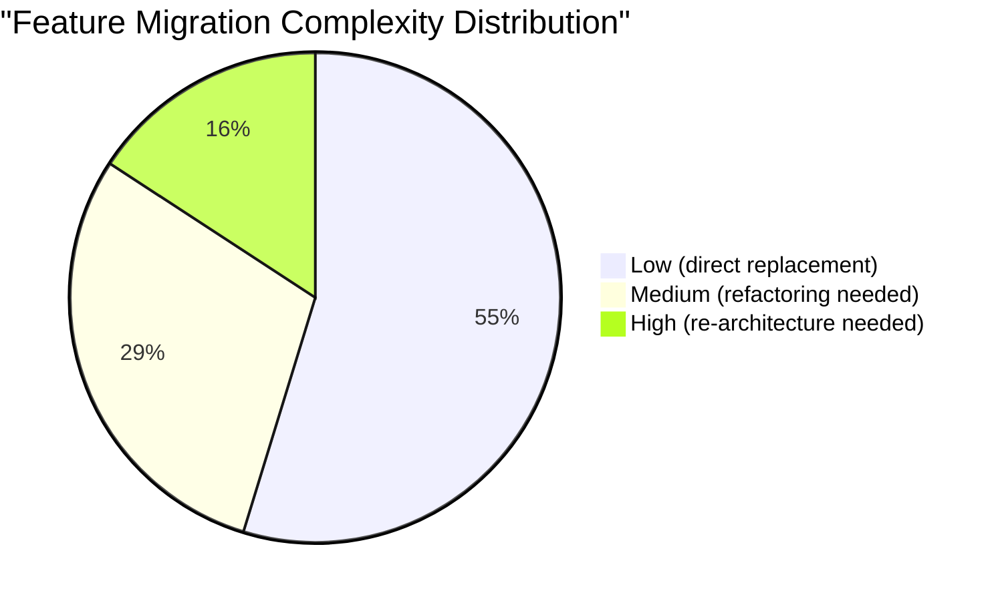

# Complete Feature Mapping: Informatica to Azure

**Every Informatica capability mapped to its Azure equivalent, with migration complexity and recommended approach.**

---

## How to read this document

Each section covers one Informatica product. Every feature is mapped to its Azure equivalent with:

- **Azure equivalent** -- the recommended service or pattern
- **Complexity** -- Low (direct replacement), Medium (refactoring needed), High (re-architecture needed)
- **Notes** -- migration-specific guidance

---

## PowerCenter features

### Core mapping concepts

| # | Informatica feature | Azure equivalent | Complexity | Notes |
|---|---|---|---|---|
| 1 | Mapping | dbt model (`.sql` file) | Low | One mapping = one or more dbt models depending on complexity |
| 2 | Mapplet (reusable) | dbt macro (`.sql` in macros/) | Low | Macros provide full Jinja templating; more powerful than mapplets |
| 3 | Session | ADF pipeline activity (Execute dbt, Copy Data) | Low | A session becomes a pipeline activity or dbt run |
| 4 | Workflow | ADF pipeline | Low | Direct conceptual mapping |
| 5 | Worklet | ADF sub-pipeline (Execute Pipeline activity) | Low | Nested pipeline execution |
| 6 | Parameter file | ADF pipeline parameters + dbt vars | Low | `dbt run --vars` or ADF global parameters |
| 7 | Mapping variable | dbt variable (`var()`) or Jinja variable | Low | |
| 8 | Connection object | ADF Linked Service | Low | Direct replacement; 100+ built-in connectors |
| 9 | Session log | ADF Monitor + dbt logs | Low | Azure Monitor for pipeline; dbt Cloud for model runs |
| 10 | Deployment group | ADF ARM/Bicep templates + dbt project | Low | Git-based deployment replaces repository export |

### Transformations

| # | Informatica transformation | Azure equivalent | Complexity | Notes |
|---|---|---|---|---|
| 11 | Source Qualifier | dbt `source()` + CTE with filter/join | Low | SQL-native; often simpler than PowerCenter |
| 12 | Expression | `SELECT` projection in dbt model | Low | Any SQL expression in SELECT clause |
| 13 | Filter | `WHERE` clause in dbt model | Low | Direct SQL equivalent |
| 14 | Lookup (connected) | `LEFT JOIN` in dbt model | Low | Standard SQL join |
| 15 | Lookup (unconnected) | dbt macro returning scalar value | Medium | Requires macro abstraction |
| 16 | Joiner | `JOIN` in dbt model (any join type) | Low | INNER, LEFT, RIGHT, FULL, CROSS |
| 17 | Router | Multiple dbt models with different `WHERE` clauses | Medium | One model per output group; use `ref()` for shared source |
| 18 | Aggregator | `GROUP BY` in dbt model | Low | Standard SQL aggregation |
| 19 | Sorter | `ORDER BY` in dbt model | Low | Note: ordering in intermediate models is usually unnecessary |
| 20 | Rank | `ROW_NUMBER()` / `RANK()` / `DENSE_RANK()` window functions | Low | Standard SQL window functions |
| 21 | Sequence Generator | `ROW_NUMBER()` or dbt `surrogate_key` macro | Low | dbt-utils `generate_surrogate_key` for hash keys |
| 22 | Update Strategy | dbt incremental materialization (`is_incremental()`) | Medium | Requires understanding dbt incremental patterns |
| 23 | Normalizer | `UNPIVOT` / `CROSS APPLY` / `LATERAL FLATTEN` | Medium | Depends on target database dialect |
| 24 | Union | `UNION ALL` in dbt model | Low | Standard SQL |
| 25 | Transaction Control | ADF pipeline error handling + dbt `run_operation` | Medium | ADF handles orchestration-level transactions |
| 26 | Stored Procedure | dbt `run_operation` or pre/post-hook | Low | Hooks execute SQL before/after model |
| 27 | Custom Transformation (Java) | ADF Azure Function activity or dbt Python model | High | Requires rewriting Java logic |
| 28 | HTTP Transformation | ADF Web activity or REST connector | Medium | ADF has native REST/HTTP support |
| 29 | XML Generator | ADF Mapping Data Flow XML sink | Medium | Or custom Azure Function |
| 30 | XML Parser | ADF Mapping Data Flow XML source | Medium | Or custom Azure Function |
| 31 | SQL Transformation | dbt model (native SQL) | Low | dbt is SQL-native; this is the simplest conversion |
| 32 | Data Masking | Purview sensitivity labels + Dynamic Data Masking | Medium | Azure SQL DDM or Purview classification |
| 33 | Address Validator | Azure Maps API or third-party (Melissa, SmartyStreets) | Medium | No built-in equivalent; requires API integration |
| 34 | SCD Type 2 | dbt snapshot | Low | `dbt snapshot` with `check_cols` or `updated_at` strategy |
| 35 | Midstream (debugger) | dbt `{{ log() }}` + `--debug` flag + ADF Monitor | Low | Different debugging model (SQL-based vs visual) |

### Workflow components

| # | Informatica feature | Azure equivalent | Complexity | Notes |
|---|---|---|---|---|
| 36 | Scheduler | ADF Trigger (Schedule, Tumbling Window, Event) | Low | Richer trigger types than Informatica |
| 37 | Email task | ADF Web activity -> Logic Apps -> Teams/Email | Low | Logic Apps provides rich notification |
| 38 | Command task | ADF Web activity or Azure Function activity | Low | |
| 39 | Decision (link condition) | ADF If Condition / Switch activity | Low | |
| 40 | Event Wait | ADF Event trigger or Wait activity | Low | |
| 41 | Timer | ADF Wait activity | Low | |
| 42 | Assignment | ADF Set Variable activity | Low | |
| 43 | Abort | ADF Fail activity | Low | New activity type in ADF |
| 44 | Session concurrency | ADF concurrent activity limit | Low | Pipeline-level concurrency control |
| 45 | Workflow recovery | ADF pipeline rerun from failure | Low | ADF supports rerun from failed activity |

---

## IICS features

| # | IICS feature | Azure equivalent | Complexity | Notes |
|---|---|---|---|---|
| 46 | Cloud Data Integration task | ADF pipeline or Fabric Data Pipeline | Low | Direct replacement for cloud ETL |
| 47 | Taskflow | ADF pipeline with orchestration activities | Low | Taskflow maps to pipeline |
| 48 | Mapping Designer (cloud) | dbt model or ADF Mapping Data Flow | Low | Code-first (dbt) preferred for production |
| 49 | Intelligent Structure Model | ADF Mapping Data Flow + schema drift handling | Medium | ADF handles semi-structured natively |
| 50 | Pushdown Optimization (ELT) | dbt (native ELT) + ADF Copy Activity | Low | dbt is ELT by design |
| 51 | Mass Ingestion | ADF Copy Activity with parallelism | Low | ADF excels at bulk data movement |
| 52 | Secure Agent | ADF Self-Hosted Integration Runtime | Low | Equivalent on-prem connectivity |
| 53 | IICS Monitor | ADF Monitor + Azure Monitor | Low | Richer with Azure Monitor dashboards |
| 54 | IICS Connectors | ADF Linked Services (100+ connectors) | Low | ADF connector library is broader |
| 55 | IICS API integration | ADF REST connector or Azure Function | Low | |
| 56 | IICS Application Integration | Logic Apps + API Management | Medium | Different architecture; event-driven |
| 57 | IICS Data Synchronization | Fabric mirroring or ADF incremental copy | Low | |
| 58 | IICS File Processing | ADF + Azure Blob Storage trigger | Low | Event-driven file processing |

---

## Informatica Data Quality (IDQ) features

| # | IDQ feature | Azure equivalent | Complexity | Notes |
|---|---|---|---|---|
| 59 | Data Profile | Purview data profiling + Great Expectations profiler | Medium | Purview provides automated column statistics |
| 60 | Scorecard | dbt test results + custom Power BI dashboard | Medium | Build scorecard from dbt test metadata |
| 61 | Data Quality Rule | dbt test (schema, data, custom) | Low-Medium | `unique`, `not_null`, `accepted_values`, custom SQL |
| 62 | Standardization | dbt model with SQL `CASE`/`TRIM`/`UPPER` logic | Low | SQL-based standardization |
| 63 | Address Validation | Azure Maps API or third-party | Medium | Requires API integration; no built-in IDQ equivalent |
| 64 | Duplicate Detection | dbt model with fuzzy matching (Jaro-Winkler via UDF) | High | Complex; may need Azure ML or Dedupe library |
| 65 | Data Cleansing Transformation | dbt model with SQL cleansing logic | Low | Standard SQL transformations |
| 66 | Reference Data Lookup | dbt seed files or reference table joins | Low | `dbt seed` loads CSV reference data |
| 67 | Exception Management | dbt test failures + Purview data quality alerts | Medium | Custom workflow for exception review |
| 68 | DQ Accelerator (pre-built rules) | Great Expectations expectation suites | Medium | GE has 300+ built-in expectations |
| 69 | Match/Merge (in IDQ) | dbt deduplication model + Azure ML | High | Complex; see [MDM Migration Guide](mdm-migration.md) |

---

## Informatica MDM features

| # | MDM feature | Azure equivalent | Complexity | Notes |
|---|---|---|---|---|
| 70 | MDM Hub (SIF API) | Azure SQL + REST API (APIM) | High | Custom API layer replaces SIF |
| 71 | Match rules | Azure ML matching model or SQL fuzzy match | High | Requires re-implementation |
| 72 | Merge rules | SQL merge logic in dbt or stored procedure | High | Business rules need manual conversion |
| 73 | Trust rules (survivorship) | dbt model with CASE-based survivorship | Medium | SQL logic for source priority |
| 74 | Hierarchy Manager | Purview collections or Azure SQL hierarchical queries | High | Purview for governance; SQL for operational hierarchy |
| 75 | Entity 360 view | Power BI report or Power Apps canvas app | Medium | Different presentation; same outcome |
| 76 | Stewardship (IDD) | Purview data stewardship or Power Apps | Medium | Custom workflow for data steward review |
| 77 | Business Entity Services | Azure APIM + Azure Functions | High | Custom API development |
| 78 | Match/merge batch | dbt model + ADF pipeline | High | Batch matching in SQL/Python |
| 79 | Real-time match | Azure Functions + Azure SQL | High | Event-driven matching |
| 80 | State management | Azure SQL temporal tables | Medium | SQL Server temporal tables track record history |

---

## Enterprise Data Catalog (EDC) features

| # | EDC feature | Azure equivalent | Complexity | Notes |
|---|---|---|---|---|
| 81 | Automated scanning | Purview automated scanning | Low | Purview scans 100+ source types |
| 82 | Business glossary | Purview business glossary | Low | Direct replacement |
| 83 | Data lineage | Purview Data Map lineage | Low | Native lineage for ADF, dbt, Synapse, Fabric |
| 84 | Column-level lineage | Purview column-level lineage | Low | Automatic for supported sources |
| 85 | Data classification | Purview sensitivity labels + classifiers | Low | 200+ built-in classifiers (PII, financial, health) |
| 86 | Data profiling (EDC) | Purview data profiling | Low | Statistical profiling during scans |
| 87 | Collaboration (annotations) | Purview annotations and contacts | Low | |
| 88 | Custom metadata | Purview custom type definitions | Medium | Purview is extensible via REST API |
| 89 | API access | Purview REST API + Apache Atlas API | Low | Purview exposes Apache Atlas-compatible API |
| 90 | Cross-platform lineage | Purview + custom lineage connectors | Medium | Purview covers Azure natively; custom connectors for non-Azure |

---

## B2B / Data Exchange features

| # | Informatica feature | Azure equivalent | Complexity | Notes |
|---|---|---|---|---|
| 91 | B2B Gateway | Logic Apps + API Management | High | Different architecture; requires re-design |
| 92 | EDI processing | Logic Apps EDI connectors (X12, EDIFACT) | Medium | Built-in EDI support in Logic Apps |
| 93 | Partner management | API Management + Entra B2B | Medium | Partner onboarding via APIM |
| 94 | File exchange | Azure Blob Storage + SFTP connector | Low | Managed SFTP on Azure Blob |
| 95 | Data marketplace | Purview data products + Azure Data Share | Medium | Purview provides data product publishing |

---

## Migration complexity summary

| Complexity | Count | Percentage | Typical effort per feature |
|---|---|---|---|
| Low | ~50 | 52% | 1-3 days |
| Medium | ~27 | 28% | 3-10 days |
| High | ~15 | 16% | 10-30+ days |

---

## Migration priority recommendation

### Phase 1: Low-complexity, high-value (Weeks 1-12)

Migrate features with Low complexity that cover the largest workload volume:

- PowerCenter mappings -> dbt models (features 1-10, 11-21, 24, 26, 31)
- Workflows -> ADF pipelines (features 36-45)
- IICS tasks -> ADF/Fabric pipelines (features 46-58)
- EDC -> Purview (features 81-90)

### Phase 2: Medium-complexity (Weeks 12-30)

- Router, Update Strategy, Normalizer transformations (features 17, 22, 23)
- IDQ rules -> dbt tests + Great Expectations (features 59-68)
- Unconnected Lookups -> dbt macros (feature 15)
- B2B EDI processing (feature 92)

### Phase 3: High-complexity (Weeks 30-52+)

- MDM match/merge/trust (features 70-80)
- Custom Java transformations (feature 27)
- Complex duplicate detection (feature 64)
- B2B Gateway (feature 91)

---

## Features with no direct equivalent

Some Informatica features have no single Azure equivalent but are addressed through architectural patterns:

| Informatica feature | Why no direct equivalent | Azure architectural pattern |
|---|---|---|
| PowerCenter visual debugger | dbt is code-first, not visual | `dbt debug` + `{{ log() }}` + query profiling |
| IDQ Address Validation database | Informatica bundles address databases | Azure Maps + third-party API (Melissa, SmartyStreets) |
| MDM Hub SIF API | Purpose-built MDM API | Custom REST API via APIM + Azure Functions |
| Informatica Axon (governance) | Purpose-built governance workflow | Purview stewardship + Power Automate workflows |
| PowerCenter Grid (parallel processing) | Server-based parallelism | ADF auto-scales; dbt uses warehouse parallelism |

---

## Related resources

- [PowerCenter Migration Guide](powercenter-migration.md) -- Detailed PowerCenter-specific guidance
- [IICS Migration Guide](iics-migration.md) -- IICS-specific migration
- [Data Quality Migration Guide](data-quality-migration.md) -- IDQ replacement patterns
- [MDM Migration Guide](mdm-migration.md) -- MDM replacement architecture
- [Why Azure over Informatica](why-azure-over-informatica.md) -- Strategic rationale
- [Migration Playbook](../informatica.md) -- End-to-end migration guide

---

**Last updated:** 2026-04-30
**Maintainers:** CSA-in-a-Box core team
