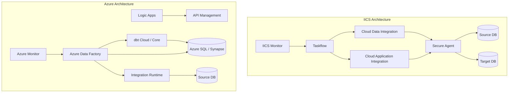

# IICS Migration Guide: IICS to ADF / Fabric Data Pipelines

**A comprehensive guide for migrating Informatica Intelligent Cloud Services (IICS) to Azure Data Factory, Microsoft Fabric Data Pipelines, and dbt.**

---

## Overview

Informatica Intelligent Cloud Services (IICS) is Informatica's cloud-native integration platform. Unlike PowerCenter, IICS is already SaaS-delivered, making the migration conceptually simpler -- you are moving from one cloud service to another rather than from on-prem to cloud. The primary motivations for migration are **cost reduction** (IPU-based pricing vs consumption-based) and **ecosystem unification** (consolidating on Azure-native services).

### IICS product components

IICS is a suite with multiple capabilities. This guide covers:

| IICS component | Azure replacement | Guide section |
|---|---|---|
| Cloud Data Integration (CDI) | ADF pipelines + dbt models | [CDI Migration](#cloud-data-integration-migration) |
| Cloud Application Integration (CAI) | Logic Apps + API Management | [CAI Migration](#cloud-application-integration-migration) |
| Data Integration Elastic | ADF + Spark / Databricks | [Elastic Migration](#data-integration-elastic-migration) |
| Taskflows | ADF pipeline orchestration | [Taskflow Migration](#taskflow-to-adf-pipeline) |
| Mass Ingestion | ADF Copy Activity with parallelism | [Mass Ingestion](#mass-ingestion-migration) |
| Intelligent Structure Models | ADF Mapping Data Flows | [ISM Migration](#intelligent-structure-model-migration) |
| IICS Monitor | ADF Monitor + Azure Monitor | [Monitoring](#monitoring-migration) |

---

## Architecture comparison



### Key architectural differences

| Aspect | IICS | Azure |
|---|---|---|
| Pricing model | IPU-based (Informatica Processing Units) | Consumption-based (per activity run, per DIU-hour) |
| Runtime agent | Secure Agent (VM-based) | Integration Runtime (managed or self-hosted) |
| Transformation engine | IICS Spark engine or native | dbt (SQL-native) or ADF Mapping Data Flows |
| Orchestration | Taskflows | ADF Pipelines |
| Monitoring | IICS Monitor | ADF Monitor + Azure Monitor + Log Analytics |
| Deployment | IICS deployment (org-to-org export) | ARM/Bicep templates + Git-based CI/CD |

---

## Cloud Data Integration migration

### CDI task to ADF pipeline mapping

Each IICS CDI task maps to an ADF pipeline activity or a combination of dbt model + ADF orchestration:

| IICS CDI task type | Azure equivalent | Notes |
|---|---|---|
| Mapping task (visual ETL) | dbt model (SQL) or ADF Mapping Data Flow (visual) | Prefer dbt for testability; use MDF for analyst-facing flows |
| Synchronization task | ADF Copy Activity (incremental) | ADF watermark-based incremental copy |
| Replication task | Fabric mirroring or ADF CDC | Fabric mirroring for supported sources |
| PowerCenter task (cloud-hosted) | dbt model + ADF pipeline | Same as PowerCenter migration |
| Data transfer task | ADF Copy Activity | Bulk data movement |

### IICS connector to ADF Linked Service mapping

| IICS connector | ADF Linked Service | Notes |
|---|---|---|
| Salesforce V2 | Salesforce connector | Native ADF connector |
| SAP | SAP Table / SAP CDC / SAP HANA | Multiple SAP connectors in ADF |
| Oracle | Oracle connector | Self-Hosted IR for on-prem |
| SQL Server | SQL Server / Azure SQL connector | Azure IR for cloud; Self-Hosted for on-prem |
| Snowflake | Snowflake connector | Native ADF connector |
| Amazon S3 | Amazon S3 connector | Native ADF connector |
| Google BigQuery | Google BigQuery connector | Native ADF connector |
| REST/SOAP | REST connector / HTTP connector | ADF REST handles pagination, auth |
| JDBC (generic) | ODBC connector | Self-Hosted IR with ODBC driver |
| Flat file | ADLS Gen2 / Blob Storage | File-based connectors |
| ServiceNow | ServiceNow connector | Native ADF connector |
| Workday | Workday connector or REST | REST with Workday API |
| NetSuite | NetSuite connector or REST | REST with NetSuite API |
| Dynamics 365 | Dynamics 365 connector | Native ADF connector |
| Azure Blob Storage | Azure Blob Storage connector | Native (identical target) |
| Azure SQL Database | Azure SQL Database connector | Native (identical target) |
| Azure Data Lake Storage | ADLS Gen2 connector | Native (identical target) |

### IICS mapping to dbt model conversion

IICS visual mappings use a similar concept to PowerCenter but with a cloud-native Spark engine. The conversion process:

**Step 1:** Export mapping metadata from IICS using the REST API:

```bash
# IICS REST API to export mapping definitions
curl -X GET "https://{pod}.informaticacloud.com/saas/api/v2/mapping/{mapping_id}" \
  -H "INFA-SESSION-ID: {session_id}" \
  -o mapping_export.json
```

**Step 2:** Analyze transformation logic in the exported JSON and convert to SQL:

| IICS transformation | dbt SQL equivalent |
|---|---|
| Source transformation | `source()` reference in CTE |
| Filter transformation | `WHERE` clause |
| Expression transformation | `SELECT` with computed columns |
| Joiner transformation | `JOIN` (any type) |
| Lookup transformation | `LEFT JOIN` to reference table |
| Aggregator transformation | `GROUP BY` with aggregate functions |
| Router transformation | Multiple models with different `WHERE` clauses |
| Union transformation | `UNION ALL` |
| Normalizer | `UNPIVOT` or `CROSS APPLY` |
| Rank | `ROW_NUMBER()` / `RANK()` window functions |
| Sorter | `ORDER BY` (usually unnecessary in dbt) |
| Target transformation | dbt materialization config |

**Step 3:** Create dbt models following the staging/intermediate/marts pattern.

**Step 4:** Create dbt tests matching any IICS data quality assertions.

---

## Taskflow to ADF pipeline

### Taskflow concepts

IICS Taskflows orchestrate CDI tasks, CAI processes, and other steps. They map directly to ADF pipelines:

| Iics Taskflow element | ADF equivalent | Notes |
|---|---|---|
| Start | Pipeline start (implicit) | ADF pipelines start automatically |
| CDI task step | Execute dbt activity or Copy Data activity | |
| CAI process step | Execute Logic App (Web activity) | |
| Decision step | If Condition / Switch activity | |
| Parallel step | Parallel activity branches | ADF supports parallel execution natively |
| Wait step | Wait activity | |
| Email notification | Web activity -> Logic Apps | |
| Error handling (fault) | ADF On Failure dependency | Activity-level failure handling |
| Taskflow parameter | Pipeline parameter | |
| Taskflow variable | Pipeline variable | |
| Sub-taskflow | Execute Pipeline activity | Nested pipeline |
| Human task | Power Automate approval flow | Logic Apps or Power Automate |

### Example conversion

**IICS Taskflow:** Daily Sales Load

```
Start -> Extract_Sales (CDI) -> Transform_Sales (CDI)
    -> Decision (row_count > 0?)
        -> Yes: Load_Warehouse (CDI) -> Notify_Success (Email)
        -> No: Notify_Empty (Email) -> End
    -> On Error: Notify_Failure (Email) -> End
```

**ADF Pipeline equivalent:**

```json
{
    "name": "pl_daily_sales_load",
    "activities": [
        {
            "name": "Extract_Sales",
            "type": "Copy",
            "dependsOn": [],
            "typeProperties": {
                "source": { "type": "SqlSource" },
                "sink": { "type": "AzureSqlSink" }
            }
        },
        {
            "name": "Transform_Sales",
            "type": "Custom",
            "dependsOn": [{ "activity": "Extract_Sales", "dependencyConditions": ["Succeeded"] }],
            "typeProperties": {
                "command": "dbt run --select stg_sales int_sales__enriched"
            }
        },
        {
            "name": "Check_Row_Count",
            "type": "IfCondition",
            "dependsOn": [{ "activity": "Transform_Sales", "dependencyConditions": ["Succeeded"] }],
            "typeProperties": {
                "expression": { "value": "@greater(activity('Transform_Sales').output.rowCount, 0)" },
                "ifTrueActivities": [
                    {
                        "name": "Load_Warehouse",
                        "type": "Custom",
                        "typeProperties": { "command": "dbt run --select mart_sales" }
                    },
                    {
                        "name": "Notify_Success",
                        "type": "WebActivity",
                        "typeProperties": { "url": "https://logic-app-url/notify-success" }
                    }
                ],
                "ifFalseActivities": [
                    {
                        "name": "Notify_Empty",
                        "type": "WebActivity",
                        "typeProperties": { "url": "https://logic-app-url/notify-empty" }
                    }
                ]
            }
        }
    ]
}
```

---

## Cloud Application Integration migration

IICS Cloud Application Integration (CAI) handles event-driven integration, API orchestration, and process automation. The Azure equivalent is a combination of Logic Apps and API Management:

| IICS CAI feature | Azure equivalent | Notes |
|---|---|---|
| Process Designer | Logic Apps Designer | Visual workflow builder |
| Service connectors | Logic Apps connectors (1,000+) | Broader connector library |
| API exposure | API Management | API gateway with throttling, auth, monitoring |
| Event-driven triggers | Event Grid + Logic Apps | Azure-native event mesh |
| Real-time integration | Logic Apps Standard (stateful) | Supports long-running workflows |
| B2B integration | Logic Apps B2B (EDI, AS2) | Enterprise Integration Pack |

### Migration approach

1. **Inventory CAI processes** -- list all processes, their triggers, and their downstream effects
2. **Map to Logic Apps patterns** -- most CAI processes translate to Logic Apps workflows 1:1
3. **Expose APIs via APIM** -- if CAI exposes REST APIs, register them in API Management
4. **Set up Event Grid** -- for event-driven triggers, use Event Grid as the event bus
5. **Test end-to-end** -- validate request/response patterns, error handling, retry logic

---

## Data Integration Elastic migration

IICS Data Integration Elastic runs large-scale transformations on a Spark cluster. The Azure equivalents are:

| IICS Elastic feature | Azure equivalent | Notes |
|---|---|---|
| Elastic mapping (Spark) | dbt + Spark (Databricks) or Synapse Spark | Spark-native execution |
| Elastic cluster auto-scaling | Databricks auto-scaling cluster or Synapse Spark pools | Native auto-scaling |
| Pushdown optimization | dbt ELT (native pushdown) | dbt pushes all logic to the warehouse engine |
| Elastic high-volume processing | ADF + Databricks | ADF orchestrates; Databricks executes Spark |

### When to use Databricks vs dbt

| Scenario | Recommendation |
|---|---|
| SQL-expressible transformations | dbt (simpler, testable, SQL-native) |
| Complex Python/Scala transformations | Databricks notebook |
| ML feature engineering | Databricks (MLflow integration) |
| Streaming data processing | Databricks Structured Streaming |
| Very large joins (100M+ rows on both sides) | Databricks (Spark optimizer handles skew) |

---

## Mass Ingestion migration

IICS Mass Ingestion handles bulk data loading from multiple sources. The ADF equivalent:

| IICS Mass Ingestion feature | ADF equivalent | Notes |
|---|---|---|
| Bulk source extraction | ADF Copy Activity (parallel) | Use ForEach activity for multi-table extraction |
| Change Data Capture | ADF CDC connector or Fabric mirroring | Native CDC for SQL Server, Oracle |
| Initial full load | ADF Copy Activity (full) | Bulk load with partitioned reads |
| Incremental load | ADF watermark pattern | Watermark-based delta extraction |
| Schema drift handling | ADF Mapping Data Flow with schema drift | Auto-handles new columns |

### Bulk ingestion pattern

```json
{
    "name": "pl_mass_ingestion",
    "activities": [
        {
            "name": "Get_Table_List",
            "type": "Lookup",
            "typeProperties": {
                "source": { "query": "SELECT table_name FROM config.ingestion_tables WHERE active = 1" }
            }
        },
        {
            "name": "ForEach_Table",
            "type": "ForEach",
            "dependsOn": [{ "activity": "Get_Table_List", "dependencyConditions": ["Succeeded"] }],
            "typeProperties": {
                "items": { "value": "@activity('Get_Table_List').output.value" },
                "isSequential": false,
                "batchCount": 10,
                "activities": [
                    {
                        "name": "Copy_Table",
                        "type": "Copy",
                        "typeProperties": {
                            "source": { "type": "SqlSource", "query": "@concat('SELECT * FROM ', item().table_name)" },
                            "sink": { "type": "ParquetSink", "storeSettings": { "type": "AzureBlobFSWriteSettings" } }
                        }
                    }
                ]
            }
        }
    ]
}
```

---

## Intelligent Structure Model migration

IICS Intelligent Structure Models (ISM) parse semi-structured data (JSON, XML, logs, EDI) using visual structure detection. ADF Mapping Data Flows provide equivalent capabilities:

| ISM feature | ADF MDF equivalent | Notes |
|---|---|---|
| Structure detection | MDF schema inference | Automatic schema detection for JSON, XML, Avro |
| Hierarchical parsing | MDF flatten transformation | Flatten nested structures |
| Sample-based learning | MDF preview + schema drift | Preview data to configure parsing |
| Complex event processing | MDF with streaming dataset | Near-real-time processing |

### Migration approach

1. **Identify ISM definitions** in IICS
2. **Map each ISM** to an ADF Mapping Data Flow source with appropriate format settings
3. **Configure parsing** using MDF's built-in flatten, derive, and filter transformations
4. **Test with sample data** to validate parsing matches ISM output

---

## Monitoring migration

### IICS Monitor to Azure Monitor

| IICS Monitor feature | Azure equivalent | Setup |
|---|---|---|
| Task run history | ADF Monitor (Pipeline runs) | Built-in; no configuration needed |
| Error details | ADF activity-level errors + Log Analytics | Configure Diagnostic Settings for detailed logs |
| Alerting | Azure Monitor alerts | Alert rules on pipeline failure, duration, data volume |
| Dashboard | Azure Monitor workbooks or Power BI | Custom dashboards on ADF metrics |
| SLA tracking | ADF + Log Analytics queries | KQL queries for SLA compliance |
| Usage metering | Azure Cost Management | Track ADF consumption costs |

### Setting up monitoring

```bash
# Enable ADF diagnostic logging to Log Analytics
az monitor diagnostic-settings create \
    --resource /subscriptions/{sub}/resourceGroups/{rg}/providers/Microsoft.DataFactory/factories/{adf} \
    --name "adf-diagnostics" \
    --workspace /subscriptions/{sub}/resourceGroups/{rg}/providers/Microsoft.OperationalInsights/workspaces/{workspace} \
    --logs '[{"category": "PipelineRuns", "enabled": true}, {"category": "ActivityRuns", "enabled": true}, {"category": "TriggerRuns", "enabled": true}]'
```

### Alerting example

```bash
# Create alert for pipeline failures
az monitor metrics alert create \
    --name "adf-pipeline-failure" \
    --resource-group {rg} \
    --scopes /subscriptions/{sub}/resourceGroups/{rg}/providers/Microsoft.DataFactory/factories/{adf} \
    --condition "total PipelineFailedRuns > 0" \
    --window-size 5m \
    --evaluation-frequency 5m \
    --action /subscriptions/{sub}/resourceGroups/{rg}/providers/Microsoft.Insights/actionGroups/{ag}
```

---

## Secure Agent to Self-Hosted IR migration

The IICS Secure Agent and ADF Self-Hosted Integration Runtime serve the same purpose: connecting cloud services to on-premises data sources.

| Aspect | IICS Secure Agent | ADF Self-Hosted IR |
|---|---|---|
| Deployment | Windows/Linux VM | Windows VM |
| High availability | Agent group (active-active) | IR sharing + auto-update |
| Network | Outbound HTTPS to IICS cloud | Outbound HTTPS to ADF |
| Authentication | IICS token | ADF authentication key |
| Auto-update | Automatic | Automatic (configurable) |
| Resource requirements | 8 GB RAM, 4 cores (recommended) | 8 GB RAM, 4 cores (recommended) |

### Migration steps

1. **Deploy Self-Hosted IR** on the same VMs (or new VMs in the same network) as the Secure Agent
2. **Configure network rules** -- Self-Hosted IR needs outbound HTTPS to `*.azure.com` and `*.microsoft.com`
3. **Register data sources** as ADF Linked Services using the Self-Hosted IR
4. **Test connectivity** to each source through ADF
5. **Decommission Secure Agent** after all IICS tasks are migrated

---

## IICS-specific migration considerations

### IPU consumption analysis

Before migration, analyze your IPU consumption to understand actual usage:

```bash
# IICS REST API to get usage metrics
curl -X GET "https://{pod}.informaticacloud.com/saas/api/v2/activity/activityMonitor" \
    -H "INFA-SESSION-ID: {session_id}" \
    -o usage_report.json
```

Common findings:
- **20-40% of IPUs** are consumed by data movement (Copy equivalent)
- **30-50% of IPUs** are consumed by transformations (dbt equivalent)
- **10-20% of IPUs** are consumed by monitoring and overhead
- **10-20% of IPUs** are wasted on failed/retried tasks

### IICS parameter and connection migration

IICS uses connections and runtime parameters similar to ADF. Create a mapping spreadsheet:

| IICS object | ADF equivalent | Action |
|---|---|---|
| Connection (per environment) | Linked Service (per environment) | Create dev/test/prod Linked Services |
| Connection property override | Linked Service parameterization | Use ADF parameters for environment-specific values |
| Input/output parameter | Pipeline parameter | Map IICS parameters to ADF parameters |
| In-out parameter | Pipeline variable | Use Set Variable + Append Variable activities |
| Secure parameter | Azure Key Vault linked service | Store secrets in Key Vault |

---

## Migration timeline for IICS

IICS migrations are typically faster than PowerCenter because:

1. **No infrastructure to decommission** -- IICS is SaaS; cancel the subscription
2. **Mappings are simpler** -- IICS promotes simpler, single-purpose tasks
3. **Modern patterns** -- IICS teams are often already familiar with cloud concepts
4. **Fewer legacy workflows** -- IICS estates are younger (typically 3-8 years vs PowerCenter's 10-20 years)

| Estate size | CDI tasks | Taskflows | Estimated migration duration |
|---|---|---|---|
| Small | 10-30 | 5-15 | 8-12 weeks |
| Medium | 30-100 | 15-50 | 12-24 weeks |
| Large | 100-300 | 50-150 | 24-36 weeks |
| Enterprise | 300+ | 150+ | 36-52 weeks |

---

## Related resources

- [PowerCenter Migration Guide](powercenter-migration.md) -- For on-prem PowerCenter migration
- [Complete Feature Mapping](feature-mapping-complete.md) -- All Informatica features mapped
- [Tutorial: Workflow to ADF](tutorial-workflow-to-adf.md) -- Hands-on walkthrough
- [Benchmarks](benchmarks.md) -- Throughput and velocity comparisons
- [Best Practices](best-practices.md) -- Migration execution guidance
- [Migration Playbook](../informatica.md) -- End-to-end migration guide

---

**Last updated:** 2026-04-30
**Maintainers:** CSA-in-a-Box core team
