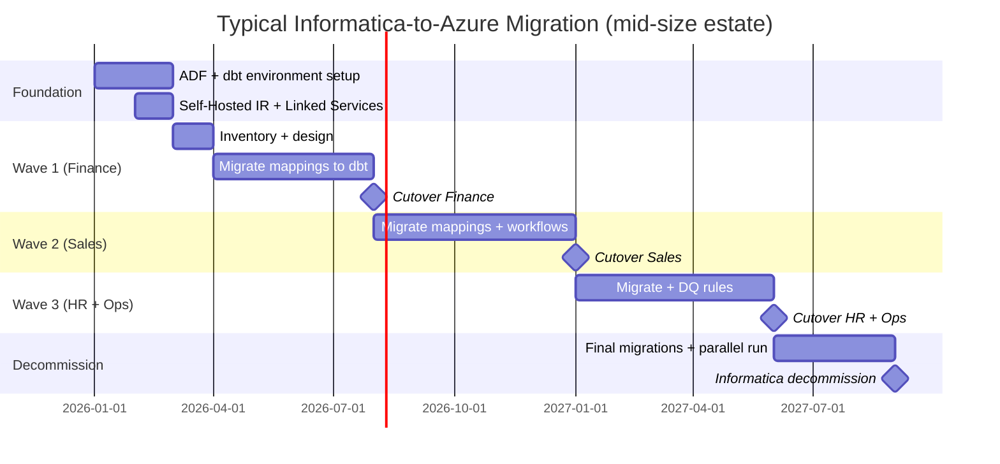

# Informatica to Azure Migration Center

**The definitive resource for migrating from Informatica PowerCenter, IICS, IDQ, MDM, and Enterprise Data Catalog to Microsoft Azure, dbt, and CSA-in-a-Box.**

---

## Who this is for

This migration center serves CDOs, Chief Data Architects, data engineering managers, ETL developers, and data quality analysts who are evaluating or executing a migration from any Informatica product to Azure-native services. Whether you are responding to a PowerCenter license renewal, a cloud-first mandate, or a desire to adopt modern code-first data engineering, these resources provide the evidence, patterns, and step-by-step guidance to execute confidently.

---

## Quick-start decision matrix

| Your situation | Start here |
|---|---|
| Executive evaluating Azure vs Informatica | [Why Azure over Informatica](why-azure-over-informatica.md) |
| Need cost justification for migration | [Total Cost of Ownership Analysis](tco-analysis.md) |
| Need a feature-by-feature comparison | [Complete Feature Mapping](feature-mapping-complete.md) |
| Running PowerCenter on-prem | [PowerCenter Migration Guide](powercenter-migration.md) |
| Running IICS (cloud) | [IICS Migration Guide](iics-migration.md) |
| Running IDQ / data quality | [Data Quality Migration Guide](data-quality-migration.md) |
| Running Informatica MDM | [MDM Migration Guide](mdm-migration.md) |
| Want hands-on tutorials | [Tutorials](#tutorials) |
| Need performance data | [Benchmarks](benchmarks.md) |
| Ready to plan migration | [Migration Playbook](../informatica.md) |

---

## Strategic resources

These documents provide the business case, cost analysis, and strategic framing for decision-makers.

| Document | Audience | Description |
|---|---|---|
| [Why Azure over Informatica](why-azure-over-informatica.md) | CIO / CDO / Board | Strategic comparison covering code-first vs GUI paradigm, cloud economics, modern data engineering, AI capabilities, and talent availability |
| [Total Cost of Ownership Analysis](tco-analysis.md) | CFO / CIO / Procurement | Detailed pricing model comparison: PowerCenter license + hardware vs ADF + dbt consumption, IICS subscription vs Fabric, 5-year projections |
| [Benchmarks & Performance](benchmarks.md) | CTO / Platform Engineering | ETL throughput, development velocity, cost-per-pipeline, maintenance overhead comparisons |

---

## Technical references

| Document | Description |
|---|---|
| [Complete Feature Mapping](feature-mapping-complete.md) | 35+ Informatica features mapped to Azure equivalents across PowerCenter, IICS, IDQ, MDM, Enterprise Data Catalog, and B2B |
| [Migration Playbook](../informatica.md) | The original end-to-end migration playbook with phase-by-phase guidance and pitfall avoidance |

---

## Migration guides

Product-specific deep dives covering every aspect of an Informatica-to-Azure migration.

| Guide | Informatica product | Azure destination |
|---|---|---|
| [PowerCenter Migration](powercenter-migration.md) | PowerCenter mappings, workflows, sessions, transformations | ADF (orchestration) + dbt (transformations) + Mapping Data Flows |
| [IICS Migration](iics-migration.md) | Cloud Data Integration, taskflows, connectors, monitoring | ADF / Fabric Data Pipelines + dbt |
| [Data Quality Migration](data-quality-migration.md) | IDQ profiles, scorecards, rules, standardization | Great Expectations + dbt tests + Purview |
| [MDM Migration](mdm-migration.md) | Match/merge, hierarchy management, entity resolution, stewardship | Purview + Azure SQL / Cosmos DB + Azure ML |
| [Best Practices](best-practices.md) | Cross-product | Complexity assessment, conversion priority, parallel-run validation, team retraining |

---

## Tutorials

Hands-on, step-by-step walkthroughs for common migration scenarios.

| Tutorial | Duration | What you'll build |
|---|---|---|
| [PowerCenter Mapping to dbt](tutorial-mapping-to-dbt.md) | 2-3 hours | Convert a complex PowerCenter mapping to a dbt SQL model with tests and documentation |
| [Informatica Workflow to ADF](tutorial-workflow-to-adf.md) | 2-3 hours | Rebuild an Informatica workflow as an ADF pipeline with dbt integration, scheduling, and error handling |

---

## How CSA-in-a-Box fits

CSA-in-a-Box is the **core migration destination** -- an Azure-native reference implementation providing Data Mesh, Data Fabric, and Data Lakehouse capabilities. It deploys a complete data platform with:

- **Infrastructure as Code** (Bicep across 4 Azure subscriptions)
- **Data governance** (Purview automation, classification taxonomies, data contracts)
- **Data engineering** (ADF pipelines, dbt models, Databricks/Fabric notebooks)
- **Analytics** (Power BI semantic models, Direct Lake, Copilot integration)
- **AI integration** (Azure OpenAI, AI Foundry, RAG patterns)
- **Data quality** (Great Expectations integration, dbt tests, Purview classification)

For Informatica migrations specifically, CSA-in-a-Box provides the landing zone architecture, dbt project structure, ADF pipeline templates, and Purview automation that replace the full Informatica suite.

---

## Migration timeline overview

---

## Related resources

- [Migrations -- Teradata](../teradata.md)
- [Migrations -- Hadoop / Hive](../hadoop-hive.md)
- [Migrations -- Snowflake](../snowflake.md)
- [ADR 0001 -- ADF + dbt over Airflow](../../adr/0001-adf-dbt-over-airflow.md)
- [ADR 0013 -- dbt as Canonical Transformation](../../adr/0013-dbt-as-canonical-transformation.md)
- [ADR 0006 -- Purview over Atlas](../../adr/0006-purview-over-atlas.md)
- [Best Practices -- Data Engineering](../../best-practices/data-engineering.md)

---

**Last updated:** 2026-04-30
**Maintainers:** CSA-in-a-Box core team
