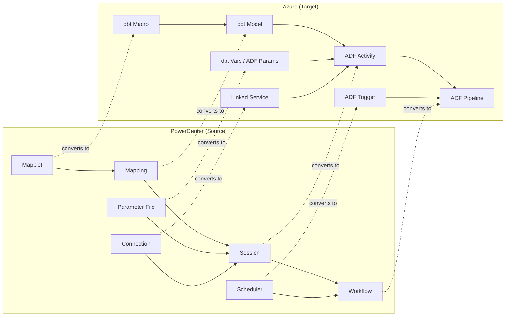

# PowerCenter Migration Guide: PowerCenter to ADF + dbt

**A comprehensive guide for migrating Informatica PowerCenter mappings, workflows, sessions, and transformations to Azure Data Factory and dbt.**

---

## Overview

PowerCenter is the workhorse of the Informatica portfolio. Enterprises typically have hundreds to thousands of mappings built over a decade or more, with complex interdependencies between workflows, sessions, and shared components. This guide provides a systematic approach to converting every PowerCenter concept to its Azure equivalent.

The target architecture is:

- **dbt** -- all transformations (SQL-first; replaces PowerCenter mappings)
- **ADF** -- orchestration and data movement (replaces PowerCenter workflows and sessions)
- **ADF Mapping Data Flows** -- visual transformations for analyst-facing flows (optional; for teams that need a GUI)

---

## Architecture mapping



---

## Transformation-by-transformation mapping

This is the definitive reference for converting every PowerCenter transformation to its dbt or ADF equivalent.

### Source/Target transformations

| PowerCenter transformation | Azure equivalent | Example |
|---|---|---|
| **Source Qualifier** | dbt `source()` reference + CTE | `WITH src AS (SELECT * FROM {{ source('erp', 'orders') }} WHERE order_date > '2024-01-01')` |
| **Target** | dbt materialization (table, view, incremental) | `{{ config(materialized='table') }}` |
| **Flat File Source** | ADF Copy Activity (Blob/ADLS source) | Copy from ADLS to staging table; dbt reads staging |
| **XML Source** | ADF Mapping Data Flow (XML connector) | Parse XML in MDF; output to staging table |
| **XML Generator** | ADF Mapping Data Flow (XML sink) | Generate XML in MDF sink |

### Row-level transformations

| PowerCenter transformation | Azure equivalent | dbt SQL pattern |
|---|---|---|
| **Expression** | dbt SELECT projection | `SELECT col_a, col_b * 1.1 AS col_b_adjusted, UPPER(col_c) AS col_c_clean FROM ...` |
| **Filter** | dbt WHERE clause | `SELECT * FROM {{ ref('stg_orders') }} WHERE status != 'cancelled'` |
| **Router** | Multiple dbt models with WHERE | Model 1: `WHERE region = 'east'`; Model 2: `WHERE region = 'west'`; each references same staging model |
| **Update Strategy** | dbt incremental materialization | `{{ config(materialized='incremental', unique_key='order_id') }}` with `` block |
| **Data Masking** | Azure SQL Dynamic Data Masking or dbt macro | `{{ mask_pii(column_name) }}` macro using `CASE WHEN` logic |

### Set-level transformations

| PowerCenter transformation | Azure equivalent | dbt SQL pattern |
|---|---|---|
| **Aggregator** | dbt GROUP BY | `SELECT customer_id, SUM(amount) AS total_amount, COUNT(*) AS order_count FROM ... GROUP BY customer_id` |
| **Sorter** | dbt ORDER BY | Generally unnecessary in intermediate models; use in final mart if needed |
| **Rank** | SQL window function | `ROW_NUMBER() OVER (PARTITION BY customer_id ORDER BY order_date DESC) AS rn` |
| **Normalizer** | SQL UNPIVOT or CROSS APPLY | `SELECT id, month, value FROM src UNPIVOT (value FOR month IN (jan, feb, mar))` |
| **Union** | dbt UNION ALL | `SELECT * FROM {{ ref('model_a') }} UNION ALL SELECT * FROM {{ ref('model_b') }}` |

### Lookup transformations

| PowerCenter transformation | Azure equivalent | dbt SQL pattern |
|---|---|---|
| **Lookup (connected, equality)** | dbt LEFT JOIN | `SELECT o.*, c.customer_name FROM orders o LEFT JOIN customers c ON o.customer_id = c.customer_id` |
| **Lookup (connected, range)** | dbt JOIN with range condition | `... ON o.order_date BETWEEN r.start_date AND r.end_date` |
| **Lookup (unconnected)** | dbt macro returning scalar | See [Unconnected Lookup Pattern](#unconnected-lookup-pattern) below |
| **Lookup (persistent cache)** | dbt ephemeral model or CTE | Ephemeral models compute once per dbt run, similar to persistent cache |
| **Joiner** | dbt JOIN (any type) | Supports INNER, LEFT, RIGHT, FULL, CROSS; dbt handles dialect differences |

### Key generation

| PowerCenter transformation | Azure equivalent | dbt SQL pattern |
|---|---|---|
| **Sequence Generator** | SQL ROW_NUMBER() | `ROW_NUMBER() OVER (ORDER BY (SELECT NULL)) + (SELECT MAX(sk) FROM target)` |
| **Surrogate key (hash)** | dbt-utils `generate_surrogate_key` | `{{ dbt_utils.generate_surrogate_key(['customer_id', 'product_id']) }}` |

### Advanced transformations

| PowerCenter transformation | Azure equivalent | Complexity | Notes |
|---|---|---|---|
| **Stored Procedure** | dbt pre/post-hook or `run_operation` | Low | `{{ config(pre_hook="EXEC sp_cleanup") }}` |
| **SQL Transformation** | dbt model (native) | Low | dbt IS SQL; simplest conversion |
| **Transaction Control** | ADF pipeline error handling | Medium | ADF handles commit/rollback at pipeline level |
| **Custom Transformation (Java)** | Azure Function or dbt Python model | High | Rewrite Java in Python or .NET; call from ADF |
| **HTTP Transformation** | ADF Web activity or REST connector | Medium | ADF REST connector handles auth, pagination |
| **Java Transformation** | Azure Function | High | Rewrite in Python/C#; expose as HTTP endpoint |
| **External Procedure** | Azure Function or dbt `run_operation` | Medium | Depends on what the procedure does |

### SCD and history

| PowerCenter transformation | Azure equivalent | dbt SQL pattern |
|---|---|---|
| **Slowly Changing Dimension Type 1** | dbt incremental with merge | `{{ config(materialized='incremental', unique_key='customer_id', incremental_strategy='merge') }}` |
| **Slowly Changing Dimension Type 2** | dbt snapshot | ` ... ` with `check_cols` or `updated_at` |
| **SCD Type 3** | dbt model with previous-value columns | Custom SQL maintaining `current_value`, `previous_value`, `change_date` |

---

## Unconnected lookup pattern

PowerCenter's unconnected lookup is a common pattern that has no single SQL equivalent. Here is the dbt macro pattern:

**PowerCenter:** `:LKP.LKP_GET_CUSTOMER_NAME(customer_id)`

**dbt macro** (`macros/lkp_get_customer_name.sql`):

```sql

(
    SELECT customer_name
    FROM {{ ref('dim_customer') }}
    WHERE customer_id = {{ customer_id_column }}
    LIMIT 1
)

```

**Usage in dbt model:**

```sql
SELECT
    order_id,
    customer_id,
    {{ lkp_get_customer_name('customer_id') }} AS customer_name,
    order_amount
FROM {{ ref('stg_orders') }}
```

**Performance note:** Correlated subqueries can be slow on large datasets. For production, prefer explicit JOINs. Use the macro pattern only when the lookup is optional or the cardinality is low.

---

## Workflow to ADF pipeline mapping

### Workflow components

| PowerCenter component | ADF equivalent | Notes |
|---|---|---|
| Workflow | Pipeline | Top-level orchestration unit |
| Session (mapping execution) | Activity (dbt run, Copy Data, Notebook) | One session = one or more activities |
| Worklet | Sub-pipeline (Execute Pipeline activity) | Nested pipeline for reuse |
| Decision (link condition) | If Condition activity / Switch activity | Conditional branching |
| Email task | Web activity -> Logic Apps | Logic Apps sends to Teams, email, Slack |
| Command task | Web activity or Azure Function activity | Shell command equivalent |
| Event Wait | Event trigger or Storage Events trigger | Wait for file arrival |
| Timer | Wait activity | Configurable delay |
| Assignment (variable) | Set Variable activity | Set pipeline variables |
| Pre-session SQL | dbt pre-hook | `{{ config(pre_hook="TRUNCATE TABLE staging.target") }}` |
| Post-session SQL | dbt post-hook | `{{ config(post_hook="EXEC sp_update_watermark") }}` |
| Session recovery | ADF rerun from failure | ADF tracks activity-level completion |

### Scheduling migration

| PowerCenter scheduler | ADF trigger type | When to use |
|---|---|---|
| Time-based schedule | Schedule trigger | Fixed time (daily, hourly, custom cron) |
| Recurring schedule | Tumbling window trigger | Fixed-interval processing with backfill support |
| Event-based (file arrival) | Storage Events trigger / Custom Events trigger | React to new files in ADLS/Blob |
| On-demand | Manual trigger / REST API | Ad-hoc execution via Portal or API |
| Dependency-based | Pipeline dependency (After success/failure) | Chain pipelines with activity dependencies |

### Connection mapping

| PowerCenter connection | ADF Linked Service | Integration Runtime |
|---|---|---|
| Oracle (on-prem) | Oracle connector | Self-Hosted IR |
| SQL Server (on-prem) | SQL Server connector | Self-Hosted IR |
| SQL Server (Azure) | Azure SQL Database connector | Azure IR (no IR needed) |
| DB2 (on-prem) | DB2 connector | Self-Hosted IR |
| Teradata | Teradata connector | Self-Hosted IR |
| SAP (ABAP, HANA) | SAP Table / SAP CDC / SAP HANA | Self-Hosted IR |
| Salesforce | Salesforce connector | Azure IR |
| Oracle (Azure) | Azure Database for PostgreSQL (migrated) or Oracle via IR | Depends on migration status |
| Flat file (local) | ADLS / Blob Storage (upload first) | Azure IR after upload |
| Flat file (FTP/SFTP) | FTP / SFTP connector | Azure IR or Self-Hosted IR |
| S3 | Amazon S3 connector | Azure IR |
| GCS | Google Cloud Storage connector | Azure IR |
| REST/SOAP API | REST connector / HTTP connector | Azure IR |
| ODBC (generic) | ODBC connector | Self-Hosted IR |

---

## Worked example: complex PowerCenter mapping to dbt

### PowerCenter mapping: `m_CUSTOMER_DIMENSION`

This mapping loads a customer dimension using SCD Type 2 with these transformations:

1. **Source Qualifier (SQ_CUSTOMER)** -- reads from `CRM.CUSTOMER` with filter on `MODIFIED_DATE`
2. **Expression (EXP_DERIVE)** -- derives `FULL_NAME`, `EMAIL_DOMAIN`, `IS_ACTIVE` flag
3. **Lookup (LKP_REGION)** -- connected lookup to `REF.REGION` on `REGION_CODE`
4. **Lookup (LKP_EXISTING)** -- connected lookup to `DW.DIM_CUSTOMER` on `CUSTOMER_ID` (for SCD detection)
5. **Router (RTR_SCD)** -- routes to INSERT group (new customers) and UPDATE group (changed customers)
6. **Update Strategy (UPD_EXPIRE)** -- marks existing records as expired (SCD Type 2 close)
7. **Target (DIM_CUSTOMER)** -- inserts new/updated records

### dbt equivalent

**Step 1: Staging model** (`models/staging/crm/stg_crm__customers.sql`):

```sql
WITH source AS (
    SELECT *
    FROM {{ source('crm', 'customer') }}
    WHERE modified_date > COALESCE(
        (SELECT MAX(dbt_updated_at) FROM {{ this }}),
        '1900-01-01'
    )
)

SELECT
    customer_id,
    first_name,
    last_name,
    CONCAT(first_name, ' ', last_name) AS full_name,
    email,
    SUBSTRING(email, CHARINDEX('@', email) + 1, LEN(email)) AS email_domain,
    CASE WHEN status = 'A' THEN TRUE ELSE FALSE END AS is_active,
    region_code,
    modified_date
FROM source
```

**Step 2: Intermediate model with lookup** (`models/intermediate/int_customers__enriched.sql`):

```sql
SELECT
    c.customer_id,
    c.full_name,
    c.email,
    c.email_domain,
    c.is_active,
    r.region_name,
    r.region_group,
    c.modified_date
FROM {{ ref('stg_crm__customers') }} c
LEFT JOIN {{ ref('stg_ref__regions') }} r
    ON c.region_code = r.region_code
```

**Step 3: Snapshot for SCD Type 2** (`snapshots/snap_dim_customer.sql`):

```sql


{{
    config(
        target_schema='dw',
        unique_key='customer_id',
        strategy='check',
        check_cols=['full_name', 'email', 'is_active', 'region_name']
    )
}}

SELECT * FROM {{ ref('int_customers__enriched') }}


```

**Step 4: Tests** (`models/staging/crm/_crm__models.yml`):

```yaml
version: 2

models:
  - name: stg_crm__customers
    columns:
      - name: customer_id
        tests:
          - unique
          - not_null
      - name: email
        tests:
          - not_null
      - name: is_active
        tests:
          - accepted_values:
              values: [true, false]
```

### Key differences from PowerCenter

| Aspect | PowerCenter | dbt |
|---|---|---|
| SCD Type 2 | Manual Router + Update Strategy | `dbt snapshot` (built-in) |
| Lookup | Separate transformation in mapping | SQL JOIN in model |
| Expression | Separate transformation | SQL in SELECT clause |
| Testing | Manual QA | `dbt test` (automated) |
| Deployment | Repository export | `git push` + CI/CD |
| Documentation | Separate wiki | Auto-generated from YAML |

---

## Migration execution process

### Step 1: Inventory and categorize (Week 1-2)

Export the PowerCenter repository metadata:

```sql
-- Query PowerCenter repository for mapping inventory
SELECT
    m.MAPPING_NAME,
    m.DESCRIPTION,
    COUNT(DISTINCT t.TRANSFORMATION_NAME) AS transformation_count,
    w.WORKFLOW_NAME,
    s.SESSION_NAME
FROM REP_MAPPINGS m
JOIN REP_WIDGET_INST t ON m.MAPPING_ID = t.MAPPING_ID
LEFT JOIN REP_SESS_WIDGET_INST sw ON m.MAPPING_ID = sw.MAPPING_ID
LEFT JOIN REP_SESSIONS s ON sw.SESSION_ID = s.SESSION_ID
LEFT JOIN REP_WORKFLOWS w ON s.WORKFLOW_ID = w.WORKFLOW_ID
GROUP BY m.MAPPING_NAME, m.DESCRIPTION, w.WORKFLOW_NAME, s.SESSION_NAME
ORDER BY transformation_count DESC;
```

Categorize each mapping:

| Tier | Transformation count | Estimated effort | Action |
|---|---|---|---|
| A (Simple) | 1-5 transformations | 1-2 days | Direct convert to dbt model |
| B (Medium) | 6-15 transformations | 3-5 days | Decompose into multiple dbt models |
| C (Complex) | 16+ transformations | 5-15 days | Re-architect; may need multiple models + macros |
| D (Decommission) | Any | 0 | Archive metadata; do not migrate |

### Step 2: Set up dbt project (Week 2-3)

```
dbt_project/
├── dbt_project.yml
├── models/
│   ├── staging/          # 1:1 with source tables
│   │   ├── crm/
│   │   ├── erp/
│   │   └── ref/
│   ├── intermediate/     # Business logic (joins, enrichment)
│   └── marts/            # Final dimensional models
├── macros/               # Reusable logic (replaces mapplets)
├── snapshots/            # SCD Type 2 (replaces SCD mappings)
├── seeds/                # Reference data (replaces flat file lookups)
└── tests/                # Custom data tests (replaces IDQ rules)
```

### Step 3: Convert mappings by wave (Weeks 3-36)

For each wave (business domain):

1. Convert Source Qualifiers to dbt `source()` definitions
2. Convert simple transformations (Expression, Filter, Lookup) to dbt SQL
3. Convert complex transformations (Router, SCD) using patterns above
4. Convert workflows to ADF pipelines
5. Implement dbt tests for every critical data quality assertion
6. Run parallel with PowerCenter for 14+ days
7. Cut over downstream consumers

### Step 4: Validate and decommission (per wave)

- Daily reconciliation: row counts + key metric values (sum of amounts, distinct counts)
- Downstream consumer repoint
- PowerCenter workflows paused (not deleted until 30-day stable period)
- After 30 days stable, archive PowerCenter metadata to Purview and decommission

---

## Common conversion challenges

### Challenge 1: Mappings with 50+ transformations

**Problem:** PowerCenter allows arbitrarily complex mappings with dozens of transformations chained together.

**Solution:** Decompose into multiple dbt models following the staging/intermediate/marts pattern. Each model should do one thing. A 50-transformation mapping typically becomes 5-10 dbt models.

### Challenge 2: Reusable mapplets used across 100+ mappings

**Problem:** A shared mapplet change in PowerCenter affects all mappings instantly. In dbt, shared logic lives in macros, and changes require re-running downstream models.

**Solution:** Convert mapplets to dbt macros. Use `dbt run --select tag:uses_customer_macro` to re-run affected models after macro changes. dbt's `ref()` graph ensures correct execution order.

### Challenge 3: Session-level overrides

**Problem:** PowerCenter sessions can override mapping-level properties (target table name, connection, SQL override). Different sessions using the same mapping may produce different results.

**Solution:** Use dbt's `{{ config() }}` block with environment-specific variables. Or create separate dbt models per session variant if the logic diverges significantly.

### Challenge 4: Pre/post-session SQL

**Problem:** Sessions often run SQL before (truncate target, disable indexes) and after (rebuild indexes, update watermarks) the mapping.

**Solution:** Use dbt pre-hooks and post-hooks:

```sql
{{ config(
    materialized='table',
    pre_hook="TRUNCATE TABLE {{ this }}",
    post_hook="UPDATE watermarks SET last_run = GETDATE() WHERE table_name = '{{ this.name }}'"
) }}
```

### Challenge 5: High-volume data movement

**Problem:** Some PowerCenter sessions move large data volumes (100M+ rows) with optimized bulk load.

**Solution:** Use ADF Copy Activity for data movement (it is optimized for bulk). dbt handles transformations after data lands. The pattern is: ADF copies raw data to staging, dbt transforms staging to marts.

---

## Related resources

- [Tutorial: Mapping to dbt](tutorial-mapping-to-dbt.md) -- Hands-on walkthrough
- [Tutorial: Workflow to ADF](tutorial-workflow-to-adf.md) -- Hands-on walkthrough
- [Complete Feature Mapping](feature-mapping-complete.md) -- All features mapped
- [IICS Migration Guide](iics-migration.md) -- For cloud-based Informatica
- [Best Practices](best-practices.md) -- Migration execution guidance
- [Migration Playbook](../informatica.md) -- End-to-end migration guide

---

**Last updated:** 2026-04-30
**Maintainers:** CSA-in-a-Box core team
