# Total Cost of Ownership: Informatica vs Azure

**A detailed financial analysis for CFOs, CIOs, and procurement teams evaluating the economics of Informatica-to-Azure migration.**

---

## Executive summary

Informatica's pricing model is built on per-core licensing (PowerCenter, IDQ, MDM) and per-IPU subscriptions (IICS). These costs are fixed regardless of utilization, creating a floor that does not scale down during low-demand periods. Azure's consumption-based model (ADF, Fabric, Purview) and open-source tools (dbt Core, Great Expectations) fundamentally change the cost structure, delivering **60-85% cost reductions** for typical enterprise deployments.

This analysis models three representative scenarios: a mid-size enterprise, a large enterprise, and an IICS-only cloud deployment. All figures are annual unless stated otherwise.

---

## Scenario 1: Mid-size enterprise (PowerCenter + IDQ)

### Current Informatica costs

**Profile:** 200 mappings, 50 workflows, 3 PowerCenter servers (16 cores each), IDQ for data quality, 10-person data team.

| Cost category | Annual cost | Notes |
|---|---|---|
| PowerCenter license (48 cores) | $480,000 | ~$10K/core average including volume discount |
| PowerCenter maintenance (22%) | $105,600 | Annual support and version updates |
| IDQ license (16 cores) | $160,000 | ~$10K/core for data quality |
| IDQ maintenance (22%) | $35,200 | Annual support |
| PowerCenter servers (3x on-prem) | $60,000 | Hardware amortization + hosting |
| Repository database (Oracle) | $40,000 | Oracle license share for PC repository |
| Storage (SAN/NAS) | $25,000 | Source/target staging areas |
| Network infrastructure | $15,000 | VPN, firewall rules, load balancers |
| Admin team (2 FTEs) | $280,000 | PowerCenter admin + DBA (partial) |
| Informatica consulting (break-fix) | $50,000 | Annual retainer for complex issues |
| **Total annual cost** | **$1,250,800** | |

### Azure replacement costs

| Cost category | Annual cost | Notes |
|---|---|---|
| ADF pipeline activity runs | $18,000 | ~200 pipelines, 4 runs/day average |
| ADF Data Integration Units | $24,000 | Data movement compute |
| ADF Self-Hosted IR (2 VMs) | $14,400 | D4s_v5 VMs for on-prem connectivity |
| dbt Cloud (Team, 10 seats) | $12,000 | $100/seat/month |
| Azure SQL (target warehouse) | $36,000 | S4 tier; adjust for workload |
| ADLS Gen2 storage | $6,000 | Staging and raw zones |
| Purview (governance) | $18,000 | Scanning + classification |
| Great Expectations (open source) | $0 | Self-hosted on existing compute |
| Azure Monitor + Log Analytics | $6,000 | Operational monitoring |
| Azure DevOps / GitHub (CI/CD) | $3,600 | 10 seats; pipeline minutes |
| Migration cost (one-time, amortized) | $80,000 | 12-month migration, amortized over 3 years |
| **Total annual cost** | **$218,000** | |

### Savings

| Metric | Value |
|---|---|
| Annual savings | $1,032,800 |
| Percentage reduction | 82.6% |
| 3-year savings (net of migration) | $2,858,400 |
| 5-year savings (net of migration) | $4,924,000 |

---

## Scenario 2: Large enterprise (PowerCenter + IDQ + MDM + EDC)

### Current Informatica costs

**Profile:** 800 mappings, 200 workflows, 8 PowerCenter servers (16 cores each), IDQ, MDM Hub, Enterprise Data Catalog, 30-person data team.

| Cost category | Annual cost | Notes |
|---|---|---|
| PowerCenter license (128 cores) | $1,024,000 | Volume discount at scale |
| PowerCenter maintenance (22%) | $225,280 | |
| IDQ license (32 cores) | $320,000 | |
| IDQ maintenance (22%) | $70,400 | |
| MDM license (32 cores) | $480,000 | MDM carries highest per-core rate |
| MDM maintenance (22%) | $105,600 | |
| Enterprise Data Catalog | $180,000 | Per-core licensing |
| EDC maintenance (22%) | $39,600 | |
| Infrastructure (servers, storage, DR) | $200,000 | 8 production + 4 DR servers |
| Repository database (Oracle RAC) | $120,000 | Oracle license share |
| Admin team (4 FTEs) | $560,000 | PowerCenter admin, DBA, MDM admin, EDC admin |
| Informatica professional services | $150,000 | Annual consulting for upgrades and complex issues |
| **Total annual cost** | **$3,474,880** | |

### Azure replacement costs

| Cost category | Annual cost | Notes |
|---|---|---|
| ADF pipeline activity runs | $60,000 | ~800 pipelines, varying frequency |
| ADF Data Integration Units | $72,000 | High data movement volume |
| ADF Self-Hosted IR (4 VMs) | $28,800 | D4s_v5 VMs |
| dbt Cloud (Business, 30 seats) | $72,000 | $200/seat/month for Business tier |
| Azure SQL / Synapse (warehouse) | $120,000 | Dedicated SQL pool for heavy workloads |
| ADLS Gen2 storage | $18,000 | Multiple zones, larger volumes |
| Purview (governance) | $48,000 | Replaces EDC + partial MDM governance |
| Azure ML (entity resolution) | $24,000 | Replaces MDM match/merge for core use cases |
| Azure SQL (mastering) | $24,000 | Master data store (replaces MDM Hub) |
| Profisee MDM (if needed) | $100,000 | Optional; only for complex MDM workloads |
| Great Expectations | $0 | Open source |
| Azure Monitor + Log Analytics | $12,000 | |
| Azure DevOps / GitHub | $10,800 | 30 seats |
| Migration cost (one-time, amortized) | $200,000 | 24-month migration, amortized over 5 years |
| **Total annual cost** | **$589,600** | Without Profisee |
| **Total annual cost** | **$689,600** | With Profisee for complex MDM |

### Savings

| Metric | Without Profisee | With Profisee |
|---|---|---|
| Annual savings | $2,885,280 | $2,785,280 |
| Percentage reduction | 83.0% | 80.2% |
| 3-year savings (net of migration) | $7,655,840 | $7,355,840 |
| 5-year savings (net of migration) | $13,426,400 | $12,926,400 |

---

## Scenario 3: IICS-only cloud deployment

### Current Informatica costs

**Profile:** 150 Cloud Data Integration tasks, 30 taskflows, IICS subscription with 200,000 IPU/month, 8-person data team.

| Cost category | Annual cost | Notes |
|---|---|---|
| IICS subscription (200K IPU/month) | $600,000 | IPU-based pricing; rates vary by contract |
| IICS additional connectors | $50,000 | Premium connector packs |
| IICS CDI Advanced features | $80,000 | Pushdown optimization, advanced transformations |
| Secure Agent VMs (3) | $36,000 | On-prem or cloud VMs for Secure Agent runtime |
| **Total annual cost** | **$766,000** | |

### Azure replacement costs (Fabric Data Pipelines + dbt)

| Cost category | Annual cost | Notes |
|---|---|---|
| Fabric capacity (F8) | $48,000 | $4,000/month; includes Data Pipelines |
| dbt Cloud (Team, 8 seats) | $9,600 | $100/seat/month |
| Fabric storage (OneLake) | $3,600 | Consumption-based |
| Purview (governance) | $12,000 | |
| Azure DevOps / GitHub | $2,880 | 8 seats |
| Migration cost (one-time, amortized) | $40,000 | 9-month migration, amortized over 3 years |
| **Total annual cost** | **$116,080** | |

### Savings

| Metric | Value |
|---|---|
| Annual savings | $649,920 |
| Percentage reduction | 84.8% |
| 3-year savings (net of migration) | $1,829,760 |
| 5-year savings (net of migration) | $3,129,600 |

---

## 5-year projection comparison

```mermaid
xychart-beta
    title "5-Year Cumulative Cost Comparison (Mid-Size Enterprise)"
    x-axis ["Year 1", "Year 2", "Year 3", "Year 4", "Year 5"]
    y-axis "Cumulative Cost ($M)" 0 --> 7
    bar [1.25, 2.50, 3.75, 5.00, 6.25]
    bar [0.46, 0.68, 0.90, 1.12, 1.34]
```

_First bar: Informatica (steady-state). Second bar: Azure (includes migration cost in Year 1)._

---

## Hidden costs often missed in Informatica TCO

### 1. Upgrade lock-in

PowerCenter major version upgrades (e.g., 9.x to 10.x) require dedicated projects, often costing $100K-$300K in professional services. Organizations frequently delay upgrades for years, accumulating technical debt and running on unsupported versions.

### 2. Repository bloat

PowerCenter repositories grow over time as mappings, sessions, and workflows accumulate. Repository performance degrades, requiring Oracle tuning, archive projects, and eventually repository rebuilds.

### 3. License true-ups

Informatica audits can result in true-up charges if actual core usage exceeds licensed cores. Virtualized environments and cloud-hosted PowerCenter instances are common audit triggers.

### 4. Talent premium

As the PowerCenter talent pool shrinks, contractors command premium rates. A senior PowerCenter developer costs $150-$200/hour on the contract market, compared to $100-$150/hour for equivalent dbt/ADF skills.

### 5. Opportunity cost

Every dollar spent on Informatica licensing is a dollar not spent on AI, advanced analytics, or modern data products. The opportunity cost compounds over time as competitors adopt modern stacks.

---

## Cost drivers and sensitivities

### What makes Azure cheaper

| Driver | Impact | Notes |
|---|---|---|
| No per-core licensing | High | Eliminates the single largest cost line |
| Open-source transformations (dbt Core) | Medium | $0 for transformation engine |
| Serverless compute (ADF) | Medium | Pay only during execution |
| Unified governance (Purview) | Medium | Replaces 3-4 separate Informatica products |
| No infrastructure management | Medium | Eliminates admin team overhead |

### What could increase Azure costs

| Driver | Impact | Mitigation |
|---|---|---|
| High data movement volumes | Medium | Use Fabric Direct Lake to avoid data copies |
| Complex MDM replacement (Profisee) | Medium | Evaluate whether full MDM is needed |
| Premium connectors (SAP, mainframe) | Low | Self-Hosted IR covers most scenarios |
| dbt Cloud Business tier (at scale) | Low | dbt Core is free; Cloud is optional |
| Extended migration timeline | Medium | Parallel licensing during migration |

---

## Parallel-run cost during migration

During migration, organizations run both platforms simultaneously. This is a real cost that must be planned for:

| Phase | Duration | Additional cost | Notes |
|---|---|---|---|
| Foundation setup | 2-3 months | Azure cost only (~$20K) | Informatica continues unchanged |
| Wave 1 (pilot) | 3-4 months | Both platforms (~$300K/quarter) | Most Informatica workflows still running |
| Wave 2-3 (bulk) | 6-12 months | Both platforms, Informatica declining | Decommission Informatica components progressively |
| Final cutover | 2-3 months | Informatica minimal, Azure full | Only residual Informatica workflows |
| Post-migration | Ongoing | Azure only | Informatica fully decommissioned |

**Planning tip:** Negotiate Informatica license terms before starting migration. Some organizations secure short-term renewals (12-18 months) at reduced rates specifically to cover the parallel-run period.

---

## FinOps recommendations

### Before migration

1. **Inventory actual usage.** Many PowerCenter estates have 20-30% idle workflows. Identify and decommission them before migration to reduce scope
2. **Negotiate Informatica terms.** Short-term renewal at reduced rate covers the parallel period
3. **Right-size target architecture.** Don't over-provision Azure resources; start small and scale

### During migration

1. **Track cost per pipeline.** Compare Informatica cost-per-workflow to Azure cost-per-pipeline
2. **Use reserved instances** for Self-Hosted IR VMs and Azure SQL (if long-term commitment is clear)
3. **Monitor ADF DIU consumption** and optimize data movement patterns

### After migration

1. **Implement Azure Cost Management budgets** with alerts at 80% and 100% thresholds
2. **Review monthly spend** against projections; adjust capacity reservations
3. **Adopt Fabric capacity pause/resume** for non-production workloads
4. **Use dbt Core** instead of dbt Cloud for cost-sensitive deployments

---

## Comparison with alternative migration targets

| Alternative | Estimated annual cost | Pros | Cons |
|---|---|---|---|
| Stay on Informatica | $1M-$3.5M | No migration risk | Rising costs, shrinking talent |
| Migrate to Talend | $200K-$600K | Open-core; familiar GUI | Qlik acquisition uncertainty; still GUI-first |
| Migrate to Matillion | $150K-$400K | Cloud-native; visual SQL | Limited to cloud warehouses; no governance |
| Migrate to Azure + dbt | $80K-$700K | Open standards; unified platform | Requires SQL skills; paradigm shift |
| Migrate to Databricks + dbt | $200K-$800K | Powerful compute; open source | Higher compute cost; less Azure-native governance |

Azure + dbt offers the best combination of cost, capability, and ecosystem integration for organizations already invested in the Microsoft ecosystem.

---

## Related resources

- [Why Azure over Informatica](why-azure-over-informatica.md) -- Strategic comparison
- [Complete Feature Mapping](feature-mapping-complete.md) -- Feature-by-feature equivalents
- [Benchmarks & Performance](benchmarks.md) -- Throughput and velocity comparisons
- [PowerCenter Migration Guide](powercenter-migration.md) -- Detailed migration steps
- [Best Practices](best-practices.md) -- Migration execution guidance

---

**Methodology note:** Informatica costs are based on published list pricing with typical enterprise discount (30-40%). Actual costs vary by contract, region, and negotiation. Azure costs are based on published pay-as-you-go pricing with reserved instance discounts where applicable. All figures in USD.

**Last updated:** 2026-04-30
**Maintainers:** CSA-in-a-Box core team
