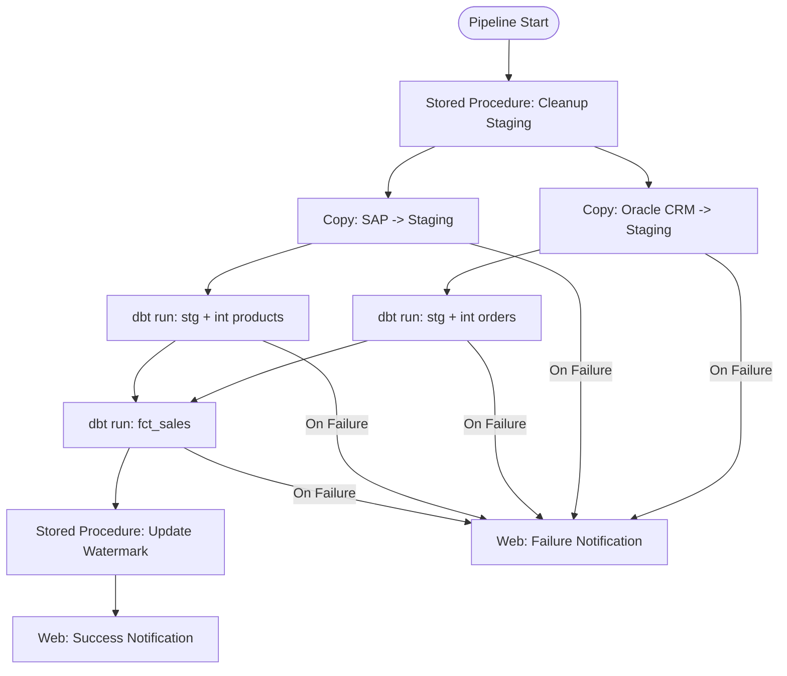

# Tutorial: Rebuild an Informatica Workflow as an ADF Pipeline

**A step-by-step walkthrough for converting an Informatica PowerCenter workflow to an Azure Data Factory pipeline with dbt integration, scheduling, and error handling.**

---

## Prerequisites

- Azure subscription with Azure Data Factory provisioned
- dbt project configured (see [Tutorial: Mapping to dbt](tutorial-mapping-to-dbt.md))
- Azure Key Vault for secrets
- Basic familiarity with ADF portal or Bicep/ARM templates
- Access to your PowerCenter Workflow Manager (for workflow export)

**Estimated time:** 2-3 hours

---

## What you will build

By the end of this tutorial, you will have:

1. Analyzed a PowerCenter workflow's structure and dependencies
2. Created an equivalent ADF pipeline with activities for data movement and dbt execution
3. Implemented error handling and retry logic
4. Configured scheduling via ADF triggers
5. Set up monitoring and alerting

---

## Step 1: Analyze the PowerCenter workflow (20 min)

### Our example workflow: `wf_DAILY_SALES_LOAD`

This workflow runs daily at 6:00 AM and loads the sales data warehouse:

```
START
  |
  v
cmd_CLEANUP (Command Task)
  -> Truncates staging tables
  |
  v
s_EXTRACT_ORDERS (Session - mapping m_EXTRACT_ORDERS)
  -> Extracts orders from Oracle CRM to staging
  |
  v
s_EXTRACT_PRODUCTS (Session - mapping m_EXTRACT_PRODUCTS)
  -> Extracts products from SAP to staging
  |                                    |
  v (parallel)                         v (parallel)
s_TRANSFORM_ORDERS                  s_TRANSFORM_PRODUCTS
  -> Transforms orders               -> Transforms products
  |                                    |
  v                                    v
  +-------- DECISION: both succeed? --------+
  |                                          |
  v (success)                                v (failure)
s_LOAD_FACT_SALES                          email_FAILURE
  -> Loads fact table                        -> Sends failure email
  |
  v
email_SUCCESS
  -> Sends success email with row counts
  |
  v
END
```

### Workflow metadata to capture

| Component        | Value                                                                                 | Notes                              |
| ---------------- | ------------------------------------------------------------------------------------- | ---------------------------------- |
| Workflow name    | `wf_DAILY_SALES_LOAD`                                                                 |                                    |
| Schedule         | Daily 6:00 AM EST                                                                     | Cron-like schedule                 |
| Sessions         | 4 (extract orders, extract products, transform orders, transform products, load fact) |                                    |
| Parallelism      | s_TRANSFORM_ORDERS and s_TRANSFORM_PRODUCTS run in parallel                           |                                    |
| Error handling   | Email on failure; abort workflow                                                      |                                    |
| Parameters       | `$$START_DATE`, `$$END_DATE`                                                          | Date range for incremental extract |
| Connections      | Oracle CRM, SAP, SQL Server DW                                                        | 3 source/target connections        |
| Pre-session SQL  | `TRUNCATE TABLE staging.orders; TRUNCATE TABLE staging.products;`                     | Cleanup before extract             |
| Post-session SQL | `UPDATE control.watermark SET last_run = GETDATE()`                                   | Update watermark after load        |

---

## Step 2: Create ADF Linked Services (20 min)

Replace PowerCenter connection objects with ADF Linked Services.

### Oracle CRM (Self-Hosted IR)

```json
{
    "name": "ls_oracle_crm",
    "type": "Microsoft.DataFactory/factories/linkedservices",
    "properties": {
        "type": "Oracle",
        "typeProperties": {
            "connectionString": {
                "type": "AzureKeyVaultSecret",
                "store": {
                    "referenceName": "ls_keyvault",
                    "type": "LinkedServiceReference"
                },
                "secretName": "oracle-crm-connection-string"
            }
        },
        "connectVia": {
            "referenceName": "ir_self_hosted",
            "type": "IntegrationRuntimeReference"
        }
    }
}
```

### Azure SQL (target warehouse)

```json
{
    "name": "ls_azure_sql_dw",
    "type": "Microsoft.DataFactory/factories/linkedservices",
    "properties": {
        "type": "AzureSqlDatabase",
        "typeProperties": {
            "connectionString": {
                "type": "AzureKeyVaultSecret",
                "store": {
                    "referenceName": "ls_keyvault",
                    "type": "LinkedServiceReference"
                },
                "secretName": "azure-sql-dw-connection-string"
            }
        }
    }
}
```

### SAP (Self-Hosted IR)

```json
{
    "name": "ls_sap",
    "type": "Microsoft.DataFactory/factories/linkedservices",
    "properties": {
        "type": "SapTable",
        "typeProperties": {
            "server": {
                "type": "AzureKeyVaultSecret",
                "store": {
                    "referenceName": "ls_keyvault",
                    "type": "LinkedServiceReference"
                },
                "secretName": "sap-server"
            },
            "userName": {
                "type": "AzureKeyVaultSecret",
                "store": {
                    "referenceName": "ls_keyvault",
                    "type": "LinkedServiceReference"
                },
                "secretName": "sap-username"
            },
            "password": {
                "type": "AzureKeyVaultSecret",
                "store": {
                    "referenceName": "ls_keyvault",
                    "type": "LinkedServiceReference"
                },
                "secretName": "sap-password"
            }
        },
        "connectVia": {
            "referenceName": "ir_self_hosted",
            "type": "IntegrationRuntimeReference"
        }
    }
}
```

---

## Step 3: Create the ADF pipeline (40 min)

### Pipeline architecture



### Pipeline definition

```json
{
    "name": "pl_daily_sales_load",
    "properties": {
        "description": "Daily sales load pipeline. Replaces PowerCenter workflow wf_DAILY_SALES_LOAD.",
        "activities": [
            {
                "name": "Cleanup_Staging",
                "description": "Replaces cmd_CLEANUP command task",
                "type": "SqlServerStoredProcedure",
                "dependsOn": [],
                "policy": {
                    "timeout": "0.00:05:00",
                    "retry": 1,
                    "retryIntervalInSeconds": 30
                },
                "typeProperties": {
                    "storedProcedureName": "staging.sp_cleanup_daily_sales",
                    "storedProcedureParameters": {}
                },
                "linkedServiceName": {
                    "referenceName": "ls_azure_sql_dw",
                    "type": "LinkedServiceReference"
                }
            },
            {
                "name": "Extract_Orders_from_CRM",
                "description": "Replaces s_EXTRACT_ORDERS session",
                "type": "Copy",
                "dependsOn": [
                    {
                        "activity": "Cleanup_Staging",
                        "dependencyConditions": ["Succeeded"]
                    }
                ],
                "policy": {
                    "timeout": "0.01:00:00",
                    "retry": 2,
                    "retryIntervalInSeconds": 60
                },
                "typeProperties": {
                    "source": {
                        "type": "OracleSource",
                        "oracleReaderQuery": {
                            "value": "SELECT order_id, customer_id, product_id, order_date, order_amount, currency_code, region_code, order_status FROM CRM.ORDERS WHERE order_date >= TO_DATE('@{pipeline().parameters.start_date}', 'YYYY-MM-DD')",
                            "type": "Expression"
                        }
                    },
                    "sink": {
                        "type": "AzureSqlSink",
                        "preCopyScript": "TRUNCATE TABLE staging.orders",
                        "writeBehavior": "insert",
                        "sqlWriterUseTableLock": true,
                        "tableOption": "autoCreate"
                    },
                    "enableStaging": false,
                    "parallelCopies": 4
                },
                "inputs": [
                    {
                        "referenceName": "ds_oracle_crm_orders",
                        "type": "DatasetReference"
                    }
                ],
                "outputs": [
                    {
                        "referenceName": "ds_azure_sql_staging_orders",
                        "type": "DatasetReference"
                    }
                ]
            },
            {
                "name": "Extract_Products_from_SAP",
                "description": "Replaces s_EXTRACT_PRODUCTS session",
                "type": "Copy",
                "dependsOn": [
                    {
                        "activity": "Cleanup_Staging",
                        "dependencyConditions": ["Succeeded"]
                    }
                ],
                "policy": {
                    "timeout": "0.01:00:00",
                    "retry": 2,
                    "retryIntervalInSeconds": 60
                },
                "typeProperties": {
                    "source": {
                        "type": "SapTableSource",
                        "rfcTableFields": "MATNR,MAKTX,MTART,MATKL",
                        "rfcTableOptions": {
                            "value": "LAEDA >= '@{pipeline().parameters.start_date}'",
                            "type": "Expression"
                        }
                    },
                    "sink": {
                        "type": "AzureSqlSink",
                        "preCopyScript": "TRUNCATE TABLE staging.products",
                        "writeBehavior": "insert"
                    }
                },
                "inputs": [
                    {
                        "referenceName": "ds_sap_mara",
                        "type": "DatasetReference"
                    }
                ],
                "outputs": [
                    {
                        "referenceName": "ds_azure_sql_staging_products",
                        "type": "DatasetReference"
                    }
                ]
            },
            {
                "name": "Transform_Orders_dbt",
                "description": "Replaces s_TRANSFORM_ORDERS session. Runs dbt staging + intermediate models.",
                "type": "WebActivity",
                "dependsOn": [
                    {
                        "activity": "Extract_Orders_from_CRM",
                        "dependencyConditions": ["Succeeded"]
                    }
                ],
                "policy": {
                    "timeout": "0.00:30:00",
                    "retry": 1,
                    "retryIntervalInSeconds": 60
                },
                "typeProperties": {
                    "url": "https://cloud.getdbt.com/api/v2/accounts/{account_id}/jobs/{orders_job_id}/run/",
                    "method": "POST",
                    "headers": {
                        "Authorization": {
                            "value": "Token @{pipeline().parameters.dbt_api_token}",
                            "type": "Expression"
                        },
                        "Content-Type": "application/json"
                    },
                    "body": {
                        "cause": "ADF pipeline trigger",
                        "steps_override": [
                            {
                                "index": 1,
                                "command": "dbt run --select stg_erp__orders int_orders__enriched"
                            },
                            {
                                "index": 2,
                                "command": "dbt test --select stg_erp__orders int_orders__enriched"
                            }
                        ]
                    }
                }
            },
            {
                "name": "Transform_Products_dbt",
                "description": "Replaces s_TRANSFORM_PRODUCTS session.",
                "type": "WebActivity",
                "dependsOn": [
                    {
                        "activity": "Extract_Products_from_SAP",
                        "dependencyConditions": ["Succeeded"]
                    }
                ],
                "policy": {
                    "timeout": "0.00:30:00",
                    "retry": 1,
                    "retryIntervalInSeconds": 60
                },
                "typeProperties": {
                    "url": "https://cloud.getdbt.com/api/v2/accounts/{account_id}/jobs/{products_job_id}/run/",
                    "method": "POST",
                    "headers": {
                        "Authorization": {
                            "value": "Token @{pipeline().parameters.dbt_api_token}",
                            "type": "Expression"
                        },
                        "Content-Type": "application/json"
                    },
                    "body": {
                        "cause": "ADF pipeline trigger",
                        "steps_override": [
                            {
                                "index": 1,
                                "command": "dbt run --select stg_ref__products int_products__enriched"
                            },
                            {
                                "index": 2,
                                "command": "dbt test --select stg_ref__products int_products__enriched"
                            }
                        ]
                    }
                }
            },
            {
                "name": "Load_Fact_Sales_dbt",
                "description": "Replaces s_LOAD_FACT_SALES session. Runs mart model.",
                "type": "WebActivity",
                "dependsOn": [
                    {
                        "activity": "Transform_Orders_dbt",
                        "dependencyConditions": ["Succeeded"]
                    },
                    {
                        "activity": "Transform_Products_dbt",
                        "dependencyConditions": ["Succeeded"]
                    }
                ],
                "policy": {
                    "timeout": "0.01:00:00",
                    "retry": 1,
                    "retryIntervalInSeconds": 120
                },
                "typeProperties": {
                    "url": "https://cloud.getdbt.com/api/v2/accounts/{account_id}/jobs/{load_job_id}/run/",
                    "method": "POST",
                    "headers": {
                        "Authorization": {
                            "value": "Token @{pipeline().parameters.dbt_api_token}",
                            "type": "Expression"
                        },
                        "Content-Type": "application/json"
                    },
                    "body": {
                        "cause": "ADF pipeline trigger",
                        "steps_override": [
                            {
                                "index": 1,
                                "command": "dbt run --select fct_sales"
                            },
                            {
                                "index": 2,
                                "command": "dbt test --select fct_sales"
                            }
                        ]
                    }
                }
            },
            {
                "name": "Update_Watermark",
                "description": "Replaces post-session SQL",
                "type": "SqlServerStoredProcedure",
                "dependsOn": [
                    {
                        "activity": "Load_Fact_Sales_dbt",
                        "dependencyConditions": ["Succeeded"]
                    }
                ],
                "typeProperties": {
                    "storedProcedureName": "control.sp_update_watermark",
                    "storedProcedureParameters": {
                        "pipeline_name": {
                            "value": "pl_daily_sales_load",
                            "type": "String"
                        },
                        "run_timestamp": {
                            "value": {
                                "value": "@utcnow()",
                                "type": "Expression"
                            },
                            "type": "String"
                        }
                    }
                },
                "linkedServiceName": {
                    "referenceName": "ls_azure_sql_dw",
                    "type": "LinkedServiceReference"
                }
            },
            {
                "name": "Notify_Success",
                "description": "Replaces email_SUCCESS email task",
                "type": "WebActivity",
                "dependsOn": [
                    {
                        "activity": "Update_Watermark",
                        "dependencyConditions": ["Succeeded"]
                    }
                ],
                "typeProperties": {
                    "url": "https://prod-xx.eastus.logic.azure.com:443/workflows/{workflow_id}/triggers/manual/paths/invoke",
                    "method": "POST",
                    "body": {
                        "pipeline_name": "pl_daily_sales_load",
                        "status": "Success",
                        "message": {
                            "value": "Daily sales load completed successfully. Pipeline run ID: @{pipeline().RunId}",
                            "type": "Expression"
                        },
                        "channel": "#data-engineering"
                    }
                }
            },
            {
                "name": "Notify_Failure",
                "description": "Replaces email_FAILURE email task",
                "type": "WebActivity",
                "dependsOn": [
                    {
                        "activity": "Extract_Orders_from_CRM",
                        "dependencyConditions": ["Failed"]
                    },
                    {
                        "activity": "Extract_Products_from_SAP",
                        "dependencyConditions": ["Failed"]
                    },
                    {
                        "activity": "Transform_Orders_dbt",
                        "dependencyConditions": ["Failed"]
                    },
                    {
                        "activity": "Transform_Products_dbt",
                        "dependencyConditions": ["Failed"]
                    },
                    {
                        "activity": "Load_Fact_Sales_dbt",
                        "dependencyConditions": ["Failed"]
                    }
                ],
                "typeProperties": {
                    "url": "https://prod-xx.eastus.logic.azure.com:443/workflows/{workflow_id}/triggers/manual/paths/invoke",
                    "method": "POST",
                    "body": {
                        "pipeline_name": "pl_daily_sales_load",
                        "status": "Failed",
                        "message": {
                            "value": "Daily sales load FAILED. Pipeline run ID: @{pipeline().RunId}. Check ADF Monitor for details.",
                            "type": "Expression"
                        },
                        "channel": "#data-engineering-alerts",
                        "severity": "critical"
                    }
                }
            }
        ],
        "parameters": {
            "start_date": {
                "type": "string",
                "defaultValue": {
                    "value": "@formatDateTime(addDays(utcnow(), -1), 'yyyy-MM-dd')",
                    "type": "Expression"
                }
            },
            "dbt_api_token": {
                "type": "securestring"
            }
        }
    }
}
```

---

## Step 4: Configure scheduling (15 min)

### Replace PowerCenter scheduler with ADF trigger

**PowerCenter schedule:** Daily at 6:00 AM EST

**ADF Schedule Trigger:**

```json
{
    "name": "tr_daily_0600_est",
    "properties": {
        "type": "ScheduleTrigger",
        "typeProperties": {
            "recurrence": {
                "frequency": "Day",
                "interval": 1,
                "startTime": "2026-01-01T06:00:00-05:00",
                "timeZone": "Eastern Standard Time"
            }
        },
        "pipelines": [
            {
                "pipelineReference": {
                    "referenceName": "pl_daily_sales_load",
                    "type": "PipelineReference"
                },
                "parameters": {
                    "start_date": "@formatDateTime(addDays(trigger().scheduledTime, -1), 'yyyy-MM-dd')"
                }
            }
        ]
    }
}
```

### Alternative: Tumbling Window trigger (for backfill support)

If you need to backfill historical data or reprocess specific date ranges:

```json
{
    "name": "tr_daily_tumbling_window",
    "properties": {
        "type": "TumblingWindowTrigger",
        "typeProperties": {
            "frequency": "Day",
            "interval": 1,
            "startTime": "2026-01-01T06:00:00-05:00",
            "delay": "00:00:00",
            "maxConcurrency": 1,
            "retryPolicy": {
                "count": 2,
                "intervalInSeconds": 300
            }
        },
        "pipeline": {
            "pipelineReference": {
                "referenceName": "pl_daily_sales_load",
                "type": "PipelineReference"
            },
            "parameters": {
                "start_date": "@formatDateTime(trigger().outputs.windowStartTime, 'yyyy-MM-dd')"
            }
        }
    }
}
```

Tumbling Window triggers support:

- **Backfill:** Automatically process missed windows
- **Dependency:** Wait for upstream pipelines to complete
- **Rerun:** Re-trigger specific windows from ADF Monitor

---

## Step 5: Implement error handling (20 min)

### ADF error handling patterns

| PowerCenter error handling      | ADF equivalent                               | Implementation                             |
| ------------------------------- | -------------------------------------------- | ------------------------------------------ |
| Session failure -> email        | Activity failure dependency -> Web activity  | Logic Apps notification                    |
| Workflow abort on error         | Pipeline fails on activity failure (default) | Automatic                                  |
| Session retry (n times)         | Activity retry policy                        | `"retry": 2, "retryIntervalInSeconds": 60` |
| Error row handling              | dbt test failures + `store_failures`         | Failing rows stored in separate schema     |
| Recovery (restart from failure) | ADF rerun from failed activity               | ADF Portal -> Monitor -> Rerun             |

### Implementing retry with exponential backoff

```json
{
    "name": "Extract_with_Retry",
    "type": "Copy",
    "policy": {
        "timeout": "0.02:00:00",
        "retry": 3,
        "retryIntervalInSeconds": 60,
        "secureInput": false,
        "secureOutput": false
    }
}
```

ADF retry intervals increase automatically: 60s, 120s, 240s (exponential backoff).

### Dead letter pattern for failed rows

If the extract succeeds but some rows fail validation:

```sql
-- dbt model: flag and route failed rows
-- models/staging/erp/stg_erp__orders.sql
{{ config(materialized='table') }}

SELECT
    *,
    CASE
        WHEN order_id IS NULL THEN 'MISSING_ORDER_ID'
        WHEN order_amount < 0 THEN 'NEGATIVE_AMOUNT'
        WHEN order_date > GETDATE() THEN 'FUTURE_DATE'
        ELSE NULL
    END AS validation_error
FROM {{ source('erp', 'orders') }}
```

```sql
-- models/staging/erp/stg_erp__orders_dead_letter.sql
-- Captures rejected rows for steward review
SELECT *
FROM {{ ref('stg_erp__orders') }}
WHERE validation_error IS NOT NULL
```

---

## Step 6: Set up monitoring and alerting (15 min)

### ADF Monitor dashboard

ADF Monitor provides built-in visibility:

- **Pipeline runs:** Start time, duration, status, trigger type
- **Activity runs:** Per-activity status, input/output, error messages
- **Trigger runs:** Trigger execution history

### Azure Monitor alerts

```bash
# Alert on pipeline failure
az monitor metrics alert create \
    --name "alert-daily-sales-failure" \
    --resource-group rg-data-platform \
    --scopes /subscriptions/{sub}/resourceGroups/{rg}/providers/Microsoft.DataFactory/factories/{adf} \
    --condition "total PipelineFailedRuns > 0" \
    --window-size 15m \
    --evaluation-frequency 5m \
    --severity 1 \
    --action /subscriptions/{sub}/resourceGroups/{rg}/providers/Microsoft.Insights/actionGroups/ag-data-team

# Alert on long-running pipeline (SLA breach)
az monitor metrics alert create \
    --name "alert-daily-sales-sla" \
    --resource-group rg-data-platform \
    --scopes /subscriptions/{sub}/resourceGroups/{rg}/providers/Microsoft.DataFactory/factories/{adf} \
    --condition "avg PipelineElapsedTimeRuns > 7200" \
    --window-size 1h \
    --evaluation-frequency 15m \
    --severity 2 \
    --action /subscriptions/{sub}/resourceGroups/{rg}/providers/Microsoft.Insights/actionGroups/ag-data-team
```

### Log Analytics queries for troubleshooting

```kusto
// Find failed pipeline runs in the last 24 hours
ADFPipelineRun
| where TimeGenerated > ago(24h)
| where Status == "Failed"
| project TimeGenerated, PipelineName, RunId, FailureType, ErrorMessage
| order by TimeGenerated desc

// Activity-level details for a specific pipeline run
ADFActivityRun
| where PipelineRunId == "{run_id}"
| project ActivityName, ActivityType, Status, DurationInMs, ErrorMessage, Input, Output
| order by TimeGenerated asc

// Daily pipeline duration trend
ADFPipelineRun
| where PipelineName == "pl_daily_sales_load"
| where Status == "Succeeded"
| summarize AvgDuration = avg(TotalDuration), MaxDuration = max(TotalDuration) by bin(TimeGenerated, 1d)
| render timechart
```

---

## Step 7: Deploy via Infrastructure as Code (15 min)

### Bicep template

```bicep
// modules/adf-pipeline-daily-sales.bicep
param dataFactoryName string
param location string = resourceGroup().location

resource dataFactory 'Microsoft.DataFactory/factories@2018-06-01' existing = {
  name: dataFactoryName
}

resource pipeline 'Microsoft.DataFactory/factories/pipelines@2018-06-01' = {
  parent: dataFactory
  name: 'pl_daily_sales_load'
  properties: {
    // Pipeline definition from Step 3
    // Stored as separate JSON file and loaded
  }
}

resource trigger 'Microsoft.DataFactory/factories/triggers@2018-06-01' = {
  parent: dataFactory
  name: 'tr_daily_0600_est'
  properties: {
    type: 'ScheduleTrigger'
    typeProperties: {
      recurrence: {
        frequency: 'Day'
        interval: 1
        startTime: '2026-01-01T06:00:00-05:00'
        timeZone: 'Eastern Standard Time'
      }
    }
    pipelines: [
      {
        pipelineReference: {
          referenceName: pipeline.name
          type: 'PipelineReference'
        }
      }
    ]
  }
}
```

---

## Comparison summary

| Aspect            | PowerCenter wf_DAILY_SALES_LOAD      | ADF pl_daily_sales_load                            |
| ----------------- | ------------------------------------ | -------------------------------------------------- |
| Definition format | GUI (stored as XML in repository)    | JSON / Bicep (Git-versioned)                       |
| Scheduling        | PowerCenter Scheduler                | ADF Trigger (Schedule or Tumbling Window)          |
| Error handling    | Email task + abort                   | Activity dependencies + Logic Apps + Azure Monitor |
| Retry             | Session-level retry (limited)        | Activity-level retry with exponential backoff      |
| Monitoring        | PowerCenter Workflow Monitor         | ADF Monitor + Azure Monitor + Log Analytics        |
| Recovery          | Manual restart from Workflow Monitor | Rerun from failed activity (ADF Portal or API)     |
| Deployment        | Repository export/import             | ARM/Bicep CI/CD pipeline                           |
| Parallelism       | Link conditions in workflow          | Activity dependency graph (native parallel)        |
| Parameters        | Parameter file (`.par`)              | Pipeline parameters + Key Vault secrets            |
| Notifications     | SMTP email task                      | Logic Apps (Teams, email, Slack, PagerDuty)        |

---

## Next steps

1. **Convert your next workflow** following this pattern
2. **Set up CI/CD** for ADF using Azure DevOps or GitHub Actions
3. **Configure centralized monitoring** with Log Analytics workspace
4. **Implement reusable sub-pipelines** for common patterns (extract, notify, watermark)
5. **Read:** [Best Practices](best-practices.md) for migration execution guidance

---

## Related resources

- [Tutorial: Mapping to dbt](tutorial-mapping-to-dbt.md) -- Transformation conversion
- [PowerCenter Migration Guide](powercenter-migration.md) -- Complete workflow/transformation mapping
- [IICS Migration Guide](iics-migration.md) -- For IICS taskflow migration
- [Benchmarks](benchmarks.md) -- Performance comparisons
- [Migration Playbook](../informatica.md) -- End-to-end migration guide

---

**Last updated:** 2026-04-30
**Maintainers:** CSA-in-a-Box core team
