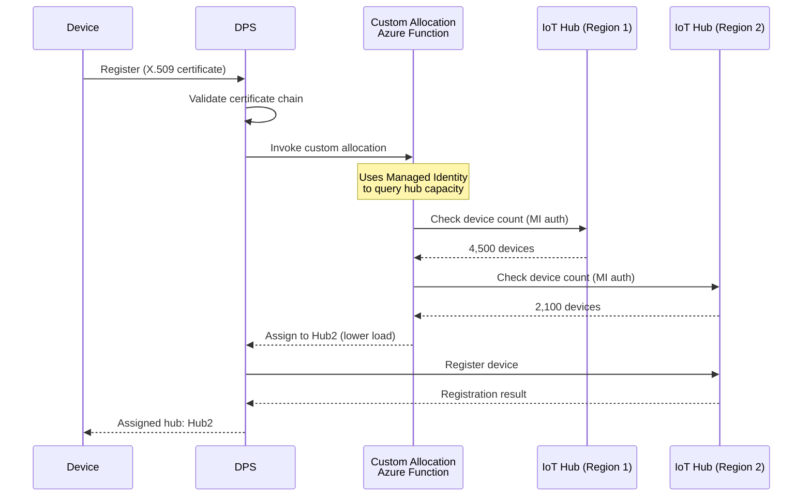
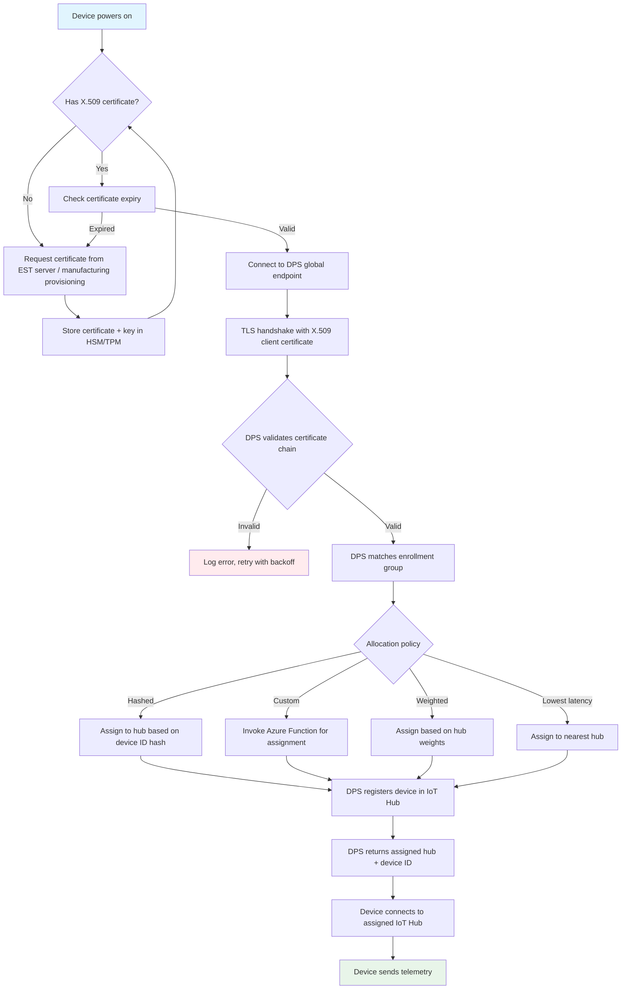

# DPS Migration — Symmetric Key to X.509 Attestation

**Migrate Device Provisioning Service enrollment groups from SAS symmetric key attestation to X.509 certificate attestation with Entra integration.**

> **Finding:** CSA-0025 (HIGH, BREAKING) | **Ballot:** AQ-0014 (approved)

---

## Overview

The Device Provisioning Service (DPS) automates device registration into IoT Hub. With SAS-based enrollment groups, DPS uses a shared symmetric key from which each device derives its individual key using HMAC-SHA256. This model inherits all the SAS key vulnerabilities: a single group key compromise affects every device in the enrollment group.

Migrating to X.509 attestation means devices prove their identity through a certificate chain rooted at a Certificate Authority registered with DPS. Each device has a unique certificate and private key. Compromise of one device does not affect others.

---

## SAS symmetric key attestation vs X.509 attestation

| Dimension                   | SAS symmetric key                                          | X.509 attestation                        |
| --------------------------- | ---------------------------------------------------------- | ---------------------------------------- |
| **Group credential**        | Single shared symmetric key                                | CA certificate (public, not secret)      |
| **Per-device credential**   | Derived key (HMAC of group key + device ID)                | Unique leaf certificate + private key    |
| **Compromise blast radius** | All devices in enrollment group                            | Single device                            |
| **Key storage**             | Flash memory (often unprotected)                           | HSM/TPM (hardware-protected)             |
| **Rotation**                | Requires new group key + all device re-derivation          | Per-device certificate renewal           |
| **Revocation**              | Disable entire enrollment group or individual registration | Revoke individual certificate (CRL/OCSP) |
| **Audit attribution**       | Device ID only                                             | Device ID + certificate thumbprint       |
| **FedRAMP High**            | Fails IA-5(2)                                              | Passes                                   |
| **FIPS 140-2**              | SDK-dependent                                              | Hardware-backed (HSM)                    |

---

## Individual enrollments vs group enrollments

### Individual enrollments

Each device has its own enrollment entry in DPS. Use for:

- Small fleets (< 100 devices)
- Devices with unique provisioning requirements
- Testing and development

```bash
# Create individual X.509 enrollment
az iot dps enrollment create \
  --dps-name "$DPS_NAME" \
  --resource-group "$RG" \
  --enrollment-id "sensor-prototype-001" \
  --attestation-type x509 \
  --certificate-path "device-sensor-prototype-001.pem" \
  --provisioning-status enabled \
  --iot-hub-host-name "$IOT_HUB_HOSTNAME"
```

### Group enrollments (recommended for production)

All devices sharing a common CA certificate can register through a single enrollment group. Use for:

- Production fleets (100+ devices)
- Devices manufactured with certificates from the same CA
- Simplified management and scaling

```bash
# Create X.509 group enrollment using intermediate CA
az iot dps enrollment-group create \
  --dps-name "$DPS_NAME" \
  --resource-group "$RG" \
  --enrollment-id "production-fleet-v2" \
  --certificate-path intermediate-ca.pem \
  --provisioning-status enabled \
  --allocation-policy hashed \
  --iot-hubs "$IOT_HUB_HOSTNAME" \
  --initial-twin-properties '{
    "tags": {
      "authType": "x509",
      "enrollmentGroup": "production-fleet-v2",
      "migrationDate": "2026-05-01"
    }
  }' \
  --initial-twin-desired-properties '{
    "firmwareVersion": "2.1.0",
    "telemetryInterval": 60
  }'
```

---

## Migration strategy: SAS to X.509

### Phase 1: Parallel enrollment groups

Create the X.509 enrollment group alongside the existing SAS enrollment group. Both are active simultaneously.

```
DPS Configuration (Phase 1):
├── Enrollment Group: "fleet-sas" (symmetric key)  ← existing, still active
│   ├── Allocation: hashed
│   └── Status: enabled
└── Enrollment Group: "fleet-x509" (X.509 CA)     ← new
    ├── Allocation: hashed
    ├── CA Certificate: intermediate-ca.pem
    └── Status: enabled
```

### Phase 2: Device migration (rolling)

Update devices in batches to use X.509 certificates. Each device re-provisions through DPS using the X.509 enrollment group.

```
Migration Wave 1 (10% of fleet):
  Devices: sensor-001 through sensor-100
  ├── Install X.509 certificate + private key
  ├── Update device software to use X.509 provisioning
  ├── Device re-provisions through DPS
  └── DPS matches to "fleet-x509" enrollment group

Migration Wave 2 (40% of fleet):
  Devices: sensor-101 through sensor-500
  └── Same process

Migration Wave 3 (50% of fleet):
  Devices: sensor-501 through sensor-1000
  └── Same process
```

### Phase 3: Disable SAS enrollment

After all devices have migrated, disable the SAS enrollment group.

```bash
# Verify all devices are on X.509
SAS_COUNT=$(az iot dps enrollment-group registration list \
  --dps-name "$DPS_NAME" -g "$RG" \
  --enrollment-id "fleet-sas" \
  --query "length([?status=='assigned'])" -o tsv)

echo "Devices still on SAS: $SAS_COUNT"

if [ "$SAS_COUNT" -eq "0" ]; then
  # Disable SAS enrollment group
  az iot dps enrollment-group update \
    --dps-name "$DPS_NAME" -g "$RG" \
    --enrollment-id "fleet-sas" \
    --provisioning-status disabled

  echo "SAS enrollment group disabled."
else
  echo "WARNING: $SAS_COUNT devices still on SAS. Do not disable yet."
fi
```

### Phase 4: Delete SAS enrollment (after soak period)

After a 30-day soak period with SAS disabled, delete the enrollment group entirely.

```bash
# Delete SAS enrollment group (after 30-day soak)
az iot dps enrollment-group delete \
  --dps-name "$DPS_NAME" -g "$RG" \
  --enrollment-id "fleet-sas"
```

---

## Custom allocation policies with Entra

DPS supports custom allocation policies via Azure Functions. When using managed identity, the Function authenticates to IoT Hub and other Azure services without SAS keys.

### Architecture



### Custom allocation function (Python)

```python
"""
Custom DPS allocation function using Managed Identity.
Replaces SAS-based allocation that used connection strings.
"""

import azure.functions as func
from azure.identity import DefaultAzureCredential
from azure.mgmt.iothub import IotHubClient
import json
import logging

app = func.FunctionApp()
credential = DefaultAzureCredential()

IOT_HUBS = [
    {"name": "hub-eastus", "resourceGroup": "rg-iot-eastus", "subscriptionId": "sub-id"},
    {"name": "hub-westus", "resourceGroup": "rg-iot-westus", "subscriptionId": "sub-id"},
]


@app.function_name("CustomAllocation")
@app.route(route="allocate", methods=["POST"])
async def custom_allocation(req: func.HttpRequest) -> func.HttpResponse:
    """Allocate device to IoT Hub with lowest device count."""
    body = req.get_json()
    device_id = body.get("deviceRuntimeContext", {}).get("registrationId")
    logging.info(f"Allocating device: {device_id}")

    # Find hub with lowest device count using managed identity
    best_hub = None
    lowest_count = float("inf")

    for hub_info in IOT_HUBS:
        client = IotHubClient(credential, hub_info["subscriptionId"])
        stats = client.iot_hub_resource.get_stats(
            hub_info["resourceGroup"], hub_info["name"]
        )
        if stats.total_device_count < lowest_count:
            lowest_count = stats.total_device_count
            best_hub = hub_info

    response = {
        "iotHubHostName": f"{best_hub['name']}.azure-devices.net",
        "initialTwin": {
            "tags": {
                "allocatedBy": "custom-allocation",
                "allocatedRegion": best_hub["name"].split("-")[-1],
            },
            "properties": {
                "desired": {
                    "allocatedHub": best_hub["name"],
                }
            }
        }
    }

    return func.HttpResponse(json.dumps(response), mimetype="application/json")
```

---

## Multi-hub provisioning patterns

### Geographic allocation

Devices are provisioned to the IoT Hub closest to their deployment location.

```bash
# DPS enrollment group with geo-aware allocation
az iot dps enrollment-group create \
  --dps-name "$DPS_NAME" -g "$RG" \
  --enrollment-id "fleet-geo-x509" \
  --certificate-path intermediate-ca.pem \
  --allocation-policy custom \
  --webhook-url "https://func-dps-allocator.azurewebsites.net/api/allocate" \
  --api-version "2021-10-01" \
  --iot-hubs "hub-eastus.azure-devices.net hub-westus.azure-devices.net hub-euwest.azure-devices.net"
```

### Failover allocation

If the primary hub is at capacity or unavailable, DPS routes to a secondary hub.

```bash
# DPS enrollment group with weighted allocation (primary/secondary)
az iot dps enrollment-group create \
  --dps-name "$DPS_NAME" -g "$RG" \
  --enrollment-id "fleet-failover-x509" \
  --certificate-path intermediate-ca.pem \
  --allocation-policy weighted \
  --iot-hubs "hub-primary.azure-devices.net hub-secondary.azure-devices.net"

# Set weights (primary gets 90% of new devices)
az iot dps linked-hub update \
  --dps-name "$DPS_NAME" -g "$RG" \
  --linked-hub "hub-primary.azure-devices.net" \
  --allocation-weight 9

az iot dps linked-hub update \
  --dps-name "$DPS_NAME" -g "$RG" \
  --linked-hub "hub-secondary.azure-devices.net" \
  --allocation-weight 1
```

---

## Reprovisioning policies

When a device re-provisions (e.g., after certificate renewal), DPS must decide what happens to the device's existing data in IoT Hub.

| Policy                       | Behavior                                                   | Use when                                      |
| ---------------------------- | ---------------------------------------------------------- | --------------------------------------------- |
| Reprovision and migrate data | Device moves to new hub, twin data follows                 | Geographic rebalancing, hub migration         |
| Reprovision and reset        | Device moves to new hub, twin reset to enrollment defaults | Clean start needed, major firmware update     |
| Never reprovision            | Device stays on originally assigned hub                    | Stable deployments, regulatory data residency |

### Setting reprovisioning policy

```bash
# Set reprovision policy on enrollment group
az iot dps enrollment-group update \
  --dps-name "$DPS_NAME" -g "$RG" \
  --enrollment-id "fleet-x509" \
  --reprovision-policy "reprovisionandmigratedata"
```

---

## DPS identity-based IoT Hub linking

Per CSA-0025, DPS links to IoT Hub using its managed identity instead of a SAS connection string. This is a post-deploy step because the ARM schema does not yet support identity-based linking declaratively.

### Bicep for DPS with managed identity

```bicep
// DPS with system-assigned managed identity (no SAS link)
resource dps 'Microsoft.Devices/provisioningServices@2022-12-12' = {
  name: dpsName
  location: location
  sku: {
    name: 'S1'
    capacity: 1
  }
  identity: {
    type: 'SystemAssigned'
  }
  properties: {
    iotHubs: []  // Link established post-deploy via CLI
    allocationPolicy: 'Hashed'
  }
}

// RBAC: DPS -> IoT Hub Data Contributor
resource dpsIoTHubRole 'Microsoft.Authorization/roleAssignments@2022-04-01' = {
  name: guid(dps.id, iotHub.id, 'IoTHubDataContributor')
  scope: iotHub
  properties: {
    principalId: dps.identity.principalId
    roleDefinitionId: subscriptionResourceId(
      'Microsoft.Authorization/roleDefinitions',
      '4fc6c259-987e-4a07-842e-c321cc9d413f'
    )
    principalType: 'ServicePrincipal'
  }
}
```

### Post-deploy linking script

```bash
#!/bin/bash
# link-dps-to-iothub.sh
# Run after Bicep deployment to establish identity-based DPS -> IoT Hub link

set -euo pipefail

RG="${1:?Usage: $0 <resource-group>}"

# Get deployment outputs
IOT_HUB_ID=$(az deployment group show \
  --resource-group "$RG" --name iot-hub \
  --query properties.outputs.iotHubResourceId.value -o tsv)
DPS_NAME=$(az deployment group show \
  --resource-group "$RG" --name iot-hub \
  --query properties.outputs.dpsName.value -o tsv)

echo "Linking DPS '$DPS_NAME' to IoT Hub (identity-based)..."

# Wait for RBAC propagation
echo "Waiting 60s for RBAC propagation..."
sleep 60

# Create identity-based linked hub
az iot dps linked-hub create \
  --dps-name "$DPS_NAME" \
  --resource-group "$RG" \
  --hub-resource-id "$IOT_HUB_ID" \
  --allocation-weight 1 \
  --authentication-type identityBased

echo "DPS linked to IoT Hub with identity-based authentication."

# Verify
az iot dps linked-hub list \
  --dps-name "$DPS_NAME" -g "$RG" \
  --query "[].{hub:name, authType:authenticationType}" -o table
```

---

## Provisioning flow diagram



---

## Migration verification

```bash
# 1. Verify X.509 enrollment group exists and is active
az iot dps enrollment-group show \
  --dps-name "$DPS_NAME" -g "$RG" \
  --enrollment-id "fleet-x509" \
  --query "{name:enrollmentGroupId, status:provisioningStatus, attestation:attestation.type}" \
  -o table

# 2. Count devices per enrollment group
echo "=== X.509 devices ==="
az iot dps enrollment-group registration list \
  --dps-name "$DPS_NAME" -g "$RG" \
  --enrollment-id "fleet-x509" \
  --query "length([?status=='assigned'])" -o tsv

echo "=== SAS devices (should be 0) ==="
az iot dps enrollment-group registration list \
  --dps-name "$DPS_NAME" -g "$RG" \
  --enrollment-id "fleet-sas" \
  --query "length([?status=='assigned'])" -o tsv

# 3. Verify DPS link is identity-based
az iot dps linked-hub list \
  --dps-name "$DPS_NAME" -g "$RG" \
  --query "[].{hub:name, authType:authenticationType}" -o table

# 4. Test device provisioning
az iot dps compute-device-key \
  --key "NOT_APPLICABLE_FOR_X509" 2>/dev/null || echo "Expected: SAS compute not applicable for X.509"
```

---

## Troubleshooting

| Symptom                                     | Likely cause                                  | Resolution                                                            |
| ------------------------------------------- | --------------------------------------------- | --------------------------------------------------------------------- |
| DPS returns 401 on device registration      | Certificate not signed by enrollment group CA | Verify chain: `openssl verify -CAfile intermediate-ca.pem device.pem` |
| DPS returns 404 on enrollment group         | Enrollment group name mismatch                | Check `az iot dps enrollment-group list`                              |
| DPS linked hub shows `keyBased`             | Post-deploy link script not run               | Run `link-dps-to-iothub.sh`                                           |
| Device provisions but cannot connect to hub | Hub does not trust the CA                     | Upload root/intermediate CA to IoT Hub certificates                   |
| Custom allocation function returns 500      | Function managed identity missing RBAC        | Assign IoT Hub Data Reader to the function identity                   |

---

**Last updated:** 2026-04-30
**Maintainers:** CSA-in-a-Box core team
**Related:** [X.509 Migration](x509-migration.md) | [Feature Mapping](feature-mapping-complete.md) | [Tutorial: Device Fleet Migration](tutorial-device-migration.md)
