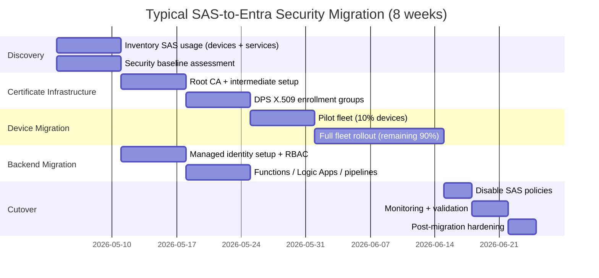

# IoT Hub & DPS — SAS to Entra Security Migration Center

**The definitive resource for migrating Azure IoT Hub and Device Provisioning Service from SAS key authentication to Entra ID-based security.**

---

## Who this is for

This migration center serves federal security engineers, IoT platform architects, DevSecOps leads, and compliance officers who must harden Azure IoT Hub and Device Provisioning Service (DPS) deployments to meet FedRAMP High, DoD IL5, and Zero Trust requirements. Unlike platform-to-platform migrations, this is a **security hardening migration** — the platform stays the same, but the authentication and authorization model is fundamentally upgraded from shared secrets to identity-based access.

---

## Quick-start decision matrix

| Your situation | Start here |
|---|---|
| Executive needs the business case for this migration | [Why Entra over SAS](why-entra-over-sas.md) |
| Security team needs threat analysis and control mappings | [Security Analysis](security-analysis.md) |
| Need a feature-by-feature auth pattern mapping | [Authentication Pattern Mapping](feature-mapping-complete.md) |
| Migrating a device fleet from SAS to X.509 certificates | [X.509 Migration Guide](x509-migration.md) |
| Migrating backend services from SAS connection strings | [Managed Identity Migration](managed-identity-migration.md) |
| Migrating DPS enrollment groups from symmetric keys | [DPS Migration Guide](dps-migration.md) |
| Need monitoring during and after migration | [Monitoring Migration](monitoring-migration.md) |
| Want a step-by-step device fleet tutorial | [Tutorial: Device Fleet Migration](tutorial-device-migration.md) |
| Want a step-by-step backend services tutorial | [Tutorial: Backend Service Migration](tutorial-backend-migration.md) |
| Need performance data for auth methods | [Benchmarks](benchmarks.md) |
| Want migration best practices and pitfalls | [Best Practices](best-practices.md) |

---

## Strategic resources

| Document | Audience | Description |
|---|---|---|
| [Why Entra over SAS](why-entra-over-sas.md) | CISO / CIO / AO | Executive case for eliminating SAS keys: Zero Trust alignment, FedRAMP, IL5, credential lifecycle, audit trail, and compliance acceleration |
| [Security Analysis](security-analysis.md) | Security Engineers / AO | Attack surface comparison, MITRE ATT&CK mapping, NIST 800-53 control mapping, threat models, and security posture scoring |
| [Benchmarks](benchmarks.md) | Platform Engineering | Auth latency, connection setup, fleet provisioning scale, certificate renewal overhead, and resource impact |

---

## Technical references

| Document | Description |
|---|---|
| [Authentication Pattern Mapping](feature-mapping-complete.md) | Every SAS-based auth pattern mapped to its Entra equivalent with Bicep before/after snippets |
| [Original Migration Guide](../iot-hub-entra.md) | The foundational CSA-0025 migration guide with Bicep changes, verification checklist, and rollback procedure |

---

## Migration guides

Domain-specific deep dives for each aspect of the SAS-to-Entra migration.

| Guide | SAS pattern | Entra destination |
|---|---|---|
| [X.509 Certificate Migration](x509-migration.md) | SAS device symmetric keys | X.509 device certificates with CA chain |
| [Managed Identity Migration](managed-identity-migration.md) | SAS connection strings in backend services | System/User-assigned managed identities with Azure RBAC |
| [DPS Migration](dps-migration.md) | DPS symmetric key attestation | DPS X.509 enrollment groups with Entra linkage |
| [Monitoring Migration](monitoring-migration.md) | Limited SAS auth metrics | Full Entra sign-in logs, certificate monitoring, audit dashboards |
| [Best Practices](best-practices.md) | N/A | Phased rollout, certificate management, HSM, rollback planning, common pitfalls |

---

## Tutorials

Hands-on, step-by-step walkthroughs for the two primary migration scenarios.

| Tutorial | Duration | What you will accomplish |
|---|---|---|
| [Migrate Device Fleet: SAS to X.509](tutorial-device-migration.md) | 3-4 hours | Generate a root CA, create DPS X.509 enrollment groups, provision leaf certificates, update device firmware, execute a rolling fleet migration, and verify |
| [Migrate Backend Services: SAS to Entra](tutorial-backend-migration.md) | 2-3 hours | Inventory SAS usage, create managed identities, assign RBAC roles, update Functions/Logic Apps/event pipelines, remove SAS secrets, and validate end-to-end |

---

## Migration timeline overview

A typical SAS-to-Entra security migration takes 4-12 weeks depending on fleet size and backend service complexity.

### Timeline by fleet size

| Fleet size | Devices | Backend services | Estimated duration |
|---|---|---|---|
| Small | < 500 | < 5 | 4-6 weeks |
| Medium | 500-5,000 | 5-15 | 6-8 weeks |
| Large | 5,000-50,000 | 15-30 | 8-10 weeks |
| Enterprise | 50,000+ | 30+ | 10-12 weeks |

Add 1-2 weeks for federal environments (ATO update overhead, ISSM review, change advisory board approval).

---

## How CSA-in-a-Box fits

The IoT Hub Bicep template in CSA-in-a-Box (`examples/iot-streaming/deploy/bicep/iot-hub.bicep`) has already been updated per CSA-0025 / AQ-0014 to enforce Entra-only authentication. This migration center provides the guidance to bring your device fleets and backend services into alignment with that template.

---

**Last updated:** 2026-04-30
**Maintainers:** CSA-in-a-Box core team
**Related:** [Original Migration Guide](../iot-hub-entra.md) | [Why Entra over SAS](why-entra-over-sas.md) | [Best Practices](best-practices.md)
