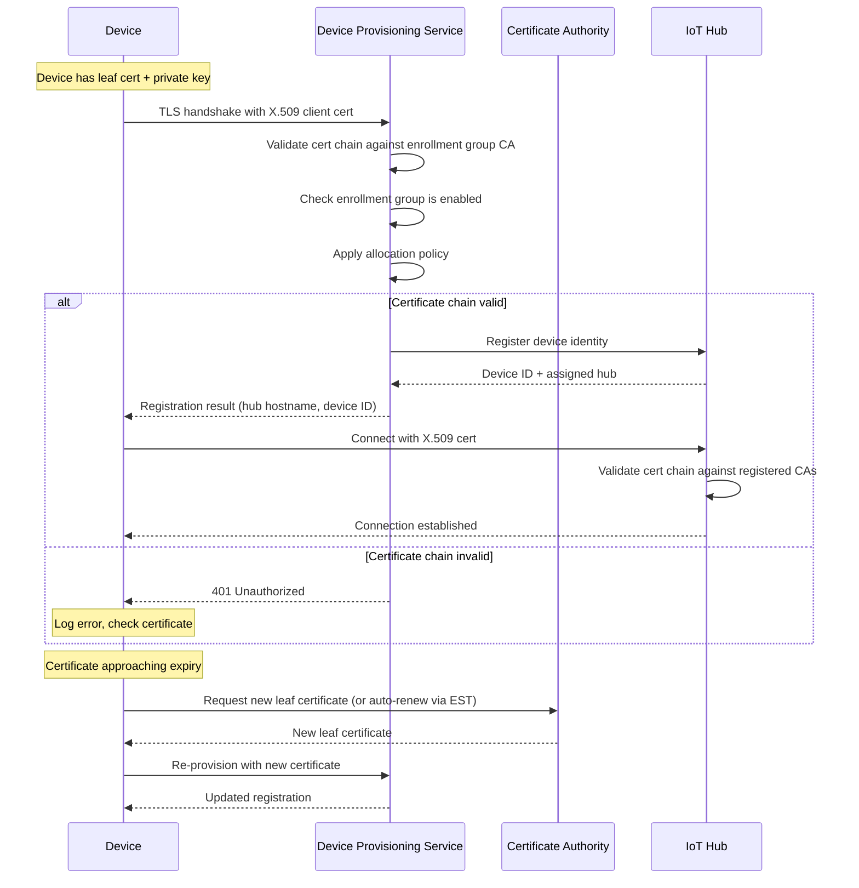

# X.509 Certificate Authentication Migration

**Migrate IoT device authentication from SAS symmetric keys to X.509 certificates with certificate chain setup, DPS enrollment, rotation strategy, and HSM integration.**

> **Finding:** CSA-0025 (HIGH, BREAKING) | **Ballot:** AQ-0014 (approved)

---

## Overview

X.509 certificate authentication replaces SAS symmetric keys with a public key infrastructure (PKI) model. Each device holds a private key (ideally in a hardware security module) and a certificate signed by a Certificate Authority registered with IoT Hub or DPS. The private key never leaves the device, eliminating the credential exposure vectors that make SAS keys a compliance failure.

This guide covers the full lifecycle: certificate hierarchy design, DPS enrollment group configuration, device provisioning flow, certificate rotation, and HSM integration.

---

## Certificate types

### Self-signed certificates

Suitable for development and testing only. Each device generates its own key pair and self-signs a certificate. The certificate thumbprint is registered directly in IoT Hub.

**Limitations:**
- No chain of trust
- Each device certificate must be individually registered
- No centralized revocation
- Not acceptable for FedRAMP High or IL5

### CA-signed certificates (production)

A Certificate Authority issues device certificates. IoT Hub or DPS validates the certificate chain against a registered root or intermediate CA. This is the only acceptable model for production and compliance environments.

**Advantages:**
- Centralized trust anchor (root CA)
- Scalable (add devices without per-device IoT Hub registration)
- Revocable (CRL or OCSP)
- Compliant with NIST 800-53 IA-5(2) (PKI-based authentication)

---

## Certificate chain setup

### Architecture

```
┌──────────────────────────────────────────────────────────┐
│                    Root CA Certificate                    │
│              (offline, air-gapped, HSM-stored)           │
│              Lifetime: 10-20 years                       │
│              CN: "CSA IoT Root CA"                       │
└──────────────────────┬───────────────────────────────────┘
                       │ Signs
┌──────────────────────▼───────────────────────────────────┐
│               Intermediate CA Certificate                 │
│              (online, Key Vault-stored)                   │
│              Lifetime: 2-5 years                         │
│              CN: "CSA IoT Intermediate CA 01"            │
└──────────────────────┬───────────────────────────────────┘
                       │ Signs
┌──────────────────────▼───────────────────────────────────┐
│                  Leaf Certificate (Device)                │
│              (on-device, HSM/TPM-stored)                 │
│              Lifetime: 90-365 days                       │
│              CN: "{device-id}"                           │
└──────────────────────────────────────────────────────────┘
```

### Design decisions

| Decision | Recommendation | Rationale |
|---|---|---|
| Root CA storage | Offline HSM (Azure Managed HSM or physical) | Root compromise = total PKI compromise |
| Intermediate CA storage | Azure Key Vault (Premium SKU with HSM) | Online signing with hardware protection |
| Leaf cert lifetime | 90 days (default), 30 days (high-security) | Balance rotation frequency with device connectivity |
| Key algorithm | RSA 2048 (broad device support) or ECC P-256 (resource-constrained devices) | FIPS 140-2 approved algorithms |
| CRL distribution | Azure Blob Storage with CDN | Low-latency revocation checking |
| Cert renewal trigger | 30 days before expiry | Allows for offline device reconnection window |

### Generate root CA certificate

```bash
# Generate root CA private key (store offline after generation)
openssl genrsa -aes256 -out root-ca.key 4096

# Generate root CA certificate (20-year lifetime)
openssl req -new -x509 -days 7300 -key root-ca.key \
  -out root-ca.pem \
  -subj "/CN=CSA IoT Root CA/O=CSA-in-a-Box/C=US" \
  -extensions v3_ca \
  -config <(cat <<EOF
[v3_ca]
basicConstraints = critical, CA:TRUE
keyUsage = critical, keyCertSign, cRLSign
subjectKeyIdentifier = hash
authorityKeyIdentifier = keyid:always, issuer:always
EOF
)

# Verify root CA certificate
openssl x509 -in root-ca.pem -text -noout
```

### Generate intermediate CA certificate

```bash
# Generate intermediate CA key (will be imported to Key Vault)
openssl genrsa -aes256 -out intermediate-ca.key 4096

# Generate CSR for intermediate CA
openssl req -new -key intermediate-ca.key \
  -out intermediate-ca.csr \
  -subj "/CN=CSA IoT Intermediate CA 01/O=CSA-in-a-Box/C=US"

# Sign intermediate CA with root CA (5-year lifetime)
openssl x509 -req -days 1825 \
  -in intermediate-ca.csr \
  -CA root-ca.pem -CAkey root-ca.key \
  -CAcreateserial \
  -out intermediate-ca.pem \
  -extensions v3_intermediate_ca \
  -extfile <(cat <<EOF
[v3_intermediate_ca]
basicConstraints = critical, CA:TRUE, pathlen:0
keyUsage = critical, keyCertSign, cRLSign
subjectKeyIdentifier = hash
authorityKeyIdentifier = keyid:always, issuer:always
EOF
)

# Create the certificate chain file
cat intermediate-ca.pem root-ca.pem > chain.pem
```

### Generate leaf (device) certificates

```bash
# Generate device private key
openssl genrsa -out device-sensor-001.key 2048

# Generate CSR with device ID as CN
openssl req -new -key device-sensor-001.key \
  -out device-sensor-001.csr \
  -subj "/CN=sensor-001/O=CSA-in-a-Box/C=US"

# Sign with intermediate CA (90-day lifetime)
openssl x509 -req -days 90 \
  -in device-sensor-001.csr \
  -CA intermediate-ca.pem -CAkey intermediate-ca.key \
  -CAcreateserial \
  -out device-sensor-001.pem \
  -extensions v3_device \
  -extfile <(cat <<EOF
[v3_device]
basicConstraints = critical, CA:FALSE
keyUsage = critical, digitalSignature, keyEncipherment
extendedKeyUsage = clientAuth
subjectKeyIdentifier = hash
authorityKeyIdentifier = keyid:always, issuer:always
EOF
)

# Create full chain for device (leaf + intermediate)
cat device-sensor-001.pem intermediate-ca.pem > device-sensor-001-fullchain.pem
```

---

## DPS enrollment group with X.509 attestation

### Upload and verify CA certificate

```bash
# Upload intermediate CA to DPS
az iot dps certificate create \
  --dps-name "$DPS_NAME" \
  --resource-group "$RG" \
  --certificate-name "csa-iot-intermediate-ca-01" \
  --path intermediate-ca.pem \
  --verified true  # Use automatic verification (2023+ API)

# Alternative: manual proof-of-possession verification
# 1. Get verification code
ETAG=$(az iot dps certificate show \
  --dps-name "$DPS_NAME" -g "$RG" \
  --certificate-name "csa-iot-intermediate-ca-01" \
  --query etag -o tsv)

VERIFICATION_CODE=$(az iot dps certificate generate-verification-code \
  --dps-name "$DPS_NAME" -g "$RG" \
  --certificate-name "csa-iot-intermediate-ca-01" \
  --etag "$ETAG" \
  --query properties.verificationCode -o tsv)

# 2. Generate verification certificate
openssl req -new -key intermediate-ca.key \
  -out verification.csr \
  -subj "/CN=$VERIFICATION_CODE"
openssl x509 -req -days 1 -in verification.csr \
  -CA intermediate-ca.pem -CAkey intermediate-ca.key \
  -CAcreateserial -out verification.pem

# 3. Upload verification certificate
az iot dps certificate verify \
  --dps-name "$DPS_NAME" -g "$RG" \
  --certificate-name "csa-iot-intermediate-ca-01" \
  --path verification.pem \
  --etag "$NEW_ETAG"
```

### Create X.509 enrollment group

```bash
# Create enrollment group using the intermediate CA
az iot dps enrollment-group create \
  --dps-name "$DPS_NAME" \
  --resource-group "$RG" \
  --enrollment-id "csa-iot-fleet-x509" \
  --certificate-path intermediate-ca.pem \
  --provisioning-status enabled \
  --allocation-policy hashed \
  --iot-hubs "$IOT_HUB_HOSTNAME" \
  --initial-twin-properties '{"tags":{"authType":"x509","enrollmentGroup":"csa-iot-fleet-x509"}}'
```

---

## Device provisioning flow



---

## Certificate rotation strategy

### Rolling rotation (recommended)

Rolling rotation updates device certificates gradually over time, avoiding fleet-wide outages.

```
Timeline (90-day certificate lifetime):
Day 0:  Certificate issued
Day 60: Renewal window opens (30 days before expiry)
Day 61: Device requests new certificate
Day 62: New certificate installed alongside old
Day 63: Device re-provisions with new certificate
Day 90: Old certificate expires (already replaced)
```

**Implementation:**

```python
import datetime
from pathlib import Path

def check_and_renew_certificate(device_id, cert_path, key_path, dps_scope):
    """Check certificate expiry and renew if within 30 days."""
    cert = load_x509_certificate(cert_path)
    days_remaining = (cert.not_valid_after - datetime.datetime.utcnow()).days

    if days_remaining <= 30:
        log.info(f"Certificate expires in {days_remaining} days. Renewing.")

        # Request new certificate from CA/EST server
        new_cert, new_key = request_certificate_from_est(
            est_server="https://est.csa-iot.internal",
            device_id=device_id,
            existing_cert=cert_path,
            existing_key=key_path,
        )

        # Save new certificate (keep old as backup)
        backup_path = Path(cert_path).with_suffix(".old.pem")
        Path(cert_path).rename(backup_path)
        save_certificate(new_cert, cert_path)
        save_private_key(new_key, key_path)

        # Re-provision through DPS with new cert
        reprovision_device(device_id, cert_path, key_path, dps_scope)

        log.info("Certificate renewed and device re-provisioned.")
        return True

    log.info(f"Certificate valid for {days_remaining} more days.")
    return False
```

### Emergency rotation

If a certificate is compromised, immediate revocation is required.

```bash
# Revoke a specific device certificate
# 1. Add to CRL
openssl ca -revoke device-compromised.pem -keyfile intermediate-ca.key -cert intermediate-ca.pem

# 2. Generate updated CRL
openssl ca -gencrl -keyfile intermediate-ca.key -cert intermediate-ca.pem -out crl.pem

# 3. Upload CRL to distribution point
az storage blob upload \
  --account-name "$STORAGE_ACCOUNT" \
  --container-name crl \
  --file crl.pem \
  --name crl.pem \
  --overwrite

# 4. Disable the device identity in IoT Hub
az iot hub device-identity update \
  --hub-name "$IOT_HUB" \
  --device-id "device-compromised" \
  --set status=disabled
```

---

## HSM integration for high-security deployments

### Why HSM

For DoD IL5, FIPS 140-2 Level 2 (minimum) or Level 3 cryptographic modules are required. Hardware Security Modules provide:

- Private key generation inside tamper-resistant hardware
- Private key never exported or readable
- Cryptographic operations performed inside the HSM
- Physical tamper evidence (Level 3) or active tamper response (Level 4)

### Device-level HSM options

| HSM/TPM option | FIPS level | Device type | Notes |
|---|---|---|---|
| TPM 2.0 | 140-2 Level 1-2 | Industrial PCs, gateways | Built into many commercial devices |
| ATECC608B (Microchip) | 140-2 Level 2 | Embedded, MCU-based | Low-cost, I2C interface |
| OPTIGA Trust M (Infineon) | 140-2 Level 2 | Embedded, MCU-based | Pre-provisioned X.509 support |
| SE050 (NXP) | 140-2 Level 3 | High-security embedded | EdgeLock platform |
| Azure Sphere (MediaTek MT3620) | Custom | IoT devices | Integrated HSM + OS + cloud security |

### Provisioning with TPM 2.0

```python
# Device provisioning with TPM-stored X.509 certificate
from azure.iot.device import ProvisioningDeviceClient, X509
from tpm2_pytss import ESAPI

def provision_with_tpm(device_id, dps_host, id_scope):
    """Provision device using X.509 certificate stored in TPM."""
    # Certificate is stored in TPM NV index
    # Private key operations happen inside TPM
    with ESAPI() as ectx:
        # Read certificate from TPM NV storage
        cert_pem = read_cert_from_tpm_nv(ectx, nv_index=0x01C00002)

        # Create X509 object pointing to TPM-backed key
        # The SDK will use the TPM for TLS handshake signing
        x509 = X509(
            cert_file=cert_pem,  # PEM certificate
            key_file=None,        # Key is in TPM, not filesystem
            pass_phrase=None,
        )

        # For TPM-backed keys, use the custom HSM interface
        client = ProvisioningDeviceClient.create_from_x509_certificate(
            provisioning_host=dps_host,
            registration_id=device_id,
            id_scope=id_scope,
            x509=x509,
        )

        result = client.register()
        return result.registration_state
```

---

## Worked example: Provision a fleet of 1,000 devices with X.509

### Step 1: Generate certificates in batch

```bash
#!/bin/bash
# generate-fleet-certs.sh
# Generate leaf certificates for a fleet of devices

FLEET_SIZE=1000
CERT_DIR="./fleet-certs"
INTERMEDIATE_CA="intermediate-ca.pem"
INTERMEDIATE_KEY="intermediate-ca.key"

mkdir -p "$CERT_DIR"

for i in $(seq -w 1 $FLEET_SIZE); do
    DEVICE_ID="sensor-${i}"
    echo "Generating certificate for $DEVICE_ID..."

    # Generate key
    openssl genrsa -out "$CERT_DIR/$DEVICE_ID.key" 2048 2>/dev/null

    # Generate CSR
    openssl req -new -key "$CERT_DIR/$DEVICE_ID.key" \
      -out "$CERT_DIR/$DEVICE_ID.csr" \
      -subj "/CN=$DEVICE_ID/O=CSA-in-a-Box/C=US" 2>/dev/null

    # Sign with intermediate CA (90-day lifetime)
    openssl x509 -req -days 90 \
      -in "$CERT_DIR/$DEVICE_ID.csr" \
      -CA "$INTERMEDIATE_CA" -CAkey "$INTERMEDIATE_KEY" \
      -CAcreateserial \
      -out "$CERT_DIR/$DEVICE_ID.pem" 2>/dev/null

    # Clean up CSR
    rm "$CERT_DIR/$DEVICE_ID.csr"
done

echo "Generated $FLEET_SIZE device certificates in $CERT_DIR/"
```

### Step 2: Deploy certificates to devices

```python
# deploy-certs.py
# Deploy certificates to devices via secure channel (e.g., SSH, Azure IoT Edge)

import paramiko
import os
from concurrent.futures import ThreadPoolExecutor

CERT_DIR = "./fleet-certs"
DEVICES_FILE = "device-inventory.csv"  # device_id,ip_address,ssh_user

def deploy_cert_to_device(device_id, ip_address, ssh_user):
    """Deploy certificate and key to a single device."""
    cert_file = os.path.join(CERT_DIR, f"{device_id}.pem")
    key_file = os.path.join(CERT_DIR, f"{device_id}.key")

    ssh = paramiko.SSHClient()
    ssh.set_missing_host_key_policy(paramiko.AutoAddPolicy())
    ssh.connect(ip_address, username=ssh_user, key_filename="~/.ssh/deploy_key")

    sftp = ssh.open_sftp()
    sftp.put(cert_file, f"/etc/iot-certs/{device_id}.pem")
    sftp.put(key_file, f"/etc/iot-certs/{device_id}.key")

    # Set restrictive permissions
    ssh.exec_command(f"chmod 644 /etc/iot-certs/{device_id}.pem")
    ssh.exec_command(f"chmod 600 /etc/iot-certs/{device_id}.key")

    # Restart IoT agent to use new certificate
    ssh.exec_command("systemctl restart iot-device-agent")

    sftp.close()
    ssh.close()
    print(f"Deployed certificate to {device_id} ({ip_address})")

# Deploy in parallel (max 50 concurrent connections)
with ThreadPoolExecutor(max_workers=50) as executor:
    with open(DEVICES_FILE) as f:
        for line in f:
            device_id, ip_address, ssh_user = line.strip().split(",")
            executor.submit(deploy_cert_to_device, device_id, ip_address, ssh_user)
```

### Step 3: Verify provisioning

```bash
# Verify devices are provisioning through DPS with X.509
az iot dps enrollment-group registration list \
  --dps-name "$DPS_NAME" \
  --resource-group "$RG" \
  --enrollment-id "csa-iot-fleet-x509" \
  --query "[].{deviceId:deviceId, status:status, lastUpdated:lastUpdatedDateTimeUtc}" \
  -o table

# Check IoT Hub for registered devices
az iot hub device-identity list \
  --hub-name "$IOT_HUB" \
  --query "[?authentication.type=='certificateAuthority'].{deviceId:deviceId, status:status}" \
  -o table | head -20
```

---

## Device client code (Python SDK)

```python
"""
IoT device client with X.509 authentication.
Replaces SAS-based device client for CSA-0025 compliance.
"""

import asyncio
import datetime
import json
import logging
from pathlib import Path

from azure.iot.device.aio import IoTHubDeviceClient, ProvisioningDeviceClient
from azure.iot.device import X509, Message

log = logging.getLogger(__name__)

# Configuration
DPS_HOST = "global.azure-devices-provisioning.net"
DPS_ID_SCOPE = "0ne00XXXXXX"
DEVICE_ID = "sensor-floor3-unit47"
CERT_PATH = "/etc/iot-certs/sensor-floor3-unit47.pem"
KEY_PATH = "/etc/iot-certs/sensor-floor3-unit47.key"
CERT_RENEWAL_DAYS = 30


async def provision_device():
    """Provision device through DPS using X.509 certificate."""
    x509 = X509(cert_file=CERT_PATH, key_file=KEY_PATH)

    provisioning_client = ProvisioningDeviceClient.create_from_x509_certificate(
        provisioning_host=DPS_HOST,
        registration_id=DEVICE_ID,
        id_scope=DPS_ID_SCOPE,
        x509=x509,
    )

    result = await provisioning_client.register()
    log.info(f"Provisioned to hub: {result.registration_state.assigned_hub}")
    return result.registration_state


async def connect_and_send(hub_hostname):
    """Connect to IoT Hub and send telemetry using X.509 certificate."""
    x509 = X509(cert_file=CERT_PATH, key_file=KEY_PATH)

    client = IoTHubDeviceClient.create_from_x509_certificate(
        hostname=hub_hostname,
        device_id=DEVICE_ID,
        x509=x509,
    )

    await client.connect()
    log.info("Connected to IoT Hub with X.509 certificate.")

    try:
        while True:
            # Check certificate expiry
            cert_expiry = get_cert_expiry(CERT_PATH)
            days_remaining = (cert_expiry - datetime.datetime.utcnow()).days

            if days_remaining <= CERT_RENEWAL_DAYS:
                log.warning(f"Certificate expires in {days_remaining} days.")

            # Send telemetry
            telemetry = {
                "temperature": 22.5,
                "humidity": 45.2,
                "timestamp": datetime.datetime.utcnow().isoformat(),
                "certDaysRemaining": days_remaining,
            }
            message = Message(json.dumps(telemetry))
            message.content_type = "application/json"
            message.content_encoding = "utf-8"
            await client.send_message(message)

            await asyncio.sleep(60)
    finally:
        await client.disconnect()


def get_cert_expiry(cert_path):
    """Read certificate expiry date."""
    from cryptography import x509 as crypto_x509
    cert_data = Path(cert_path).read_bytes()
    cert = crypto_x509.load_pem_x509_certificate(cert_data)
    return cert.not_valid_after


async def main():
    registration = await provision_device()
    await connect_and_send(registration.assigned_hub)


if __name__ == "__main__":
    logging.basicConfig(level=logging.INFO)
    asyncio.run(main())
```

---

## Troubleshooting

| Symptom | Likely cause | Resolution |
|---|---|---|
| `401 Unauthorized` during DPS registration | Certificate chain does not match enrollment group CA | Verify `openssl verify -CAfile chain.pem device.pem` |
| `403 Forbidden` after DPS registration | IoT Hub does not have the CA registered | Upload root/intermediate CA to IoT Hub CA certificates |
| TLS handshake failure | Certificate key mismatch | Verify key matches cert: `openssl x509 -noout -modulus -in cert.pem | openssl md5` vs `openssl rsa -noout -modulus -in key.pem | openssl md5` |
| Device connects but cannot send telemetry | Device ID in IoT Hub does not match certificate CN | Ensure registration ID matches CN in certificate |
| Certificate expired | Renewal process not triggered | Check renewal monitoring alerts; see [Monitoring](monitoring-migration.md) |

---

**Last updated:** 2026-04-30
**Maintainers:** CSA-in-a-Box core team
**Related:** [Feature Mapping](feature-mapping-complete.md) | [DPS Migration](dps-migration.md) | [Tutorial: Device Fleet Migration](tutorial-device-migration.md)
