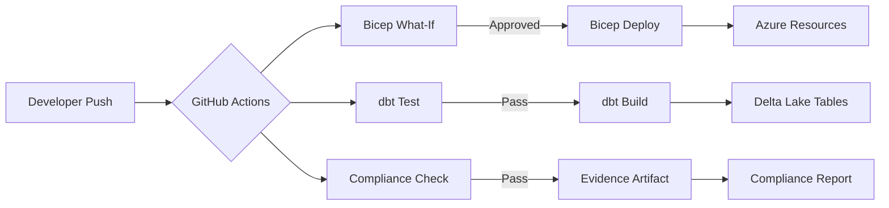

# Jenkins to GitHub Actions Migration Center

**The definitive resource for migrating CI/CD pipelines from Jenkins to GitHub Actions or Azure DevOps Pipelines, with patterns tailored for CSA-in-a-Box Azure-native deployments.**

---

## Who this is for

This migration center serves DevOps leads, platform engineers, CI/CD administrators, engineering managers, and federal technology directors who are evaluating or executing a migration from Jenkins to modern CI/CD platforms. Whether you are consolidating CI/CD onto the same platform as your source control, reducing the operational burden of self-hosted Jenkins infrastructure, improving security posture through native secret scanning and OIDC federation, or aligning your CI/CD pipelines with the CSA-in-a-Box reference implementation for Azure-native data platforms, these resources provide the evidence, patterns, and step-by-step guidance to execute confidently.

---

## Quick-start decision matrix

| Your situation                                 | Start here                                                       |
| ---------------------------------------------- | ---------------------------------------------------------------- |
| Executive evaluating GitHub Actions vs Jenkins | [Why GitHub Actions](why-github-actions.md)                      |
| Need cost justification for migration          | [Total Cost of Ownership Analysis](tco-analysis.md)              |
| Need a feature-by-feature comparison           | [Complete Feature Mapping](feature-mapping-complete.md)          |
| Ready to plan a migration                      | [Migration Playbook](../jenkins-to-github-actions.md)            |
| Converting Jenkinsfile pipelines               | [Pipeline Migration Guide](pipeline-migration.md)                |
| Mapping Jenkins plugins to Actions             | [Plugin Migration Reference](plugin-migration.md)                |
| Migrating Jenkins agents to runners            | [Agent Migration Guide](agent-migration.md)                      |
| Migrating credentials and secrets              | [Secret Migration Guide](secret-migration.md)                    |
| Considering Azure DevOps instead               | [Azure DevOps Migration](azure-devops-migration.md)              |
| Federal/government-specific requirements       | [Federal Migration Guide](federal-migration-guide.md)            |
| Want to use the automated importer tool        | [Tutorial: Actions Importer](tutorial-actions-importer.md)       |
| Want a hands-on pipeline conversion            | [Tutorial: Pipeline Conversion](tutorial-pipeline-conversion.md) |

---

## Decision matrix --- GitHub Actions vs Azure DevOps Pipelines vs Hybrid

Choosing the right target CI/CD platform depends on your source control strategy, compliance requirements, and existing tooling investments.

### When to choose GitHub Actions

- Source code is already on GitHub (or migrating to GitHub)
- You want native Copilot integration for workflow authoring and code review
- You need the largest marketplace ecosystem (20,000+ actions)
- You are adopting CSA-in-a-Box, which uses GitHub Actions natively
- You want integrated security scanning (Dependabot, CodeQL, secret scanning)
- Your teams value developer experience and minimal context-switching

### When to choose Azure DevOps Pipelines

- Source code is on Azure Repos and will remain there
- You have significant existing investment in Azure DevOps (boards, artifacts, test plans)
- You need Azure DevOps Server (on-premises) for IL4/IL5 air-gapped environments
- You need release gates with manual approvals and business-hour restrictions
- Your organization mandates Azure DevOps for governance and audit reasons

### When to choose a hybrid approach

- Large organization with teams on both GitHub and Azure DevOps
- Phased migration where some teams move first
- GitHub for development CI, Azure DevOps for production release management
- Federal environments needing both GHEC (for development) and ADO Server (for IL5 deployment)

### Comparison matrix

| Capability                     | Jenkins                               | GitHub Actions                                    | Azure DevOps Pipelines                             |
| ------------------------------ | ------------------------------------- | ------------------------------------------------- | -------------------------------------------------- |
| **Hosting model**              | Self-hosted (controller + agents)     | Managed (hosted runners) + self-hosted option     | Managed (Microsoft-hosted) + self-hosted option    |
| **Pipeline definition**        | Jenkinsfile (Groovy DSL)              | YAML (`.github/workflows/`)                       | YAML (`azure-pipelines.yml`)                       |
| **Plugin/extension ecosystem** | 1,800+ plugins (community-maintained) | 20,000+ marketplace actions                       | ~1,200 extensions                                  |
| **Source control integration** | Any SCM via plugins                   | Native GitHub integration                         | Native Azure Repos + GitHub integration            |
| **Secret management**          | Jenkins Credentials + plugins         | GitHub Secrets + OIDC federation                  | Variable groups + service connections + Key Vault  |
| **Container support**          | Docker plugin + agents                | Container jobs, service containers                | Container jobs, service connections                |
| **Matrix builds**              | Parallel stages (manual config)       | Native `strategy.matrix`                          | Native `strategy.matrix`                           |
| **Caching**                    | Workspace stashing + plugins          | `actions/cache` (10 GB per repo)                  | Pipeline caching (10 GB per pipeline)              |
| **Artifacts**                  | `archiveArtifacts` + stash/unstash    | `actions/upload-artifact` (500 MB--10 GB)         | Pipeline artifacts + Azure Artifacts               |
| **Reusable pipelines**         | Shared libraries (Groovy)             | Reusable workflows + composite actions            | Templates + extends                                |
| **Environments**               | Manual stage configuration            | Environments with protection rules                | Environments with approvals and gates              |
| **Security scanning**          | Plugins (OWASP, SonarQube)            | CodeQL, Dependabot, secret scanning (native)      | Microsoft Defender for DevOps, SonarQube extension |
| **AI assistance**              | None native                           | GitHub Copilot (workflow authoring, Autofix)      | Limited (Azure DevOps Copilot preview)             |
| **Cost model**                 | Infrastructure + admin FTE            | Per-minute (hosted) or free (self-hosted compute) | Per-minute (hosted) or free (self-hosted compute)  |
| **FedRAMP**                    | Customer-managed                      | GHEC with data residency (FedRAMP authorized)     | Azure DevOps FedRAMP High                          |
| **DoD IL4/IL5**                | Self-hosted in classified network     | Self-hosted runners in Gov regions                | Azure DevOps Server (on-prem) for IL4/IL5          |
| **SBOM / provenance**          | Plugins                               | `actions/attest-build-provenance` (SLSA Level 3)  | Microsoft SBOM tool integration                    |

---

## Strategic resources

These documents provide the business case, cost analysis, and strategic framing for decision-makers.

| Document                                                | Audience                    | Description                                                                                                                                                   |
| ------------------------------------------------------- | --------------------------- | ------------------------------------------------------------------------------------------------------------------------------------------------------------- |
| [Why GitHub Actions](why-github-actions.md)             | CIO / CDO / DevOps Director | Executive white paper covering Copilot integration, marketplace ecosystem, security advantages, managed runners, and honest assessment of Jenkins strengths   |
| [Total Cost of Ownership Analysis](tco-analysis.md)     | CFO / CIO / Procurement     | Detailed pricing comparison across three organization sizes, 5-year TCO projections, hidden cost analysis for Jenkins, and GitHub Actions free-tier economics |
| [Complete Feature Mapping](feature-mapping-complete.md) | CTO / Platform Architecture | 50+ Jenkins concepts mapped to GitHub Actions and Azure DevOps equivalents with migration complexity ratings                                                  |

---

## Migration guides

Domain-specific deep dives covering every aspect of a Jenkins-to-GitHub Actions migration.

| Guide                                       | Jenkins capability                     | GitHub Actions destination                |
| ------------------------------------------- | -------------------------------------- | ----------------------------------------- |
| [Pipeline Migration](pipeline-migration.md) | Jenkinsfile (declarative + scripted)   | GitHub Actions workflow YAML              |
| [Plugin Migration](plugin-migration.md)     | 1,800+ Jenkins plugins                 | 20,000+ marketplace actions               |
| [Agent Migration](agent-migration.md)       | Jenkins agents (permanent + ephemeral) | GitHub-hosted + self-hosted runners (ARC) |
| [Secret Migration](secret-migration.md)     | Jenkins Credentials (all types)        | GitHub Secrets + OIDC federation          |

---

## Alternative platform

| Guide                                               | Description                                                                                                                                                                   |
| --------------------------------------------------- | ----------------------------------------------------------------------------------------------------------------------------------------------------------------------------- |
| [Azure DevOps Migration](azure-devops-migration.md) | When and how to migrate Jenkins pipelines to Azure DevOps Pipelines instead --- YAML syntax, service connections, variable groups, deployment environments, and release gates |

---

## Tutorials

Hands-on, step-by-step guides for executing the migration.

| Tutorial                                               | Description                                                                                                                                                  | Time       |
| ------------------------------------------------------ | ------------------------------------------------------------------------------------------------------------------------------------------------------------ | ---------- |
| [Actions Importer CLI](tutorial-actions-importer.md)   | Install the GitHub Actions Importer, audit your Jenkins instance, dry-run conversions, review generated workflows, migrate, and validate                     | 2--4 hours |
| [Pipeline Conversion](tutorial-pipeline-conversion.md) | Take a real-world multi-stage Jenkinsfile (Docker build, test, deploy to Azure), convert to GitHub Actions, add OIDC auth, Copilot suggestions, and validate | 1--2 hours |

---

## Government and federal

| Document                                              | Description                                                                                                                                                               |
| ----------------------------------------------------- | ------------------------------------------------------------------------------------------------------------------------------------------------------------------------- |
| [Federal Migration Guide](federal-migration-guide.md) | GitHub Enterprise in Azure Government, Azure DevOps Server for IL4/IL5, FedRAMP authorized services, self-hosted runners in Gov regions, SBOM generation, SLSA provenance |

---

## Performance and quality

| Document                            | Description                                                                                                                                            |
| ----------------------------------- | ------------------------------------------------------------------------------------------------------------------------------------------------------ |
| [Benchmarks](benchmarks.md)         | Build time comparisons (Jenkins vs GitHub Actions hosted vs self-hosted), parallel execution, caching effectiveness, artifact speeds, OIDC overhead    |
| [Best Practices](best-practices.md) | Incremental migration strategy, dual-running period, reusable workflow library, security hardening (OIDC, pinned actions), CSA-in-a-Box CI/CD patterns |

---

## How CSA-in-a-Box fits

CSA-in-a-Box uses GitHub Actions as its native CI/CD platform, providing reference workflows for the full lifecycle of an Azure-native data platform deployment:

- **Bicep What-If workflows** --- Preview infrastructure changes before deployment, with environment-specific approval gates
- **Bicep Deploy workflows** --- Deploy Azure resources (Databricks, Purview, ADLS, ADF, Event Hubs, Key Vault) via OIDC-authenticated deployments with no stored secrets
- **dbt CI workflows** --- Run `dbt test` and `dbt build --select state:modified+` on pull requests to catch data model regressions before merge
- **Data pipeline validation** --- Trigger ADF pipelines, validate row counts, assert schema compliance, and run Great Expectations suites
- **Compliance check workflows** --- Run Checkov against Bicep modules, verify Azure Policy compliance, audit Purview classifications, and generate NIST 800-53 evidence
- **Documentation deployment** --- Build and deploy MkDocs to GitHub Pages with `actions/deploy-pages`

Migrating from Jenkins to GitHub Actions aligns your CI/CD infrastructure with the CSA-in-a-Box reference implementation, enabling you to adopt these patterns directly instead of re-implementing them as Jenkins pipelines.

### CSA-in-a-Box workflow architecture

---

## Migration timeline

For a typical Jenkins estate (10--50 pipelines, 5--20 agents, 50--100 plugins), expect the following timeline:

| Phase        | Duration     | Activities                                                                                                 |
| ------------ | ------------ | ---------------------------------------------------------------------------------------------------------- |
| **Assess**   | Weeks 1--2   | Inventory Jenkins; run Actions Importer audit; classify pipelines; map credentials; assess plugins         |
| **Pilot**    | Weeks 3--4   | Convert 3--5 representative pipelines; dual-run; validate parity                                           |
| **Migrate**  | Weeks 5--10  | Pipeline-by-pipeline migration; credential migration; agent-to-runner migration; decommission Jenkins jobs |
| **Optimize** | Weeks 11--12 | Build reusable workflow library; security hardening; monitoring; decommission Jenkins infrastructure       |

For larger Jenkins estates (100+ pipelines), add 4--8 weeks to the Migrate phase and consider running multiple migration streams in parallel.

---

## Audience and prerequisites

### Primary audience

- **DevOps leads** who own the CI/CD platform and need to plan the migration
- **Platform engineers** who will execute the migration and build the GitHub Actions infrastructure
- **CI/CD administrators** who manage Jenkins today and need to understand the target state
- **Engineering managers** who need to communicate the migration plan to development teams
- **Federal technology directors** who need to validate compliance and authorization requirements

### Prerequisites

- Access to your Jenkins controller(s) with admin credentials (for audit and export)
- A GitHub organization (free, Team, or Enterprise tier)
- Basic familiarity with YAML syntax
- For OIDC federation: an Azure subscription with permission to create app registrations and federated credentials
- For self-hosted runners: compute resources (VMs, Kubernetes cluster, or ARC-compatible infrastructure)

---

## Getting started

1. **Read the executive brief** --- Start with [Why GitHub Actions](why-github-actions.md) to align stakeholders
2. **Build the business case** --- Use the [TCO Analysis](tco-analysis.md) for cost justification
3. **Assess your Jenkins estate** --- Follow the [Actions Importer Tutorial](tutorial-actions-importer.md)
4. **Convert your first pipeline** --- Walk through the [Pipeline Conversion Tutorial](tutorial-pipeline-conversion.md)
5. **Review feature mapping** --- Reference the [Complete Feature Mapping](feature-mapping-complete.md) for detailed concept-by-concept guidance
6. **Adopt best practices** --- Follow the [Best Practices](best-practices.md) for production-grade GitHub Actions workflows
