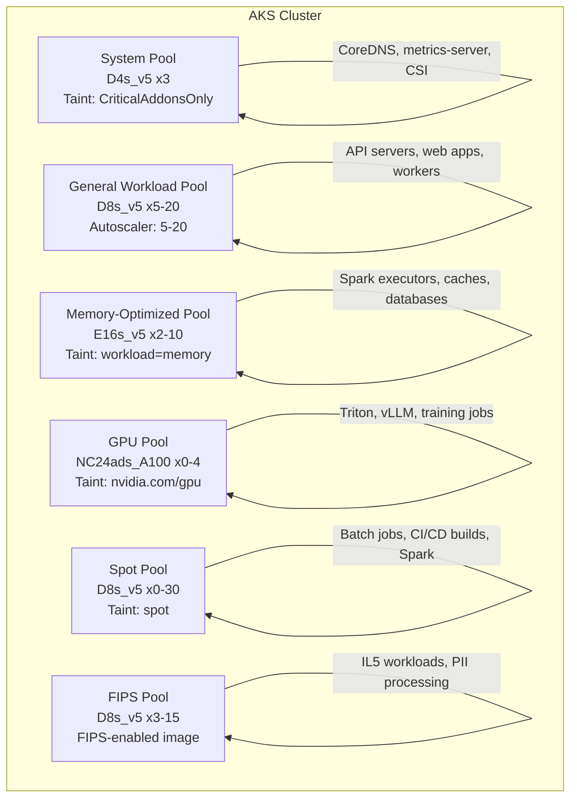
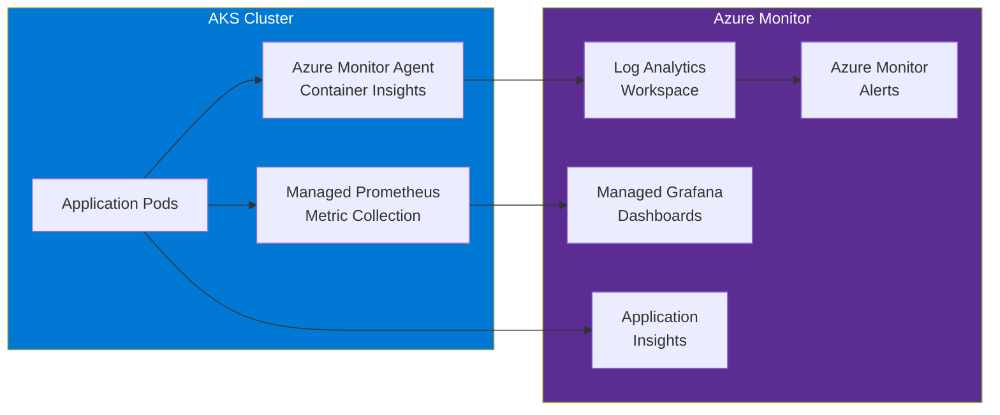

# AKS Best Practices for Federal Container Platforms

**Status:** Authored 2026-04-30
**Audience:** Platform engineers, SREs, and architects operating AKS clusters for federal workloads, especially those integrating with CSA-in-a-Box data services.
**Scope:** Cluster design, node pool strategy, namespace organization, monitoring, GitOps adoption, security hardening, and CSA-in-a-Box integration patterns.

---

## 1. Cluster design

### Multi-cluster strategy

For federal deployments, use separate clusters per environment and security boundary:

| Cluster         | Purpose                     | AKS tier            | Node pools                | Notes                                        |
| --------------- | --------------------------- | ------------------- | ------------------------- | -------------------------------------------- |
| **aks-dev**     | Development and testing     | Free                | 1 system + 1 workload     | Smallest viable; Spot nodes for cost savings |
| **aks-staging** | Pre-production validation   | Standard            | 1 system + 2 workload     | Mirrors production topology                  |
| **aks-prod**    | Production workloads        | Standard or Premium | 1 system + 3--5 workload  | Full HA, zone-redundant                      |
| **aks-data**    | CSA-in-a-Box data workloads | Standard            | 1 system + GPU + high-mem | Spark, model serving, dbt                    |

### Single cluster with namespace isolation (alternative)

For smaller deployments, a single cluster with namespace isolation is acceptable:

```yaml
# Namespace hierarchy
namespaces:
    system:
        - kube-system # K8s system pods
        - ingress-nginx # Ingress controller
        - cert-manager # TLS certificate management
        - monitoring # Prometheus, Grafana
        - flux-system # GitOps controller
        - gatekeeper-system # Policy enforcement
        - velero # Backup and restore
    workloads:
        - production # Production applications
        - staging # Staging applications
        - development # Development sandboxes
    data:
        - spark-jobs # Spark Operator workloads
        - model-serving # ML model inference
        - data-pipelines # dbt, event consumers
        - data-apis # Data product APIs
```

### Cluster naming convention

```
aks-{environment}-{region}-{purpose}
Examples:
  aks-prod-govva-platform
  aks-prod-govva-data
  aks-dev-govva-sandbox
```

---

## 2. Node pool strategy

### Recommended node pool architecture



### Node pool sizing guidelines

| Workload type                       | VM series           | Sizing rule                                   | Autoscaler min/max |
| ----------------------------------- | ------------------- | --------------------------------------------- | ------------------ |
| **System pods**                     | D4s_v5              | 3 nodes (one per zone)                        | 3/5                |
| **General workloads**               | D8s_v5              | 2--3 pods per vCPU (packing)                  | 3/20               |
| **Memory-intensive** (Spark, Redis) | E16s_v5 or E32s_v5  | Memory-bound; 70% utilization target          | 2/10               |
| **GPU inference**                   | NC24ads_A100_v4     | 1 model per GPU (simple) or MIG (multi-model) | 0/4                |
| **GPU training**                    | ND96isr_H100_v5     | Job-based; scale to 0 when idle               | 0/8                |
| **Batch / CI builds**               | D8s_v5 (Spot)       | Scale to 0 when idle; tolerate eviction       | 0/30               |
| **FIPS workloads**                  | D8s_v5 (FIPS image) | Dedicated pool for IL5+ workloads             | 3/15               |

### Best practices for node pools

1. **Always use availability zones** (zones 1, 2, 3) for production node pools
2. **Taint system pool** with `CriticalAddonsOnly=true:NoSchedule` to prevent application pods from landing on system nodes
3. **Taint specialized pools** (GPU, memory, Spot) and use tolerations to target workloads explicitly
4. **Scale GPU and Spot pools to 0** when idle -- no cost for unused capacity
5. **Use max-pods=110** (default 30 is too low for most workloads)
6. **Set OS disk type to Managed** and OS disk size to 128 GB minimum for production

---

## 3. Namespace organization

### Resource isolation per namespace

```yaml
# Template for production namespace
apiVersion: v1
kind: Namespace
metadata:
    name: production
    labels:
        # Pod Security Standards
        pod-security.kubernetes.io/enforce: restricted
        pod-security.kubernetes.io/audit: restricted
        pod-security.kubernetes.io/warn: restricted
        # Metadata
        team: platform
        environment: production
        cost-center: "CC-12345"
---
apiVersion: v1
kind: ResourceQuota
metadata:
    name: resource-limits
    namespace: production
spec:
    hard:
        requests.cpu: "40"
        requests.memory: "80Gi"
        limits.cpu: "80"
        limits.memory: "160Gi"
        persistentvolumeclaims: "20"
        services.loadbalancers: "3"
        count/deployments.apps: "50"
        count/services: "50"
---
apiVersion: v1
kind: LimitRange
metadata:
    name: default-limits
    namespace: production
spec:
    limits:
        - default:
              cpu: "500m"
              memory: "512Mi"
          defaultRequest:
              cpu: "100m"
              memory: "128Mi"
          max:
              cpu: "8"
              memory: "16Gi"
          min:
              cpu: "50m"
              memory: "64Mi"
          type: Container
---
apiVersion: networking.k8s.io/v1
kind: NetworkPolicy
metadata:
    name: default-deny-all
    namespace: production
spec:
    podSelector: {}
    policyTypes:
        - Ingress
        - Egress
---
apiVersion: networking.k8s.io/v1
kind: NetworkPolicy
metadata:
    name: allow-dns
    namespace: production
spec:
    podSelector: {}
    policyTypes:
        - Egress
    egress:
        - to:
              - namespaceSelector:
                    matchLabels:
                        kubernetes.io/metadata.name: kube-system
          ports:
              - protocol: UDP
                port: 53
              - protocol: TCP
                port: 53
```

---

## 4. Monitoring and observability

### Monitoring stack architecture



### Essential alerts

```yaml
# Critical alerts to configure
alerts:
    cluster:
        - name: NodeNotReady
          condition: "Node status NotReady for > 5 minutes"
          severity: Critical
        - name: ClusterAutoscalerFailed
          condition: "Autoscaler unable to provision nodes"
          severity: Critical
        - name: PVCPendingBound
          condition: "PVC pending for > 10 minutes"
          severity: Warning

    workload:
        - name: PodCrashLooping
          condition: "Pod restart count > 5 in 10 minutes"
          severity: Critical
        - name: ContainerOOMKilled
          condition: "Container OOMKilled event"
          severity: Warning
        - name: HPAMaxedOut
          condition: "HPA at maxReplicas for > 30 minutes"
          severity: Warning
        - name: HighErrorRate
          condition: "HTTP 5xx rate > 5% for > 5 minutes"
          severity: Critical

    security:
        - name: DefenderThreatDetected
          condition: "Defender for Containers alert fired"
          severity: Critical
        - name: PolicyViolation
          condition: "Azure Policy deny event"
          severity: Warning
        - name: UnauthorizedAPIAccess
          condition: "401/403 to API server > 10 in 5 minutes"
          severity: Warning
```

### Log retention strategy

| Log category                | Retention                        | Purpose                         |
| --------------------------- | -------------------------------- | ------------------------------- |
| **Container stdout/stderr** | 30 days                          | Debugging and troubleshooting   |
| **Kubernetes events**       | 30 days                          | Cluster state changes           |
| **kube-audit**              | 90 days (federal minimum)        | Security audit trail            |
| **kube-audit-admin**        | 1 year (for IL5/STIG compliance) | Admin action audit              |
| **Defender alerts**         | 1 year                           | Security incident investigation |
| **Azure Activity Log**      | 90 days                          | Azure resource changes          |

---

## 5. GitOps adoption

### GitOps repository structure

```
aks-gitops/
  clusters/
    aks-prod-govva/
      flux-system/           # Flux bootstrap (auto-generated)
      infrastructure.yaml    # Kustomization pointing to infrastructure/
      applications.yaml      # Kustomization pointing to apps/
  infrastructure/
    sources/                 # Helm repositories, Git sources
      helm-repos.yaml
    controllers/
      ingress-nginx/
        namespace.yaml
        helmrelease.yaml
      cert-manager/
        namespace.yaml
        helmrelease.yaml
      kube-prometheus-stack/
        namespace.yaml
        helmrelease.yaml
    policies/
      pod-security.yaml
      network-policies.yaml
      resource-quotas.yaml
  applications/
    base/
      api-server/
        deployment.yaml
        service.yaml
        ingress.yaml
        kustomization.yaml
    overlays/
      production/
        kustomization.yaml
        patches/
      staging/
        kustomization.yaml
        patches/
```

### GitOps best practices

1. **Separate infrastructure and application repositories** -- infrastructure changes have different review and approval requirements
2. **Use Kustomize overlays** for environment-specific configuration (never duplicate manifests)
3. **Pin Helm chart versions** -- never use `latest` or `*` in HelmRelease version constraints
4. **Require PR approval** for production changes -- GitOps is only as good as the review process
5. **Use Flux image automation** for automated image updates in non-production environments
6. **Encrypt secrets in Git** with SOPS + Azure Key Vault -- or reference Key Vault via SecretProviderClass and do not store secrets in Git at all

---

## 6. Security hardening best practices

### Defense in depth layers

| Layer         | Control                                                           | Implementation                                     |
| ------------- | ----------------------------------------------------------------- | -------------------------------------------------- |
| **Cluster**   | Private cluster, Entra ID auth, local accounts disabled           | Cluster creation flags                             |
| **Network**   | Default-deny network policies, Azure Firewall egress              | NetworkPolicy + Azure Firewall                     |
| **Node**      | FIPS images, CIS benchmarks, auto-patching                        | Node pool config + Azure Policy                    |
| **Container** | PSS restricted, read-only filesystem, drop all capabilities       | Pod security context                               |
| **Image**     | Approved registries only, vulnerability scanning, image signing   | Azure Policy + Defender + Notation                 |
| **Identity**  | Workload Identity (no secrets), Key Vault secrets, MFA for admins | Workload Identity + Key Vault + Conditional Access |
| **Runtime**   | Defender runtime protection, binary drift detection               | Defender for Containers                            |
| **Data**      | Encryption at rest (CMK), encryption in transit (TLS/mTLS)        | Azure Disk encryption + Istio                      |

### Security baseline checklist

```bash
# Verify security configuration
# 1. Local accounts disabled
az aks show -g rg-aks-prod -n aks-prod --query disableLocalAccounts

# 2. Entra ID integration enabled
az aks show -g rg-aks-prod -n aks-prod --query aadProfile.managed

# 3. Private cluster
az aks show -g rg-aks-prod -n aks-prod --query apiServerAccessProfile.enablePrivateCluster

# 4. Defender enabled
az aks show -g rg-aks-prod -n aks-prod --query securityProfile.defender

# 5. Workload Identity enabled
az aks show -g rg-aks-prod -n aks-prod --query securityProfile.workloadIdentity.enabled

# 6. FIPS node pools
az aks nodepool show -g rg-aks-prod --cluster-name aks-prod -n fipspool --query enableFIPS

# 7. Azure Policy assigned
az policy assignment list --scope "/subscriptions/$SUB_ID/resourceGroups/rg-aks-prod" --query "[].displayName"
```

---

## 7. Cost optimization

### Right-sizing workloads

```bash
# Use Container Insights to identify over-provisioned workloads
# Azure Portal > AKS > Insights > Containers
# Look for: CPU request >> CPU usage, Memory request >> Memory usage

# CLI: check resource usage vs requests
kubectl top pods -A --sort-by=cpu | head -20
kubectl top pods -A --sort-by=memory | head -20
```

### Reserved Instances strategy

| Workload type                           | Commitment           | Recommendation                            |
| --------------------------------------- | -------------------- | ----------------------------------------- |
| System pool (always running)            | 3-year RI            | 56% savings                               |
| Production workload pool (steady-state) | 1-year RI            | 38% savings                               |
| GPU pool (intermittent)                 | Pay-as-you-go + Spot | Use Spot for training; PAYG for inference |
| Spot pool (batch jobs)                  | Spot pricing         | Up to 90% savings                         |
| Dev/staging                             | Azure Savings Plan   | Flexible across regions and sizes         |

### Cost allocation with namespaces

```bash
# Enable cost allocation in Container Insights
# Azure Portal > AKS > Cost Analysis > Namespaces
# Attribute costs to teams/projects via namespace labels:
# cost-center, team, project, environment
```

---

## 8. CSA-in-a-Box containerized data services integration

### Spark on Kubernetes

```yaml
# Spark Operator SparkApplication on AKS
apiVersion: sparkoperator.k8s.io/v1beta2
kind: SparkApplication
metadata:
    name: daily-sales-etl
    namespace: spark-jobs
spec:
    type: Python
    pythonVersion: "3"
    mode: cluster
    image: csainaboxacr.azurecr.io/spark/spark-py:3.5.0
    mainApplicationFile: "abfss://code@stcsainbox.dfs.core.windows.net/jobs/daily_sales_etl.py"
    sparkVersion: "3.5.0"
    driver:
        cores: 2
        memory: "4g"
        serviceAccount: spark-sa
        labels:
            azure.workload.identity/use: "true"
        nodeSelector:
            agentpool: workload
    executor:
        cores: 4
        instances: 8
        memory: "8g"
        nodeSelector:
            agentpool: highmem
        tolerations:
            - key: workload
              value: memory-intensive
              effect: NoSchedule
    sparkConf:
        spark.hadoop.fs.azure.account.auth.type: OAuth
        spark.hadoop.fs.azure.account.oauth.provider.type: org.apache.hadoop.fs.azurebfs.oauth2.WorkloadIdentityTokenProvider
        spark.sql.catalog.unity: com.databricks.sql.catalog.UnityCatalog
        spark.sql.catalog.unity.uri: "https://adb-xxxx.azuredatabricks.net"
        spark.kubernetes.driver.volumes.persistentVolumeClaim.scratch.mount.path: /scratch
        spark.kubernetes.driver.volumes.persistentVolumeClaim.scratch.options.claimName: spark-scratch
    restartPolicy:
        type: OnFailure
        onFailureRetries: 3
        onFailureRetryInterval: 30
```

### Model serving on GPU node pools

```yaml
# Triton Inference Server on AKS GPU nodes
apiVersion: apps/v1
kind: Deployment
metadata:
    name: triton-inference
    namespace: model-serving
spec:
    replicas: 2
    selector:
        matchLabels:
            app: triton
    template:
        metadata:
            labels:
                app: triton
                azure.workload.identity/use: "true"
        spec:
            serviceAccountName: model-serving-sa
            containers:
                - name: triton
                  image: csainaboxacr.azurecr.io/nvidia/tritonserver:24.01-py3
                  args:
                      - tritonserver
                      - --model-repository=abfss://models@stcsainbox.dfs.core.windows.net/triton/
                  ports:
                      - containerPort: 8000
                        name: http
                      - containerPort: 8001
                        name: grpc
                      - containerPort: 8002
                        name: metrics
                  resources:
                      limits:
                          nvidia.com/gpu: 1
                          memory: "32Gi"
                      requests:
                          nvidia.com/gpu: 1
                          cpu: "8"
                          memory: "16Gi"
            nodeSelector:
                agentpool: gpu
            tolerations:
                - key: nvidia.com/gpu
                  operator: Exists
                  effect: NoSchedule
```

### Event-driven data consumer with KEDA

```yaml
# KEDA-scaled Event Hubs consumer
apiVersion: keda.sh/v1alpha1
kind: ScaledObject
metadata:
    name: eventhub-consumer
    namespace: data-pipelines
spec:
    scaleTargetRef:
        name: event-consumer
    pollingInterval: 15
    cooldownPeriod: 120
    minReplicaCount: 1
    maxReplicaCount: 20
    triggers:
        - type: azure-eventhub
          metadata:
              connectionFromEnv: EVENTHUB_CONNECTION
              storageConnectionFromEnv: CHECKPOINT_STORAGE_CONNECTION
              consumerGroup: "$Default"
              unprocessedEventThreshold: "100"
              blobContainer: "checkpoints"
```

### dbt runner as CronJob

```yaml
# Scheduled dbt run on AKS
apiVersion: batch/v1
kind: CronJob
metadata:
    name: dbt-daily-run
    namespace: data-pipelines
spec:
    schedule: "0 2 * * *" # 02:00 UTC daily
    jobTemplate:
        spec:
            template:
                metadata:
                    labels:
                        azure.workload.identity/use: "true"
                spec:
                    serviceAccountName: dbt-sa
                    containers:
                        - name: dbt
                          image: csainaboxacr.azurecr.io/dbt/dbt-databricks:1.8.0
                          command: ["dbt"]
                          args:
                              - "run"
                              - "--profiles-dir=/profiles"
                              - "--project-dir=/dbt"
                              - "--select"
                              - "tag:daily"
                          volumeMounts:
                              - name: dbt-project
                                mountPath: /dbt
                              - name: dbt-profiles
                                mountPath: /profiles
                          resources:
                              requests:
                                  cpu: "500m"
                                  memory: "1Gi"
                              limits:
                                  cpu: "2"
                                  memory: "4Gi"
                    volumes:
                        - name: dbt-project
                          configMap:
                              name: dbt-project-config
                        - name: dbt-profiles
                          secret:
                              secretName: dbt-profiles
                    restartPolicy: OnFailure
```

---

## 9. Operational runbooks

### Common operational procedures

| Procedure                    | Frequency                               | Tool                                  | Notes                             |
| ---------------------------- | --------------------------------------- | ------------------------------------- | --------------------------------- |
| **Node pool scaling**        | As needed                               | `az aks nodepool scale` or autoscaler | Autoscaler handles most cases     |
| **Kubernetes upgrade**       | Quarterly (or per auto-upgrade channel) | `az aks upgrade` or auto-upgrade      | Test in staging first             |
| **Node image upgrade**       | Weekly (auto) or monthly (manual)       | Auto-upgrade channel: `NodeImage`     | Security patches                  |
| **Backup**                   | Daily (Velero)                          | Velero CronJob                        | PV data + K8s resources           |
| **Certificate rotation**     | Automatic (AKS)                         | N/A                                   | AKS handles cluster cert rotation |
| **Log retention cleanup**    | Monthly                                 | Log Analytics retention policy        | Automated via policy              |
| **Cost review**              | Monthly                                 | Azure Cost Management                 | Per-namespace cost allocation     |
| **Security scan review**     | Weekly                                  | Defender for Containers dashboard     | Remediate critical/high CVEs      |
| **Policy compliance review** | Weekly                                  | Azure Policy compliance dashboard     | Address non-compliant resources   |

### Incident response for AKS

```bash
# Quick triage commands
# 1. Cluster health
kubectl get nodes
kubectl get componentstatuses 2>/dev/null || kubectl get --raw /healthz

# 2. Pod issues
kubectl get pods -A --field-selector status.phase!=Running,status.phase!=Succeeded

# 3. Events (last hour)
kubectl get events -A --sort-by='.lastTimestamp' | tail -30

# 4. Resource pressure
kubectl top nodes
kubectl describe nodes | grep -A 5 "Conditions"

# 5. Network issues
kubectl get networkpolicies -A
kubectl get svc -A --field-selector spec.type=LoadBalancer

# 6. Storage issues
kubectl get pvc -A --field-selector status.phase!=Bound
```

---

## 10. Migration readiness checklist

Before considering the migration complete, verify all best practices are implemented:

- [ ] **Cluster design**: multi-cluster or namespace isolation configured
- [ ] **Node pools**: system, workload, GPU, Spot, FIPS pools as needed
- [ ] **Networking**: private cluster, Azure CNI (Overlay or Cilium), network policies
- [ ] **Security**: Entra ID, Workload Identity, Key Vault, Defender, Azure Policy
- [ ] **Monitoring**: Container Insights, Managed Prometheus, Managed Grafana, alerts
- [ ] **GitOps**: Flux or ArgoCD for cluster and application configuration
- [ ] **Backup**: Velero scheduled backups to Azure Blob
- [ ] **Cost**: Reserved Instances for steady-state, Spot for batch, namespace cost allocation
- [ ] **Compliance**: FedRAMP/STIG/CIS policies assigned and compliant
- [ ] **CSA-in-a-Box**: Spark Operator, model serving, KEDA, dbt runners deployed (if applicable)
- [ ] **Runbooks**: operational procedures documented and tested
- [ ] **DR**: backup/restore tested; cross-region strategy documented
- [ ] **Training**: platform team trained on AKS operations

---

**Maintainers:** CSA-in-a-Box core team
**Last updated:** 2026-04-30
**Related:** [Cluster Migration](cluster-migration.md) | [Federal Migration Guide](federal-migration-guide.md) | [Benchmarks](benchmarks.md)
