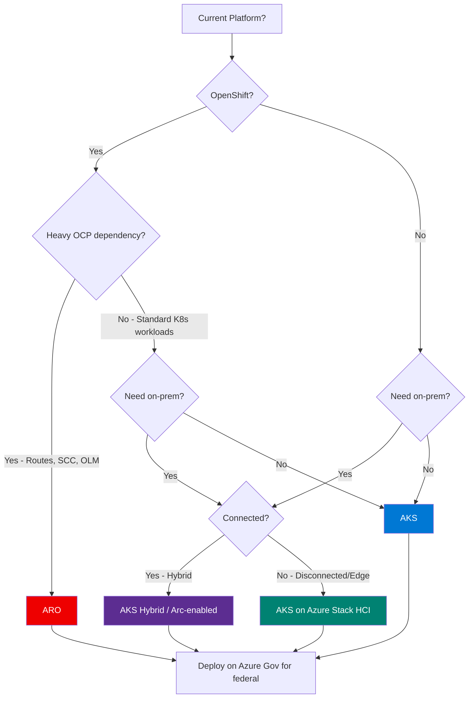
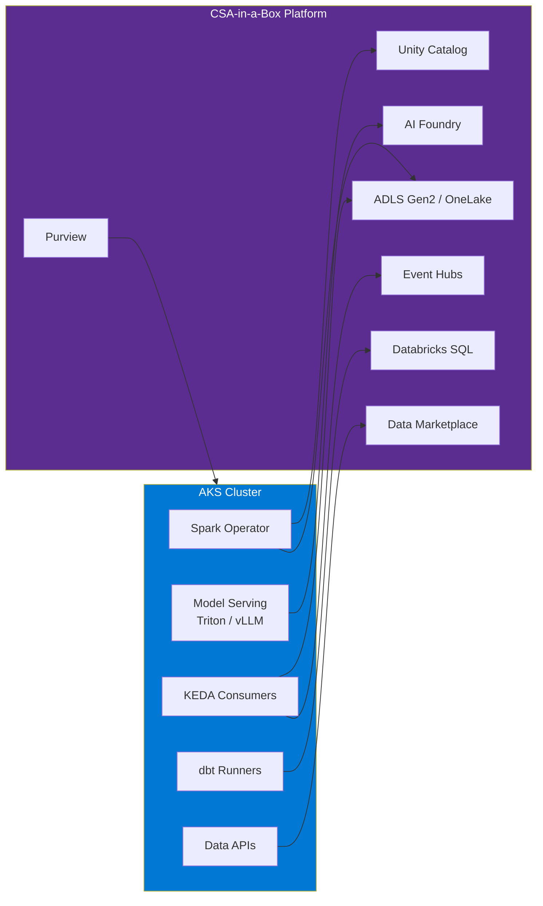
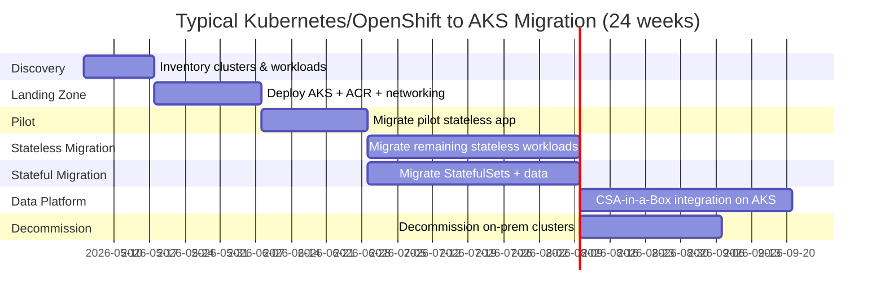

# Kubernetes / OpenShift to AKS Migration Center

**The definitive resource for migrating from self-managed Kubernetes and Red Hat OpenShift to Azure Kubernetes Service (AKS), Azure Red Hat OpenShift (ARO), and AKS Hybrid.**

---

## Who this is for

This migration center serves federal CIOs, CTOs, platform engineering leads, DevOps engineers, and application architects who are evaluating or executing a migration from self-managed Kubernetes clusters (kubeadm, Rancher, k3s, Tanzu) or Red Hat OpenShift (OCP 4.x) to Azure-managed container platforms. Whether you are responding to an Azure-first mandate, eliminating control-plane operational burden, consolidating container infrastructure onto a single hyperscaler, addressing compliance gaps (FedRAMP, STIG, FIPS), or modernizing data workloads with CSA-in-a-Box on AKS, these resources provide the evidence, patterns, and step-by-step guidance to execute confidently.

---

## Quick-start decision matrix

| Your situation                               | Start here                                                 |
| -------------------------------------------- | ---------------------------------------------------------- |
| Executive evaluating AKS vs self-managed K8s | [Why AKS (Executive Brief)](why-aks.md)                    |
| Need cost justification for migration        | [Total Cost of Ownership Analysis](tco-analysis.md)        |
| Need a feature-by-feature comparison         | [Complete Feature Mapping](feature-mapping-complete.md)    |
| Ready to plan a migration                    | [Migration Playbook](../kubernetes-to-aks.md)              |
| Federal/government-specific requirements     | [Federal Migration Guide](federal-migration-guide.md)      |
| Migrating cluster configuration              | [Cluster Migration](cluster-migration.md)                  |
| Migrating application workloads              | [Workload Migration](workload-migration.md)                |
| Migrating persistent storage                 | [Storage Migration](storage-migration.md)                  |
| Migrating networking and service mesh        | [Networking Migration](networking-migration.md)            |
| Migrating security and RBAC                  | [Security Migration](security-migration.md)                |
| Migrating CI/CD pipelines                    | [CI/CD Migration](cicd-migration.md)                       |
| Step-by-step Velero migration                | [Tutorial: Velero Migration](tutorial-velero-migration.md) |
| Step-by-step application migration           | [Tutorial: App Migration](tutorial-app-migration.md)       |

---

## Target platform decision matrix

Before starting, choose your target platform. The decision depends on your current platform, OpenShift dependency depth, hybrid requirements, and compliance posture.

| Factor                       | AKS                                           | ARO                        | AKS Hybrid (Arc)            | AKS on Azure Stack HCI      |
| ---------------------------- | --------------------------------------------- | -------------------------- | --------------------------- | --------------------------- |
| **Best for**                 | Standard K8s shops                            | Red Hat / OpenShift shops  | Hybrid on-prem + cloud      | Edge / disconnected         |
| **Control plane cost**       | Free (free tier) or $0.10/hr (standard)       | Included in ARO pricing    | Per-node pricing            | Azure Stack HCI licensing   |
| **Kubernetes conformance**   | CNCF conformant                               | OCP 4.x (K8s superset)     | CNCF conformant             | CNCF conformant             |
| **OpenShift compatibility**  | No (standard K8s only)                        | Full OCP 4.x               | No                          | No                          |
| **Azure integration depth**  | Deep (Entra, Key Vault, Monitor, ACR, Policy) | Moderate (Entra, Monitor)  | Deep (Arc-enabled)          | Moderate (Arc-enabled)      |
| **GPU support**              | Full (NC, ND, NV series)                      | Limited (GPU worker nodes) | Depends on on-prem hardware | Depends on HCI hardware     |
| **FIPS 140-2 node pools**    | Yes (native)                                  | Yes (OCP FIPS mode)        | Yes                         | Yes                         |
| **FedRAMP High**             | Inherited (Azure Gov)                         | Inherited (Azure Gov)      | Customer + Azure Gov        | Customer + Azure Gov        |
| **IL4/IL5**                  | Supported (Azure Gov)                         | Supported (Azure Gov)      | Depends on deployment       | Depends on deployment       |
| **Managed upgrades**         | Auto-upgrade channels                         | OCP upgrade channels       | Manual + Arc                | Manual + Arc                |
| **Typical migration effort** | 12--20 weeks                                  | 8--14 weeks (from OCP)     | 16--24 weeks                | 12--20 weeks                |
| **Monthly cost (50 nodes)**  | ~$15K--$30K                                   | ~$25K--$45K                | ~$20K--$35K + on-prem       | Azure Stack HCI + licensing |

### Decision flowchart

---

## Strategic resources

These documents provide the business case, cost analysis, and strategic framing for decision-makers.

| Document                                                | Audience                    | Description                                                                                                                                                                           |
| ------------------------------------------------------- | --------------------------- | ------------------------------------------------------------------------------------------------------------------------------------------------------------------------------------- |
| [Why AKS](why-aks.md)                                   | CIO / CTO / Board           | Executive white paper covering managed control plane, Azure integration, CNCF conformance, Copilot in AKS, cost advantages, and honest assessment of self-managed K8s strengths       |
| [Total Cost of Ownership Analysis](tco-analysis.md)     | CFO / CIO / Procurement     | Detailed pricing comparison of self-managed K8s, OpenShift, and AKS across three federal deployment sizes with 5-year TCO projections, FTE savings, and infrastructure cost reduction |
| [Complete Feature Mapping](feature-mapping-complete.md) | CTO / Platform Architecture | 50+ Kubernetes and OpenShift features mapped to AKS equivalents with migration complexity ratings, gap analysis, and CSA-in-a-Box integration points                                  |

---

## Migration guides

Domain-specific deep dives covering every aspect of a container platform migration.

| Guide                                           | Source capability                                       | AKS destination                                                     |
| ----------------------------------------------- | ------------------------------------------------------- | ------------------------------------------------------------------- |
| [Cluster Migration](cluster-migration.md)       | Cluster config, node pools, networking, autoscaling     | AKS cluster configuration, VM sizes, availability zones, autoscaler |
| [Workload Migration](workload-migration.md)     | Deployments, StatefulSets, CRDs, operators, Helm charts | Standard K8s manifests, Helm, Kustomize, AKS extensions             |
| [Storage Migration](storage-migration.md)       | Ceph, NFS, GlusterFS, local storage, Velero             | Azure Disk, Azure Files, Azure Blob CSI, Azure NetApp Files         |
| [Networking Migration](networking-migration.md) | CNI, Ingress, Service Mesh, Network Policies, DNS       | Azure CNI, NGINX/AGIC, Istio, Calico/Cilium, Azure DNS              |
| [Security Migration](security-migration.md)     | RBAC, SCCs, secrets, pod security, image scanning       | Entra Workload Identity, PSS, Key Vault, Defender for Containers    |
| [CI/CD Migration](cicd-migration.md)            | Jenkins, GitLab CI, Tekton, ArgoCD, image builds        | GitHub Actions, Azure DevOps, Flux, ArgoCD, ACR Tasks               |

---

## Tutorials

Step-by-step walkthroughs for common migration scenarios.

| Tutorial                                                       | Description                                                                                                     | Duration   |
| -------------------------------------------------------------- | --------------------------------------------------------------------------------------------------------------- | ---------- |
| [Velero Cross-Cluster Migration](tutorial-velero-migration.md) | Install Velero on source and target clusters, backup namespaces, restore workloads on AKS, validate, update DNS | 4--6 hours |
| [Stateful Application Migration](tutorial-app-migration.md)    | Migrate a PostgreSQL + API tier from on-prem K8s to AKS with persistent storage, Ingress, TLS, and monitoring   | 6--8 hours |

---

## Technical references

| Document                                                | Description                                                                                                      |
| ------------------------------------------------------- | ---------------------------------------------------------------------------------------------------------------- |
| [Complete Feature Mapping](feature-mapping-complete.md) | Every K8s/OpenShift feature mapped to its AKS equivalent with migration complexity and CSA-in-a-Box evidence     |
| [Benchmarks](benchmarks.md)                             | Pod scheduling latency, network throughput by CNI, storage IOPS by CSI driver, autoscaling response, API latency |
| [Best Practices](best-practices.md)                     | Cluster design, node pool strategy, namespace organization, monitoring, GitOps, CSA-in-a-Box integration         |

---

## Government and federal

| Document                                              | Description                                                                                                                                                                           |
| ----------------------------------------------------- | ------------------------------------------------------------------------------------------------------------------------------------------------------------------------------------- |
| [Federal Migration Guide](federal-migration-guide.md) | AKS in Azure Government, FedRAMP High, IL4/IL5, STIG-hardened images, FIPS crypto modules, Azure Policy for containers, image provenance with Notary v2, and agency-specific patterns |

---

## How CSA-in-a-Box fits

CSA-in-a-Box extends AKS from a generic container platform into a **governed data and AI platform**. Container workloads on AKS integrate directly with the CSA-in-a-Box architecture:

- **Containerized data pipelines**: Spark on Kubernetes (via Spark Operator) runs on AKS, reading from and writing to ADLS Gen2 / OneLake. Jobs are governed by Unity Catalog and lineage-tracked in Purview.
- **Model serving**: AI models trained in Azure ML or Databricks deploy to AKS GPU node pools (NC/ND series) using Triton Inference Server, vLLM, or TorchServe. Model endpoints register in AI Foundry and appear in the CSA-in-a-Box data marketplace.
- **Event-driven data processing**: KEDA on AKS scales data consumers based on Event Hubs partition lag. Consumers write to the medallion architecture (bronze/silver/gold) on ADLS Gen2.
- **dbt runners**: Containerized dbt jobs execute as Kubernetes CronJobs, running transformations against Databricks SQL Warehouses or Fabric SQL endpoints with contract validation.
- **Data API layer**: REST and GraphQL APIs serving data products from the CSA-in-a-Box data marketplace run on AKS with Entra Workload Identity authentication, AGIC traffic management, and Container Insights observability.
- **Compliance integration**: Azure Policy assignments on AKS clusters enforce the same compliance baselines (FedRAMP, CMMC, HIPAA) that govern the rest of the CSA-in-a-Box platform.

---

## Migration timeline overview

---

**Last updated:** 2026-04-30
**Maintainers:** CSA-in-a-Box core team
**Related:** [Migration Playbook](../kubernetes-to-aks.md) | [VMware Migration Center](../vmware-to-azure/index.md) | [AWS Migration](../aws-to-azure.md)
