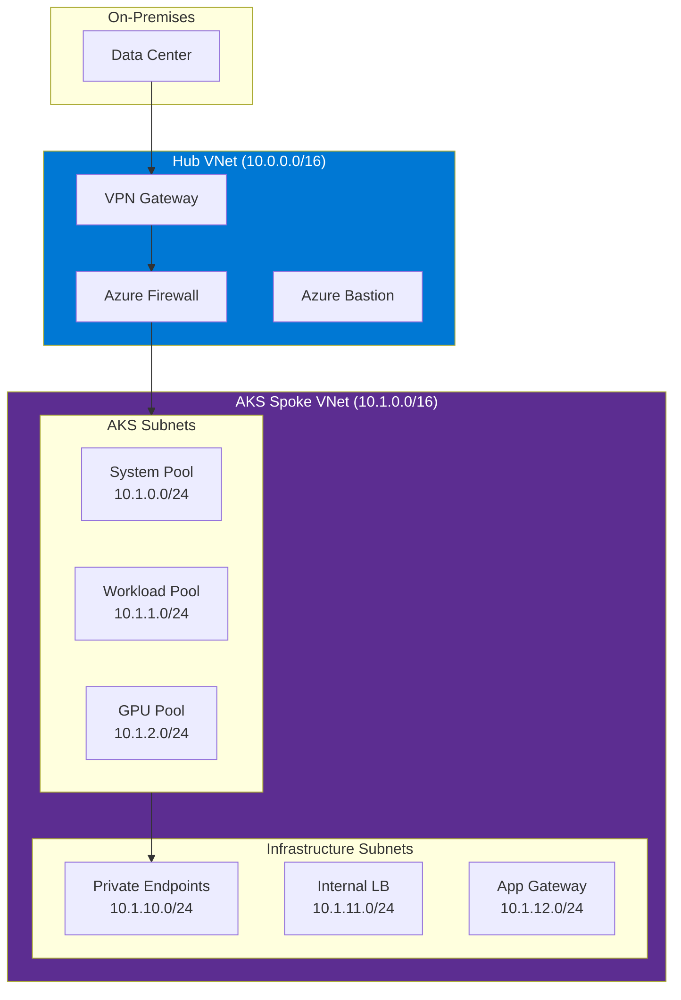

# Networking Migration: CNI, Ingress, Service Mesh, and Network Policies

**Status:** Authored 2026-04-30
**Audience:** Network engineers and platform architects migrating Kubernetes networking configurations to AKS.
**Scope:** CNI selection and migration, Ingress controller deployment, service mesh migration, network policy conversion, DNS, load balancing, and Private Link integration.

---

## 1. CNI migration

### CNI selection matrix

| Source CNI                     | Recommended AKS CNI                       | Migration effort | Notes                                                               |
| ------------------------------ | ----------------------------------------- | ---------------- | ------------------------------------------------------------------- |
| **Calico** (BGP or VXLAN)      | Azure CNI Overlay + Calico network policy | S                | Calico network policies work on AKS; dataplane changes to Azure CNI |
| **Cilium**                     | Azure CNI powered by Cilium               | XS               | First-class AKS integration; eBPF dataplane                         |
| **Flannel**                    | Azure CNI Overlay                         | S                | Similar overlay model; swap CNI config                              |
| **Weave Net**                  | Azure CNI Overlay                         | S                | Replace with Azure CNI Overlay                                      |
| **OVN-Kubernetes** (OpenShift) | Azure CNI + Cilium                        | M                | Replace OCP SDN with Azure-native                                   |
| **OpenShift SDN**              | Azure CNI Overlay                         | M                | Replace OCP SDN with Azure-native                                   |
| **Canal** (Calico + Flannel)   | Azure CNI Overlay + Calico                | S                | Azure CNI Overlay replaces Flannel; Calico policies preserved       |
| **kubenet**                    | Azure CNI Overlay                         | S                | Upgrade from kubenet to Azure CNI Overlay                           |

### Azure CNI Overlay configuration

Azure CNI Overlay is recommended for most migrations. Pods get IPs from a private overlay network (not VNet IPs), which simplifies IP address planning and scales to thousands of pods.

```bash
# Cluster with Azure CNI Overlay
az aks create \
  --network-plugin azure \
  --network-plugin-mode overlay \
  --pod-cidr 10.244.0.0/16 \
  ...
```

Key characteristics:

- Pod IPs from overlay CIDR (not VNet)
- No VNet IP exhaustion
- Up to 250 pods per node
- Compatible with Calico and Cilium network policies
- Service CIDR and pod CIDR are independent of VNet

### Azure CNI powered by Cilium

For advanced networking requirements (L7 network policy, DNS-aware policy, eBPF observability):

```bash
# Cluster with Azure CNI + Cilium
az aks create \
  --network-plugin azure \
  --network-plugin-mode overlay \
  --network-dataplane cilium \
  ...
```

Cilium provides:

- eBPF-based dataplane (no iptables chains)
- CiliumNetworkPolicy (L3/L4/L7 policy)
- FQDN-based egress policy
- Hubble observability (flow logs, service map)
- Transparent encryption (WireGuard)
- Bandwidth Manager (rate limiting per pod)

---

## 2. Ingress controller migration

### NGINX Ingress Controller

The most common Ingress controller. Works identically on AKS.

```bash
# Install NGINX Ingress Controller
helm repo add ingress-nginx https://kubernetes.github.io/ingress-nginx
helm install ingress-nginx ingress-nginx/ingress-nginx \
  --namespace ingress-nginx --create-namespace \
  --set controller.replicaCount=3 \
  --set controller.nodeSelector."kubernetes\.io/os"=linux \
  --set controller.service.annotations."service\.beta\.kubernetes\.io/azure-load-balancer-health-probe-request-path"=/healthz \
  --set controller.service.annotations."service\.beta\.kubernetes\.io/azure-load-balancer-internal"="true" \
  --set controller.service.externalTrafficPolicy=Local \
  --set controller.topologySpreadConstraints[0].maxSkew=1 \
  --set controller.topologySpreadConstraints[0].topologyKey=topology.kubernetes.io/zone \
  --set controller.topologySpreadConstraints[0].whenUnsatisfiable=DoNotSchedule
```

For internal-only access (federal common pattern):

```yaml
# Internal load balancer annotation
service:
    annotations:
        service.beta.kubernetes.io/azure-load-balancer-internal: "true"
        service.beta.kubernetes.io/azure-load-balancer-internal-subnet: "snet-aks-ingress"
```

### Application Gateway Ingress Controller (AGIC)

AGIC integrates AKS with Azure Application Gateway for L7 load balancing with WAF.

```bash
# Enable AGIC addon
az aks enable-addons \
  --resource-group rg-aks-prod \
  --name aks-prod-eastus2 \
  --addons ingress-appgw \
  --appgw-id /subscriptions/.../resourceGroups/.../providers/Microsoft.Network/applicationGateways/agw-aks-prod
```

AGIC-specific Ingress annotations:

```yaml
apiVersion: networking.k8s.io/v1
kind: Ingress
metadata:
    name: api-ingress
    annotations:
        kubernetes.io/ingress.class: azure/application-gateway
        appgw.ingress.kubernetes.io/ssl-redirect: "true"
        appgw.ingress.kubernetes.io/waf-policy-for-path: "/subscriptions/.../providers/Microsoft.Network/ApplicationGatewayWebApplicationFirewallPolicies/waf-policy"
        appgw.ingress.kubernetes.io/connection-draining: "true"
        appgw.ingress.kubernetes.io/connection-draining-timeout: "30"
spec:
    tls:
        - hosts:
              - api.app.gov
          secretName: api-tls
    rules:
        - host: api.app.gov
          http:
              paths:
                  - path: /api/
                    pathType: Prefix
                    backend:
                        service:
                            name: api-service
                            port:
                                number: 8080
```

### Ingress controller comparison for AKS

| Feature             | NGINX Ingress              | AGIC                    | Contour                |
| ------------------- | -------------------------- | ----------------------- | ---------------------- |
| **L7 routing**      | Yes                        | Yes (App Gateway)       | Yes (Envoy)            |
| **WAF**             | ModSecurity (self-managed) | Azure WAF v2 (managed)  | No built-in            |
| **TLS termination** | cert-manager               | App Gateway + Key Vault | cert-manager           |
| **Rate limiting**   | NGINX config               | App Gateway rules       | Envoy filters          |
| **WebSocket**       | Yes                        | Yes                     | Yes                    |
| **gRPC**            | Yes                        | Yes                     | Yes (native Envoy)     |
| **Internal LB**     | Annotation                 | App Gateway private IP  | Annotation             |
| **Scaling**         | Pod-based (HPA)            | App Gateway auto-scale  | Pod-based              |
| **Best for**        | General purpose            | WAF + Azure integration | Envoy-based ecosystems |

### OpenShift Route to Ingress migration

```yaml
# OpenShift Route
apiVersion: route.openshift.io/v1
kind: Route
metadata:
    name: api
spec:
    host: api.app.gov
    path: /api
    port:
        targetPort: http
    tls:
        termination: edge
        insecureEdgeTerminationPolicy: Redirect
    to:
        kind: Service
        name: api-service
        weight: 100
    wildcardPolicy: None


# Equivalent AKS Ingress
---
apiVersion: networking.k8s.io/v1
kind: Ingress
metadata:
    name: api
    annotations:
        nginx.ingress.kubernetes.io/ssl-redirect: "true"
        cert-manager.io/cluster-issuer: letsencrypt-prod
spec:
    ingressClassName: nginx
    tls:
        - hosts:
              - api.app.gov
          secretName: api-tls
    rules:
        - host: api.app.gov
          http:
              paths:
                  - path: /api
                    pathType: Prefix
                    backend:
                        service:
                            name: api-service
                            port:
                                number: 8080
```

---

## 3. Service mesh migration

### Istio migration

If you are running self-managed Istio, migrate to the AKS Istio-based service mesh addon for managed lifecycle.

```bash
# Enable Istio addon on AKS
az aks mesh enable \
  --resource-group rg-aks-prod \
  --name aks-prod-eastus2 \
  --revision asm-1-22

# Enable sidecar injection per namespace
kubectl label namespace production istio.io/rev=asm-1-22

# Restart deployments to inject sidecars
kubectl rollout restart deployment -n production
```

Existing Istio CRDs work unchanged:

- `VirtualService` -- traffic routing, retries, timeouts
- `DestinationRule` -- load balancing, circuit breaking, TLS settings
- `Gateway` -- ingress gateway configuration
- `PeerAuthentication` -- mTLS settings
- `AuthorizationPolicy` -- access control
- `ServiceEntry` -- external service registration

### OpenShift Service Mesh migration

OpenShift Service Mesh is Istio-based with additional OCP integration. Migration to AKS Istio addon:

| OCP Service Mesh component        | AKS equivalent                               | Notes                                                     |
| --------------------------------- | -------------------------------------------- | --------------------------------------------------------- |
| `ServiceMeshControlPlane` CR      | AKS Istio addon (managed)                    | No SMCP resource needed; addon manages control plane      |
| `ServiceMeshMemberRoll`           | Namespace labeling (`istio.io/rev=asm-X-XX`) | Label namespaces for sidecar injection                    |
| Kiali                             | Managed Grafana                              | Grafana with Istio dashboards replaces Kiali              |
| Jaeger                            | Application Insights (OpenTelemetry)         | OpenTelemetry SDK replaces Jaeger for distributed tracing |
| Istio CRDs (VirtualService, etc.) | Same CRDs on AKS                             | Direct migration; no changes needed                       |

---

## 4. Network policy migration

### Standard NetworkPolicy (Calico/Cilium)

Standard Kubernetes NetworkPolicy resources work on AKS without modification when using Calico or Cilium network policy engines.

```yaml
# This policy works on both on-prem K8s and AKS
apiVersion: networking.k8s.io/v1
kind: NetworkPolicy
metadata:
    name: allow-api-to-database
    namespace: production
spec:
    podSelector:
        matchLabels:
            app: database
    policyTypes:
        - Ingress
    ingress:
        - from:
              - podSelector:
                    matchLabels:
                        app: api-server
          ports:
              - protocol: TCP
                port: 5432
```

### OpenShift-specific network policy migration

OpenShift `EgressNetworkPolicy` and `EgressIP` need conversion:

```yaml
# OpenShift EgressNetworkPolicy (deprecated in OCP 4.x)
apiVersion: network.openshift.io/v1
kind: EgressNetworkPolicy
metadata:
    name: default
    namespace: production
spec:
    egress:
        - type: Allow
          to:
              cidrSelector: 10.0.0.0/8
        - type: Deny
          to:
              cidrSelector: 0.0.0.0/0


# AKS equivalent: Cilium CiliumNetworkPolicy
---
apiVersion: cilium.io/v2
kind: CiliumNetworkPolicy
metadata:
    name: egress-control
    namespace: production
spec:
    endpointSelector: {}
    egress:
        - toCIDR:
              - 10.0.0.0/8
        - toCIDRSet:
              - cidr: 0.0.0.0/0
                except:
                    - 10.0.0.0/8
          toPorts:
              - ports:
                    - port: "443"
                      protocol: TCP
```

### Default deny policy (recommended baseline)

```yaml
# Deny all ingress and egress by default
apiVersion: networking.k8s.io/v1
kind: NetworkPolicy
metadata:
    name: default-deny-all
    namespace: production
spec:
    podSelector: {}
    policyTypes:
        - Ingress
        - Egress
---
# Allow DNS (required for service discovery)
apiVersion: networking.k8s.io/v1
kind: NetworkPolicy
metadata:
    name: allow-dns
    namespace: production
spec:
    podSelector: {}
    policyTypes:
        - Egress
    egress:
        - to:
              - namespaceSelector:
                    matchLabels:
                        kubernetes.io/metadata.name: kube-system
          ports:
              - protocol: UDP
                port: 53
              - protocol: TCP
                port: 53
```

---

## 5. DNS configuration

### Internal DNS

AKS uses CoreDNS (managed by AKS) for in-cluster DNS. No migration required for standard Kubernetes service discovery (`service.namespace.svc.cluster.local`).

### Custom DNS configuration

If your on-prem cluster uses custom CoreDNS configuration (forward zones, custom resolvers):

```yaml
# CoreDNS ConfigMap customization on AKS
apiVersion: v1
kind: ConfigMap
metadata:
    name: coredns-custom
    namespace: kube-system
data:
    custom.server: |
        onprem.internal:53 {
          forward . 10.0.0.53 10.0.0.54
          cache 30
        }
        corp.gov:53 {
          forward . 10.1.0.10
          cache 30
        }
```

### External DNS

Use external-dns to automatically manage Azure DNS records from Ingress and Service resources:

```bash
helm install external-dns bitnami/external-dns \
  --namespace external-dns --create-namespace \
  --set provider=azure \
  --set azure.resourceGroup=rg-dns-prod \
  --set azure.tenantId=$TENANT_ID \
  --set azure.subscriptionId=$SUBSCRIPTION_ID \
  --set azure.useManagedIdentityExtension=true \
  --set policy=sync \
  --set txtOwnerId=aks-prod-eastus2
```

---

## 6. Load balancing

### Azure Load Balancer

AKS automatically provisions Azure Load Balancer for Service type: LoadBalancer.

```yaml
# External load balancer (default)
apiVersion: v1
kind: Service
metadata:
    name: api-service
spec:
    type: LoadBalancer
    ports:
        - port: 443
          targetPort: 8080
    selector:
        app: api-server


# Internal load balancer (federal common pattern)
---
apiVersion: v1
kind: Service
metadata:
    name: api-service-internal
    annotations:
        service.beta.kubernetes.io/azure-load-balancer-internal: "true"
        service.beta.kubernetes.io/azure-load-balancer-internal-subnet: "snet-aks-lb"
spec:
    type: LoadBalancer
    ports:
        - port: 443
          targetPort: 8080
    selector:
        app: api-server
```

### Load balancer migration from MetalLB

MetalLB is unnecessary on AKS. Remove MetalLB and use Azure Load Balancer directly. The migration is transparent -- Service type: LoadBalancer works automatically.

| MetalLB feature    | Azure Load Balancer equivalent           |
| ------------------ | ---------------------------------------- |
| Layer 2 mode (ARP) | Azure LB (automatic)                     |
| BGP mode           | Azure LB with static IP                  |
| IP address pool    | Azure LB frontend IP configuration       |
| Address sharing    | Multiple Services can share one Azure LB |

---

## 7. Private Link integration

### Private cluster API server

```bash
# Private cluster -- API server accessible only via Private Link
az aks create \
  --enable-private-cluster \
  --private-dns-zone system \
  ...
```

### Private endpoints for Azure PaaS services

Connect AKS pods to Azure services through private endpoints (no public internet):

```bash
# Create private endpoint for Azure SQL
az network private-endpoint create \
  --name pe-sql-prod \
  --resource-group rg-aks-prod \
  --vnet-name vnet-aks-prod \
  --subnet snet-private-endpoints \
  --private-connection-resource-id /subscriptions/.../providers/Microsoft.Sql/servers/sql-prod \
  --group-id sqlServer \
  --connection-name sql-prod-connection

# Create private DNS zone for Azure SQL
az network private-dns zone create \
  --resource-group rg-aks-prod \
  --name privatelink.database.windows.net

# Link DNS zone to VNet
az network private-dns zone vnet-link create \
  --resource-group rg-aks-prod \
  --zone-name privatelink.database.windows.net \
  --name link-aks-vnet \
  --virtual-network vnet-aks-prod \
  --registration-enabled false
```

Common private endpoints for CSA-in-a-Box integration:

| Azure service                 | Private DNS zone                       | Group ID          |
| ----------------------------- | -------------------------------------- | ----------------- |
| Azure Storage (blob)          | `privatelink.blob.core.windows.net`    | blob              |
| Azure Storage (ADLS Gen2)     | `privatelink.dfs.core.windows.net`     | dfs               |
| Azure Key Vault               | `privatelink.vaultcore.azure.net`      | vault             |
| Azure SQL                     | `privatelink.database.windows.net`     | sqlServer         |
| Azure Container Registry      | `privatelink.azurecr.io`               | registry          |
| Azure Monitor (Log Analytics) | `privatelink.ods.opinsights.azure.com` | azuremonitor      |
| Azure Event Hubs              | `privatelink.servicebus.windows.net`   | namespace         |
| Databricks (control plane)    | `privatelink.azuredatabricks.net`      | databricks_ui_api |

---

## 8. Network topology: hub-spoke for federal



---

## 9. Networking migration validation

- [ ] Pod-to-pod connectivity works across nodes (`kubectl exec -- curl`)
- [ ] Pod-to-service connectivity works (DNS resolution + TCP connection)
- [ ] Ingress routes traffic correctly (test each hostname/path)
- [ ] TLS certificates valid and auto-renewed (cert-manager)
- [ ] Network policies enforced (test denied connections)
- [ ] DNS custom forward zones resolve correctly
- [ ] Private endpoints reachable from pods (test connectivity to Azure PaaS)
- [ ] Egress traffic routed through Azure Firewall (if configured)
- [ ] Load balancer health probes passing
- [ ] Service mesh mTLS active (if Istio deployed)
- [ ] External-dns creating DNS records
- [ ] No public endpoints exposed that should be internal-only

---

**Maintainers:** CSA-in-a-Box core team
**Last updated:** 2026-04-30
**Related:** [Cluster Migration](cluster-migration.md) | [Security Migration](security-migration.md) | [Feature Mapping](feature-mapping-complete.md)
