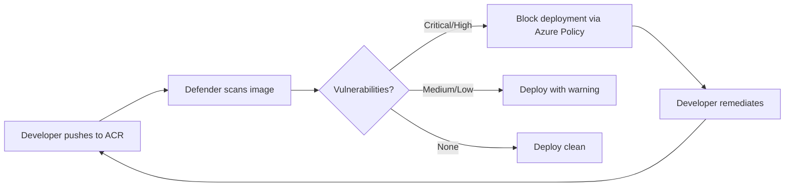

# Security Migration: RBAC, Pod Security, Identity, and Compliance

**Status:** Authored 2026-04-30
**Audience:** Security engineers and platform architects migrating Kubernetes security configurations to AKS.
**Scope:** RBAC mapping, Pod Security Standards, Entra Workload Identity, Azure Key Vault Secrets Provider, Defender for Containers, image scanning, and policy enforcement.

---

## 1. Authentication migration

### From kubeconfig certificates to Entra ID

Self-managed Kubernetes clusters typically use client certificates or static tokens for authentication. AKS integrates with Entra ID natively.

```bash
# Enable Entra ID integration (at cluster creation)
az aks create \
  --enable-aad \
  --aad-admin-group-object-ids "xxxxxxxx-xxxx-xxxx-xxxx-xxxxxxxxxxxx" \
  --enable-azure-rbac \
  --disable-local-accounts \
  ...

# Or enable on existing cluster
az aks update \
  --resource-group rg-aks-prod \
  --name aks-prod-eastus2 \
  --enable-aad \
  --aad-admin-group-object-ids "xxxxxxxx-xxxx-xxxx-xxxx-xxxxxxxxxxxx"
```

### Authentication method mapping

| Source method                       | AKS equivalent                      | Notes                                                                                   |
| ----------------------------------- | ----------------------------------- | --------------------------------------------------------------------------------------- |
| Client certificates (kubeconfig)    | Entra ID authentication (kubelogin) | `az aks get-credentials` generates Entra ID-based kubeconfig                            |
| Static tokens (token file)          | Entra ID tokens                     | Static tokens should never be used in production                                        |
| OIDC provider (Dex, Keycloak)       | Entra ID (native)                   | Remove OIDC proxy. Entra ID is the native OIDC provider                                 |
| LDAP/AD integration (via OIDC)      | Entra ID (direct)                   | Entra ID replaces the LDAP/AD → OIDC bridge                                             |
| Service account tokens (in-cluster) | Entra Workload Identity             | Service accounts remain for in-cluster auth; Workload Identity for Azure service access |

### Conditional Access for kubectl

Apply Entra Conditional Access policies to Kubernetes API access:

- **Require MFA** for cluster-admin operations
- **Require compliant device** for production cluster access
- **Block access from untrusted networks** (IP-based conditions)
- **Require specific authentication methods** (passwordless, FIDO2)

---

## 2. RBAC migration

### Kubernetes RBAC with Entra ID groups

Map on-prem Kubernetes RBAC bindings to Entra ID groups:

```yaml
# Before (on-prem): RBAC binding to local user
apiVersion: rbac.authorization.k8s.io/v1
kind: ClusterRoleBinding
metadata:
    name: cluster-admin-binding
subjects:
    - kind: User
      name: admin@internal.gov
      apiGroup: rbac.authorization.k8s.io
roleRef:
    kind: ClusterRole
    name: cluster-admin
    apiGroup: rbac.authorization.k8s.io


# After (AKS): RBAC binding to Entra ID group
---
apiVersion: rbac.authorization.k8s.io/v1
kind: ClusterRoleBinding
metadata:
    name: cluster-admin-binding
subjects:
    - kind: Group
      name: "xxxxxxxx-xxxx-xxxx-xxxx-xxxxxxxxxxxx" # Entra ID group Object ID
      apiGroup: rbac.authorization.k8s.io
roleRef:
    kind: ClusterRole
    name: cluster-admin
    apiGroup: rbac.authorization.k8s.io
```

### Azure RBAC for Kubernetes (alternative)

Azure RBAC for Kubernetes maps Azure roles to Kubernetes permissions, managed entirely in Azure:

| Azure built-in role                         | Kubernetes equivalent | Use case                       |
| ------------------------------------------- | --------------------- | ------------------------------ |
| Azure Kubernetes Service RBAC Cluster Admin | `cluster-admin`       | Full cluster administration    |
| Azure Kubernetes Service RBAC Admin         | `admin` (namespaced)  | Namespace-level administration |
| Azure Kubernetes Service RBAC Writer        | `edit` (namespaced)   | Deploy and manage workloads    |
| Azure Kubernetes Service RBAC Reader        | `view` (namespaced)   | Read-only access to resources  |

```bash
# Assign Azure RBAC role for K8s access
az role assignment create \
  --role "Azure Kubernetes Service RBAC Writer" \
  --assignee-object-id "xxxxxxxx-xxxx-xxxx-xxxx-xxxxxxxxxxxx" \
  --scope "/subscriptions/.../resourceGroups/rg-aks-prod/providers/Microsoft.ContainerService/managedClusters/aks-prod-eastus2/namespaces/production"
```

### Namespace-level RBAC migration pattern

```yaml
# Namespace-scoped role for application team
apiVersion: rbac.authorization.k8s.io/v1
kind: Role
metadata:
    name: app-team-role
    namespace: production
rules:
    - apiGroups: ["", "apps", "batch", "networking.k8s.io"]
      resources:
          [
              "deployments",
              "services",
              "pods",
              "configmaps",
              "jobs",
              "cronjobs",
              "ingresses",
          ]
      verbs: ["get", "list", "watch", "create", "update", "patch", "delete"]
    - apiGroups: [""]
      resources: ["secrets"]
      verbs: ["get", "list", "watch"] # No create/update for secrets (managed in Key Vault)
    - apiGroups: [""]
      resources: ["pods/log", "pods/exec"]
      verbs: ["get", "create"]
---
apiVersion: rbac.authorization.k8s.io/v1
kind: RoleBinding
metadata:
    name: app-team-binding
    namespace: production
subjects:
    - kind: Group
      name: "xxxxxxxx-xxxx-xxxx-xxxx-xxxxxxxxxxxx" # Entra ID group: App Team Production
      apiGroup: rbac.authorization.k8s.io
roleRef:
    kind: Role
    name: app-team-role
    apiGroup: rbac.authorization.k8s.io
```

---

## 3. Pod Security Standards (replacing PSP and SCC)

### Pod Security Policy to Pod Security Standards migration

Pod Security Policies (PSP) were deprecated in K8s 1.21 and removed in 1.25. AKS uses Pod Security Standards (PSS) with Pod Security Admission (PSA).

| PSP / SCC level                                  | PSS level    | Description                                                 |
| ------------------------------------------------ | ------------ | ----------------------------------------------------------- |
| `privileged` / SCC `privileged`                  | `privileged` | Unrestricted; system workloads only                         |
| `restricted` with some relaxation / SCC `anyuid` | `baseline`   | Prevents known privilege escalations; allows most workloads |
| `restricted` / SCC `restricted`                  | `restricted` | Heavily restricted; best security posture                   |

### Applying PSS to namespaces

```yaml
apiVersion: v1
kind: Namespace
metadata:
    name: production
    labels:
        # Enforce restricted PSS (block non-compliant pods)
        pod-security.kubernetes.io/enforce: restricted
        pod-security.kubernetes.io/enforce-version: latest
        # Audit and warn on restricted violations
        pod-security.kubernetes.io/audit: restricted
        pod-security.kubernetes.io/warn: restricted
```

### OpenShift SCC to PSS mapping

| OpenShift SCC      | PSS level                                  | Migration notes                                                                 |
| ------------------ | ------------------------------------------ | ------------------------------------------------------------------------------- |
| `privileged`       | `privileged`                               | System workloads; apply to kube-system only                                     |
| `anyuid`           | `baseline`                                 | Most common. Remove `runAsUser: RunAsAny`; set explicit `runAsUser` in pod spec |
| `restricted`       | `restricted`                               | Direct mapping. May need `seccompProfile` and `runAsNonRoot` in pod spec        |
| `hostaccess`       | `privileged` (restricted to specific pods) | Limit to DaemonSets that need host access; use Gatekeeper exceptions            |
| `hostmount-anyuid` | `baseline` + volume exceptions             | Use Gatekeeper to allow specific hostPath mounts                                |
| `nonroot`          | `restricted`                               | Direct mapping                                                                  |
| `hostnetwork`      | `privileged` (restricted to specific pods) | Limit to Ingress controllers and monitoring DaemonSets                          |

### Common pod security adjustments

```yaml
# Before: Pod relying on SCC anyuid (running as root)
spec:
  containers:
    - name: app
      image: legacy-app:latest  # Runs as root by default

# After: Pod compliant with PSS restricted
spec:
  securityContext:
    runAsNonRoot: true
    runAsUser: 1000
    runAsGroup: 1000
    fsGroup: 1000
    seccompProfile:
      type: RuntimeDefault
  containers:
    - name: app
      image: csainaboxacr.azurecr.io/legacy-app:latest
      securityContext:
        allowPrivilegeEscalation: false
        readOnlyRootFilesystem: true
        capabilities:
          drop:
            - ALL
```

---

## 4. Entra Workload Identity

Entra Workload Identity replaces pod-managed identity (aad-pod-identity) and service account token-based authentication to Azure services.

### Setup

```bash
# 1. Create managed identity
az identity create \
  --name umi-app-prod \
  --resource-group rg-aks-prod

# 2. Create federated credential
az identity federated-credential create \
  --name fc-app-prod \
  --identity-name umi-app-prod \
  --resource-group rg-aks-prod \
  --issuer $(az aks show -g rg-aks-prod -n aks-prod-eastus2 --query oidcIssuerProfile.issuerUrl -o tsv) \
  --subject system:serviceaccount:production:app-sa \
  --audience api://AzureADTokenExchange

# 3. Grant Azure permissions to managed identity
az role assignment create \
  --role "Storage Blob Data Contributor" \
  --assignee $(az identity show -g rg-aks-prod -n umi-app-prod --query principalId -o tsv) \
  --scope /subscriptions/.../resourceGroups/rg-storage/providers/Microsoft.Storage/storageAccounts/stcsainbox

# 4. Create Kubernetes service account with Workload Identity annotation
kubectl apply -f - << 'EOF'
apiVersion: v1
kind: ServiceAccount
metadata:
  name: app-sa
  namespace: production
  annotations:
    azure.workload.identity/client-id: "xxxxxxxx-xxxx-xxxx-xxxx-xxxxxxxxxxxx"
EOF

# 5. Deploy pod with Workload Identity
kubectl apply -f - << 'EOF'
apiVersion: apps/v1
kind: Deployment
metadata:
  name: app
  namespace: production
spec:
  template:
    metadata:
      labels:
        azure.workload.identity/use: "true"
    spec:
      serviceAccountName: app-sa
      containers:
        - name: app
          image: csainaboxacr.azurecr.io/app:latest
          env:
            - name: AZURE_STORAGE_ACCOUNT
              value: stcsainbox
EOF
```

### Identity migration mapping

| Source identity method              | AKS equivalent                      | Migration path                                                    |
| ----------------------------------- | ----------------------------------- | ----------------------------------------------------------------- |
| K8s Secret with Azure credentials   | Workload Identity                   | Remove Secret; configure federated credential                     |
| aad-pod-identity (NMI)              | Workload Identity                   | Remove NMI DaemonSet; use federated credentials                   |
| Service account token + custom auth | Workload Identity                   | Replace custom auth code with DefaultAzureCredential SDK          |
| On-prem Vault (HashiCorp)           | Azure Key Vault + Workload Identity | Migrate secrets to Key Vault; authenticate with Workload Identity |
| AWS IRSA (if multi-cloud)           | Workload Identity                   | Azure equivalent of AWS IRSA                                      |

---

## 5. Azure Key Vault Secrets Provider

### Installation and configuration

```bash
# Enable Key Vault Secrets Provider addon
az aks enable-addons \
  --resource-group rg-aks-prod \
  --name aks-prod-eastus2 \
  --addons azure-keyvault-secrets-provider \
  --enable-secret-rotation \
  --rotation-poll-interval 2m
```

### Mount secrets from Key Vault

```yaml
# SecretProviderClass
apiVersion: secrets-store.csi.x-k8s.io/v1
kind: SecretProviderClass
metadata:
    name: kv-secrets
    namespace: production
spec:
    provider: azure
    parameters:
        usePodIdentity: "false"
        useVMManagedIdentity: "false"
        clientID: "xxxxxxxx-xxxx-xxxx-xxxx-xxxxxxxxxxxx" # Workload Identity client ID
        keyvaultName: kv-csa-prod
        tenantId: "xxxxxxxx-xxxx-xxxx-xxxx-xxxxxxxxxxxx"
        objects: |
            array:
              - |
                objectName: db-password
                objectType: secret
              - |
                objectName: api-key
                objectType: secret
              - |
                objectName: tls-cert
                objectType: secret
    secretObjects:
        - secretName: app-secrets
          type: Opaque
          data:
              - objectName: db-password
                key: DB_PASSWORD
              - objectName: api-key
                key: API_KEY
---
# Pod mounting Key Vault secrets
apiVersion: apps/v1
kind: Deployment
metadata:
    name: app
    namespace: production
spec:
    template:
        metadata:
            labels:
                azure.workload.identity/use: "true"
        spec:
            serviceAccountName: app-sa
            containers:
                - name: app
                  image: csainaboxacr.azurecr.io/app:latest
                  envFrom:
                      - secretRef:
                            name: app-secrets
                  volumeMounts:
                      - name: secrets-store
                        mountPath: "/mnt/secrets"
                        readOnly: true
            volumes:
                - name: secrets-store
                  csi:
                      driver: secrets-store.csi.k8s.io
                      readOnly: true
                      volumeAttributes:
                          secretProviderClass: kv-secrets
```

---

## 6. Defender for Containers

### Enable Defender for Containers

```bash
# Enable at subscription level
az security pricing create \
  --name Containers \
  --tier standard

# Enable on AKS cluster
az aks update \
  --resource-group rg-aks-prod \
  --name aks-prod-eastus2 \
  --enable-defender
```

### Defender capabilities

| Capability                   | Description                                                                                 | Replaces                          |
| ---------------------------- | ------------------------------------------------------------------------------------------- | --------------------------------- |
| **Vulnerability assessment** | Scans ACR images for CVEs; powered by Microsoft Defender Vulnerability Management           | Trivy, Clair, Anchore             |
| **Runtime threat detection** | Detects suspicious container behavior (crypto mining, reverse shells, privilege escalation) | Falco, Sysdig                     |
| **Admission control**        | Blocks deployment of images with critical vulnerabilities                                   | OPA Gatekeeper admission webhooks |
| **Binary drift detection**   | Detects executables running in containers that are not part of the original image           | Custom runtime security           |
| **Network analytics**        | Maps container network flows and detects anomalies                                          | Network monitoring tools          |

### Image scanning workflow



---

## 7. Azure Policy for Kubernetes (Gatekeeper)

### Built-in policy initiatives

| Initiative                                     | Description                   | Policies     |
| ---------------------------------------------- | ----------------------------- | ------------ |
| **Kubernetes cluster pod security baseline**   | Enforces PSS baseline level   | 8 policies   |
| **Kubernetes cluster pod security restricted** | Enforces PSS restricted level | 12 policies  |
| **CIS Microsoft Azure Foundations Benchmark**  | CIS benchmark for AKS         | 20+ policies |
| **NIST SP 800-53 Rev 5**                       | NIST controls for containers  | 30+ policies |

### Assign policy initiative

```bash
# Assign pod security restricted initiative
az policy assignment create \
  --name "aks-pod-security-restricted" \
  --display-name "AKS Pod Security Restricted" \
  --policy-set-definition "42b8ef37-b724-4e24-bbc8-7a7708edfe00" \
  --scope "/subscriptions/.../resourceGroups/rg-aks-prod/providers/Microsoft.ContainerService/managedClusters/aks-prod-eastus2" \
  --params '{"effect": {"value": "deny"}}'
```

### Custom policy examples

```yaml
# Require approved container registries only
apiVersion: templates.gatekeeper.sh/v1
kind: ConstraintTemplate
metadata:
    name: k8sallowedregistries
spec:
    crd:
        spec:
            names:
                kind: K8sAllowedRegistries
            validation:
                openAPIV3Schema:
                    type: object
                    properties:
                        registries:
                            type: array
                            items:
                                type: string
    targets:
        - target: admission.k8s.gatekeeper.sh
          rego: |
              package k8sallowedregistries
              violation[{"msg": msg}] {
                container := input.review.object.spec.containers[_]
                not startswith(container.image, input.parameters.registries[_])
                msg := sprintf("Container image '%v' is not from an approved registry", [container.image])
              }
---
apiVersion: constraints.gatekeeper.sh/v1beta1
kind: K8sAllowedRegistries
metadata:
    name: require-approved-registries
spec:
    match:
        kinds:
            - apiGroups: [""]
              kinds: ["Pod"]
        excludedNamespaces:
            - kube-system
            - gatekeeper-system
    parameters:
        registries:
            - "csainaboxacr.azurecr.io/"
            - "mcr.microsoft.com/"
```

---

## 8. Image provenance and signing

### Notation (Notary v2) for image signing

```bash
# Install Notation
az acr notation install

# Sign an image
notation sign \
  --signature-format cose \
  csainaboxacr.azurecr.io/app:v2.3.1

# Verify an image
notation verify \
  csainaboxacr.azurecr.io/app:v2.3.1

# Enforce signed images via Ratify on AKS
helm install ratify ratify/ratify \
  --namespace gatekeeper-system \
  --set featureFlags.RATIFY_CERT_ROTATION=true
```

---

## 9. Security migration checklist

- [ ] Entra ID integration enabled on AKS cluster
- [ ] Local accounts disabled
- [ ] RBAC bindings mapped to Entra ID groups
- [ ] Pod Security Standards enforced per namespace
- [ ] Workload Identity configured for all pods accessing Azure services
- [ ] Secrets migrated to Azure Key Vault
- [ ] Key Vault Secrets Provider CSI driver installed and configured
- [ ] Defender for Containers enabled (vulnerability scanning + runtime protection)
- [ ] Azure Policy initiatives assigned (CIS, PSS, NIST)
- [ ] Container images pushed to ACR (no external registries in production)
- [ ] Image signing configured (Notation)
- [ ] Network policies enforced (default-deny + explicit allow)
- [ ] Private cluster enabled (no public API server endpoint)
- [ ] Audit logs flowing to Log Analytics
- [ ] Conditional Access policies applied to kubectl access

---

**Maintainers:** CSA-in-a-Box core team
**Last updated:** 2026-04-30
**Related:** [Cluster Migration](cluster-migration.md) | [Networking Migration](networking-migration.md) | [Federal Migration Guide](federal-migration-guide.md)
