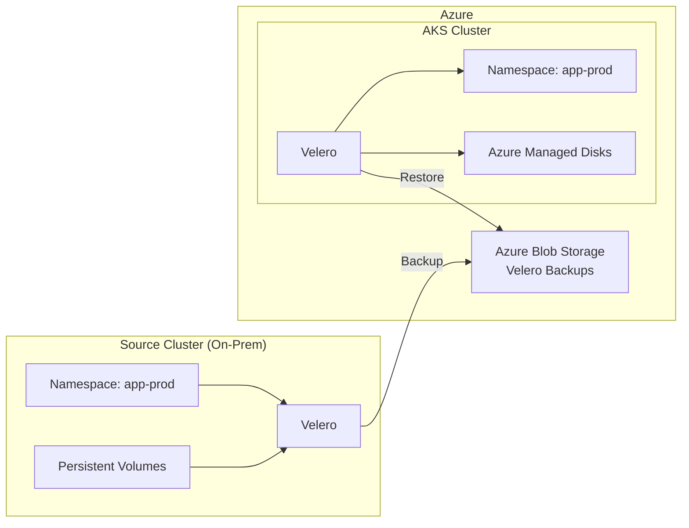

# Tutorial: Cross-Cluster Migration with Velero

**Status:** Authored 2026-04-30
**Audience:** Platform engineers performing a cluster migration from on-premises Kubernetes to AKS using Velero for backup and restore.
**Duration:** 4--6 hours for a single namespace migration. Scale linearly for additional namespaces.
**Prerequisites:** Source K8s cluster accessible, AKS cluster deployed (see [Cluster Migration](cluster-migration.md)), Azure Blob Storage account for Velero backups, Helm 3.x installed.

---

## Overview

This tutorial walks through migrating workloads from an on-premises Kubernetes cluster to AKS using Velero for backup and restore. Velero handles the heavy lifting: it backs up Kubernetes resources and persistent volume data from the source cluster and restores them on AKS with storage class mapping.



---

## Step 1: Prepare Azure resources

### Create storage account for Velero backups

```bash
# Variables
AZURE_BACKUP_RESOURCE_GROUP=rg-velero-backups
AZURE_STORAGE_ACCOUNT_ID="stvelerbackups$(openssl rand -hex 4)"
BLOB_CONTAINER=velero

# Create resource group
az group create \
  --name $AZURE_BACKUP_RESOURCE_GROUP \
  --location eastus2

# Create storage account
az storage account create \
  --name $AZURE_STORAGE_ACCOUNT_ID \
  --resource-group $AZURE_BACKUP_RESOURCE_GROUP \
  --sku Standard_GRS \
  --encryption-services blob \
  --https-only true \
  --kind StorageV2 \
  --min-tls-version TLS1_2

# Create blob container
az storage container create \
  --name $BLOB_CONTAINER \
  --account-name $AZURE_STORAGE_ACCOUNT_ID \
  --public-access off
```

### Create managed identity for Velero

```bash
# Create managed identity
az identity create \
  --name umi-velero \
  --resource-group $AZURE_BACKUP_RESOURCE_GROUP

VELERO_IDENTITY_CLIENT_ID=$(az identity show \
  --name umi-velero \
  --resource-group $AZURE_BACKUP_RESOURCE_GROUP \
  --query clientId -o tsv)

VELERO_IDENTITY_PRINCIPAL_ID=$(az identity show \
  --name umi-velero \
  --resource-group $AZURE_BACKUP_RESOURCE_GROUP \
  --query principalId -o tsv)

# Grant Velero access to storage account
az role assignment create \
  --role "Storage Blob Data Contributor" \
  --assignee-principal-type ServicePrincipal \
  --assignee-object-id $VELERO_IDENTITY_PRINCIPAL_ID \
  --scope /subscriptions/$SUBSCRIPTION_ID/resourceGroups/$AZURE_BACKUP_RESOURCE_GROUP/providers/Microsoft.Storage/storageAccounts/$AZURE_STORAGE_ACCOUNT_ID

# Grant Velero access to AKS managed disk snapshots
az role assignment create \
  --role "Contributor" \
  --assignee-principal-type ServicePrincipal \
  --assignee-object-id $VELERO_IDENTITY_PRINCIPAL_ID \
  --scope /subscriptions/$SUBSCRIPTION_ID/resourceGroups/$(az aks show -g rg-aks-prod -n aks-prod-eastus2 --query nodeResourceGroup -o tsv)
```

---

## Step 2: Install Velero on source cluster

### Install Velero CLI

```bash
# Download Velero CLI
VELERO_VERSION=v1.14.0
curl -fsSL https://github.com/vmware-tanzu/velero/releases/download/${VELERO_VERSION}/velero-${VELERO_VERSION}-linux-amd64.tar.gz | \
  tar xz --strip-components=1 -C /usr/local/bin velero-${VELERO_VERSION}-linux-amd64/velero
```

### Create credentials file for source cluster

```bash
# For source cluster: use Azure SP credentials (since source is not on Azure)
cat > credentials-velero-source << EOF
AZURE_SUBSCRIPTION_ID=${SUBSCRIPTION_ID}
AZURE_TENANT_ID=${TENANT_ID}
AZURE_CLIENT_ID=${SP_CLIENT_ID}
AZURE_CLIENT_SECRET=${SP_CLIENT_SECRET}
AZURE_RESOURCE_GROUP=${AZURE_BACKUP_RESOURCE_GROUP}
AZURE_CLOUD_NAME=AzurePublicCloud
EOF
```

### Install Velero on source cluster

```bash
# Switch to source cluster context
kubectl config use-context source-cluster

# Install Velero with Azure plugin
velero install \
  --provider azure \
  --plugins velero/velero-plugin-for-microsoft-azure:v1.10.0 \
  --bucket $BLOB_CONTAINER \
  --secret-file credentials-velero-source \
  --backup-location-config \
    resourceGroup=$AZURE_BACKUP_RESOURCE_GROUP,storageAccount=$AZURE_STORAGE_ACCOUNT_ID,subscriptionId=$SUBSCRIPTION_ID \
  --snapshot-location-config \
    apiTimeout=10m,resourceGroup=$AZURE_BACKUP_RESOURCE_GROUP,subscriptionId=$SUBSCRIPTION_ID \
  --use-node-agent \
  --default-volumes-to-fs-backup

# Verify Velero is running
kubectl get pods -n velero
velero version
```

---

## Step 3: Backup workloads on source cluster

### Backup a single namespace

```bash
# Backup the app-prod namespace with all resources and PV data
velero backup create app-prod-backup \
  --include-namespaces app-prod \
  --default-volumes-to-fs-backup=true \
  --wait

# Check backup status
velero backup describe app-prod-backup --details
velero backup logs app-prod-backup
```

### Backup multiple namespaces

```bash
# Backup all application namespaces
velero backup create full-migration-backup \
  --include-namespaces app-prod,app-staging,databases,monitoring \
  --default-volumes-to-fs-backup=true \
  --exclude-resources events,events.events.k8s.io \
  --wait

# Verify backup
velero backup describe full-migration-backup --details
```

### Backup with label selectors

```bash
# Backup only workloads with migration label
velero backup create wave1-backup \
  --selector migration-wave=1 \
  --default-volumes-to-fs-backup=true \
  --wait
```

### Verify backup contents

```bash
# List backed-up resources
velero backup describe app-prod-backup --details

# Check for warnings or errors
velero backup logs app-prod-backup | grep -E "error|warn"

# List backed-up PVs
velero backup describe app-prod-backup --details | grep -A 20 "Volumes"
```

---

## Step 4: Install Velero on AKS cluster

### Configure Velero with Workload Identity on AKS

```bash
# Switch to AKS cluster context
az aks get-credentials --resource-group rg-aks-prod --name aks-prod-eastus2

# Create federated credential for Velero service account
az identity federated-credential create \
  --name fc-velero \
  --identity-name umi-velero \
  --resource-group $AZURE_BACKUP_RESOURCE_GROUP \
  --issuer $(az aks show -g rg-aks-prod -n aks-prod-eastus2 --query oidcIssuerProfile.issuerUrl -o tsv) \
  --subject system:serviceaccount:velero:velero \
  --audience api://AzureADTokenExchange

# Install Velero on AKS with Workload Identity
helm repo add vmware-tanzu https://vmware-tanzu.github.io/helm-charts
helm install velero vmware-tanzu/velero \
  --namespace velero --create-namespace \
  --set credentials.useSecret=false \
  --set configuration.backupStorageLocation[0].name=azure \
  --set configuration.backupStorageLocation[0].provider=azure \
  --set configuration.backupStorageLocation[0].bucket=$BLOB_CONTAINER \
  --set configuration.backupStorageLocation[0].config.resourceGroup=$AZURE_BACKUP_RESOURCE_GROUP \
  --set configuration.backupStorageLocation[0].config.storageAccount=$AZURE_STORAGE_ACCOUNT_ID \
  --set configuration.backupStorageLocation[0].config.subscriptionId=$SUBSCRIPTION_ID \
  --set configuration.volumeSnapshotLocation[0].name=azure \
  --set configuration.volumeSnapshotLocation[0].provider=azure \
  --set configuration.volumeSnapshotLocation[0].config.resourceGroup=$AZURE_BACKUP_RESOURCE_GROUP \
  --set configuration.volumeSnapshotLocation[0].config.subscriptionId=$SUBSCRIPTION_ID \
  --set initContainers[0].name=velero-plugin-for-microsoft-azure \
  --set initContainers[0].image=velero/velero-plugin-for-microsoft-azure:v1.10.0 \
  --set initContainers[0].volumeMounts[0].mountPath=/target \
  --set initContainers[0].volumeMounts[0].name=plugins \
  --set deployNodeAgent=true \
  --set serviceAccount.server.annotations."azure\.workload\.identity/client-id"=$VELERO_IDENTITY_CLIENT_ID \
  --set podLabels."azure\.workload\.identity/use"="true"
```

### Configure storage class mapping

```bash
# Create ConfigMap for storage class mapping
kubectl apply -f - << 'EOF'
apiVersion: v1
kind: ConfigMap
metadata:
  name: change-storage-class-config
  namespace: velero
  labels:
    velero.io/plugin-config: ""
    velero.io/change-storage-class: RestoreItemAction
data:
  ceph-block: managed-csi-premium
  rook-ceph-block: managed-csi-premium
  cephfs: azurefile-csi-nfs-premium
  rook-cephfs: azurefile-csi-nfs-premium
  nfs-client: azurefile-csi-nfs-premium
  local-path: managed-csi-premium
  hostpath: managed-csi-premium
  glusterfs: azurefile-csi-premium
  longhorn: managed-csi-premium
EOF
```

### Verify Velero can see source backups

```bash
# Velero should see backups from the shared Blob storage
velero backup get

# Expected output:
# NAME                  STATUS      ERRORS   WARNINGS   CREATED
# app-prod-backup       Completed   0        0          2026-04-30 10:00:00
```

---

## Step 5: Restore workloads on AKS

### Restore a single namespace

```bash
# Restore the app-prod namespace
velero restore create app-prod-restore \
  --from-backup app-prod-backup \
  --wait

# Check restore status
velero restore describe app-prod-restore --details
velero restore logs app-prod-restore
```

### Restore with resource exclusions

```bash
# Restore but exclude resources that should be recreated on AKS
velero restore create app-prod-restore \
  --from-backup app-prod-backup \
  --exclude-resources storageclasses,nodes,persistentvolumes \
  --wait
```

### Restore with namespace mapping

```bash
# Restore to a different namespace (e.g., for validation)
velero restore create app-prod-validate \
  --from-backup app-prod-backup \
  --namespace-mappings app-prod:app-prod-validate \
  --wait
```

---

## Step 6: Validate restored workloads

### Basic validation

```bash
# Check all pods are running
kubectl get pods -n app-prod -o wide

# Check PVCs are bound
kubectl get pvc -n app-prod

# Check services have endpoints
kubectl get endpoints -n app-prod

# Check Ingress resources
kubectl get ingress -n app-prod

# Check events for errors
kubectl get events -n app-prod --sort-by='.lastTimestamp' | tail -20
```

### Application-level validation

```bash
# Port-forward to test application
kubectl port-forward svc/api-service 8080:8080 -n app-prod &

# Test health endpoint
curl http://localhost:8080/health

# Test critical API endpoints
curl http://localhost:8080/api/v1/status

# Run integration tests
kubectl run test-runner --rm -it \
  --image=csainaboxacr.azurecr.io/tools/test-runner:latest \
  --namespace app-prod \
  -- pytest /tests/integration/
```

### Data validation for stateful workloads

```bash
# Connect to database and verify data
kubectl exec -it postgres-0 -n app-prod -- psql -U postgres -c "SELECT count(*) FROM important_table;"

# Compare row counts with source
# Source: kubectl exec on source cluster
# AKS: kubectl exec on AKS cluster
# Counts should match
```

---

## Step 7: Update DNS and Ingress

### Create Ingress resources (if not restored)

```bash
# Apply AKS-specific Ingress (replacing OpenShift Routes)
kubectl apply -f - << 'EOF'
apiVersion: networking.k8s.io/v1
kind: Ingress
metadata:
  name: api-ingress
  namespace: app-prod
  annotations:
    nginx.ingress.kubernetes.io/ssl-redirect: "true"
    cert-manager.io/cluster-issuer: letsencrypt-prod
spec:
  ingressClassName: nginx
  tls:
    - hosts:
        - api.app.gov
      secretName: api-tls
  rules:
    - host: api.app.gov
      http:
        paths:
          - path: /
            pathType: Prefix
            backend:
              service:
                name: api-service
                port:
                  number: 8080
EOF
```

### Update DNS records

```bash
# Get the Ingress external IP
INGRESS_IP=$(kubectl get svc ingress-nginx-controller -n ingress-nginx -o jsonpath='{.status.loadBalancer.ingress[0].ip}')

# Update Azure DNS
az network dns record-set a add-record \
  --resource-group rg-dns \
  --zone-name app.gov \
  --record-set-name api \
  --ipv4-address $INGRESS_IP

# Or update your DNS provider
echo "Update DNS: api.app.gov -> $INGRESS_IP"
```

---

## Step 8: Cutover and cleanup

### Verify production traffic on AKS

```bash
# Monitor pod metrics
kubectl top pods -n app-prod

# Check Container Insights for traffic
# Azure Portal > AKS Cluster > Insights > Containers

# Monitor for errors
kubectl logs -f deployment/api-server -n app-prod --tail=100
```

### Decommission source cluster resources

```bash
# After successful validation period (recommended: 7-14 days)

# Scale down source workloads
kubectl --context=source-cluster scale deployment --all --replicas=0 -n app-prod

# After soak period: delete source namespace
kubectl --context=source-cluster delete namespace app-prod
```

### Clean up Velero backups (optional)

```bash
# Keep backups for rollback period, then clean up
velero backup delete app-prod-backup --confirm

# Or set TTL for automatic cleanup
velero backup create app-prod-backup \
  --include-namespaces app-prod \
  --ttl 720h  # 30 days
```

---

## Troubleshooting

### Restore fails with "PVC bound to wrong storage class"

The storage class mapping ConfigMap was not applied before restore. Delete the failed restore, apply the ConfigMap, and restore again.

### Restore fails with "unable to create PV"

The Velero managed identity may not have permissions to create disks in the AKS node resource group. Verify role assignments.

### Pod CrashLoopBackOff after restore

Check container image references. If images referenced an on-prem registry, they need to be pushed to ACR and image references updated.

### Large PV restore is slow

File-system-level backup/restore is I/O-bound. For PVs > 100 GB, consider application-level replication instead of Velero file-system backup.

---

**Maintainers:** CSA-in-a-Box core team
**Last updated:** 2026-04-30
**Related:** [Storage Migration](storage-migration.md) | [Tutorial: App Migration](tutorial-app-migration.md) | [Workload Migration](workload-migration.md)
