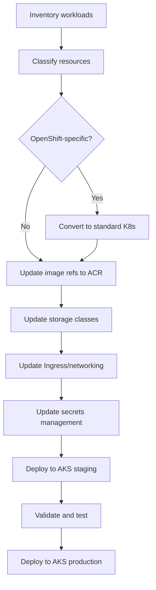

# Workload Migration: Deploying Applications on AKS

**Status:** Authored 2026-04-30
**Audience:** Application developers and DevOps engineers migrating workloads from self-managed Kubernetes or OpenShift to AKS.
**Scope:** Manifest conversion, Helm chart updates, Kustomize overlays, CRD migration, operator migration, and OpenShift-specific resource conversion.

---

## 1. Migration approach overview

Workload migration follows a bottom-up approach: convert manifests, update image references, adjust storage and networking, validate, and deploy.



### Workload classification

| Category                                                                              | Action                                                                        | Effort |
| ------------------------------------------------------------------------------------- | ----------------------------------------------------------------------------- | ------ |
| **Standard K8s resources** (Deployment, StatefulSet, Service, ConfigMap, Secret, HPA) | Update image refs, storage classes, secrets. Deploy as-is                     | XS--S  |
| **Helm-managed workloads**                                                            | Update values.yaml (image registry, storage class, ingress). Deploy with Helm | S      |
| **Kustomize-managed workloads**                                                       | Add AKS overlay with environment-specific patches                             | S      |
| **OpenShift-specific resources** (DeploymentConfig, Route, BuildConfig, ImageStream)  | Convert to standard K8s equivalents                                           | M--L   |
| **Custom operators** (OLM-managed)                                                    | Replace with Helm charts or repackage for AKS                                 | M--L   |
| **CRDs + custom controllers**                                                         | Deploy CRDs on AKS, update controller deployment                              | S--M   |

---

## 2. Standard Kubernetes manifest updates

### Image references

Replace internal registry references with ACR:

```yaml
# Before (on-prem registry)
containers:
  - name: api
    image: registry.internal.gov/team/api:v2.3.1

# After (ACR)
containers:
  - name: api
    image: csainaboxacr.azurecr.io/team/api:v2.3.1
```

Push images to ACR:

```bash
# Tag and push to ACR
az acr login --name csainaboxacr
docker tag registry.internal.gov/team/api:v2.3.1 csainaboxacr.azurecr.io/team/api:v2.3.1
docker push csainaboxacr.azurecr.io/team/api:v2.3.1

# Or use ACR import (no Docker daemon needed)
az acr import \
  --name csainaboxacr \
  --source registry.internal.gov/team/api:v2.3.1 \
  --image team/api:v2.3.1 \
  --username "$REGISTRY_USER" \
  --password "$REGISTRY_PASS"
```

### Storage class references

```yaml
# Before (on-prem storage)
volumeClaimTemplates:
  - spec:
      storageClassName: ceph-block  # or rook-ceph-block, nfs-client, local-path

# After (AKS)
volumeClaimTemplates:
  - spec:
      storageClassName: managed-csi-premium  # Azure Premium SSD
```

AKS built-in storage classes:

| Storage class             | Backend                            | Use case                        |
| ------------------------- | ---------------------------------- | ------------------------------- |
| `managed-csi`             | Azure Standard SSD                 | General purpose                 |
| `managed-csi-premium`     | Azure Premium SSD                  | Production databases, high-IOPS |
| `managed-csi-premium-zrs` | Azure Premium SSD (zone-redundant) | HA databases                    |
| `azurefile-csi`           | Azure Files SMB                    | Shared storage (ReadWriteMany)  |
| `azurefile-csi-premium`   | Azure Files Premium SMB            | High-performance shared storage |
| `azurefile-csi-nfs`       | Azure Files NFS                    | Linux NFS workloads             |

### Node selectors and tolerations

```yaml
# Before (on-prem node labels)
nodeSelector:
  node-role: worker
  hardware-type: gpu

# After (AKS node pool labels)
nodeSelector:
  agentpool: gpu  # or use custom labels
  workload-type: gpu
tolerations:
  - key: nvidia.com/gpu
    operator: Exists
    effect: NoSchedule
```

### Resource requests and limits

Review and adjust resource requests/limits for Azure VM sizes:

```yaml
resources:
    requests:
        cpu: "500m"
        memory: "512Mi"
    limits:
        cpu: "2000m"
        memory: "2Gi"
```

---

## 3. OpenShift DeploymentConfig conversion

DeploymentConfig is the most common OpenShift-specific resource to convert.

### Before (OpenShift DeploymentConfig)

```yaml
apiVersion: apps.openshift.io/v1
kind: DeploymentConfig
metadata:
    name: api-server
spec:
    replicas: 3
    strategy:
        type: Rolling
        rollingParams:
            maxUnavailable: 1
            maxSurge: 1
            timeoutSeconds: 600
            pre:
                failurePolicy: Abort
                execNewPod:
                    command: ["/bin/sh", "-c", "python manage.py migrate"]
                    containerName: api
    triggers:
        - type: ConfigChange
        - type: ImageChange
          imageChangeParams:
              automatic: true
              containerNames: [api]
              from:
                  kind: ImageStreamTag
                  name: api:latest
    selector:
        app: api-server
    template:
        spec:
            containers:
                - name: api
                  image: " " # Populated by ImageStream trigger
                  ports:
                      - containerPort: 8080
                  readinessProbe:
                      httpGet:
                          path: /health
                          port: 8080
```

### After (Standard Kubernetes Deployment)

```yaml
apiVersion: apps/v1
kind: Deployment
metadata:
    name: api-server
spec:
    replicas: 3
    strategy:
        type: RollingUpdate
        rollingUpdate:
            maxUnavailable: 1
            maxSurge: 1
    selector:
        matchLabels:
            app: api-server
    template:
        metadata:
            labels:
                app: api-server
        spec:
            containers:
                - name: api
                  image: csainaboxacr.azurecr.io/team/api:v2.3.1 # Explicit image reference
                  ports:
                      - containerPort: 8080
                  readinessProbe:
                      httpGet:
                          path: /health
                          port: 8080
---
# Pre-deploy migration as a separate Job
apiVersion: batch/v1
kind: Job
metadata:
    name: api-migrate
    annotations:
        helm.sh/hook: pre-install,pre-upgrade
        helm.sh/hook-weight: "-1"
spec:
    template:
        spec:
            containers:
                - name: migrate
                  image: csainaboxacr.azurecr.io/team/api:v2.3.1
                  command: ["/bin/sh", "-c", "python manage.py migrate"]
            restartPolicy: Never
```

### Conversion checklist for DeploymentConfig

| DeploymentConfig feature                    | Standard K8s equivalent        | Notes                                                                   |
| ------------------------------------------- | ------------------------------ | ----------------------------------------------------------------------- |
| `kind: DeploymentConfig`                    | `kind: Deployment`             | Change API group from `apps.openshift.io/v1` to `apps/v1`               |
| `strategy.type: Rolling`                    | `strategy.type: RollingUpdate` | Rename and adjust params                                                |
| `strategy.rollingParams.pre/post`           | Helm hooks or separate Job     | Pre/post deploy hooks become K8s Jobs (Helm hooks or ArgoCD sync waves) |
| `triggers.ImageChange`                      | CI/CD pipeline image update    | No K8s equivalent. CI/CD pipeline updates Deployment image tag          |
| `triggers.ConfigChange`                     | Default behavior               | Deployments automatically roll on spec changes                          |
| `selector` (without `matchLabels`)          | `selector.matchLabels`         | Must use `matchLabels` in Deployment                                    |
| `image: " "` (empty, ImageStream-populated) | Explicit image reference       | Always use explicit `registry/repo:tag`                                 |

---

## 4. OpenShift Route to Ingress conversion

### Before (OpenShift Route)

```yaml
apiVersion: route.openshift.io/v1
kind: Route
metadata:
    name: api-route
spec:
    host: api.app.gov
    port:
        targetPort: 8080
    tls:
        termination: edge
        insecureEdgeTerminationPolicy: Redirect
    to:
        kind: Service
        name: api-service
        weight: 100
```

### After (Kubernetes Ingress with NGINX)

```yaml
apiVersion: networking.k8s.io/v1
kind: Ingress
metadata:
    name: api-ingress
    annotations:
        nginx.ingress.kubernetes.io/ssl-redirect: "true"
        cert-manager.io/cluster-issuer: letsencrypt-prod
spec:
    ingressClassName: nginx
    tls:
        - hosts:
              - api.app.gov
          secretName: api-tls
    rules:
        - host: api.app.gov
          http:
              paths:
                  - path: /
                    pathType: Prefix
                    backend:
                        service:
                            name: api-service
                            port:
                                number: 8080
```

---

## 5. Helm chart migration

For Helm-managed workloads, create an AKS-specific values override file:

```yaml
# values-aks.yaml
image:
    registry: csainaboxacr.azurecr.io
    pullPolicy: IfNotPresent
    # Remove imagePullSecrets - AKS uses managed identity for ACR

ingress:
    enabled: true
    className: nginx
    annotations:
        cert-manager.io/cluster-issuer: letsencrypt-prod
    hosts:
        - host: api.app.gov
          paths:
              - path: /
                pathType: Prefix
    tls:
        - secretName: api-tls
          hosts:
              - api.app.gov

persistence:
    storageClass: managed-csi-premium
    size: 100Gi

nodeSelector:
    agentpool: workload

resources:
    requests:
        cpu: "500m"
        memory: "512Mi"
    limits:
        cpu: "2000m"
        memory: "2Gi"

serviceAccount:
    annotations:
        azure.workload.identity/client-id: "your-managed-identity-client-id"
```

Deploy with AKS-specific values:

```bash
helm upgrade --install api-server ./charts/api-server \
  -f values.yaml \
  -f values-aks.yaml \
  --namespace production
```

---

## 6. Kustomize overlay for AKS

Create an AKS-specific overlay:

```
base/
  deployment.yaml
  service.yaml
  kustomization.yaml
overlays/
  on-prem/
    kustomization.yaml
    patches/
  aks/
    kustomization.yaml
    patches/
      image-registry.yaml
      storage-class.yaml
      ingress.yaml
      node-selector.yaml
```

```yaml
# overlays/aks/kustomization.yaml
apiVersion: kustomize.config.k8s.io/v1beta1
kind: Kustomization
namespace: production
resources:
    - ../../base
patches:
    - path: patches/node-selector.yaml
      target:
          kind: Deployment
    - path: patches/storage-class.yaml
      target:
          kind: PersistentVolumeClaim
images:
    - name: registry.internal.gov/team/api
      newName: csainaboxacr.azurecr.io/team/api
      newTag: v2.3.1
```

```yaml
# overlays/aks/patches/storage-class.yaml
apiVersion: v1
kind: PersistentVolumeClaim
metadata:
    name: not-important # Patched by target selector
spec:
    storageClassName: managed-csi-premium
```

---

## 7. CRD migration

Custom Resource Definitions (CRDs) and their associated controllers generally work on AKS without modification.

### Migration steps

1. **Export CRDs from source cluster:**

    ```bash
    kubectl get crds -o yaml > crds-export.yaml
    ```

2. **Apply CRDs to AKS:**

    ```bash
    kubectl apply -f crds-export.yaml
    ```

3. **Deploy custom controllers:**
   Update controller Deployments with ACR image references and AKS storage/networking settings.

4. **Migrate custom resources:**
    ```bash
    # Export custom resources
    kubectl get myresource -A -o yaml > custom-resources-export.yaml
    # Apply to AKS
    kubectl apply -f custom-resources-export.yaml
    ```

### CRDs that require special attention

| CRD type                                              | Concern                                | Solution                                                 |
| ----------------------------------------------------- | -------------------------------------- | -------------------------------------------------------- |
| **OCP-specific CRDs** (Route, DeploymentConfig, etc.) | Not available on AKS                   | Convert to standard K8s equivalents (see sections above) |
| **Storage-dependent CRDs**                            | May reference on-prem storage classes  | Update storage class references                          |
| **Network-dependent CRDs**                            | May reference on-prem IPs or DNS       | Update to Azure networking                               |
| **Identity-dependent CRDs**                           | May reference on-prem service accounts | Update to Entra Workload Identity                        |

---

## 8. Operator migration

### OLM-managed operators (OpenShift)

OpenShift uses the Operator Lifecycle Manager (OLM) to manage operators from OperatorHub. AKS does not have OLM. Migration strategies:

| Strategy              | When to use                                                            | Effort |
| --------------------- | ---------------------------------------------------------------------- | ------ |
| **Helm chart**        | Operator has a community Helm chart                                    | S      |
| **AKS extension**     | Operator is available as an AKS extension (Flux, Dapr, Azure ML, etc.) | XS     |
| **Manual deployment** | Operator has raw manifests available                                   | M      |
| **Re-build**          | OCP SDK-based operator with deep OCP dependency                        | L--XL  |

### Common operators and their AKS equivalents

| Operator (OperatorHub)             | AKS equivalent                                        | Installation                                        |
| ---------------------------------- | ----------------------------------------------------- | --------------------------------------------------- |
| **Prometheus Operator**            | AKS Managed Prometheus + kube-prometheus-stack Helm   | `helm install kube-prometheus-stack` or AKS managed |
| **cert-manager**                   | cert-manager Helm chart                               | `helm install cert-manager jetstack/cert-manager`   |
| **Strimzi (Kafka)**                | Strimzi Helm chart on AKS or Event Hubs               | Same Helm chart; or migrate to Event Hubs           |
| **Elasticsearch (ECK)**            | ECK Helm chart on AKS or Azure Monitor                | Same Helm chart; or migrate to Log Analytics        |
| **PostgreSQL (Crunchy/Zalando)**   | Same operator on AKS or Azure Database for PostgreSQL | Same Helm chart; or migrate to managed PaaS         |
| **Redis (Redis Enterprise)**       | Redis Enterprise Helm on AKS or Azure Cache for Redis | Same operator; or migrate to managed PaaS           |
| **Istio (OpenShift Service Mesh)** | AKS Istio addon                                       | `az aks mesh enable`                                |
| **ArgoCD**                         | ArgoCD Helm on AKS                                    | Same Helm chart                                     |
| **Tekton**                         | Tekton on AKS or Azure Pipelines                      | Same manifests; or migrate to Azure Pipelines       |
| **KEDA**                           | AKS KEDA addon                                        | `az aks update --enable-keda`                       |
| **Spark Operator**                 | Spark Operator Helm on AKS                            | Same Helm chart; integrates with CSA-in-a-Box       |

---

## 9. Namespace migration

### Export and import namespaces

```bash
# Export namespace resources (excluding cluster-scoped resources)
kubectl get all,configmap,secret,ingress,networkpolicy,pvc,serviceaccount \
  -n my-namespace -o yaml > namespace-export.yaml

# Clean exported resources (remove cluster-specific metadata)
# Remove: resourceVersion, uid, creationTimestamp, selfLink, status
# Remove: annotations like kubectl.kubernetes.io/last-applied-configuration

# Apply to AKS
kubectl create namespace my-namespace
kubectl apply -f namespace-export.yaml -n my-namespace
```

### Namespace-level configuration on AKS

```yaml
# Resource quotas
apiVersion: v1
kind: ResourceQuota
metadata:
    name: team-quota
    namespace: my-namespace
spec:
    hard:
        requests.cpu: "20"
        requests.memory: "40Gi"
        limits.cpu: "40"
        limits.memory: "80Gi"
        persistentvolumeclaims: "10"
        services.loadbalancers: "2"
---
# LimitRange
apiVersion: v1
kind: LimitRange
metadata:
    name: default-limits
    namespace: my-namespace
spec:
    limits:
        - default:
              cpu: "500m"
              memory: "512Mi"
          defaultRequest:
              cpu: "100m"
              memory: "128Mi"
          type: Container
---
# Pod Security Standards
apiVersion: v1
kind: Namespace
metadata:
    name: my-namespace
    labels:
        pod-security.kubernetes.io/enforce: restricted
        pod-security.kubernetes.io/audit: restricted
        pod-security.kubernetes.io/warn: restricted
```

---

## 10. Validation checklist

After deploying each workload to AKS, validate:

- [ ] All pods running and healthy (`kubectl get pods -n namespace`)
- [ ] All services have endpoints (`kubectl get endpoints -n namespace`)
- [ ] Ingress routing works (test with `curl` or browser)
- [ ] TLS certificates valid (check with `openssl s_client`)
- [ ] Persistent volumes bound and data accessible
- [ ] Secrets mounted correctly (verify environment variables or volume mounts)
- [ ] Health checks passing (readiness and liveness probes)
- [ ] Horizontal pod autoscaler active (`kubectl get hpa -n namespace`)
- [ ] Network policies enforced (test connectivity with `kubectl exec`)
- [ ] Container logs flowing to Container Insights
- [ ] Metrics visible in Managed Prometheus / Grafana
- [ ] Application-level smoke tests passing
- [ ] Load test passing at expected throughput
- [ ] DNS resolving correctly for external and internal services

---

**Maintainers:** CSA-in-a-Box core team
**Last updated:** 2026-04-30
**Related:** [Cluster Migration](cluster-migration.md) | [Storage Migration](storage-migration.md) | [Security Migration](security-migration.md)
