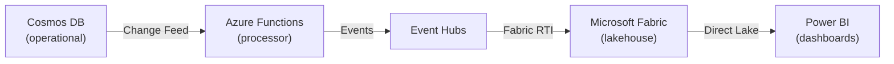

# Migrating from MongoDB to Azure Cosmos DB

**Status:** Authored 2026-04-30
**Audience:** Federal CTO / CDO / Data Architect running MongoDB (Atlas, Community, or Enterprise) and evaluating or executing a migration to Azure Cosmos DB -- commercial or Azure Government.
**Scope:** The MongoDB operational database estate: replica sets, sharded clusters, Atlas clusters (M10--M700), self-hosted Community/Enterprise deployments, change streams, Atlas Search, Realm (device sync), and Charts. Application-tier driver compatibility, schema migration, and data-platform integration with CSA-in-a-Box (Fabric, Purview, Power BI).

---

!!! tip "Expanded Migration Center Available"
This playbook is the core migration reference. For the complete MongoDB-to-Cosmos DB migration package -- including white papers, deep-dive guides, tutorials, benchmarks, and federal-specific guidance -- visit the **[MongoDB to Cosmos DB Migration Center](mongodb-to-cosmosdb/index.md)**.

    **Quick links:**

    - [Why Cosmos DB over MongoDB (Executive Brief)](mongodb-to-cosmosdb/why-cosmosdb-over-mongodb.md)
    - [Total Cost of Ownership Analysis](mongodb-to-cosmosdb/tco-analysis.md)
    - [Complete Feature Mapping (50+ features)](mongodb-to-cosmosdb/feature-mapping-complete.md)
    - [vCore Migration Guide](mongodb-to-cosmosdb/vcore-migration.md)
    - [RU-Based Migration Guide](mongodb-to-cosmosdb/ru-migration.md)
    - [Federal Migration Guide](mongodb-to-cosmosdb/federal-migration-guide.md)
    - [Tutorials & Walkthroughs](mongodb-to-cosmosdb/index.md#tutorials)
    - [Benchmarks & Performance](mongodb-to-cosmosdb/benchmarks.md)
    - [Best Practices](mongodb-to-cosmosdb/best-practices.md)

## 1. Executive summary

MongoDB is the most widely adopted document database, with over 46,000 customers and a massive developer ecosystem. The reasons to migrate are typically strategic: an Azure-first mandate, a need for turnkey global distribution with single-digit-millisecond SLA, tighter integration with the Azure data platform (Fabric, Purview, Power BI), analytical store for HTAP workloads without ETL, vector search for AI/RAG scenarios, or federal compliance requirements (FedRAMP High, IL4/IL5) that are simpler to satisfy on a fully managed Azure-native service.

Azure Cosmos DB for MongoDB offers wire-protocol compatibility in two deployment models:

- **Cosmos DB for MongoDB vCore** -- cluster-based, familiar MongoDB architecture, connection-string swap for most applications, native vector search, up to 128 vCores and 2 TiB RAM per node. Best for lift-and-shift from Atlas or self-hosted.
- **Cosmos DB for MongoDB (RU-based)** -- request-unit throughput model, automatic global distribution, 99.999% multi-region SLA, analytical store (column-oriented HTAP layer), change feed for event-driven architecture, serverless tier for dev/test. Best for greenfield or workloads needing planet-scale distribution.

csa-inabox on Azure integrates Cosmos DB into the data platform through change feed (streaming to Fabric via Event Hubs), analytical store (direct query from Fabric Spark or Synapse Link), and Purview for governance and lineage. Every data product in Cosmos DB can be cataloged, classified, and served through the csa-inabox data marketplace.

### Decision matrix -- which Cosmos DB API

| Your situation                              | Recommended target                           | Why                                                          |
| ------------------------------------------- | -------------------------------------------- | ------------------------------------------------------------ |
| Atlas M10--M50, minimal code changes wanted | Cosmos DB for MongoDB vCore                  | Connection-string swap; familiar cluster model               |
| Atlas M60+, globally distributed workload   | Cosmos DB for MongoDB (RU-based)             | Turnkey multi-region; 99.999% SLA                            |
| Self-hosted Community/Enterprise on VMs     | Cosmos DB for MongoDB vCore                  | Eliminate ops burden; same wire protocol                     |
| Need analytical store + HTAP                | Cosmos DB for MongoDB (RU-based)             | Analytical store (column-oriented) for analytics without ETL |
| Need vector search for AI/RAG               | Cosmos DB for MongoDB vCore                  | Native vector search; integrated with Azure AI               |
| Dev/test, unpredictable traffic             | Cosmos DB for MongoDB (RU-based, serverless) | Pay-per-request; no capacity planning                        |
| Federal IL4/IL5 with data residency         | Either (Azure Government)                    | Both available in Azure Gov; FedRAMP High inherited          |

---

## 2. Capability mapping -- MongoDB to Cosmos DB

| MongoDB capability            | Cosmos DB equivalent                                                | Notes                                                                 | Effort |
| ----------------------------- | ------------------------------------------------------------------- | --------------------------------------------------------------------- | ------ |
| Replica sets (3-node)         | vCore: HA cluster; RU: multi-region replication                     | vCore handles HA automatically; RU adds geo-distribution              | S      |
| Sharded clusters              | vCore: built-in sharding; RU: physical partitions                   | RU partition key is immutable -- choose carefully                     | M      |
| Aggregation pipeline          | Supported (vCore: full; RU: most stages)                            | vCore supports $lookup, $graphLookup; RU has some limitations         | S      |
| Change streams                | vCore: change streams; RU: change feed                              | RU change feed is push-based and integrates with Functions/Event Hubs | S      |
| Atlas Search                  | vCore: native vector + text search; RU: Azure AI Search integration | vCore has built-in search; RU pairs with Azure AI Search              | M      |
| MongoDB Charts                | Power BI (Direct Lake or import)                                    | Power BI offers richer visualization and enterprise distribution      | M      |
| Realm / Device Sync           | Not applicable                                                      | Use Azure Mobile Apps or custom sync with change feed                 | L      |
| Transactions (multi-document) | vCore: full ACID; RU: multi-document within partition               | RU transactions scoped to logical partition key                       | S      |
| TTL indexes                   | Both: native TTL support                                            | 1:1 mapping                                                           | XS     |
| Atlas Data Federation         | Fabric lakehouse (ADLS Gen2 + Spark)                                | Analytical store or change feed replaces data federation              | M      |

---

## 3. Migration sequence (phased project plan)

A typical MongoDB-to-Cosmos DB migration runs 8--16 weeks for a mid-sized estate (5--20 collections, 100 GB--1 TB data).

### Phase 0 -- Assessment (Weeks 1--2)

- Inventory all MongoDB databases, collections, indexes, and users.
- Run the Cosmos DB migration assessment tool (VS Code extension) against each database.
- Identify unsupported features (if RU-based): `$where`, `$eval`, certain aggregation stages.
- Map change streams consumers to change feed equivalents.
- Assess driver versions and connection string configuration.

### Phase 1 -- Schema and index design (Weeks 2--4)

- Choose partition key (RU-based) or shard key (vCore) for each collection.
- Review document modeling: embedded vs. referenced documents.
- Design indexing policy: wildcard vs. targeted indexes (RU-based); standard indexes (vCore).
- Configure TTL policies where applicable.
- Provision Cosmos DB account in target region (or Azure Government).

### Phase 2 -- Data migration (Weeks 4--8)

- Small datasets (< 10 GB): `mongodump` / `mongorestore` with `--uri` pointing to Cosmos DB.
- Medium datasets (10--500 GB): Azure Database Migration Service (DMS) with online CDC.
- Large datasets (500 GB+): Azure Data Factory with Spark connector or native MongoDB connector.
- Validate document counts, index presence, and sample query results.

### Phase 3 -- Application migration (Weeks 6--10, overlapping)

- Update connection strings in application configuration.
- Test driver compatibility (MongoDB drivers 4.0+ for vCore; 3.6+ for RU-based).
- Update retry logic for Cosmos DB error codes (16500 = rate limiting on RU-based).
- Validate aggregation pipeline compatibility.
- Run integration tests against Cosmos DB target.

### Phase 4 -- Cutover and validation (Weeks 10--14)

- Enable DMS continuous sync (CDC) for zero-downtime cutover.
- Switch application connection strings to Cosmos DB.
- Monitor latency, RU consumption (RU-based), and error rates.
- Validate change feed consumers are receiving events.
- Decommission MongoDB source after validation period (typically 2 weeks).

### Phase 5 -- Platform integration (Weeks 12--16)

- Enable analytical store (RU-based) for HTAP queries from Fabric Spark.
- Configure change feed to Event Hubs for real-time analytics pipeline.
- Register Cosmos DB data products in Purview catalog.
- Build Power BI reports over Cosmos DB analytical store or Fabric lakehouse.

---

## 4. CSA-in-a-Box integration

Cosmos DB is not an island -- it plugs into the csa-inabox data platform at three integration points:

### 4.1 Change feed to Fabric (real-time)

Every insert, update, or delete in Cosmos DB flows through change feed to Event Hubs, lands in the Fabric lakehouse as Delta tables, and surfaces in Power BI via Direct Lake -- typically within seconds.

### 4.2 Analytical store (HTAP)

Cosmos DB analytical store provides a fully isolated, column-oriented copy of operational data. Fabric Spark or Synapse Link queries this store directly -- no ETL pipeline, no impact on operational workload RU budget.

### 4.3 Purview governance

Purview scans Cosmos DB accounts, discovers collections and schemas, applies classifications (PII, PHI, financial), and traces lineage from operational source through Fabric lakehouse to Power BI report. Every Cosmos DB collection becomes a governed data product in the csa-inabox data marketplace.

---

## 5. Federal compliance considerations

- **FedRAMP High:** Cosmos DB is FedRAMP High authorized in Azure Government. Inherits the same compliance posture as the rest of csa-inabox.
- **DoD IL4 / IL5:** Cosmos DB is available in Azure Government regions with IL4/IL5 authorization. Check `docs/GOV_SERVICE_MATRIX.md` for current service-level coverage.
- **ITAR:** Azure Government tenant-binding handles data residency requirements.
- **Encryption:** Data encrypted at rest (service-managed or customer-managed keys via Key Vault). Data encrypted in transit (TLS 1.2+). CMK supported for both vCore and RU-based.
- **Private endpoints:** Both vCore and RU-based support Azure Private Link for network isolation.
- **CMMC 2.0 Level 2:** Mappings in `csa_platform/csa_platform/governance/compliance/cmmc-2.0-l2.yaml`.

---

## 6. Cost comparison

Illustrative. A federal tenant running a mid-sized MongoDB Atlas estate (3 clusters, M30 tier, ~500 GB total, 3 regions) at approximately **$180K/year** typically lands on:

- Cosmos DB for MongoDB vCore (equivalent sizing): **$80K--$120K/year**
- Cosmos DB for MongoDB RU-based (400K RU/s autoscale): **$100K--$160K/year**
- Savings from eliminating Atlas management overhead: **$30K--$60K/year** (FTE time)
- Additional platform value: analytical store, Purview governance, Fabric integration -- included at no incremental Cosmos DB cost.

**Typical run-rate: 30--50% savings** at comparable workload, before factoring platform integration benefits.

---

## 7. Gaps and honest assessment

| Gap                               | Description                                                             | Mitigation                                                        |
| --------------------------------- | ----------------------------------------------------------------------- | ----------------------------------------------------------------- |
| Realm / Device Sync               | No direct Cosmos DB equivalent                                          | Azure Mobile Apps or custom sync via change feed                  |
| MongoDB Charts                    | No built-in charting in Cosmos DB                                       | Power BI provides superior enterprise BI                          |
| RU-based aggregation limits       | Some stages unsupported ($merge to different DB, some $lookup patterns) | Use vCore for complex aggregation; or refactor to Fabric Spark    |
| Atlas Data Lake / Data Federation | No direct equivalent                                                    | Fabric lakehouse + analytical store covers analytics use cases    |
| Community ecosystem tools         | Some MongoDB community tools assume mongod/mongos                       | vCore is wire-compatible; most tools work; validate in assessment |

---

## 8. Related resources

- **Migration index:** [docs/migrations/README.md](README.md)
- **Companion playbooks:** [aws-to-azure.md](aws-to-azure.md), [sql-server-to-azure.md](sql-server-to-azure.md), [oracle-to-azure.md](oracle-to-azure.md)
- **Decision trees:**
    - `docs/decisions/fabric-vs-databricks-vs-synapse.md`
    - `docs/decisions/batch-vs-streaming.md`
- **Platform modules:**
    - `csa_platform/csa_platform/governance/purview/` -- Purview automation, classifications
    - `csa_platform/ai_integration/` -- AI Foundry / Azure OpenAI primitives
    - `csa_platform/data_marketplace/` -- data-product registry
- **Cosmos DB patterns:** `docs/patterns/cosmos-db-patterns.md`
- **Cosmos DB guide:** `docs/guides/cosmos-db.md`

---

**Maintainers:** csa-inabox core team
**Last updated:** 2026-04-30
