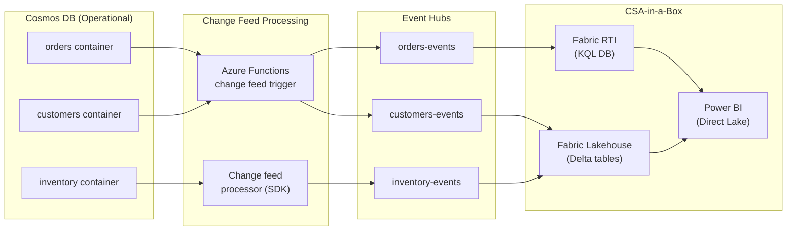

# Best Practices: Cosmos DB for MongoDB in CSA-in-a-Box

**Audience:** Data engineers, platform architects, and application developers operating Cosmos DB for MongoDB within the csa-inabox data platform.

---

## Overview

This guide covers operational best practices for Cosmos DB for MongoDB after migration, with specific emphasis on integration with the csa-inabox data platform. Topics include partition key design patterns, RU optimization, indexing policy tuning, change feed for event-driven architecture, and integration with Fabric, Purview, and Power BI.

---

## 1. Partition key design patterns

The partition key is the most consequential design decision for RU-based deployments. A well-chosen partition key enables efficient queries, balanced throughput distribution, and transactional scope. A poorly chosen key causes hot partitions, cross-partition fan-out, and RU waste.

### Pattern: tenant-scoped isolation

```
Container: documents
Partition key: /tenantId

Benefits:
- All tenant data co-located for single-partition queries
- Per-tenant transactions possible
- Natural isolation boundary for compliance
- RU consumption attributable per tenant
```

Use case: multi-tenant SaaS applications, federal agency data isolation.

### Pattern: hierarchical distribution

```
Container: telemetry
Partition key: /deviceId, /date (hierarchical)

Benefits:
- Fine-grained distribution (prevents device hot-spots)
- Time-range queries efficient within a device
- Cross-device analytics via analytical store (not operational)
```

Use case: IoT telemetry, sensor data, device monitoring.

### Pattern: synthetic partition key

When no single field provides good distribution, create a synthetic key:

```javascript
// Before insert, compute synthetic partition key
document.partitionKey = `${document.region}-${document.productCategory}-${document.orderDate.substring(0, 7)}`;
```

```
Container: orders
Partition key: /partitionKey (synthetic)

Benefits:
- Controlled cardinality and distribution
- Query affinity for common filter combinations
- Avoids hot partitions from temporal or categorical skew
```

### Anti-patterns to avoid

| Anti-pattern                                | Problem                                           | Fix                                                    |
| ------------------------------------------- | ------------------------------------------------- | ------------------------------------------------------ |
| `_id` as partition key                      | No query affinity; every query is cross-partition | Use a business field (`/userId`, `/tenantId`)          |
| Low-cardinality key (`/status`)             | Hot partitions (most docs have same status)       | Use higher-cardinality field or hierarchical key       |
| Monotonically increasing key (`/timestamp`) | All writes go to one partition                    | Combine with a distribution suffix                     |
| Overly fine-grained key (`/documentId`)     | No transaction scope; every write is isolated     | Use a grouping field that enables logical transactions |

---

## 2. RU optimization

### Monitor RU consumption

```kusto
// Log Analytics query: RU consumption by collection
AzureDiagnostics
| where ResourceProvider == "MICROSOFT.DOCUMENTDB"
| where Category == "DataPlaneRequests"
| summarize
    TotalRU = sum(todouble(requestCharge_s)),
    AvgRU = avg(todouble(requestCharge_s)),
    MaxRU = max(todouble(requestCharge_s)),
    OperationCount = count()
  by collectionName_s, OperationName
| order by TotalRU desc
```

### Reduce RU per operation

| Optimization                            | Impact                         | Effort                                                  |
| --------------------------------------- | ------------------------------ | ------------------------------------------------------- |
| **Point reads instead of queries**      | 1 RU vs 5--50 RU per operation | Refactor queries to use `_id` + partition key           |
| **Targeted indexing policy**            | 20--50% write RU reduction     | Define included/excluded paths                          |
| **Smaller documents**                   | Linear RU reduction with size  | Normalize large embedded arrays                         |
| **Projection (return fewer fields)**    | 10--30% read RU reduction      | Add `$project` to aggregation or projection to `find()` |
| **Avoid cross-partition queries**       | 10--100x RU reduction          | Include partition key in all query filters              |
| **Consistent prefix instead of strong** | 50% read RU reduction          | Change consistency for non-critical reads               |

### Autoscale right-sizing

```bash
# Check normalized RU consumption (Azure Monitor)
az monitor metrics list \
  --resource "/subscriptions/{sub}/resourceGroups/{rg}/providers/Microsoft.DocumentDB/databaseAccounts/{account}" \
  --metric "NormalizedRUConsumption" \
  --interval PT1H \
  --aggregation Maximum \
  --start-time "2026-04-29T00:00:00Z" \
  --end-time "2026-04-30T00:00:00Z"
```

**Right-sizing rules:**

- **NormalizedRUConsumption consistently < 20%:** Reduce autoscale max by 50%.
- **NormalizedRUConsumption consistently 40--60%:** Optimal range. No changes needed.
- **NormalizedRUConsumption consistently > 70%:** Increase autoscale max by 50--100%.
- **NormalizedRUConsumption hitting 100%:** Immediate action -- increase max, add indexes, or optimize queries.

### Reserved capacity

For production workloads with predictable RU consumption:

| Reservation term | Discount | Best for                                    |
| ---------------- | -------- | ------------------------------------------- |
| 1-year           | 20%      | Production with 12+ month commitment        |
| 3-year           | 35%      | Stable production with long-term commitment |

Reserved capacity applies to RU/s provisioned, not consumption. Only reserve what you know you'll use at steady-state.

---

## 3. Indexing policy tuning

### Default policy (index everything)

```json
{
    "indexingMode": "consistent",
    "includedPaths": [{ "path": "/*" }],
    "excludedPaths": [{ "path": "/\"_etag\"/?" }]
}
```

**Cost:** Maximum query flexibility. High write RU cost (every property indexed on every write).

### Optimized policy (exclude-first approach)

```json
{
    "indexingMode": "consistent",
    "includedPaths": [
        { "path": "/customerId/?" },
        { "path": "/orderDate/?" },
        { "path": "/status/?" },
        { "path": "/total/?" },
        { "path": "/region/?" }
    ],
    "excludedPaths": [{ "path": "/*" }],
    "compositeIndexes": [
        [
            { "path": "/customerId", "order": "ascending" },
            { "path": "/orderDate", "order": "descending" }
        ],
        [
            { "path": "/region", "order": "ascending" },
            { "path": "/total", "order": "descending" }
        ]
    ]
}
```

**Cost:** 20--50% lower write RU. Only paths needed for queries are indexed.

### Indexing policy design process

1. **List all query patterns** for the collection (filter fields, sort fields, range predicates).
2. **Map filters to included paths** -- every field used in a `$match` or `find()` filter needs an index.
3. **Map sorts to composite indexes** -- every `$sort` on multiple fields needs a composite index.
4. **Exclude everything else** -- start with `"excludedPaths": [{"path": "/*"}]` and add back only what's needed.
5. **Test** -- run each query pattern with `explain()` and verify index usage.

---

## 4. Change feed for event-driven architecture

Change feed is the integration backbone between Cosmos DB and the csa-inabox platform. Every insert, update, or delete flows through change feed to downstream consumers.

### Architecture: Cosmos DB to Fabric via Event Hubs



### Change feed processor implementation

```csharp
// C#: Robust change feed processor with Event Hubs output
public class OrderChangeFeedProcessor
{
    private readonly EventHubProducerClient _producer;
    private readonly ILogger _logger;

    public async Task StartAsync(CosmosClient cosmosClient)
    {
        var leaseContainer = cosmosClient
            .GetDatabase("mydb")
            .GetContainer("leases");

        var processor = cosmosClient
            .GetDatabase("mydb")
            .GetContainer("orders")
            .GetChangeFeedProcessorBuilder<OrderDocument>(
                processorName: "orderProcessor",
                onChangesDelegate: HandleChangesAsync)
            .WithInstanceName(Environment.MachineName)
            .WithLeaseContainer(leaseContainer)
            .WithStartTime(DateTime.UtcNow.AddHours(-1))
            .WithMaxItems(100)
            .WithPollInterval(TimeSpan.FromSeconds(1))
            .Build();

        await processor.StartAsync();
    }

    private async Task HandleChangesAsync(
        ChangeFeedProcessorContext context,
        IReadOnlyCollection<OrderDocument> changes,
        CancellationToken cancellationToken)
    {
        var batch = new List<EventData>();

        foreach (var change in changes)
        {
            var eventData = new EventData(
                JsonSerializer.SerializeToUtf8Bytes(change));
            eventData.Properties["operationType"] = "change";
            eventData.Properties["partitionKey"] = change.CustomerId;
            batch.Add(eventData);
        }

        await _producer.SendAsync(batch, cancellationToken);
        _logger.LogInformation(
            "Processed {Count} changes from partition {Partition}",
            changes.Count, context.LeaseToken);
    }
}
```

### Change feed best practices

- **Lease container** -- create a dedicated lease container in the same database. Partition by `/id`.
- **Processor instances** -- run multiple instances for scale. The change feed processor automatically distributes partition ranges across instances.
- **Start time** -- for new processors, set start time to when migration completed (not "beginning of time").
- **Error handling** -- change feed processing is at-least-once. Design downstream consumers to be idempotent.
- **Monitoring** -- alert on change feed processor lag (time between latest change and latest processed change).

---

## 5. CSA-in-a-Box integration patterns

### Pattern 1: Analytical store to Fabric lakehouse

For RU-based deployments, analytical store provides the zero-ETL path to analytics.

```python
# Fabric Spark notebook: read from analytical store
df = spark.read \
    .format("cosmos.olap") \
    .option("spark.synapse.linkedService", "CosmosDb_mydb") \
    .option("spark.cosmos.container", "orders") \
    .load()

# Write to Fabric lakehouse as Delta table
df.write \
    .format("delta") \
    .mode("overwrite") \
    .saveAsTable("lakehouse.bronze.cosmos_orders")
```

**Scheduling:** Run this notebook daily or hourly via Fabric pipeline. Analytical store always has the latest data (within ~2 minutes of operational write), so the lakehouse refresh captures all changes since last run.

### Pattern 2: Change feed to Event Hubs to real-time dashboard

```python
# Fabric KQL query: real-time order monitoring
OrderEvents
| where ingestion_time() > ago(5m)
| summarize
    OrderCount = count(),
    TotalRevenue = sum(toreal(total)),
    AvgOrderValue = avg(toreal(total))
  by bin(ingestion_time(), 1m), region
| render timechart
```

This feeds a Power BI real-time dashboard showing order volume and revenue, updated every minute, sourced from Cosmos DB change feed.

### Pattern 3: Purview governance

Register Cosmos DB as a data source in Purview for the csa-inabox data marketplace:

1. **Register data source** -- add Cosmos DB account in Purview Studio.
2. **Create scan ruleset** -- include MongoDB API collections.
3. **Run scan** -- Purview discovers collections, infers schemas, identifies data types.
4. **Apply classifications** -- PII (email, phone, SSN), PHI (diagnosis codes), financial data.
5. **Build lineage** -- Purview traces data from Cosmos DB through Fabric to Power BI.

Reference: `csa_platform/csa_platform/governance/purview/purview_automation.py`

### Pattern 4: Data product registration

Each Cosmos DB collection that serves downstream consumers can be registered as a data product in the csa-inabox data marketplace.

```yaml
# data-product: cosmos-orders
name: cosmos-orders
source: cosmos-db
container: orders
partition_key: /customerId
governance:
    owner: orders-team
    classification: internal
    pii_fields: [customerEmail, customerPhone]
    retention: 7-years
access:
    read: [analytics-team, bi-team, ml-team]
    write: [orders-service]
sla:
    freshness: real-time (change feed)
    availability: 99.99%
```

Reference: `csa_platform/data_marketplace/`, `domains/finance/data-products/invoices/contract.yaml`

---

## 6. Monitoring and alerting

### Essential metrics to monitor

| Metric                     | Threshold              | Alert action                                  |
| -------------------------- | ---------------------- | --------------------------------------------- |
| NormalizedRUConsumption    | > 80% sustained 15 min | Increase autoscale max                        |
| TotalRequests (429 status) | > 1% of total          | Investigate hot partitions; increase RU       |
| ServerSideLatency p99      | > 50 ms                | Check query plans; add indexes                |
| DataUsage                  | > 80% of storage quota | Plan capacity increase                        |
| AvailableStorage           | < 20% remaining        | Urgent: increase storage or enable auto-grow  |
| ReplicationLatency         | > 5 seconds            | Check network; investigate replication health |

### Azure Monitor workbook

```kusto
// KQL: comprehensive Cosmos DB health dashboard
let timeRange = 24h;

// RU consumption trend
AzureDiagnostics
| where TimeGenerated > ago(timeRange)
| where ResourceProvider == "MICROSOFT.DOCUMENTDB"
| where Category == "DataPlaneRequests"
| summarize
    TotalRU = sum(todouble(requestCharge_s)),
    P99Latency = percentile(todouble(duration_s), 99),
    ErrorCount = countif(statusCode_s startswith "4" or statusCode_s startswith "5"),
    TotalOps = count()
  by bin(TimeGenerated, 5m), collectionName_s
| render timechart
```

---

## 7. Document modeling best practices

### Keep documents small

Target document size under 4 KB for optimal RU efficiency. Documents over 16 KB should be split.

### Use materialized views for read optimization

```javascript
// Change feed processor creates materialized view
// Operational: orders (partition: /customerId)
// Materialized: customer_dashboard (partition: /customerId)
// Contains pre-computed aggregates per customer

{
  "_id": "dashboard-cust-123",
  "customerId": "cust-123",
  "totalOrders": 47,
  "totalSpent": 12450.00,
  "lastOrderDate": "2026-04-30",
  "topProducts": ["Widget A", "Widget B"],
  "lastUpdated": "2026-04-30T15:30:00Z"
}
```

### Version documents for conflict resolution

For multi-region write deployments:

```javascript
{
  "_id": "order-456",
  "customerId": "cust-123",
  "_version": 3,
  "_lastModified": "2026-04-30T15:30:00Z",
  "_modifiedBy": "us-east-service",
  // ... data fields
}
```

---

## 8. Security best practices

### Principle of least privilege

- Use Entra ID RBAC with granular roles (read-only, read-write, admin).
- Never use account-level primary keys in application code. Use managed identities.
- Rotate keys on a regular schedule (90 days recommended).

### Network isolation

- Disable public network access for production.
- Use Private Endpoints exclusively.
- Configure NSG rules to restrict access to known application subnets.

### Data protection

- Enable customer-managed keys (CMK) for encryption at rest.
- Enforce TLS 1.2 minimum.
- Use Purview to classify and monitor sensitive data access.

---

## 9. Operational runbooks

### Runbook: RU throttling (429 errors)

1. Check `NormalizedRUConsumption` in Azure Monitor.
2. Identify the hot partition: query `PartitionKeyRangeId` in diagnostic logs.
3. If a single partition is hot: redesign partition key or distribute writes.
4. If overall capacity is insufficient: increase autoscale maximum.
5. For burst scenarios: temporarily increase manual throughput, then scale back.

### Runbook: high latency

1. Check `ServerSideLatency` p99 in Azure Monitor.
2. Identify slow queries: filter `DataPlaneRequests` by `duration_s > 100`.
3. Run `explain()` on slow queries to verify index usage.
4. Add missing indexes or composite indexes.
5. If cross-partition queries: add partition key to query filter.

### Runbook: change feed lag

1. Check change feed processor metrics (custom Application Insights).
2. If lag is growing: add more processor instances.
3. If single partition is slow: check for long-running transactions blocking the change stream.
4. If Event Hubs is the bottleneck: increase throughput units or partition count.

---

## 10. Migration from MongoDB -- ongoing optimization

After migration, optimize over the first 30 days:

| Week   | Action                                                                                   |
| ------ | ---------------------------------------------------------------------------------------- |
| Week 1 | Monitor RU consumption, latency, and error rates. Establish baseline.                    |
| Week 2 | Tune indexing policy based on actual query patterns (not assumed patterns from MongoDB). |
| Week 3 | Right-size autoscale based on observed traffic patterns. Consider reserved capacity.     |
| Week 4 | Enable analytical store, configure change feed to Fabric, register in Purview.           |

---

## Related resources

- [vCore Migration Guide](vcore-migration.md)
- [RU-Based Migration Guide](ru-migration.md)
- [Schema Migration](schema-migration.md)
- [Benchmarks](benchmarks.md)
- [Federal Migration Guide](federal-migration-guide.md)
- [Cosmos DB Patterns](../../patterns/cosmos-db-patterns.md)
- [Cosmos DB Guide](../../guides/cosmos-db.md)
- [Migration Playbook](../mongodb-to-cosmosdb.md)

---

**Maintainers:** csa-inabox core team
**Last updated:** 2026-04-30
