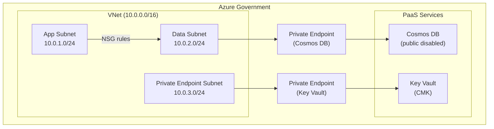

# Federal Migration Guide: MongoDB to Cosmos DB in Azure Government

**Audience:** Federal CISOs, compliance officers, ATO reviewers, and data architects planning a MongoDB-to-Cosmos DB migration within Azure Government (FedRAMP High, DoD IL4/IL5, ITAR).

---

## Overview

This guide covers the federal-specific requirements for migrating MongoDB workloads to Azure Cosmos DB in Azure Government. Cosmos DB is FedRAMP High authorized, DoD SRG IL4 and IL5 authorized, and available in Azure Government regions (US Gov Virginia, US Gov Texas, US Gov Arizona). This document addresses data residency, encryption requirements, network isolation, compliance certifications, and the authorization boundary considerations unique to federal deployments.

---

## 1. Compliance certifications

### Azure Cosmos DB in Azure Government

| Certification | Status     | Notes                                                              |
| ------------- | ---------- | ------------------------------------------------------------------ |
| FedRAMP High  | Authorized | Inherited through Azure Government P-ATO                           |
| DoD SRG IL2   | Authorized | All Azure Government services                                      |
| DoD SRG IL4   | Authorized | Cosmos DB (both vCore and RU-based)                                |
| DoD SRG IL5   | Authorized | Cosmos DB in dedicated IL5 regions (US DoD Central, US DoD East)   |
| ITAR          | Compliant  | Azure Government tenant-binding; all data in US sovereign boundary |
| CJIS          | Compliant  | With CJIS Security Policy compliance agreement                     |
| IRS 1075      | Compliant  | With appropriate safeguards                                        |
| HIPAA         | Compliant  | BAA available through Azure Government                             |
| SOC 1/2/3     | Certified  | Annual audit reports available                                     |
| ISO 27001     | Certified  | Annual certification                                               |

### MongoDB Atlas for Government comparison

| Certification        | Atlas for Government        | Cosmos DB (Azure Gov)                |
| -------------------- | --------------------------- | ------------------------------------ |
| FedRAMP              | Moderate (AWS GovCloud)     | **High** (Azure Government)          |
| DoD IL4              | Not directly authorized     | Authorized                           |
| DoD IL5              | Not directly authorized     | Authorized                           |
| ITAR                 | AWS GovCloud data residency | Azure Government tenant-binding      |
| Total certifications | ~10                         | **90+** (Azure Government portfolio) |

Cosmos DB on Azure Government inherits the full Azure Government compliance portfolio. Atlas for Government operates on AWS GovCloud with a FedRAMP Moderate authorization. For federal workloads requiring FedRAMP High, DoD IL4/IL5, or ITAR compliance, Cosmos DB on Azure Government provides a more comprehensive and directly inherited compliance posture.

---

## 2. Data residency and sovereignty

### Azure Government data residency

- **US sovereign boundary:** All data stored in Azure Government remains within the continental United States.
- **Tenant isolation:** Azure Government is a physically and logically separate instance of Azure, operated by screened US persons.
- **Regions:** US Gov Virginia, US Gov Texas, US Gov Arizona (Azure Government); US DoD Central, US DoD East (DoD-dedicated).

### Cosmos DB data residency configuration

```bash
# Create Cosmos DB in Azure Government region
az cosmosdb create \
  --resource-group rg-data-platform-gov \
  --name cosmos-federal-mongo \
  --kind MongoDB \
  --server-version 7.0 \
  --locations regionName=usgovvirginia failoverPriority=0 isZoneRedundant=true \
  --locations regionName=usgovtexas failoverPriority=1 isZoneRedundant=false \
  --default-consistency-level Session \
  --enable-analytical-storage true \
  --backup-policy-type Continuous \
  --environment "AzureUSGovernment"
```

### Multi-region within Government

For HA within Azure Government, replicate across government regions:

| Primary region  | DR region      | Use case                |
| --------------- | -------------- | ----------------------- |
| US Gov Virginia | US Gov Texas   | Standard federal HA     |
| US Gov Virginia | US Gov Arizona | Alternative DR location |
| US DoD Central  | US DoD East    | DoD IL5 workloads       |

All replication stays within the Azure Government sovereign boundary. No data crosses to commercial Azure regions.

---

## 3. Encryption requirements

### Encryption at rest

Cosmos DB encrypts all data at rest by default using Microsoft-managed keys (service-level encryption). For federal workloads requiring customer-managed keys (CMK):

```bash
# Create Key Vault in Azure Government
az keyvault create \
  --resource-group rg-data-platform-gov \
  --name kv-cosmos-cmk-gov \
  --location usgovvirginia \
  --sku premium \
  --enable-purge-protection true \
  --enable-soft-delete true \
  --retention-days 90

# Create encryption key
az keyvault key create \
  --vault-name kv-cosmos-cmk-gov \
  --name cosmos-cmk \
  --kty RSA \
  --size 3072 \
  --ops wrapKey unwrapKey

# Configure Cosmos DB with CMK
az cosmosdb update \
  --resource-group rg-data-platform-gov \
  --name cosmos-federal-mongo \
  --key-uri "https://kv-cosmos-cmk-gov.vault.usgovcloudapi.net/keys/cosmos-cmk"
```

**CMK requirements for federal:**

- Key Vault must be in the same Azure Government region as the Cosmos DB account.
- Use RSA keys with minimum 3072-bit length (NIST SP 800-57 guidance).
- Enable purge protection and soft delete (90-day retention recommended).
- Configure key rotation policy (annual rotation recommended; NIST SP 800-57).
- Document key management procedures in the System Security Plan (SSP).

### Encryption in transit

- TLS 1.2+ required for all connections (enforced by Cosmos DB).
- Minimum TLS version is configurable (set to 1.2; do not allow TLS 1.0 or 1.1).
- Certificate validation is enforced by MongoDB drivers.

```bash
# Enforce minimum TLS 1.2
az cosmosdb update \
  --resource-group rg-data-platform-gov \
  --name cosmos-federal-mongo \
  --minimal-tls-version Tls12
```

---

## 4. Network isolation

### Private endpoints (required for federal)

Federal Cosmos DB deployments must use Azure Private Link for network isolation. Public endpoint access should be disabled.

```bash
# Disable public access
az cosmosdb update \
  --resource-group rg-data-platform-gov \
  --name cosmos-federal-mongo \
  --enable-public-network false

# Create private endpoint
az network private-endpoint create \
  --resource-group rg-data-platform-gov \
  --name pe-cosmos-mongo \
  --vnet-name vnet-data-platform \
  --subnet subnet-data \
  --private-connection-resource-id "/subscriptions/{sub}/resourceGroups/rg-data-platform-gov/providers/Microsoft.DocumentDB/databaseAccounts/cosmos-federal-mongo" \
  --group-ids MongoDB \
  --connection-name cosmos-mongo-connection

# Create Private DNS zone
az network private-dns zone create \
  --resource-group rg-data-platform-gov \
  --name privatelink.mongo.cosmos.usgovcloudapi.net

# Link DNS zone to VNet
az network private-dns zone vnet-link create \
  --resource-group rg-data-platform-gov \
  --zone-name privatelink.mongo.cosmos.usgovcloudapi.net \
  --name cosmos-dns-link \
  --virtual-network vnet-data-platform \
  --registration-enabled false
```

### Network architecture



### Network Security Group (NSG) rules

```bash
# Allow application subnet to access data subnet
az network nsg rule create \
  --resource-group rg-data-platform-gov \
  --nsg-name nsg-data-subnet \
  --name allow-app-to-data \
  --priority 100 \
  --source-address-prefixes 10.0.1.0/24 \
  --destination-address-prefixes 10.0.2.0/24 \
  --destination-port-ranges 10255 443 \
  --access Allow \
  --protocol Tcp

# Deny all other inbound
az network nsg rule create \
  --resource-group rg-data-platform-gov \
  --nsg-name nsg-data-subnet \
  --name deny-all-inbound \
  --priority 4000 \
  --source-address-prefixes '*' \
  --destination-address-prefixes '*' \
  --destination-port-ranges '*' \
  --access Deny \
  --protocol '*'
```

---

## 5. Identity and access management

### Entra ID RBAC (recommended for federal)

Use Entra ID (Azure AD) authentication instead of connection string keys for production federal workloads.

```bash
# Assign Cosmos DB data plane role to managed identity
az cosmosdb sql role assignment create \
  --resource-group rg-data-platform-gov \
  --account-name cosmos-federal-mongo \
  --role-definition-name "Cosmos DB Built-in Data Contributor" \
  --principal-id "{managed-identity-object-id}" \
  --scope "/subscriptions/{sub}/resourceGroups/rg-data-platform-gov/providers/Microsoft.DocumentDB/databaseAccounts/cosmos-federal-mongo"
```

### Managed identity for applications

```csharp
// C#: Connect with managed identity (no keys in config)
var credential = new DefaultAzureCredential();
var client = new CosmosClient(
    "https://cosmos-federal-mongo.mongo.cosmos.usgovcloudapi.net:443/",
    credential);
```

### Key rotation

If using connection string authentication, rotate keys regularly:

```bash
# Regenerate primary key
az cosmosdb keys regenerate \
  --resource-group rg-data-platform-gov \
  --name cosmos-federal-mongo \
  --key-kind primary

# Update Key Vault with new key
az keyvault secret set \
  --vault-name kv-app-secrets-gov \
  --name cosmosdb-primary-key \
  --value "$(az cosmosdb keys list --resource-group rg-data-platform-gov --name cosmos-federal-mongo --query primaryMasterKey -o tsv)"
```

---

## 6. Audit logging

### Diagnostic settings

```bash
# Enable diagnostic logging to Log Analytics
az monitor diagnostic-settings create \
  --resource "/subscriptions/{sub}/resourceGroups/rg-data-platform-gov/providers/Microsoft.DocumentDB/databaseAccounts/cosmos-federal-mongo" \
  --name cosmos-diagnostics \
  --workspace "/subscriptions/{sub}/resourceGroups/rg-monitoring/providers/Microsoft.OperationalInsights/workspaces/law-federal" \
  --logs '[
    {"category": "DataPlaneRequests", "enabled": true, "retentionPolicy": {"enabled": true, "days": 365}},
    {"category": "MongoRequests", "enabled": true, "retentionPolicy": {"enabled": true, "days": 365}},
    {"category": "QueryRuntimeStatistics", "enabled": true, "retentionPolicy": {"enabled": true, "days": 90}},
    {"category": "ControlPlaneRequests", "enabled": true, "retentionPolicy": {"enabled": true, "days": 365}}
  ]' \
  --metrics '[
    {"category": "Requests", "enabled": true, "retentionPolicy": {"enabled": true, "days": 365}}
  ]'
```

### Log retention for compliance

| Log category           | Minimum retention | NIST control                    |
| ---------------------- | ----------------- | ------------------------------- |
| DataPlaneRequests      | 365 days          | AU-11 (Audit Record Retention)  |
| MongoRequests          | 365 days          | AU-11                           |
| ControlPlaneRequests   | 365 days          | AU-11                           |
| QueryRuntimeStatistics | 90 days           | AU-6 (Audit Review)             |
| Activity Log           | 365 days          | AU-3 (Content of Audit Records) |

### NIST 800-53 Rev 5 control mapping

| Control family | Control                           | Cosmos DB implementation                                      |
| -------------- | --------------------------------- | ------------------------------------------------------------- |
| AC-2           | Account Management                | Entra ID RBAC, managed identities                             |
| AC-3           | Access Enforcement                | RBAC data-plane roles, private endpoints                      |
| AU-2           | Audit Events                      | Diagnostic logs (all categories)                              |
| AU-3           | Content of Audit Records          | DataPlaneRequests includes user, operation, timestamp, result |
| AU-6           | Audit Review                      | Log Analytics queries, workbooks                              |
| AU-11          | Audit Record Retention            | 365-day retention policy                                      |
| IA-2           | Identification and Authentication | Entra ID authentication                                       |
| SC-8           | Transmission Confidentiality      | TLS 1.2+ enforced                                             |
| SC-12          | Cryptographic Key Management      | Key Vault CMK with rotation policy                            |
| SC-28          | Protection of Information at Rest | AES-256 encryption (service or CMK)                           |
| SI-4           | Information System Monitoring     | Azure Monitor, diagnostic settings                            |

---

## 7. Migration in Azure Government

### DMS in Azure Government

Azure DMS is available in Azure Government. The migration process is identical to commercial Azure, with Azure Government-specific endpoints.

```bash
# Create DMS in Azure Government
az dms create \
  --resource-group rg-dms-gov \
  --name dms-mongo-gov \
  --location usgovvirginia \
  --sku-name Premium_4vCores \
  --subnet "/subscriptions/{sub}/resourceGroups/rg-dms-gov/providers/Microsoft.Network/virtualNetworks/vnet-dms-gov/subnets/subnet-dms"
```

### Data transfer considerations

- **ITAR workloads:** All data must remain within Azure Government sovereign boundary during migration. Do not stage data in commercial Azure or non-US regions.
- **Cross-cloud migration (Atlas to Cosmos DB):** If source MongoDB Atlas is on AWS GovCloud, data egress crosses cloud boundaries. Ensure data transfer path complies with ITAR requirements (encrypted in transit, no intermediate storage outside sovereign boundary).
- **Air-gapped environments:** For IL5/IL6 environments without internet access, use Azure Data Box to physically ship data. Not applicable to most IL4 migrations.

---

## 8. csa-inabox compliance integration

Cosmos DB in Azure Government integrates with the csa-inabox compliance framework:

- **NIST 800-53 Rev 5 controls** mapped in `csa_platform/csa_platform/governance/compliance/nist-800-53-rev5.yaml`.
- **CMMC 2.0 Level 2 practices** mapped in `csa_platform/csa_platform/governance/compliance/cmmc-2.0-l2.yaml`.
- **HIPAA Security Rule** mapped in `csa_platform/csa_platform/governance/compliance/hipaa-security-rule.yaml`.
- **Purview governance** scans Cosmos DB accounts in Azure Government identically to commercial Azure.
- **Azure Monitor / Log Analytics** collects Cosmos DB diagnostics for tamper-evident audit trail (CSA-0016).

---

## 9. Federal migration checklist

- [ ] Verified Cosmos DB service availability in target Azure Government region.
- [ ] Confirmed FedRAMP High / DoD IL4/IL5 authorization for Cosmos DB (check `docs/GOV_SERVICE_MATRIX.md`).
- [ ] Created Cosmos DB account in Azure Government with appropriate regions.
- [ ] Configured customer-managed keys (CMK) via Key Vault.
- [ ] Disabled public network access; configured Private Endpoints.
- [ ] Configured Entra ID RBAC for data-plane access (no connection string keys in production).
- [ ] Enabled diagnostic logging with 365-day retention.
- [ ] Enforced TLS 1.2 minimum.
- [ ] Documented Cosmos DB in the System Security Plan (SSP).
- [ ] Mapped NIST 800-53 controls to Cosmos DB implementation.
- [ ] Conducted security assessment of migration path (data in transit, no intermediate non-sovereign storage).
- [ ] Obtained ATO or updated existing ATO for the new data store.

---

## Related resources

- [Why Cosmos DB over MongoDB](why-cosmosdb-over-mongodb.md)
- [vCore Migration Guide](vcore-migration.md)
- [RU-Based Migration Guide](ru-migration.md)
- [Benchmarks](benchmarks.md)
- [Best Practices](best-practices.md)
- [Migration Playbook](../mongodb-to-cosmosdb.md)
- **Compliance references:** `docs/compliance/nist-800-53-rev5.md`, `docs/compliance/fedramp-moderate.md`, `docs/compliance/cmmc-2.0-l2.md`
- **Government service matrix:** `docs/GOV_SERVICE_MATRIX.md`

---

**Maintainers:** csa-inabox core team
**Last updated:** 2026-04-30
