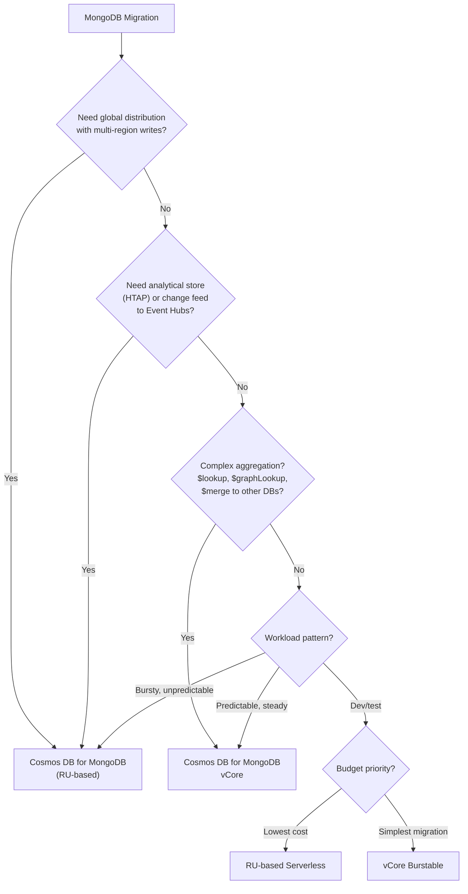
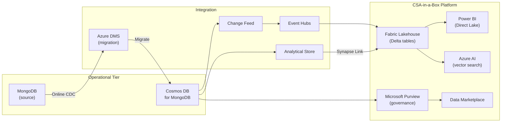

# MongoDB to Azure Cosmos DB Migration Center

**The definitive resource for migrating from MongoDB (Atlas, Community, Enterprise) to Azure Cosmos DB for MongoDB -- wire-protocol compatible, fully managed, globally distributed.**

---

## Who this is for

This migration center serves CTOs, CDOs, platform architects, data engineers, application developers, and DevOps engineers who are evaluating or executing a migration from MongoDB to Azure Cosmos DB. Whether you are running MongoDB Atlas (M10 through M700), self-hosted Community or Enterprise editions on VMs or Kubernetes, or a hybrid deployment -- these resources provide the evidence, patterns, and step-by-step guidance to execute confidently.

MongoDB powers over 46,000 customers globally. The migration to Cosmos DB is driven by one or more forcing functions: an Azure-first mandate, the need for turnkey global distribution with financially backed SLAs, tighter integration with the Azure analytical platform (Fabric, Purview, Power BI), HTAP via analytical store, vector search for AI/RAG, or federal compliance requirements that are simpler to satisfy on a fully managed Azure-native service.

---

## Quick-start decision matrix

| Your situation                            | Start here                                                            |
| ----------------------------------------- | --------------------------------------------------------------------- |
| Executive evaluating Cosmos DB vs MongoDB | [Why Cosmos DB over MongoDB](why-cosmosdb-over-mongodb.md)            |
| Need cost justification for migration     | [Total Cost of Ownership Analysis](tco-analysis.md)                   |
| Need a feature-by-feature comparison      | [Complete Feature Mapping](feature-mapping-complete.md)               |
| Ready to plan a migration (vCore path)    | [vCore Migration Guide](vcore-migration.md)                           |
| Ready to plan a migration (RU-based path) | [RU-Based Migration Guide](ru-migration.md)                           |
| Need to redesign schemas for Cosmos DB    | [Schema Migration](schema-migration.md)                               |
| Need to move data                         | [Data Migration](data-migration.md)                                   |
| Updating application code and drivers     | [Application Migration](application-migration.md)                     |
| Want a guided VS Code walkthrough         | [Tutorial: VS Code Migration Extension](tutorial-vscode-migration.md) |
| Want online migration with DMS            | [Tutorial: DMS Online Migration](tutorial-dms-migration.md)           |
| Federal/government-specific requirements  | [Federal Migration Guide](federal-migration-guide.md)                 |
| Need performance data                     | [Benchmarks](benchmarks.md)                                           |

---

## The Cosmos DB for MongoDB decision: vCore vs RU-based

Before diving into migration guides, choose the right Cosmos DB deployment model. This is the single most important architectural decision in the migration.

### Cosmos DB for MongoDB vCore

- **Architecture:** Cluster-based, similar to Atlas or self-hosted MongoDB. Dedicated compute nodes with local SSD storage.
- **Compatibility:** Full MongoDB wire protocol (5.0+), including `$lookup`, `$graphLookup`, `$merge`, `$out`, native aggregation pipeline.
- **Best for:** Lift-and-shift from Atlas or self-hosted; workloads needing complex aggregation; applications where connection-string swap is the goal.
- **Scaling:** Vertical (up to 128 vCores, 2 TiB RAM per node) + horizontal (sharding). Burstable tier for dev/test.
- **Vector search:** Native integrated vector search for AI/RAG scenarios.
- **Pricing:** Per-node, per-hour. Predictable costs similar to Atlas cluster pricing.

### Cosmos DB for MongoDB (RU-based)

- **Architecture:** Request-unit throughput model. Globally distributed, multi-region writes, automatic partitioning.
- **Compatibility:** MongoDB wire protocol (3.6, 4.0, 4.2, 5.0, 6.0, 7.0 selectable). Most aggregation stages supported; some limitations on `$merge` to different databases and certain `$lookup` patterns.
- **Best for:** Globally distributed applications; event-driven architectures needing change feed; HTAP via analytical store; serverless or unpredictable workloads.
- **Scaling:** Horizontal (unlimited partitions, autoscale 10x range). Manual or autoscale throughput provisioning. Serverless tier for dev/test.
- **Analytical store:** Column-oriented, fully isolated HTAP layer queryable from Fabric Spark or Synapse.
- **Pricing:** Per-RU/s provisioned (or per-operation for serverless). Globally distributed storage billed per GB per region.

### Decision flowchart

---

## How CSA-in-a-Box fits

Cosmos DB does not exist in isolation within csa-inabox. It integrates with the broader data platform through three primary pathways:

### Change feed to Fabric (real-time streaming)

Cosmos DB change feed captures every insert, update, and delete. An Azure Functions processor or a Kafka-protocol consumer pushes events to Event Hubs, which feeds Fabric Real-Time Intelligence (RTI). Data lands as Delta tables in the Fabric lakehouse within seconds, available for Power BI Direct Lake dashboards, dbt transformations, or downstream AI workloads.

**CSA-in-a-Box reference:** `examples/iot-streaming/`, `csa_platform/data_activator/`, ADR-0005 `docs/adr/0005-event-hubs-over-kafka.md`

### Analytical store (zero-ETL HTAP)

For RU-based deployments, analytical store provides a column-oriented mirror of operational data. Fabric Spark notebooks or Synapse Link query this store directly -- no ETL pipeline, no RU consumption on the operational side. This is the fastest path to analytics over Cosmos DB data.

**CSA-in-a-Box reference:** `docs/patterns/cosmos-db-patterns.md`, `docs/guides/cosmos-db.md`

### Purview governance and lineage

Purview scans Cosmos DB accounts, discovering collections, inferring schemas, applying data classifications (PII, PHI, financial data), and building lineage graphs from operational source through Fabric lakehouse to Power BI report. Every Cosmos DB collection becomes a governed data product in the csa-inabox data marketplace.

**CSA-in-a-Box reference:** `csa_platform/csa_platform/governance/purview/purview_automation.py`, ADR-0006 `docs/adr/0006-purview-over-atlas.md`

### Integration architecture

---

## Strategic resources

These documents provide the business case, cost analysis, and strategic framing for decision-makers.

| Document                                                   | Audience                    | Description                                                                                                                                                       |
| ---------------------------------------------------------- | --------------------------- | ----------------------------------------------------------------------------------------------------------------------------------------------------------------- |
| [Why Cosmos DB over MongoDB](why-cosmosdb-over-mongodb.md) | CIO / CTO / Board           | Executive white paper: global distribution, SLA guarantees, analytical store, vector search, Azure-native integration, and honest assessment of MongoDB strengths |
| [Total Cost of Ownership Analysis](tco-analysis.md)        | CFO / CTO / Procurement     | Detailed pricing comparison: Atlas M10--M700 tiers and self-hosted vs Cosmos DB vCore and RU-based, including egress, backup, monitoring, and management overhead |
| [Complete Feature Mapping](feature-mapping-complete.md)    | CTO / Platform Architecture | 50+ MongoDB features mapped to Cosmos DB equivalents with migration complexity ratings                                                                            |

---

## Migration guides

Domain-specific deep dives covering every aspect of a MongoDB-to-Cosmos DB migration.

| Guide                                             | Source capability                           | Target                                  |
| ------------------------------------------------- | ------------------------------------------- | --------------------------------------- |
| [vCore Migration](vcore-migration.md)             | Atlas / self-hosted clusters                | Cosmos DB for MongoDB vCore             |
| [RU-Based Migration](ru-migration.md)             | Atlas / self-hosted (any size)              | Cosmos DB for MongoDB (RU-based)        |
| [Schema Migration](schema-migration.md)           | Collection design, indexes, document models | Cosmos DB schema + partition key design |
| [Data Migration](data-migration.md)               | mongodump, DMS, ADF, Spark                  | Data transfer and validation            |
| [Application Migration](application-migration.md) | Drivers, connection strings, query patterns | Application-tier compatibility          |

---

## Tutorials

Step-by-step walkthroughs with screenshots and validation checkpoints.

| Tutorial                                                    | Description                                                                                                       | Duration   |
| ----------------------------------------------------------- | ----------------------------------------------------------------------------------------------------------------- | ---------- |
| [VS Code Migration Extension](tutorial-vscode-migration.md) | Install the Cosmos DB migration extension, assess compatibility, plan and execute migration from VS Code          | 2--4 hours |
| [DMS Online Migration](tutorial-dms-migration.md)           | Online migration with continuous sync (CDC) using Azure Database Migration Service, cutover with minimal downtime | 4--8 hours |

---

## Technical references

| Document                                              | Description                                                                                                         |
| ----------------------------------------------------- | ------------------------------------------------------------------------------------------------------------------- |
| [Federal Migration Guide](federal-migration-guide.md) | Cosmos DB in Azure Government, FedRAMP High, IL4/IL5, data residency, CMK encryption, private endpoints             |
| [Benchmarks](benchmarks.md)                           | Read/write latency (p50/p99), throughput comparison, global replication latency, analytical store performance       |
| [Best Practices](best-practices.md)                   | Partition key design, RU optimization, indexing policy, change feed architecture, CSA-in-a-Box integration patterns |

---

## Migration timeline expectations

| Estate size | Collections | Data volume  | Typical duration | Key risk                                       |
| ----------- | ----------- | ------------ | ---------------- | ---------------------------------------------- |
| Small       | 1--5        | < 10 GB      | 4--6 weeks       | Driver compatibility                           |
| Medium      | 5--20       | 10--500 GB   | 8--12 weeks      | Partition key design                           |
| Large       | 20--100     | 500 GB--5 TB | 12--20 weeks     | Data transfer time, aggregation compatibility  |
| Very large  | 100+        | 5 TB+        | 20--30 weeks     | Phased migration coordination, change feed lag |

---

## Audience guide

| Role                      | Recommended reading path                                                |
| ------------------------- | ----------------------------------------------------------------------- |
| **CIO / CDO**             | Why Cosmos DB > TCO Analysis > Federal Guide                            |
| **Platform Architect**    | Feature Mapping > vCore or RU Guide > Schema Migration > Best Practices |
| **Data Engineer**         | Data Migration > Schema Migration > Best Practices > Benchmarks         |
| **Application Developer** | Application Migration > Tutorial (VS Code) > vCore or RU Guide          |
| **DevOps / SRE**          | vCore or RU Guide > Data Migration > Tutorial (DMS) > Benchmarks        |
| **Compliance Officer**    | Federal Migration Guide > Why Cosmos DB (compliance section)            |

---

## Related resources

- **Migration playbook (concise):** [mongodb-to-cosmosdb.md](../mongodb-to-cosmosdb.md)
- **Cosmos DB patterns:** [docs/patterns/cosmos-db-patterns.md](../../patterns/cosmos-db-patterns.md)
- **Cosmos DB guide:** [docs/guides/cosmos-db.md](../../guides/cosmos-db.md)
- **Decision trees:**
    - `docs/decisions/fabric-vs-databricks-vs-synapse.md`
    - `docs/decisions/batch-vs-streaming.md`
- **Companion migration playbooks:** [sql-server-to-azure.md](../sql-server-to-azure.md), [oracle-to-azure.md](../oracle-to-azure.md)
- **Compliance matrices:**
    - `docs/compliance/nist-800-53-rev5.md`
    - `docs/compliance/fedramp-moderate.md`
    - `docs/compliance/cmmc-2.0-l2.md`

---

**Maintainers:** csa-inabox core team
**Last updated:** 2026-04-30
