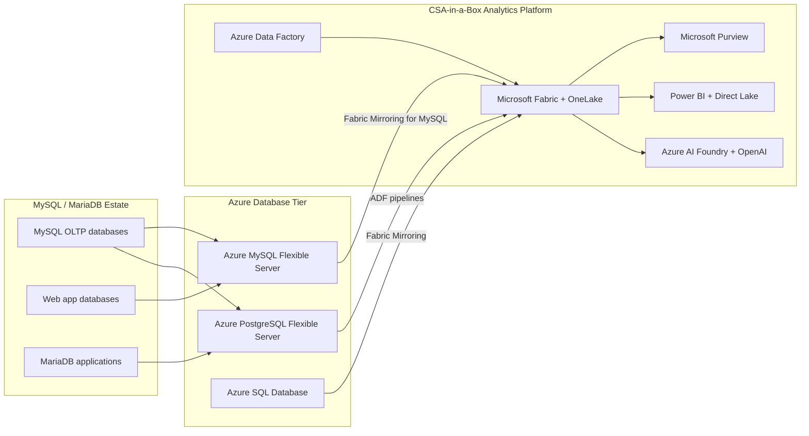

# Migrating from MySQL / MariaDB to Azure

**Status:** Authored 2026-04-30
**Audience:** Database administrators, data engineers, cloud architects, and IT leadership managing MySQL or MariaDB workloads and migrating to Azure-native managed databases.
**Scope:** MySQL Community/Enterprise and MariaDB Server migrating to Azure Database for MySQL Flexible Server, Azure Database for PostgreSQL Flexible Server, or Azure SQL Database. Covers schema conversion, data movement, security migration, and CSA-in-a-Box analytics integration.

---

!!! tip "Expanded Migration Center Available"
This playbook is the core migration reference. For the complete MySQL/MariaDB-to-Azure migration package -- including white papers, deep-dive guides, tutorials, benchmarks, and federal-specific guidance -- visit the **[MySQL to Azure Migration Center](mysql-to-azure/index.md)**.

    **Quick links:**

    - [Why Azure Database (Executive Brief)](mysql-to-azure/why-azure-database.md)
    - [Total Cost of Ownership Analysis](mysql-to-azure/tco-analysis.md)
    - [Complete Feature Mapping (40+ features)](mysql-to-azure/feature-mapping-complete.md)
    - [Federal Migration Guide](mysql-to-azure/federal-migration-guide.md)
    - [Tutorials & Walkthroughs](mysql-to-azure/index.md#tutorials)
    - [Benchmarks & Performance](mysql-to-azure/benchmarks.md)
    - [Best Practices](mysql-to-azure/best-practices.md)

    **Migration guides by target:** [Azure MySQL Flexible Server](mysql-to-azure/flexible-server-migration.md) | [Azure PostgreSQL](mysql-to-azure/postgresql-migration.md) | [Schema Migration](mysql-to-azure/schema-migration.md) | [Data Migration](mysql-to-azure/data-migration.md) | [Security](mysql-to-azure/security-migration.md)

---

## 1. Executive summary

MySQL is the world's most popular open-source relational database, with an estimated 10+ million active deployments spanning web applications, SaaS platforms, government systems, e-commerce, financial services, and IoT backends. MariaDB, the community-driven fork created after Oracle's 2010 acquisition of Sun Microsystems, runs many of the same workloads and maintains broad MySQL compatibility. Together, MySQL and MariaDB underpin a significant portion of the global data infrastructure.

Oracle's ownership of MySQL creates a strategic concern for organizations that chose MySQL specifically to avoid proprietary vendor lock-in. MySQL Enterprise Edition pricing, feature gating (Thread Pool, Enterprise Audit, Enterprise Encryption), and Oracle's track record with open-source acquisitions (OpenSolaris, Hudson/Jenkins, Java SE licensing changes) motivate migration to a fully managed cloud-native platform. MariaDB users face different pressures -- MariaDB Corporation's shift toward SkySQL and the BSL license for newer versions introduces its own commercial uncertainty.

Microsoft Azure offers three compelling targets for MySQL/MariaDB workloads: **Azure Database for MySQL Flexible Server** (same engine, managed service), **Azure Database for PostgreSQL Flexible Server** (engine switch with significant benefits), and **Azure SQL Database** (full platform consolidation). All three provide enterprise-grade high availability, automated patching, built-in backups, Entra ID authentication, Private Link networking, and native integration with the CSA-in-a-Box analytics platform.

This playbook provides honest, practical guidance. MySQL-to-MySQL Flexible Server migration is straightforward for most workloads. MySQL-to-PostgreSQL is a real engine change with tangible benefits but genuine conversion effort. The right choice depends on your workload complexity, team skills, and strategic direction.

### Target platform decision matrix

| Scenario                                            | Recommended target                   | Why                                                                            |
| --------------------------------------------------- | ------------------------------------ | ------------------------------------------------------------------------------ |
| Standard MySQL/MariaDB OLTP, WordPress, web apps    | **Azure MySQL Flexible Server**      | Same engine, minimal code changes, fastest migration                           |
| Open-source modernization, advanced features needed | **Azure PostgreSQL Flexible Server** | Superior JSON, CTE, window functions; PostGIS for spatial; Citus for scale-out |
| Platform consolidation onto Microsoft stack         | **Azure SQL Database / MI**          | Unified management, T-SQL ecosystem, Fabric Mirroring GA                       |
| Large-scale analytics workloads                     | **Microsoft Fabric / Synapse**       | Columnar storage, Spark, Direct Lake, CSA-in-a-Box native                      |
| Regulatory requirement for specific DB engine       | **Azure MySQL Flexible Server**      | Preserves MySQL compatibility for certified applications                       |

---

## 2. How CSA-in-a-Box fits

CSA-in-a-Box is the analytics, governance, and AI landing zone that consumes data from migrated MySQL/MariaDB workloads regardless of which target database you choose.

Key integration points:

- **Fabric Mirroring for Azure MySQL** replicates transactional data to OneLake in near-real-time, enabling analytics without impacting OLTP performance.
- **Azure Data Factory** provides MySQL and MariaDB connectors for batch data movement into the CSA-in-a-Box medallion architecture (Bronze/Silver/Gold layers).
- **Microsoft Purview** catalogs migrated databases, applies classifications (PII, CUI, PHI), and maintains lineage from source MySQL through the analytics layer.
- **Power BI with Direct Lake** serves analytics over migrated data with no data movement from OneLake.

---

## 3. Migration approach summary

### Phase 0 -- Discovery and assessment (Weeks 1-2)

- Inventory all MySQL/MariaDB instances (version, size, engine type, replication topology)
- Identify storage engines in use (InnoDB, MyISAM, MEMORY, ARCHIVE)
- Catalog application dependencies and connection methods (ORM, direct SQL, stored procedures)
- Run Azure Database Migration Service assessment
- Determine target platform per workload (MySQL Flexible, PostgreSQL, Azure SQL)

### Phase 1 -- Landing zone deployment (Weeks 3-4)

- Deploy CSA-in-a-Box foundation (Bicep modules)
- Provision target databases (Azure MySQL Flexible Server, PostgreSQL Flexible Server)
- Configure networking (VNet integration, Private Endpoints)
- Establish Purview catalog and classification taxonomies

### Phase 2 -- Schema migration (Weeks 5-8)

- Convert MyISAM tables to InnoDB (required for Azure MySQL Flexible Server)
- Map character sets and collations (utf8mb3 to utf8mb4)
- Convert schemas using mysqldump DDL extraction or pgloader (for PostgreSQL target)
- Migrate stored procedures, triggers, events, and views
- Deploy and validate converted schemas

### Phase 3 -- Data migration (Weeks 9-14)

- Migrate data using Azure DMS (online or offline mode)
- For large databases, use mydumper/myloader for parallel export/import
- Configure binlog replication for minimal-downtime cutover
- Validate data integrity with row counts, checksums, and application-level testing

### Phase 4 -- Application cutover (Weeks 15-18)

- Update connection strings and driver configurations
- Switch SSL/TLS certificates to Azure-issued certificates
- Parallel-run period with source MySQL as fallback
- Performance validation against baselines
- User acceptance testing

### Phase 5 -- Decommission and optimize (Weeks 19-22)

- Decommission source MySQL/MariaDB instances
- Terminate any MySQL Enterprise subscriptions
- Optimize Azure resource sizing based on production metrics
- Configure Fabric Mirroring or ADF pipelines for analytics integration

---

## 4. Federal compliance considerations

- **FedRAMP High:** Azure Database for MySQL Flexible Server and Azure Database for PostgreSQL Flexible Server are FedRAMP High authorized in Azure Government regions. Control mappings in `csa_platform/csa_platform/governance/compliance/nist-800-53-rev5.yaml`.
- **DoD IL4/IL5:** Both MySQL Flexible Server and PostgreSQL Flexible Server are IL5-authorized on Azure Government.
- **CMMC 2.0 Level 2:** Practice-level mappings in `csa_platform/csa_platform/governance/compliance/cmmc-2.0-l2.yaml`.
- **HIPAA:** BAA-covered services; mappings in `csa_platform/csa_platform/governance/compliance/hipaa-security-rule.yaml`.
- **Oracle/MySQL licensing risk:** Federal agencies using MySQL Enterprise Edition face audit exposure similar to Oracle Database. Migration to Azure MySQL Flexible Server (Community-based) eliminates this commercial risk entirely.

---

## 5. Cost impact

For a **typical mid-sized MySQL estate** (8 production databases, 64 CPU cores across servers, 5 TB total data, mix of Community and Enterprise Edition):

- **Self-hosted MySQL annual cost:** $300K-$800K/year (servers, DBA labor, backups, DR, MySQL Enterprise subscriptions if applicable)
- **Azure MySQL Flexible Server equivalent:** $80K-$200K/year (General Purpose tier, zone-redundant HA, included backups)
- **Azure PostgreSQL equivalent:** $70K-$180K/year (no MySQL licensing considerations, Flexible Server, Citus for scale-out)
- **Azure SQL Database equivalent:** $120K-$280K/year (DTU or vCore pricing, Fabric Mirroring GA)

The 3-year savings for Azure MySQL Flexible Server typically range from $500K to $1.5M, depending on current infrastructure costs and MySQL Enterprise licensing.

See [Total Cost of Ownership Analysis](mysql-to-azure/tco-analysis.md) for detailed projections.

---

## 6. Related resources

- **Migration center:** [MySQL to Azure Migration Center](mysql-to-azure/index.md)
- **Migration index:** [docs/migrations/README.md](README.md)
- **Decision trees:** `docs/decisions/fabric-vs-databricks-vs-synapse.md`
- **Compliance matrices:**
    - `docs/compliance/nist-800-53-rev5.md`
    - `docs/compliance/cmmc-2.0-l2.md`
    - `docs/compliance/hipaa-security-rule.md`
- **CSA-in-a-Box guides:**
    - `docs/guides/azure-mysql.md` -- Azure MySQL integration patterns
    - `docs/guides/azure-postgresql.md` -- Azure PostgreSQL integration patterns
    - `docs/ARCHITECTURE.md` -- Platform architecture
    - `docs/GOV_SERVICE_MATRIX.md` -- Government service availability
    - `docs/COST_MANAGEMENT.md` -- FinOps and cost optimization

---

**Maintainers:** csa-inabox core team
**Last updated:** 2026-04-30
