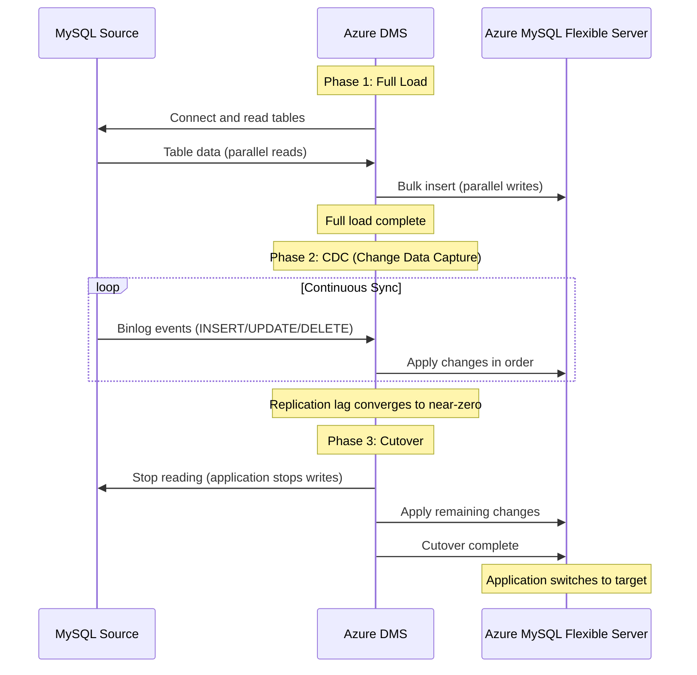
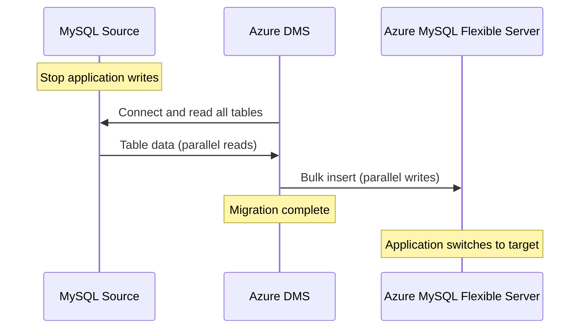

# MySQL / MariaDB Data Migration

**Migration tools and strategies: Azure Database Migration Service (online/offline), mysqldump/mysqlimport, Azure Data Factory, mydumper/myloader for parallel dumps, and binlog replication for minimal-downtime cutover.**

---

!!! abstract "Migration tool decision matrix"
| Tool | Mode | Downtime | Data size | Complexity | Best for |
|---|---|---|---|---|---|
| **Azure DMS** | Online (continuous sync) | Minutes (cutover only) | Any size | Low-Medium | Production migrations needing minimal downtime |
| **Azure DMS** | Offline (one-time) | Hours (proportional to size) | < 1 TB | Low | Simple migrations, dev/test |
| **mysqldump + mysqlimport** | Offline | Hours | < 100 GB | Low | Small databases, simple migrations |
| **mydumper + myloader** | Offline (parallel) | Hours (faster than mysqldump) | 100 GB - 1 TB | Medium | Medium databases needing faster export/import |
| **Azure Data Factory** | Online (batch/incremental) | Minutes (with incremental) | Any size | Medium | Integration with CSA-in-a-Box pipelines |
| **Binlog replication** (manual) | Online (continuous) | Minutes | Any size | High | Custom requirements, complex topologies |

---

## 1. Azure Database Migration Service (DMS)

### 1.1 Overview

Azure DMS is the recommended tool for migrating MySQL databases to Azure Database for MySQL Flexible Server. It supports both online (continuous sync with binlog replication) and offline (one-time copy) modes.

### 1.2 DMS prerequisites

**Source MySQL requirements:**

```sql
-- Verify binlog is enabled (required for online migration)
SHOW VARIABLES LIKE 'log_bin';  -- Must be ON

-- Verify binlog format
SHOW VARIABLES LIKE 'binlog_format';  -- Must be ROW

-- Verify binlog row image
SHOW VARIABLES LIKE 'binlog_row_image';  -- Must be FULL

-- Verify server ID
SHOW VARIABLES LIKE 'server_id';  -- Must be >= 1

-- Verify GTID mode (recommended but not required)
SHOW VARIABLES LIKE 'gtid_mode';  -- ON recommended

-- If binlog is not enabled, add to my.cnf:
-- [mysqld]
-- log-bin = mysql-bin
-- binlog_format = ROW
-- binlog_row_image = FULL
-- server-id = 1
-- gtid_mode = ON
-- enforce-gtid-consistency = ON
-- binlog_expire_logs_seconds = 259200  -- 3 days minimum

-- Create migration user with required privileges
CREATE USER 'dms_user'@'%' IDENTIFIED BY 'StrongPassword123!';
GRANT REPLICATION SLAVE, REPLICATION CLIENT ON *.* TO 'dms_user'@'%';
GRANT SELECT ON *.* TO 'dms_user'@'%';
FLUSH PRIVILEGES;
```

**Target Azure MySQL Flexible Server requirements:**

- Server must be created and accessible
- Target databases must exist (DMS does not create databases)
- Firewall rules or VNet configuration to allow DMS access
- Admin user credentials

**Network requirements:**

- DMS must have network access to both source and target
- For on-premises sources: Azure VPN Gateway, ExpressRoute, or public endpoint with firewall
- For cloud sources: VNet peering or public endpoint

### 1.3 DMS online migration flow



### 1.4 DMS offline migration flow



### 1.5 DMS limitations

| Limitation                                 | Impact                                        | Workaround                                                        |
| ------------------------------------------ | --------------------------------------------- | ----------------------------------------------------------------- |
| **Stored procedures not migrated**         | Schema objects not included in data migration | Export with `mysqldump --routines --no-data` and apply separately |
| **Triggers not migrated**                  | Schema objects not included                   | Export and apply separately                                       |
| **Events not migrated**                    | Schema objects not included                   | Export and recreate                                               |
| **Views not migrated**                     | Schema objects not included                   | Export and apply separately                                       |
| **User accounts not migrated**             | Security model not included                   | Recreate users on target; plan Entra ID migration                 |
| **Cross-database queries**                 | DMS migrates one database at a time           | Migrate all databases, then test cross-database access            |
| **Max 10 databases per migration project** | Large estates need multiple projects          | Create multiple DMS migration projects                            |
| **DEFINER clauses**                        | Views/procedures with DEFINER may fail        | Update DEFINER to target admin user                               |

---

## 2. mysqldump and mysqlimport

### 2.1 mysqldump export

mysqldump is the traditional MySQL backup and migration tool. It produces SQL statements that recreate schema and data.

```bash
# Full database export (schema + data)
mysqldump -h source-host -u root -p \
  --single-transaction \
  --routines \
  --triggers \
  --events \
  --set-gtid-purged=OFF \
  --max_allowed_packet=1G \
  --net_buffer_length=32768 \
  --default-character-set=utf8mb4 \
  mydb > mydb_full.sql

# Schema only (for pre-migration validation)
mysqldump -h source-host -u root -p \
  --no-data \
  --routines \
  --triggers \
  --events \
  mydb > mydb_schema.sql

# Data only (after schema is applied to target)
mysqldump -h source-host -u root -p \
  --no-create-info \
  --single-transaction \
  --set-gtid-purged=OFF \
  --max_allowed_packet=1G \
  mydb > mydb_data.sql

# Single table export
mysqldump -h source-host -u root -p \
  --single-transaction \
  mydb customers > customers.sql

# Exclude specific tables
mysqldump -h source-host -u root -p \
  --single-transaction \
  --ignore-table=mydb.large_log_table \
  --ignore-table=mydb.temp_table \
  mydb > mydb_filtered.sql
```

### 2.2 Import to Azure MySQL Flexible Server

```bash
# Import full dump
mysql -h target-server.mysql.database.azure.com -u admin -p \
  --max_allowed_packet=1G \
  --ssl-mode=REQUIRED \
  mydb < mydb_full.sql

# For faster import, set these on the target before import:
mysql -h target-server.mysql.database.azure.com -u admin -p -e "
SET GLOBAL innodb_flush_log_at_trx_commit = 2;
SET GLOBAL sync_binlog = 0;
SET GLOBAL foreign_key_checks = 0;
SET GLOBAL unique_checks = 0;
SET GLOBAL innodb_buffer_pool_size = <80% of RAM>;
"

# Import data
mysql -h target-server.mysql.database.azure.com -u admin -p mydb < mydb_data.sql

# Restore safe settings after import
mysql -h target-server.mysql.database.azure.com -u admin -p -e "
SET GLOBAL innodb_flush_log_at_trx_commit = 1;
SET GLOBAL sync_binlog = 1;
SET GLOBAL foreign_key_checks = 1;
SET GLOBAL unique_checks = 1;
"
```

### 2.3 mysqldump performance tips

| Technique                     | Impact                              | How                                |
| ----------------------------- | ----------------------------------- | ---------------------------------- |
| `--single-transaction`        | Consistent snapshot without locking | Use for InnoDB tables              |
| `--max_allowed_packet=1G`     | Handle large rows                   | Set on both export and import      |
| `--net_buffer_length=32768`   | Larger INSERT batches               | Faster import                      |
| `--extended-insert`           | Multi-row INSERT statements         | Default ON; faster than single-row |
| `--quick`                     | Stream results instead of buffering | Reduces memory usage               |
| `--compress`                  | Compress data in transit            | Reduces network time               |
| Split by table                | Parallel import of separate files   | Export each table to separate file |
| Disable FK/unique checks      | Skip validation during import       | Re-enable after import             |
| Reduce durability temporarily | `innodb_flush_log_at_trx_commit=2`  | Restore to 1 after import          |

---

## 3. mydumper and myloader

### 3.1 Overview

mydumper/myloader is an open-source tool that provides parallel export and import of MySQL databases. It is significantly faster than mysqldump for medium-to-large databases.

### 3.2 Installation

```bash
# Debian/Ubuntu
sudo apt-get install mydumper

# RHEL/CentOS
sudo yum install mydumper

# macOS
brew install mydumper
```

### 3.3 Parallel export with mydumper

```bash
# Full database export with 8 threads
mydumper \
  --host source-host \
  --user root \
  --password 'MyPassword' \
  --database mydb \
  --outputdir /backup/mydb \
  --threads 8 \
  --rows 100000 \
  --compress \
  --verbose 3 \
  --triggers \
  --events \
  --routines \
  --logfile /backup/mydumper.log

# Options explained:
# --threads 8       : Use 8 parallel threads for export
# --rows 100000     : Split tables into chunks of 100K rows
# --compress        : Compress output files (gzip)
# --triggers        : Include trigger definitions
# --events          : Include event definitions
# --routines        : Include stored procedures/functions
```

### 3.4 Parallel import with myloader

```bash
# Import to Azure MySQL Flexible Server
myloader \
  --host target-server.mysql.database.azure.com \
  --user admin \
  --password 'MyPassword' \
  --database mydb \
  --directory /backup/mydb \
  --threads 8 \
  --overwrite-tables \
  --verbose 3 \
  --logfile /backup/myloader.log

# Options explained:
# --threads 8           : Use 8 parallel threads for import
# --overwrite-tables    : Drop existing tables before import
```

### 3.5 mydumper vs mysqldump performance comparison

| Database size | mysqldump export | mydumper export (8 threads) | mysqldump import | myloader import (8 threads) |
| ------------- | ---------------- | --------------------------- | ---------------- | --------------------------- |
| 10 GB         | ~15 min          | ~4 min                      | ~30 min          | ~8 min                      |
| 50 GB         | ~75 min          | ~18 min                     | ~150 min         | ~35 min                     |
| 100 GB        | ~150 min         | ~35 min                     | ~300 min         | ~70 min                     |
| 500 GB        | ~12 hours        | ~3 hours                    | ~24 hours        | ~6 hours                    |
| 1 TB          | ~24 hours        | ~6 hours                    | ~48 hours        | ~12 hours                   |

Times are approximate and depend on hardware, network speed, and data complexity.

---

## 4. Azure Data Factory

### 4.1 ADF MySQL connector

Azure Data Factory provides a MySQL connector for reading data from MySQL/MariaDB sources and writing to various Azure targets.

```json
{
    "name": "MySQLLinkedService",
    "type": "Microsoft.DataFactory/factories/linkedservices",
    "properties": {
        "type": "MySql",
        "typeProperties": {
            "server": "source-mysql-host",
            "port": 3306,
            "database": "mydb",
            "username": "migration_user",
            "password": {
                "type": "SecureString",
                "value": "StrongPassword123!"
            },
            "sslMode": "Required"
        }
    }
}
```

### 4.2 ADF for incremental data migration

ADF supports incremental (delta) data migration using watermark columns:

```json
{
    "name": "IncrementalCopyPipeline",
    "properties": {
        "activities": [
            {
                "name": "LookupLastWatermark",
                "type": "Lookup",
                "typeProperties": {
                    "source": {
                        "type": "AzureMySqlSource",
                        "query": "SELECT MAX(updated_at) AS last_watermark FROM watermark_table"
                    }
                }
            },
            {
                "name": "IncrementalCopy",
                "type": "Copy",
                "dependsOn": [
                    {
                        "activity": "LookupLastWatermark",
                        "dependencyConditions": ["Succeeded"]
                    }
                ],
                "typeProperties": {
                    "source": {
                        "type": "MySqlSource",
                        "query": "SELECT * FROM customers WHERE updated_at > '@{activity('LookupLastWatermark').output.firstRow.last_watermark}'"
                    },
                    "sink": {
                        "type": "AzureMySqlSink",
                        "writeBatchSize": 10000
                    }
                }
            }
        ]
    }
}
```

### 4.3 ADF for CSA-in-a-Box integration

ADF pipelines can load MySQL data directly into the CSA-in-a-Box medallion architecture:

```
MySQL Source -> ADF Copy Activity -> ADLS Gen2 (Bronze Layer, Parquet)
                                  -> Fabric Lakehouse (Bronze)
                                  -> dbt transformation (Silver/Gold)
```

This pattern is recommended for ongoing data integration after the initial database migration is complete.

---

## 5. Binlog replication for minimal downtime

### 5.1 Manual binlog replication setup

For scenarios where Azure DMS is not suitable, manual binlog replication provides continuous data synchronization from source MySQL to Azure MySQL Flexible Server.

**Step 1: Configure source MySQL**

```sql
-- Verify binlog configuration
SHOW VARIABLES LIKE 'log_bin';         -- Must be ON
SHOW VARIABLES LIKE 'binlog_format';   -- Must be ROW
SHOW VARIABLES LIKE 'server_id';       -- Must be unique

-- Create replication user
CREATE USER 'repl_user'@'%' IDENTIFIED BY 'StrongPassword123!';
GRANT REPLICATION SLAVE ON *.* TO 'repl_user'@'%';
FLUSH PRIVILEGES;
```

**Step 2: Take consistent snapshot**

```bash
# Use mysqldump with --master-data to record binlog position
mysqldump -h source-host -u root -p \
  --single-transaction \
  --master-data=2 \
  --routines \
  --triggers \
  --set-gtid-purged=OFF \
  mydb > mydb_snapshot.sql

# The dump file will contain a comment like:
# -- CHANGE MASTER TO MASTER_LOG_FILE='mysql-bin.000042', MASTER_LOG_POS=154;
```

**Step 3: Import snapshot to target**

```bash
mysql -h target-server.mysql.database.azure.com -u admin -p mydb < mydb_snapshot.sql
```

**Step 4: Configure replication on Azure MySQL Flexible Server**

```sql
-- On Azure MySQL Flexible Server, use the stored procedure:
CALL mysql.az_replication_change_master(
    'source-host',        -- source hostname/IP
    'repl_user',          -- replication username
    'StrongPassword123!', -- replication password
    3306,                 -- source port
    'mysql-bin.000042',   -- binlog file from snapshot
    154,                  -- binlog position from snapshot
    ''                    -- SSL CA certificate (empty for non-SSL)
);

-- Start replication
CALL mysql.az_replication_start;

-- Monitor replication status
SHOW SLAVE STATUS\G
-- Check: Slave_IO_Running = Yes, Slave_SQL_Running = Yes, Seconds_Behind_Master = 0
```

**Step 5: Cutover**

```sql
-- When Seconds_Behind_Master = 0:
-- 1. Stop writes on source application
-- 2. Wait for replication to catch up (Seconds_Behind_Master = 0)
-- 3. Stop replication
CALL mysql.az_replication_stop;

-- 4. Switch application connection strings to Azure MySQL Flexible Server
-- 5. Verify application functionality
-- 6. Clean up replication
CALL mysql.az_replication_remove_master;
```

---

## 6. Data validation

### 6.1 Row count validation

```sql
-- Source: Get row counts for all tables
SELECT table_schema, table_name, table_rows
FROM information_schema.tables
WHERE table_schema = 'mydb'
  AND table_type = 'BASE TABLE'
ORDER BY table_name;

-- Target: Same query on Azure MySQL Flexible Server
-- Compare row counts

-- For exact counts (table_rows in information_schema is approximate):
SELECT 'customers' AS table_name, COUNT(*) AS row_count FROM customers
UNION ALL
SELECT 'orders', COUNT(*) FROM orders
UNION ALL
SELECT 'products', COUNT(*) FROM products;
```

### 6.2 Checksum validation

```sql
-- Source: Compute table checksum
CHECKSUM TABLE mydb.customers, mydb.orders, mydb.products;

-- Target: Compute same checksums and compare
CHECKSUM TABLE mydb.customers, mydb.orders, mydb.products;

-- For column-level validation:
SELECT
    COUNT(*) AS row_count,
    SUM(CRC32(CONCAT_WS('|', id, name, email, created_at))) AS checksum
FROM customers;
```

### 6.3 Application-level validation

- Run application integration tests against target database
- Compare query results for a representative set of business-critical queries
- Validate stored procedure outputs with known inputs
- Test edge cases: NULL values, special characters, Unicode, large BLOBs
- Verify foreign key integrity: `SELECT * FROM child WHERE parent_id NOT IN (SELECT id FROM parent)`

---

## 7. Migration performance optimization

### 7.1 Source-side optimization

```sql
-- Increase binlog retention for online migration
SET GLOBAL binlog_expire_logs_seconds = 604800;  -- 7 days

-- Increase max_allowed_packet for large row export
SET GLOBAL max_allowed_packet = 1073741824;  -- 1 GB

-- If using FLUSH TABLES WITH READ LOCK (MyISAM):
-- Schedule during maintenance window
```

### 7.2 Target-side optimization during import

```sql
-- Temporarily reduce durability for faster import
SET GLOBAL innodb_flush_log_at_trx_commit = 2;
SET GLOBAL sync_binlog = 0;

-- Disable checks
SET GLOBAL foreign_key_checks = 0;
SET GLOBAL unique_checks = 0;

-- Increase sort buffer for index creation
SET GLOBAL sort_buffer_size = 67108864;  -- 64 MB

-- After import, restore production settings:
SET GLOBAL innodb_flush_log_at_trx_commit = 1;
SET GLOBAL sync_binlog = 1;
SET GLOBAL foreign_key_checks = 1;
SET GLOBAL unique_checks = 1;
SET GLOBAL sort_buffer_size = 262144;  -- Default
```

### 7.3 Network optimization

| Technique                   | Impact                 | How                                              |
| --------------------------- | ---------------------- | ------------------------------------------------ |
| **Compression**             | 3-5x faster over WAN   | `--compress` flag in mysqldump/mysqlimport       |
| **Parallel connections**    | 4-8x faster import     | mydumper/myloader with `--threads`               |
| **ExpressRoute**            | Consistent low latency | For on-premises to Azure                         |
| **VPN Gateway**             | Secure tunnel          | For on-premises to Azure                         |
| **Azure Migrate appliance** | On-premises agent      | For discovery and assessment                     |
| **Proximity**               | Minimal latency        | Run migration tools from Azure VM in same region |

---

## 8. Post-migration data tasks

### 8.1 Verify and optimize

```sql
-- Analyze tables to update statistics
ANALYZE TABLE customers;
ANALYZE TABLE orders;
-- Run for all tables

-- Check for missing indexes
-- Review slow query log after application testing

-- Verify auto_increment values
SELECT table_name, auto_increment
FROM information_schema.tables
WHERE table_schema = 'mydb'
  AND auto_increment IS NOT NULL;
```

### 8.2 Configure Fabric Mirroring

After migration, configure Fabric Mirroring for CSA-in-a-Box analytics integration:

1. Navigate to Microsoft Fabric portal
2. Create a new Mirrored Database
3. Select Azure Database for MySQL as source
4. Configure connection to Azure MySQL Flexible Server
5. Select tables to mirror
6. Start mirroring -- data replicates to OneLake in near-real-time

---

**Next:** [Security Migration](security-migration.md) | [Tutorial: DMS Online Migration](tutorial-dms-migration.md) | [Tutorial: mysqldump Migration](tutorial-mysqldump.md)

---

**Maintainers:** csa-inabox core team
**Last updated:** 2026-04-30
