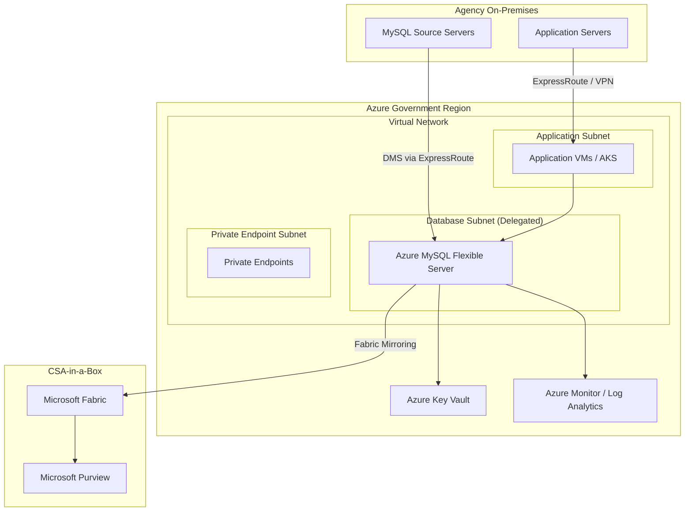

# MySQL Migration in Federal Government

**Azure MySQL in Government regions, FedRAMP authorization, IL compliance, data residency requirements, encryption mandates, private connectivity in Azure Government, and CSA-in-a-Box integration for federal analytics.**

---

!!! abstract "Federal MySQL landscape"
MySQL is widely deployed across federal agencies for web applications, content management systems, custom line-of-business applications, and supporting databases for larger enterprise systems. While MySQL does not carry the same licensing audit exposure as Oracle Database, federal organizations running self-hosted MySQL face significant operational compliance burdens -- patching timelines mandated by BOD 22-01, continuous monitoring requirements, and authorization boundaries that must be documented and maintained. Azure Database for MySQL Flexible Server in Azure Government regions inherits FedRAMP High authorization, simplifying compliance while eliminating operational overhead.

---

## 1. Federal MySQL footprint

### 1.1 MySQL across federal agencies

| Agency / Department        | MySQL usage pattern                               | Migration drivers                       |
| -------------------------- | ------------------------------------------------- | --------------------------------------- |
| **DoD (various branches)** | Web portals, internal tools, WordPress/Drupal CMS | IL4/IL5 compliance, cloud-first mandate |
| **VA**                     | Patient portal backends, appointment systems      | Modernization, HIPAA compliance         |
| **HHS / CMS**              | Public health data, grants management web apps    | FedRAMP requirements, data analytics    |
| **DHS / CISA**             | Cybersecurity tools, threat intelligence DBs      | Security hardening, BOD 22-01 patching  |
| **Commerce / Census**      | Survey data collection, web applications          | Cloud migration, data analytics         |
| **Education**              | Grant management, FAFSA support systems           | Cost reduction, modernization           |
| **Interior / USGS**        | Scientific data collection, GIS backends          | PostGIS migration, analytics            |
| **NASA**                   | Mission support tools, research databases         | Scientific computing, cost optimization |
| **State**                  | Consular applications, visa processing tools      | Global availability, security           |
| **GSA**                    | SAM.gov backends, procurement tools               | Cloud consolidation                     |

### 1.2 Common federal MySQL patterns

| Pattern                     | Description                                          | Count (estimated) |
| --------------------------- | ---------------------------------------------------- | ----------------- |
| **WordPress / Drupal CMS**  | Content management for agency websites               | 5,000+ instances  |
| **Custom web applications** | Python/PHP/Java backends with MySQL                  | 10,000+ instances |
| **COTS backend databases**  | Commercial software using MySQL                      | 2,000+ instances  |
| **Data collection systems** | Survey and data intake applications                  | 1,000+ instances  |
| **DevOps tooling**          | CI/CD, monitoring, ticketing (GitLab, Grafana, JIRA) | 3,000+ instances  |
| **MariaDB forks**           | Agencies that switched from MySQL to MariaDB         | 1,000+ instances  |

---

## 2. Compliance and authorization

### 2.1 Azure database services in Government regions

| Service                              | Azure Government | FedRAMP High | DoD IL2    | DoD IL4    | DoD IL5    | DoD IL6       |
| ------------------------------------ | ---------------- | ------------ | ---------- | ---------- | ---------- | ------------- |
| **Azure MySQL Flexible Server**      | GA               | Authorized   | Authorized | Authorized | Authorized | Not available |
| **Azure PostgreSQL Flexible Server** | GA               | Authorized   | Authorized | Authorized | Authorized | Not available |
| **Azure SQL Database**               | GA               | Authorized   | Authorized | Authorized | Authorized | Authorized    |
| **Azure SQL Managed Instance**       | GA               | Authorized   | Authorized | Authorized | Authorized | Not available |
| **Azure DMS**                        | GA               | Authorized   | Authorized | Authorized | Authorized | Not available |
| **Azure Data Factory**               | GA               | Authorized   | Authorized | Authorized | Authorized | Not available |
| **Microsoft Fabric**                 | GA               | Authorized   | Authorized | Authorized | Roadmap    | Not available |
| **Microsoft Purview**                | GA               | Authorized   | Authorized | Authorized | Authorized | Not available |

### 2.2 Government region availability

Azure Government operates in physically isolated data centers:

| Region              | Location | IL levels          | Services                  |
| ------------------- | -------- | ------------------ | ------------------------- |
| **US Gov Virginia** | Virginia | IL2, IL4, IL5      | Full service availability |
| **US Gov Texas**    | Texas    | IL2, IL4, IL5      | Full service availability |
| **US Gov Arizona**  | Arizona  | IL2, IL4, IL5      | Full service availability |
| **US DoD Central**  | Iowa     | IL2, IL4, IL5, IL6 | DoD-specific services     |
| **US DoD East**     | Virginia | IL2, IL4, IL5, IL6 | DoD-specific services     |

### 2.3 FedRAMP inheritance

When you deploy Azure Database for MySQL Flexible Server in an Azure Government region, you inherit Azure's FedRAMP High authorization. This means:

| NIST 800-53 control family               | Azure-provided controls                    | Customer responsibility                           |
| ---------------------------------------- | ------------------------------------------ | ------------------------------------------------- |
| **AC (Access Control)**                  | Physical access, network access controls   | Database user management, Entra ID configuration  |
| **AU (Audit)**                           | Infrastructure audit, platform logs        | Database audit log configuration, log review      |
| **CM (Configuration Management)**        | OS and platform patching                   | Server parameters, application configuration      |
| **CP (Contingency Planning)**            | Infrastructure redundancy, geo-redundancy  | Backup retention policy, DR plan                  |
| **IA (Identification & Authentication)** | Entra ID, MFA infrastructure               | User provisioning, MFA enforcement                |
| **IR (Incident Response)**               | Platform security monitoring               | Application-level monitoring, response procedures |
| **PE (Physical & Environmental)**        | Data center physical security              | N/A (fully inherited)                             |
| **SC (System & Communications)**         | TLS, encryption at rest, network isolation | Private Link configuration, CMK management        |
| **SI (System & Information Integrity)**  | Patch management, vulnerability scanning   | Application patching, custom code scanning        |

---

## 3. Data residency requirements

### 3.1 Data residency by classification

| Data classification    | Residency requirement                      | Azure Government support           |
| ---------------------- | ------------------------------------------ | ---------------------------------- |
| **Unclassified / CUI** | US-based processing and storage            | US Gov Virginia/Texas/Arizona      |
| **ITAR**               | US-only access, no foreign national access | Azure Government (US persons only) |
| **EAR**                | Export control compliance                  | Azure Government                   |
| **HIPAA/PHI**          | BAA required, US-based recommended         | Azure Government with BAA          |
| **DoD IL4**            | US-based, DoD-approved cloud               | US Gov Virginia/Texas/Arizona      |
| **DoD IL5**            | US-based, higher isolation                 | US Gov Virginia/Texas/Arizona      |
| **DoD IL6**            | Classified processing                      | US DoD Central/East only           |

### 3.2 Data residency configuration

```bash
# Create MySQL Flexible Server in Government region
az mysql flexible-server create \
  --resource-group rg-mysql-federal \
  --name federal-mysql-server \
  --location usgovvirginia \
  --sku-name Standard_D8ds_v4 \
  --tier GeneralPurpose \
  --storage-size 512 \
  --version 8.0-lts \
  --admin-user federaladmin \
  --admin-password 'FederalSecure$2026!' \
  --high-availability ZoneRedundant \
  --geo-redundant-backup Enabled \
  --yes

# Verify region
az mysql flexible-server show \
  --resource-group rg-mysql-federal \
  --name federal-mysql-server \
  --query location
# Expected: usgovvirginia
```

---

## 4. Encryption requirements

### 4.1 FIPS 140-2 compliance

Azure Government regions use FIPS 140-2 validated cryptographic modules for all encryption operations:

| Encryption layer    | Standard                                      | Azure implementation                               |
| ------------------- | --------------------------------------------- | -------------------------------------------------- |
| **Data at rest**    | AES-256 (FIPS 140-2 validated)                | Azure Storage Service Encryption                   |
| **Data in transit** | TLS 1.2/1.3 (FIPS 140-2 validated)            | Azure TLS implementation                           |
| **Key management**  | FIPS 140-2 Level 2 (software) / Level 3 (HSM) | Azure Key Vault (software) / Managed HSM (Level 3) |

### 4.2 Customer-managed keys for federal workloads

Federal agencies often require customer-managed encryption keys (CMK) for data sovereignty:

```bash
# Create Key Vault in Government region
az keyvault create \
  --name federal-mysql-kv \
  --resource-group rg-mysql-federal \
  --location usgovvirginia \
  --sku premium \
  --enable-purge-protection true \
  --retention-days 90

# Create RSA key for MySQL encryption
az keyvault key create \
  --vault-name federal-mysql-kv \
  --name mysql-cmk \
  --kty RSA \
  --size 2048

# Create managed identity for MySQL server
az identity create \
  --resource-group rg-mysql-federal \
  --name mysql-identity \
  --location usgovvirginia

# Grant Key Vault access
az keyvault set-policy \
  --name federal-mysql-kv \
  --object-id <identity-principal-id> \
  --key-permissions get unwrapKey wrapKey

# Configure CMK on MySQL server
az mysql flexible-server update \
  --resource-group rg-mysql-federal \
  --name federal-mysql-server \
  --key <key-resource-id> \
  --identity mysql-identity
```

### 4.3 For IL5 / classified adjacent workloads

| Requirement              | Implementation                                                |
| ------------------------ | ------------------------------------------------------------- |
| FIPS 140-2 Level 3 (HSM) | Use Azure Managed HSM for key storage                         |
| Double encryption        | Enable infrastructure encryption (double encryption at rest)  |
| Key rotation             | Configure automatic key rotation in Key Vault (90-day policy) |
| Key access audit         | Enable Key Vault diagnostic logging to Log Analytics          |

---

## 5. Private connectivity in Government

### 5.1 Network architecture for federal MySQL



### 5.2 ExpressRoute for migration

For federal agencies migrating from on-premises MySQL, ExpressRoute provides a dedicated, private connection to Azure Government:

```bash
# Configure ExpressRoute circuit (example)
az network express-route create \
  --resource-group rg-mysql-federal \
  --name federal-expressroute \
  --location usgovvirginia \
  --bandwidth 1000 \
  --peering-location "Washington DC" \
  --provider "Equinix" \
  --sku-family MeteredData \
  --sku-tier Standard

# Peer VNet to ExpressRoute
az network vnet-gateway create \
  --resource-group rg-mysql-federal \
  --name federal-vnet-gw \
  --vnet federal-vnet \
  --gateway-type ExpressRoute \
  --sku Standard
```

### 5.3 Zero-trust networking

```bash
# Deploy MySQL in a delegated subnet (no public access)
az mysql flexible-server create \
  --resource-group rg-mysql-federal \
  --name federal-mysql-server \
  --location usgovvirginia \
  --vnet federal-vnet \
  --subnet mysql-subnet \
  --private-dns-zone federal-mysql-dns.private.mysql.database.azure.com \
  --public-access Disabled

# Verify no public access
az mysql flexible-server show \
  --resource-group rg-mysql-federal \
  --name federal-mysql-server \
  --query "network.publicNetworkAccess"
# Expected: Disabled
```

---

## 6. Continuous monitoring and BOD compliance

### 6.1 BOD 22-01 (vulnerability patching)

CISA Binding Operational Directive 22-01 requires federal agencies to remediate known exploited vulnerabilities within specified timeframes. Azure MySQL Flexible Server addresses this through automated patching:

| BOD requirement                                    | Azure MySQL implementation                  |
| -------------------------------------------------- | ------------------------------------------- |
| Patch critical vulnerabilities within 14 days      | Automated minor version updates (monthly)   |
| Patch known exploited vulnerabilities per CISA KEV | Microsoft patches critical CVEs within days |
| Maintain vulnerability management program          | Azure Defender + diagnostic logging         |
| Report patching status                             | Azure Policy compliance reports             |

### 6.2 Continuous diagnostics and mitigation (CDM)

```bash
# Configure diagnostic settings for CDM compliance
az monitor diagnostic-settings create \
  --resource /subscriptions/<sub>/resourceGroups/rg-mysql-federal/providers/Microsoft.DBforMySQL/flexibleServers/federal-mysql-server \
  --name MySQLDiagnostics \
  --workspace <log-analytics-workspace-id> \
  --logs '[
    {"category": "MySqlAuditLogs", "enabled": true, "retentionPolicy": {"enabled": true, "days": 365}},
    {"category": "MySqlSlowLogs", "enabled": true, "retentionPolicy": {"enabled": true, "days": 90}}
  ]' \
  --metrics '[
    {"category": "AllMetrics", "enabled": true, "retentionPolicy": {"enabled": true, "days": 90}}
  ]'
```

### 6.3 Azure Policy for compliance enforcement

```bash
# Assign policy: MySQL should use private link
az policy assignment create \
  --name "mysql-private-link" \
  --scope "/subscriptions/<sub>/resourceGroups/rg-mysql-federal" \
  --policy "d9844e8a-1437-4aeb-a32c-0c992f056095"

# Assign policy: MySQL should use CMK encryption
az policy assignment create \
  --name "mysql-cmk-encryption" \
  --scope "/subscriptions/<sub>/resourceGroups/rg-mysql-federal" \
  --policy "83cef61d-dbd1-4b20-a4fc-5fbc7da10833"
```

---

## 7. Federal migration checklist

- [ ] Verify target Azure Government region supports required IL level
- [ ] Confirm FedRAMP High authorization inheritance for Azure MySQL Flexible Server
- [ ] Document SSP (System Security Plan) changes for ATO update
- [ ] Configure customer-managed encryption keys in Azure Key Vault
- [ ] Deploy MySQL in delegated VNet subnet (no public access)
- [ ] Configure ExpressRoute or VPN for on-premises connectivity
- [ ] Enable audit logging with 365-day retention
- [ ] Configure Azure Defender for MySQL
- [ ] Set up diagnostic settings for CDM compliance
- [ ] Apply Azure Policy for compliance enforcement
- [ ] Migrate users to Entra ID authentication (phase out MySQL passwords)
- [ ] Configure FIPS 140-2 validated encryption (automatic in Gov regions)
- [ ] Test DR procedures (point-in-time restore, geo-restore)
- [ ] Update ATO documentation with new system boundary
- [ ] Brief ISSM/ISSO on architecture changes

---

## 8. CSA-in-a-Box integration in Government

CSA-in-a-Box deployment in Azure Government regions provides the same analytics, governance, and AI capabilities as commercial Azure, within the FedRAMP High boundary:

| CSA-in-a-Box component | Azure Government availability | Federal use case                                      |
| ---------------------- | ----------------------------- | ----------------------------------------------------- |
| **Azure Data Factory** | GA                            | MySQL data ingestion into medallion architecture      |
| **Microsoft Fabric**   | GA                            | Lakehouse analytics on MySQL data                     |
| **Microsoft Purview**  | GA                            | Data catalog, classification (CUI, PII, PHI), lineage |
| **Power BI**           | GA                            | Dashboards and reports over migrated MySQL data       |
| **Azure AI Foundry**   | GA                            | AI/ML on MySQL data (Azure OpenAI in Gov)             |

---

**Next:** [Benchmarks](benchmarks.md) | [Best Practices](best-practices.md) | [Security Migration](security-migration.md)

---

**Maintainers:** csa-inabox core team
**Last updated:** 2026-04-30
