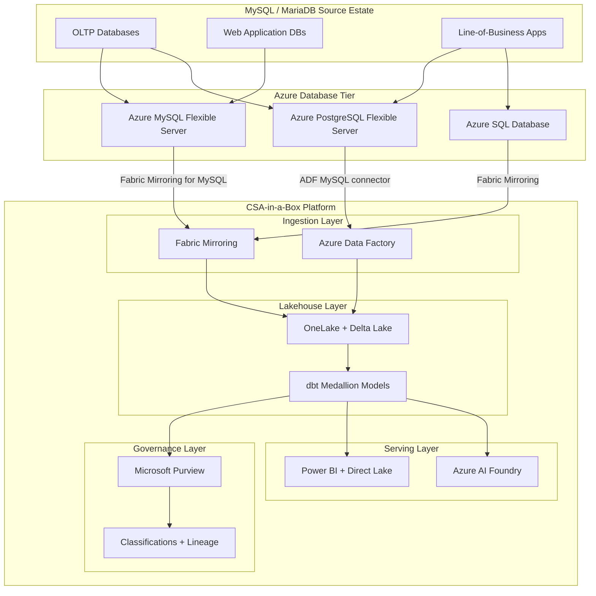
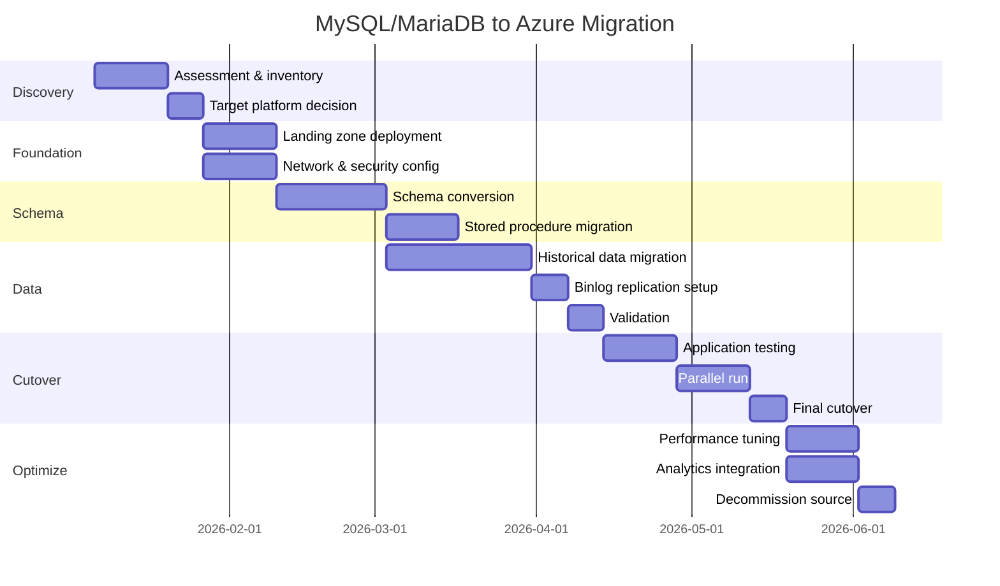

# MySQL / MariaDB to Azure Migration Center

**The definitive resource for migrating from MySQL and MariaDB to Microsoft Azure -- whether staying on the MySQL engine with Azure Database for MySQL Flexible Server, modernizing to PostgreSQL, or consolidating onto Azure SQL.**

---

## Who this is for

This migration center serves database administrators, data engineers, application developers, cloud architects, IT leadership, and federal program managers evaluating or executing a migration from self-hosted MySQL or MariaDB to Azure-native managed databases. Whether you are driven by Oracle's ownership of MySQL, the operational burden of self-managed databases, a cloud-first mandate, or the need for enterprise-grade security and compliance, these resources provide the evidence, patterns, and step-by-step guidance to execute confidently.

### Audience by role

| Role                          | Start here                                                | Key concern                                                       |
| ----------------------------- | --------------------------------------------------------- | ----------------------------------------------------------------- |
| CIO / CDO / Executive sponsor | [Why Azure Database](why-azure-database.md)               | Strategic rationale, managed service benefits, Oracle vendor risk |
| CFO / Procurement             | [TCO Analysis](tco-analysis.md)                           | Infrastructure savings, DBA labor reduction, 3/5-year projections |
| Enterprise Architect          | [Feature Mapping](feature-mapping-complete.md)            | Capability parity, engine differences, architectural decisions    |
| DBA / Database Engineer       | [Flexible Server Migration](flexible-server-migration.md) | Server parameters, version compatibility, performance tuning      |
| Application Developer         | [Schema Migration](schema-migration.md)                   | Data type mapping, SQL syntax differences, ORM configuration      |
| Security / Compliance         | [Security Migration](security-migration.md)               | Authentication, encryption, Private Link, FedRAMP inheritance     |
| Federal Program Manager       | [Federal Migration Guide](federal-migration-guide.md)     | Gov region availability, IL compliance, data residency            |

---

## Quick-start decision matrix

| Your situation                                 | Start here                                                             |
| ---------------------------------------------- | ---------------------------------------------------------------------- |
| Executive evaluating MySQL migration to cloud  | [Why Azure Database](why-azure-database.md)                            |
| Need cost justification for migration          | [Total Cost of Ownership Analysis](tco-analysis.md)                    |
| Need a feature-by-feature comparison           | [Complete Feature Mapping (40+ features)](feature-mapping-complete.md) |
| Standard MySQL OLTP, want same engine in cloud | [Azure MySQL Flexible Server Migration](flexible-server-migration.md)  |
| Considering switching to PostgreSQL            | [PostgreSQL Migration](postgresql-migration.md)                        |
| Need data type and schema conversion details   | [Schema Migration](schema-migration.md)                                |
| Planning data movement strategy                | [Data Migration](data-migration.md)                                    |
| Federal/government-specific requirements       | [Federal Migration Guide](federal-migration-guide.md)                  |
| Want a hands-on DMS walkthrough                | [Tutorial: DMS Online Migration](tutorial-dms-migration.md)            |
| Want a mysqldump-based migration               | [Tutorial: mysqldump Migration](tutorial-mysqldump.md)                 |
| Need performance comparison data               | [Benchmarks](benchmarks.md)                                            |
| Ready to plan full migration                   | [Migration Playbook](../mysql-to-azure.md)                             |

---

## Target platform comparison

The first decision is which Azure database platform to target. MySQL and MariaDB workloads typically land on one of three targets.

| Criterion                   | Azure MySQL Flexible Server                         | Azure PostgreSQL Flexible Server                      | Azure SQL Database                                     |
| --------------------------- | --------------------------------------------------- | ----------------------------------------------------- | ------------------------------------------------------ |
| **Best for**                | MySQL apps, minimal code changes, fastest migration | Advanced features, PostGIS, open-source modernization | Microsoft ecosystem consolidation, Fabric Mirroring GA |
| **Engine**                  | MySQL Community Edition (8.0, 8.4)                  | PostgreSQL (13-17)                                    | SQL Server engine                                      |
| **License cost**            | Included (Community Edition)                        | None (open source)                                    | Included in service                                    |
| **Schema conversion**       | Minimal (same engine)                               | pgloader, manual SQL conversion                       | MySQL Workbench + SSMA patterns                        |
| **Stored procedures**       | Native MySQL syntax                                 | Requires PL/pgSQL conversion                          | Requires T-SQL conversion                              |
| **High availability**       | Zone-redundant HA (99.99% SLA)                      | Zone-redundant HA (99.99% SLA)                        | Built-in HA (99.99-99.995% SLA)                        |
| **Max storage**             | 16 TB                                               | 64 TB                                                 | 100 TB (Hyperscale)                                    |
| **Read replicas**           | Up to 10                                            | Up to 5                                               | Built-in read scale-out                                |
| **Connection pooling**      | Built-in (MySQL router compatible)                  | Built-in PgBouncer                                    | Built-in connection pooling                            |
| **JSON support**            | MySQL JSON type                                     | JSONB with advanced indexing                          | JSON with T-SQL functions                              |
| **Spatial/GIS**             | MySQL Spatial (limited)                             | PostGIS (industry standard)                           | Spatial data types                                     |
| **Full-text search**        | MySQL full-text (InnoDB)                            | tsvector/tsquery                                      | Full-text search                                       |
| **Fabric Mirroring**        | Supported (Mirroring for MySQL)                     | Via ADF pipelines                                     | GA (native Mirroring)                                  |
| **Gov region availability** | GA in Azure Government                              | GA in Azure Government                                | GA in Azure Government                                 |
| **Migration complexity**    | Low                                                 | Medium-High                                           | High                                                   |

---

## How CSA-in-a-Box fits

Regardless of which target database you choose, CSA-in-a-Box serves as the unified analytics, governance, and AI platform that consumes data from migrated MySQL/MariaDB workloads.

### Integration patterns

**Fabric Mirroring for Azure MySQL Flexible Server** enables near-real-time replication of MySQL tables into OneLake without impacting OLTP performance. Once data lands in OneLake as Delta Lake tables, the full CSA-in-a-Box analytics stack is available -- dbt medallion models for transformation, Purview for governance and lineage, Power BI with Direct Lake for zero-copy reporting, and Azure AI Foundry for intelligent workloads.

**Azure Data Factory MySQL connector** provides batch and incremental data movement from MySQL sources (on-premises or Azure MySQL Flexible Server) into the CSA-in-a-Box medallion architecture. ADF supports both the MySQL native connector and the generic ODBC connector for MariaDB-specific deployments.

**Microsoft Purview** catalogs migrated databases, applies sensitivity labels and classifications (PII, CUI, PHI), scans Azure MySQL Flexible Server and PostgreSQL Flexible Server metadata, and maintains end-to-end data lineage from source MySQL through the OneLake analytics layer.

---

## Migration timeline

### Typical timeline by workload complexity

| Complexity     | Database count  | Characteristics                                                                                    | Timeline    |
| -------------- | --------------- | -------------------------------------------------------------------------------------------------- | ----------- |
| **Simple**     | 1-5 databases   | < 100 GB each, no stored procedures, InnoDB only, single-region                                    | 4-6 weeks   |
| **Moderate**   | 5-20 databases  | 100 GB - 1 TB, stored procedures, triggers, replication, multi-app                                 | 8-14 weeks  |
| **Complex**    | 20-50 databases | > 1 TB, MyISAM conversion needed, cross-database queries, custom UDFs, engine switch to PostgreSQL | 14-24 weeks |
| **Enterprise** | 50+ databases   | Multi-region, complex replication topologies, MariaDB mixed fleet, compliance requirements         | 24-36 weeks |

### Phase overview

---

## Guides

### Core migration guides

| Guide                                                     | Description                                                                                           | Lines |
| --------------------------------------------------------- | ----------------------------------------------------------------------------------------------------- | ----- |
| [Flexible Server Migration](flexible-server-migration.md) | MySQL to Azure MySQL Flexible Server: version compatibility, parameter mapping, storage configuration | ~380  |
| [PostgreSQL Migration](postgresql-migration.md)           | MySQL to Azure PostgreSQL: when to switch engines, schema conversion tools, SQL syntax differences    | ~380  |
| [Schema Migration](schema-migration.md)                   | Data type mapping, AUTO_INCREMENT, character sets, collations, indexes, partitioning                  | ~380  |
| [Data Migration](data-migration.md)                       | Azure DMS, mysqldump, mydumper/myloader, ADF, binlog replication                                      | ~430  |
| [Security Migration](security-migration.md)               | Authentication, TLS, Private Link, encryption, audit logging                                          | ~340  |

### Reference materials

| Resource                                              | Description                                                                   |
| ----------------------------------------------------- | ----------------------------------------------------------------------------- |
| [Why Azure Database](why-azure-database.md)           | Executive brief: managed service advantages, Oracle risk, innovation velocity |
| [TCO Analysis](tco-analysis.md)                       | Self-hosted MySQL vs Azure MySQL Flexible Server cost comparison              |
| [Feature Mapping](feature-mapping-complete.md)        | 40+ MySQL/MariaDB features mapped to Azure equivalents                        |
| [Federal Migration Guide](federal-migration-guide.md) | Gov regions, FedRAMP, IL compliance, data residency                           |
| [Benchmarks](benchmarks.md)                           | Performance comparison by tier, IOPS, connection pooling                      |
| [Best Practices](best-practices.md)                   | Version checklist, parameter tuning, monitoring, CSA-in-a-Box integration     |

---

## Tutorials

| Tutorial                                             | Duration  | Difficulty   | Description                                                                              |
| ---------------------------------------------------- | --------- | ------------ | ---------------------------------------------------------------------------------------- |
| [DMS Online Migration](tutorial-dms-migration.md)    | 2-3 hours | Intermediate | End-to-end online migration using Azure DMS with binlog replication for minimal downtime |
| [mysqldump Offline Migration](tutorial-mysqldump.md) | 1-2 hours | Beginner     | Offline migration using mysqldump/mysqlimport with parallel export using mydumper        |

---

## MySQL vs MariaDB -- migration differences

While MySQL and MariaDB share a common heritage, their divergence since the MariaDB 10.x series creates specific migration considerations.

| Aspect                | MySQL                                | MariaDB                                           | Migration impact                                               |
| --------------------- | ------------------------------------ | ------------------------------------------------- | -------------------------------------------------------------- |
| **Target server**     | Azure MySQL Flexible Server (native) | Azure MySQL Flexible Server (compatible for 10.x) | MariaDB 10.x mostly compatible; 11.x may need testing          |
| **Storage engines**   | InnoDB, MyISAM, MEMORY, NDB          | InnoDB, Aria, ColumnStore, MyISAM, MEMORY         | Aria/ColumnStore need conversion to InnoDB                     |
| **Replication**       | GTID (MySQL format), binlog          | GTID (MariaDB format), binlog, Galera             | MariaDB GTID format differs; binlog position preferred for DMS |
| **JSON support**      | Native JSON type (binary storage)    | JSON as alias for LONGTEXT (string storage)       | MariaDB JSON queries may behave differently on Azure MySQL     |
| **Window functions**  | MySQL 8.0+                           | MariaDB 10.2+                                     | Both supported on Azure MySQL Flexible Server                  |
| **System versioning** | Not available                        | MariaDB 10.3+ (temporal tables)                   | Requires application-level handling on Azure MySQL             |
| **Sequences**         | Not available (use AUTO_INCREMENT)   | MariaDB 10.3+ (CREATE SEQUENCE)                   | Convert sequences to AUTO_INCREMENT for Azure MySQL            |
| **CHECK constraints** | MySQL 8.0.16+ (enforced)             | MariaDB 10.2+ (enforced)                          | Both enforced on Azure MySQL 8.0+                              |
| **CTE (WITH)**        | MySQL 8.0+                           | MariaDB 10.2+                                     | Both supported                                                 |
| **Invisible columns** | MySQL 8.0.23+                        | MariaDB 10.3+                                     | Both supported on Azure MySQL 8.0                              |

---

## Common migration blockers and solutions

| Blocker                     | Impact                                       | Solution                                                                  |
| --------------------------- | -------------------------------------------- | ------------------------------------------------------------------------- |
| **MyISAM tables**           | Azure MySQL Flexible Server requires InnoDB  | Convert with `ALTER TABLE t ENGINE=InnoDB` before migration               |
| **MySQL 5.6 or earlier**    | Not supported on Flexible Server             | Upgrade to 5.7 or 8.0 on-premises first, then migrate                     |
| **MariaDB-specific SQL**    | Sequences, system versioning, Aria engine    | Convert to MySQL-compatible syntax before migration                       |
| **SUPER privilege usage**   | Not available on managed service             | Refactor to use supported privilege model                                 |
| **local_infile**            | Disabled by default on Flexible Server       | Enable via server parameter or use alternative bulk load                  |
| **Custom UDFs**             | User-defined functions (C/C++) not supported | Rewrite as stored functions or move logic to application tier             |
| **mysql system database**   | Not accessible on managed service            | Use server parameters and Entra ID for configuration                      |
| **FEDERATED engine**        | Not supported on Flexible Server             | Replace with Azure Data Factory for cross-database data movement          |
| **NDB Cluster**             | Not supported on Flexible Server             | Redesign for Azure MySQL HA or PostgreSQL with Citus                      |
| **Large BLOB/TEXT columns** | max_allowed_packet limits                    | Configure server parameter; consider Azure Blob Storage for large objects |

---

## Getting started

1. **Read the executive brief:** [Why Azure Database](why-azure-database.md) to understand the strategic case
2. **Run the TCO analysis:** [TCO Analysis](tco-analysis.md) with your specific MySQL estate data
3. **Choose your target:** Use the decision matrix above to select Azure MySQL, PostgreSQL, or Azure SQL
4. **Follow the appropriate guide:** [Flexible Server Migration](flexible-server-migration.md) or [PostgreSQL Migration](postgresql-migration.md)
5. **Execute a tutorial:** [DMS Online Migration](tutorial-dms-migration.md) for hands-on experience
6. **Plan the full migration:** [Migration Playbook](../mysql-to-azure.md) for the complete lifecycle

---

**Maintainers:** csa-inabox core team
**Last updated:** 2026-04-30
