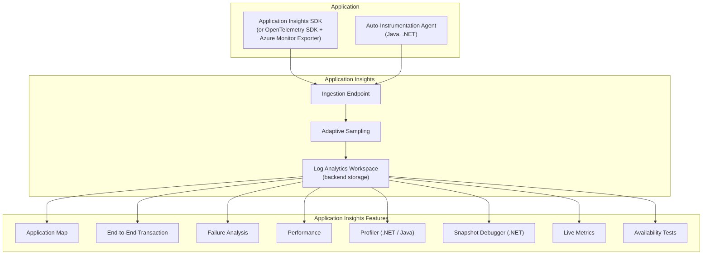

# APM Migration: Application Performance Monitoring to Application Insights

**Audience:** Application Developers, SREs, Platform Engineers
**Source platforms:** Datadog APM, New Relic APM, Splunk APM
**Target:** Azure Application Insights (OpenTelemetry-based)
**Last updated:** 2026-04-30

---

## Overview

Application Performance Monitoring (APM) is typically the highest-value and most migration-sensitive observability component. APM instruments application code to capture distributed traces, dependency calls, exceptions, and performance metrics. This guide covers migrating from Datadog APM, New Relic APM, and Splunk APM to Azure Application Insights.

Application Insights supports two instrumentation approaches:

1. **Auto-instrumentation (codeless)** -- attach an agent or enable a platform feature; no code changes required. Available for .NET, Java, Node.js, and Python.
2. **OpenTelemetry SDK** -- instrument with the vendor-neutral OpenTelemetry SDK using the Azure Monitor exporter. Available for all languages with OTel support.

The recommended strategy is to use auto-instrumentation where available and OpenTelemetry SDK for languages or frameworks where auto-instrumentation is not supported.

---

## Architecture: Application Insights components



---

## Migration by language

### .NET applications

#### Auto-instrumentation (recommended for Azure App Service)

For .NET applications running on Azure App Service, enable Application Insights with zero code changes.

**Azure Portal:**

1. Navigate to your App Service resource
2. Select **Application Insights** in the left menu
3. Click **Turn on Application Insights**
4. Select your workspace-based Application Insights resource
5. Choose the instrumentation level (Recommended or Full)

**Bicep:**

```bicep
resource appServiceSiteExtension 'Microsoft.Web/sites/siteextensions@2023-12-01' = {
  parent: appService
  name: 'Microsoft.ApplicationInsights.AzureWebSites'
}

resource appService 'Microsoft.Web/sites@2023-12-01' = {
  name: appServiceName
  location: location
  properties: {
    siteConfig: {
      appSettings: [
        {
          name: 'APPLICATIONINSIGHTS_CONNECTION_STRING'
          value: appInsights.properties.ConnectionString
        }
        {
          name: 'ApplicationInsightsAgent_EXTENSION_VERSION'
          value: '~3'
        }
      ]
    }
  }
}
```

#### OpenTelemetry SDK (.NET)

For self-hosted .NET applications or when you need fine-grained control.

```csharp
// Program.cs
using Azure.Monitor.OpenTelemetry.AspNetCore;

var builder = WebApplication.CreateBuilder(args);

// Add Azure Monitor OpenTelemetry
builder.Services.AddOpenTelemetry().UseAzureMonitor(options =>
{
    options.ConnectionString = builder.Configuration["APPLICATIONINSIGHTS_CONNECTION_STRING"];
});

var app = builder.Build();
app.Run();
```

**NuGet package:** `Azure.Monitor.OpenTelemetry.AspNetCore`

**What it captures automatically:**

- HTTP incoming requests (ASP.NET Core middleware)
- HTTP outgoing calls (HttpClient)
- SQL Server queries (Microsoft.Data.SqlClient)
- Azure SDK calls (Azure.Core)
- gRPC calls
- Exceptions and stack traces

**Migration from Datadog .NET tracer:**

| Datadog configuration                  | Application Insights equivalent                  |
| -------------------------------------- | ------------------------------------------------ |
| `DD_AGENT_HOST` / `DD_TRACE_AGENT_URL` | `APPLICATIONINSIGHTS_CONNECTION_STRING`          |
| `DD_SERVICE`                           | Set via `ActivitySource` name or `CloudRoleName` |
| `DD_ENV`                               | Set via `CloudRoleInstance` or custom property   |
| `DD_VERSION`                           | Application Insights release annotation          |
| `DD_TRACE_SAMPLE_RATE`                 | `SamplingPercentage` in SDK configuration        |
| `DD_LOGS_INJECTION`                    | Automatic with `ILogger` integration             |

**Migration from New Relic .NET agent:**

| New Relic configuration        | Application Insights equivalent             |
| ------------------------------ | ------------------------------------------- |
| `NEW_RELIC_LICENSE_KEY`        | `APPLICATIONINSIGHTS_CONNECTION_STRING`     |
| `NEW_RELIC_APP_NAME`           | `CloudRoleName`                             |
| `newrelic.config` agent config | `appsettings.json` or environment variables |
| Custom instrumentation XML     | OpenTelemetry `ActivitySource` spans        |

### Java applications

#### Auto-instrumentation (recommended)

The Application Insights Java agent provides codeless auto-instrumentation for all major Java frameworks.

**Setup:**

1. Download the Application Insights Java agent JAR
2. Add the JVM argument: `-javaagent:applicationinsights-agent-3.6.x.jar`
3. Set the connection string via environment variable or `applicationinsights.json`

```json
{
    "connectionString": "InstrumentationKey=...;IngestionEndpoint=...",
    "role": {
        "name": "my-java-service"
    },
    "sampling": {
        "percentage": 50
    },
    "instrumentation": {
        "logging": {
            "level": "WARN"
        }
    }
}
```

**Frameworks auto-instrumented:**

- Spring Boot (MVC, WebFlux)
- Apache Tomcat, Jetty, Undertow
- Jakarta EE / Java EE
- Quarkus, Micronaut
- Apache HttpClient, OkHttp, Netty
- JDBC (all drivers), MongoDB, Redis, Cassandra
- Kafka, RabbitMQ, JMS
- gRPC

**Migration from Datadog Java tracer:**

| Datadog                           | Application Insights                             |
| --------------------------------- | ------------------------------------------------ |
| `-javaagent:dd-java-agent.jar`    | `-javaagent:applicationinsights-agent-3.6.x.jar` |
| `DD_SERVICE=my-service`           | `"role": {"name": "my-service"}` in config       |
| `DD_TRACE_SAMPLE_RATE=0.5`        | `"sampling": {"percentage": 50}`                 |
| `@Trace` annotation               | OpenTelemetry `@WithSpan` annotation             |
| `DDTracer.builder()` custom spans | `Tracer.spanBuilder()` via OTel API              |

#### OpenTelemetry SDK (Java)

For maximum control or when using the OTel Collector as an intermediary.

```java
// build.gradle
dependencies {
    implementation 'com.azure:azure-monitor-opentelemetry-exporter:1.0.0-beta.x'
    implementation 'io.opentelemetry:opentelemetry-sdk:1.x'
    implementation 'io.opentelemetry:opentelemetry-sdk-extension-autoconfigure:1.x'
}
```

```java
import com.azure.monitor.opentelemetry.exporter.AzureMonitorExporterBuilder;

OpenTelemetrySdk sdk = AutoConfiguredOpenTelemetrySdk.builder()
    .addSpanExporterCustomizer((exporter, config) ->
        new AzureMonitorExporterBuilder()
            .connectionString(System.getenv("APPLICATIONINSIGHTS_CONNECTION_STRING"))
            .buildTraceExporter())
    .build()
    .getOpenTelemetrySdk();
```

### Node.js applications

```javascript
// tracing.js -- load before any other module
const { useAzureMonitor } = require("@azure/monitor-opentelemetry");

useAzureMonitor({
    azureMonitorExporterOptions: {
        connectionString: process.env.APPLICATIONINSIGHTS_CONNECTION_STRING,
    },
    samplingRatio: 0.5,
});
```

**npm package:** `@azure/monitor-opentelemetry`

**Auto-instrumented:**

- Express, Fastify, Koa, Hapi
- http/https modules
- MongoDB, PostgreSQL, MySQL, Redis
- AWS SDK, Azure SDK
- gRPC, GraphQL

**Migration from Datadog Node.js tracer:**

| Datadog                         | Application Insights                           |
| ------------------------------- | ---------------------------------------------- |
| `require('dd-trace').init()`    | `useAzureMonitor({...})`                       |
| `DD_TRACE_AGENT_URL`            | `APPLICATIONINSIGHTS_CONNECTION_STRING`        |
| `tracer.trace('operation', fn)` | OTel `tracer.startActiveSpan('operation', fn)` |

### Python applications

```python
# app.py -- configure before importing application modules
from azure.monitor.opentelemetry import configure_azure_monitor

configure_azure_monitor(
    connection_string=os.environ["APPLICATIONINSIGHTS_CONNECTION_STRING"],
    enable_live_metrics=True,
)
```

**pip package:** `azure-monitor-opentelemetry`

**Auto-instrumented:**

- Django, Flask, FastAPI
- requests, urllib3, httpx, aiohttp
- psycopg2, pymongo, redis, pymysql
- Azure SDK

---

## Distributed tracing migration

### Trace context propagation

Application Insights uses W3C TraceContext for distributed trace propagation -- the same standard that Datadog, New Relic, and Splunk support. During migration, mixed environments (some services on the old APM, some on Application Insights) will propagate trace context correctly if both sides support W3C TraceContext.

**Dual-instrumentation during migration:**

For services that need to send traces to both the old APM and Application Insights simultaneously, use the OpenTelemetry Collector as a routing layer.

```yaml
# otel-collector-config.yaml
receivers:
    otlp:
        protocols:
            grpc:
                endpoint: 0.0.0.0:4317
            http:
                endpoint: 0.0.0.0:4318

exporters:
    azuremonitor:
        connection_string: ${APPLICATIONINSIGHTS_CONNECTION_STRING}
    datadog:
        api:
            key: ${DD_API_KEY}

service:
    pipelines:
        traces:
            receivers: [otlp]
            exporters: [azuremonitor, datadog] # Dual-ship traces
```

### Trace sampling strategies

Application Insights provides three sampling approaches.

**Adaptive sampling (recommended for most workloads):**

Automatically adjusts sampling rate to target a configured volume. In the .NET SDK, this is enabled by default.

```csharp
builder.Services.AddOpenTelemetry().UseAzureMonitor(options =>
{
    options.SamplingRatio = 0.5f; // Start at 50%; adaptive adjusts
});
```

**Fixed-rate sampling:**

Consistent sampling ratio for all telemetry. Useful when you need predictable volume.

```json
{
    "sampling": {
        "percentage": 10
    }
}
```

**Ingestion sampling:**

Applied after data reaches the Application Insights endpoint. Use as a cost safety net.

Configure in the Azure portal under Application Insights > Usage and estimated costs > Data sampling.

---

## Application Map and dependency tracking

Application Insights automatically builds an Application Map showing service dependencies, call volumes, and error rates. This replaces:

- Datadog Service Map
- New Relic Service Maps
- Splunk APM Service Map

The map is generated from distributed trace data. No additional configuration is needed beyond enabling Application Insights on each service.

**Cross-service correlation requirements:**

1. All services must send telemetry to the same Log Analytics workspace (or workspace group)
2. Each service must set a unique `CloudRoleName` (equivalent to Datadog `DD_SERVICE`)
3. W3C TraceContext headers must propagate between services (automatic with OTel SDKs)

---

## Performance Profiler

Application Insights Profiler captures CPU call stacks in production with minimal overhead (<5% CPU impact). This replaces Datadog Continuous Profiler and New Relic CodeStream profiling.

**Supported runtimes:**

- .NET (ASP.NET Core on App Service, VMs, Containers)
- Java (via JFR integration)

**Enable for .NET on App Service:**

1. Navigate to Application Insights > Performance > Profiler
2. Click **Enable Profiler**
3. Configure triggers (always-on, CPU threshold, or manual)

**Profiler output:**

- Hot path analysis (which code paths consume the most CPU)
- Flame graphs for individual requests
- Comparison between slow and fast request profiles

---

## Snapshot Debugger (.NET only)

A unique Application Insights feature with no equivalent in Datadog, New Relic, or Splunk. Snapshot Debugger captures local variable values and the call stack when exceptions occur in production -- without attaching a debugger or stopping the process.

**Enable:**

```csharp
builder.Services.AddSnapshotCollector(config =>
{
    config.IsEnabledInDeveloperMode = false;
    config.ThresholdForSnapshotting = 1; // Capture after 1 occurrence
    config.MaximumSnapshotsRequired = 3; // Limit snapshots per problem
});
```

---

## Migration checklist

- [ ] Deploy workspace-based Application Insights resources (one per application or shared)
- [ ] Enable auto-instrumentation for .NET and Java applications
- [ ] Add OpenTelemetry SDK for Node.js and Python applications
- [ ] Configure `CloudRoleName` for each service (replaces vendor service names)
- [ ] Verify distributed trace propagation across services (W3C TraceContext)
- [ ] Set up adaptive sampling with target volume
- [ ] Enable Profiler for critical .NET/Java services
- [ ] Enable Snapshot Debugger for .NET services
- [ ] Create Application Insights availability tests (replaces vendor synthetic monitors)
- [ ] Configure alert rules for failure rate, response time, and dependency failures
- [ ] Set up release annotations for deployment tracking
- [ ] Dual-ship traces during migration using OTel Collector
- [ ] Validate Application Map shows all services and dependencies
- [ ] Remove vendor APM agents/SDKs after validation period

---

**Related:** [Log Migration](log-migration.md) | [Metrics Migration](metrics-migration.md) | [Tutorial: Application Insights](tutorial-app-insights.md) | [Feature Mapping](feature-mapping-complete.md)
