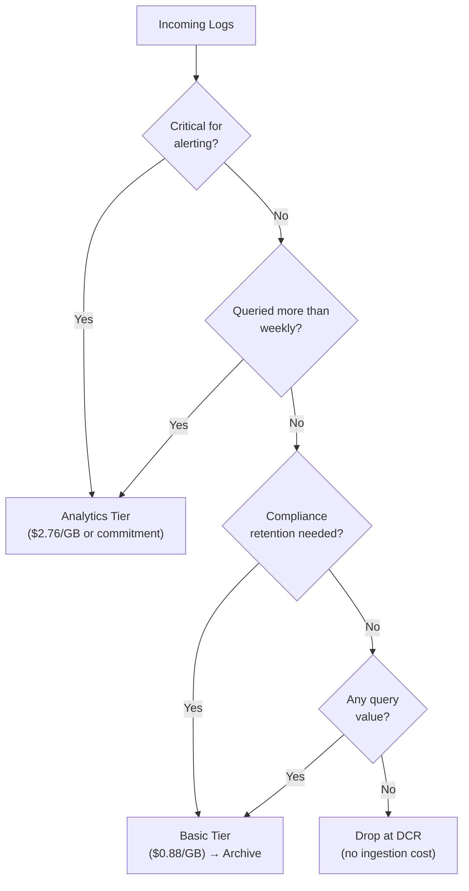
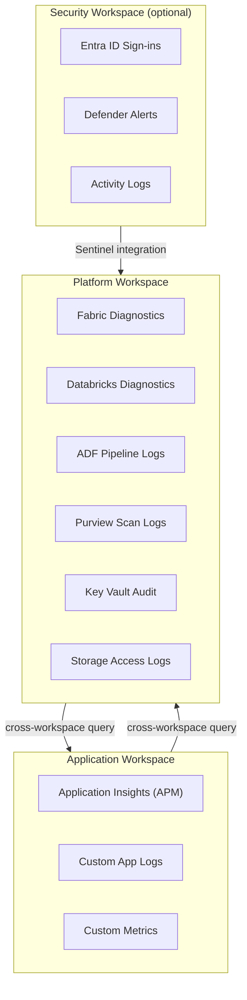

# Best Practices: Observability Migration to Azure Monitor

**Audience:** Platform Engineers, SREs, DevOps Leads
**Last updated:** 2026-04-30

---

## Overview

This document captures proven best practices for migrating from third-party observability platforms to Azure Monitor. These recommendations are based on patterns observed across enterprise and federal migrations.

---

## 1. Incremental migration strategy

### Start with new applications

The lowest-risk migration approach is to instrument all new applications with Azure Monitor from day one while keeping existing applications on the current vendor. This creates a growing Azure Monitor footprint without disrupting existing operations.

**Implementation:**

- Add Application Insights OpenTelemetry to all new application templates and scaffolding
- Configure new AKS clusters with Container Insights enabled by default
- Deploy new VMs with Azure Monitor Agent via Azure Policy
- Existing applications migrate on a service-by-service basis during scheduled maintenance windows

**Benefits:**

- Zero disruption to existing monitoring
- Team gains Azure Monitor experience on lower-risk applications
- Natural migration as applications are rewritten or updated

### Migration priority order

Migrate observability components in this recommended order:

1. **Infrastructure monitoring** (VM Insights, Container Insights) -- lowest risk, most standardized
2. **Log ingestion** (Azure Monitor Agent, DCR) -- high value, well-understood patterns
3. **Metrics and dashboards** -- visible impact, manageable scope
4. **APM (Application Insights)** -- highest value, most migration effort
5. **Alerting** -- migrate last, after data sources are established
6. **Synthetic monitoring** -- can run in parallel indefinitely

---

## 2. Dual-shipping: Run both platforms in parallel

### Why dual-ship

Never attempt a big-bang cutover. Dual-shipping telemetry to both the existing vendor and Azure Monitor for 2-4 weeks provides:

- **Validation:** Confirm data completeness and accuracy
- **Confidence:** Operations teams can compare dashboards and alerts side-by-side
- **Rollback:** If Azure Monitor reveals gaps, the existing vendor continues providing coverage
- **Training:** Teams learn KQL and Azure Monitor workflows while the safety net is in place

### OpenTelemetry Collector for dual-shipping

The OpenTelemetry Collector is the ideal intermediary for dual-shipping. Applications send telemetry to the Collector once; the Collector forwards to both destinations.

```yaml
# otel-collector-config.yaml
receivers:
    otlp:
        protocols:
            grpc:
                endpoint: 0.0.0.0:4317
            http:
                endpoint: 0.0.0.0:4318

processors:
    batch:
        timeout: 10s
        send_batch_size: 1024

exporters:
    # Azure Monitor (target)
    azuremonitor:
        connection_string: ${APPLICATIONINSIGHTS_CONNECTION_STRING}

    # Datadog (existing - temporary during migration)
    datadog:
        api:
            key: ${DD_API_KEY}
            site: datadoghq.com

    # Log Analytics (for logs)
    azuremonitor/logs:
        connection_string: ${APPLICATIONINSIGHTS_CONNECTION_STRING}

service:
    pipelines:
        traces:
            receivers: [otlp]
            processors: [batch]
            exporters: [azuremonitor, datadog]
        metrics:
            receivers: [otlp]
            processors: [batch]
            exporters: [azuremonitor, datadog]
        logs:
            receivers: [otlp]
            processors: [batch]
            exporters: [azuremonitor/logs, datadog]
```

### Dual-shipping cost management

Dual-shipping doubles telemetry volume temporarily. Manage costs by:

- Sampling aggressively during the dual-ship period (25-50%)
- Dual-shipping only for services actively being migrated (not the entire fleet)
- Limiting the dual-ship period to 2-4 weeks per service
- Using Basic logs tier for the duplicate data stream on Azure Monitor

---

## 3. OpenTelemetry as the abstraction layer

### Vendor-neutral instrumentation

The single most important architectural decision for a sustainable observability strategy is to instrument with OpenTelemetry rather than vendor-specific SDKs.

**Why:**

- Applications are instrumented once with OpenTelemetry APIs
- The backend (Azure Monitor, Datadog, Grafana Cloud, etc.) is a deployment-time configuration decision
- Future vendor changes require zero application code changes
- OpenTelemetry is a CNCF standard with broad industry support

**How:**

```csharp
// .NET example -- vendor-neutral instrumentation
using System.Diagnostics;
using System.Diagnostics.Metrics;

// These use OpenTelemetry APIs, NOT vendor-specific APIs
var activitySource = new ActivitySource("MyApp.Orders");
var meter = new Meter("MyApp.Metrics");
var counter = meter.CreateCounter<long>("orders_created");

// The exporter configuration determines where telemetry goes
// Swap Azure Monitor for any OTel-compatible backend with zero code changes
builder.Services.AddOpenTelemetry()
    .UseAzureMonitor()  // Azure Monitor exporter
    // .WithTracing(b => b.AddOtlpExporter())  // Or OTLP to any backend
    ;
```

### Avoid vendor-specific SDK features

When migrating to Azure Monitor, resist the temptation to use Application Insights-specific APIs (e.g., `TelemetryClient.TrackEvent()`) for new instrumentation. Use OpenTelemetry APIs exclusively for new code. The Azure Monitor OpenTelemetry distribution transparently translates OTel telemetry to Application Insights format.

**Exceptions where Application Insights-specific features are justified:**

- Snapshot Debugger (no OTel equivalent)
- Live Metrics (no OTel equivalent)
- Release annotations (API-only feature)

---

## 4. Cost optimization

### Tier routing strategy

Route logs to the appropriate tier based on value and query frequency.



### Specific routing recommendations

| Log source                           | Tier              | Rationale                                          |
| ------------------------------------ | ----------------- | -------------------------------------------------- |
| Application exceptions               | Analytics         | Active alerting and investigation                  |
| API request traces                   | Analytics         | Performance monitoring and SLO tracking            |
| Security audit logs                  | Analytics         | Compliance and security alerting                   |
| Infrastructure syslog (warn+)        | Analytics         | Operational alerting                               |
| Application debug/trace logs         | Basic             | Rarely queried; ad-hoc investigation               |
| CDN/WAF access logs                  | Basic             | Forensic investigation only                        |
| Health check probes                  | Drop (DCR filter) | No analytical value; generates noise               |
| Kubernetes liveness/readiness probes | Drop (DCR filter) | High volume; no analytical value                   |
| Verbose SDK telemetry                | Drop (DCR filter) | Internal SDK diagnostics; not needed in production |

### DCR transformation to drop noise

```kusto
// Drop health check requests before ingestion
source
| where not(Url has "/health" or Url has "/ready" or Url has "/alive")
| where not(UserAgent has "kube-probe" or UserAgent has "ELB-HealthChecker")
```

### Commitment tier selection

Choose your commitment tier based on 30 days of observed ingestion.

```kusto
// Query to determine daily ingestion volume
Usage
| where TimeGenerated > ago(30d)
| summarize DailyGB = sum(Quantity) / 1024.0 by bin(TimeGenerated, 1d)
| summarize
    AvgDailyGB = avg(DailyGB),
    P90DailyGB = percentile(DailyGB, 90),
    MaxDailyGB = max(DailyGB)
```

**Decision rule:** Commit to the tier at or below your P90 daily ingestion. Overages above the commitment tier are billed at pay-as-you-go rates, which is more expensive than the commitment but ensures you never pay for committed capacity you do not use.

### Application Insights sampling

Enable adaptive sampling for production workloads. Configure sampling overrides to keep 100% of high-value telemetry.

```json
{
    "sampling": {
        "percentage": 25,
        "overrides": [
            { "telemetryType": "exception", "percentage": 100 },
            {
                "telemetryType": "request",
                "attributes": [
                    {
                        "key": "http.status_code",
                        "value": "5.*",
                        "matchType": "regexp"
                    }
                ],
                "percentage": 100
            },
            {
                "telemetryType": "dependency",
                "attributes": [{ "key": "success", "value": "false" }],
                "percentage": 100
            }
        ]
    }
}
```

---

## 5. Workspace design

### Single workspace vs multiple workspaces

| Pattern                                | Use case                                           | Trade-offs                                                                                      |
| -------------------------------------- | -------------------------------------------------- | ----------------------------------------------------------------------------------------------- |
| **Single workspace**                   | Small-medium organizations; simplicity             | Simplest queries; single RBAC boundary; risk of noisy-neighbor query impact                     |
| **Per-environment** (dev/staging/prod) | Environment isolation                              | Clean separation; no risk of dev data in prod queries; slightly more complex cross-env analysis |
| **Per-team + shared**                  | Large organizations with data ownership boundaries | Team autonomy; table-level RBAC; cross-workspace queries possible but more complex              |
| **Per-compliance-boundary**            | Federal (IL4 vs IL5, classified vs unclassified)   | Mandatory for compliance; separate regions and access controls                                  |

**Recommendation for CSA-in-a-Box:** Start with a single workspace for the platform (Fabric, Databricks, ADF, Purview diagnostics) and separate workspace(s) for application teams. Cross-workspace queries in KQL (`workspace('other-workspace').TableName`) enable correlation when needed.

### Workspace architecture for CSA-in-a-Box



---

## 6. CSA-in-a-Box monitoring integration

### Enable diagnostic settings for all CSA-in-a-Box components

Ensure every deployed CSA-in-a-Box resource sends diagnostics to the central Log Analytics workspace.

```bicep
// Template pattern for diagnostic settings
resource diagnosticSetting 'Microsoft.Insights/diagnosticSettings@2021-05-01-preview' = {
  scope: targetResource
  name: 'diag-to-law'
  properties: {
    workspaceId: platformWorkspace.id
    logs: [
      { categoryGroup: 'allLogs', enabled: true }
    ]
    metrics: [
      { category: 'AllMetrics', enabled: true }
    ]
  }
}
```

### CSA-in-a-Box platform health workbook

Create a unified workbook that shows the health of all CSA-in-a-Box components.

```kusto
// ADF pipeline success rate (last 24h)
AzureDiagnostics
| where ResourceProvider == "MICROSOFT.DATAFACTORY"
| where Category == "PipelineRuns"
| where TimeGenerated > ago(24h)
| summarize
    Total = count(),
    Succeeded = countif(status_s == "Succeeded"),
    Failed = countif(status_s == "Failed")
| extend SuccessRate = round(Succeeded * 100.0 / Total, 2)

// Databricks cluster utilization
AzureDiagnostics
| where ResourceProvider == "MICROSOFT.DATABRICKS"
| where Category == "clusters"
| where TimeGenerated > ago(1h)
| summarize AvgNodes = avg(toint(num_workers_s)) by bin(TimeGenerated, 5m)
| render timechart

// Purview scan status
AzureDiagnostics
| where ResourceProvider == "MICROSOFT.PURVIEW"
| where Category == "ScanStatusLogEvent"
| where TimeGenerated > ago(7d)
| summarize Count = count() by resultType_s
```

---

## 7. Team enablement

### KQL training plan

| Week | Topic                                                   | Resources                                                                          |
| ---- | ------------------------------------------------------- | ---------------------------------------------------------------------------------- |
| 1    | KQL basics: `where`, `project`, `summarize`, `order by` | [KQL Quick Reference](https://learn.microsoft.com/kusto/query/kql-quick-reference) |
| 2    | Time series: `bin`, `render timechart`, `make-series`   | KQL tutorials in Azure portal                                                      |
| 3    | Joins and subqueries: `join`, `let`, `materialize`      | Log Analytics demo workspace                                                       |
| 4    | Advanced: `parse`, `extract`, `reduce`, `evaluate`      | Team query library                                                                 |

### Query library

Maintain a shared KQL query library (as a Workbook or in Git) with pre-built queries for common investigation patterns. This accelerates adoption by giving teams working examples rather than requiring them to write KQL from scratch.

### Runbook integration

Update operational runbooks to reference Azure Monitor:

- Replace "open Datadog and search for..." with "open Log Analytics and run this KQL query..."
- Include direct links to Azure Monitor alert investigation views
- Add workbook URLs for common troubleshooting dashboards

---

## 8. Operational readiness checklist

Before decommissioning the source vendor, verify:

- [ ] All hosts and containers are reporting via Azure Monitor Agent
- [ ] All applications are instrumented with Application Insights
- [ ] Top 20 dashboards are recreated in Workbooks or Managed Grafana
- [ ] All critical alert rules are migrated and validated
- [ ] Alert notification channels (PagerDuty, Slack, ServiceNow) are tested
- [ ] On-call teams are trained on KQL and Azure Monitor workflows
- [ ] Runbooks are updated with Azure Monitor references
- [ ] Data ingestion volume matches expected levels
- [ ] Commitment tier is set appropriately
- [ ] Basic logs and archive tiers are configured for cost optimization
- [ ] Sampling is enabled and tuned for production workloads
- [ ] Cross-workspace queries work for platform-to-application correlation
- [ ] CSA-in-a-Box diagnostic settings are active for all components
- [ ] Cost alerts are configured (Azure Cost Management)
- [ ] Compliance requirements are met (retention, encryption, access control)
- [ ] Vendor contract termination notice has been prepared

---

**Related:** [Migration Playbook](../observability-to-azure-monitor.md) | [TCO Analysis](tco-analysis.md) | [Benchmarks](benchmarks.md) | [Federal Migration Guide](federal-migration-guide.md)
