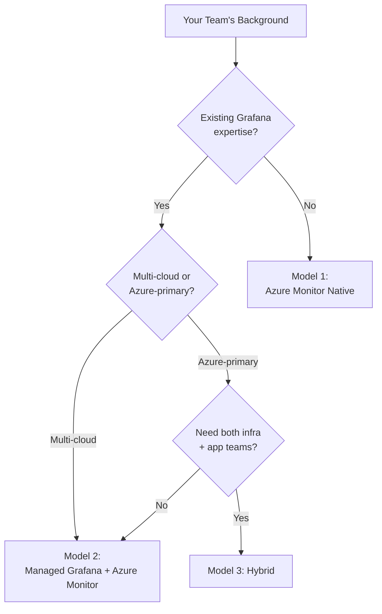
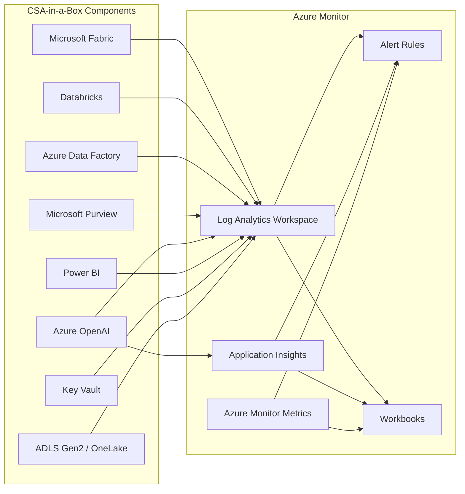
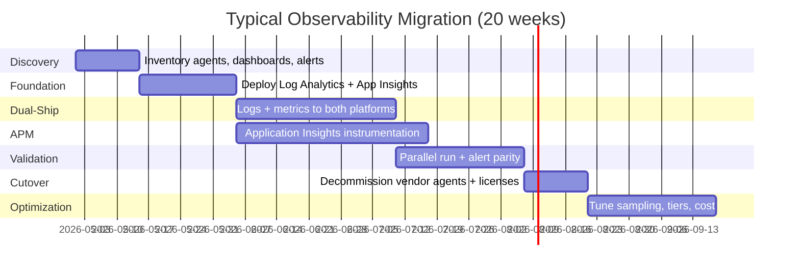

# Observability to Azure Monitor Migration Center

**The definitive resource for migrating from Datadog, New Relic, Splunk Observability, and Dynatrace to Azure Monitor, Application Insights, and Azure Managed Grafana.**

---

## Who this is for

This migration center serves platform engineers, SREs, DevOps leads, IT directors, application developers, and federal technology leaders who are evaluating or executing a migration from third-party observability platforms to Azure Monitor. Whether you are responding to cost pressure from per-host licensing, consolidating observability onto the Azure control plane, addressing federal compliance requirements that third-party vendors cannot meet, or unifying application and infrastructure monitoring, these resources provide the evidence, patterns, and step-by-step guidance to execute confidently.

---

## Quick-start decision matrix

| Your situation                                          | Start here                                                 |
| ------------------------------------------------------- | ---------------------------------------------------------- |
| Executive evaluating Azure Monitor vs Datadog/NR/Splunk | [Why Azure Monitor](why-azure-monitor.md)                  |
| Need cost justification for migration                   | [Total Cost of Ownership Analysis](tco-analysis.md)        |
| Need a feature-by-feature comparison                    | [Complete Feature Mapping](feature-mapping-complete.md)    |
| Ready to plan a migration                               | [Migration Playbook](../observability-to-azure-monitor.md) |
| Federal/government-specific requirements                | [Federal Migration Guide](federal-migration-guide.md)      |
| Migrating APM / distributed tracing                     | [APM Migration](apm-migration.md)                          |
| Migrating log management                                | [Log Migration](log-migration.md)                          |
| Migrating metrics and Prometheus                        | [Metrics Migration](metrics-migration.md)                  |
| Migrating alert rules and on-call                       | [Alerting Migration](alerting-migration.md)                |
| Migrating dashboards                                    | [Dashboard Migration](dashboard-migration.md)              |
| Hands-on Application Insights tutorial                  | [Tutorial: Application Insights](tutorial-app-insights.md) |
| Hands-on Log Analytics tutorial                         | [Tutorial: Log Analytics](tutorial-log-analytics.md)       |

---

## Decision: Azure Monitor vs Azure Managed Grafana vs Hybrid

Before migrating, decide on your target architecture. Azure Monitor supports three deployment models.

### Model 1: Azure Monitor Native

**Best for:** Teams standardizing on Azure, new to observability tooling, or prioritizing simplicity and cost.

- **Dashboards:** Azure Workbooks
- **Alerting:** Azure Monitor Alerts
- **Query language:** KQL
- **Cost:** Lowest (no additional Grafana compute)
- **Strengths:** Deepest Azure integration, simplest operations, single billing

### Model 2: Azure Managed Grafana + Azure Monitor Backend

**Best for:** Teams with existing Grafana expertise, multi-cloud environments, or strong PromQL/Grafana dashboard investment.

- **Dashboards:** Azure Managed Grafana (fully managed)
- **Data sources:** Azure Monitor, Azure Data Explorer, Prometheus, Log Analytics
- **Query language:** KQL + PromQL
- **Cost:** Moderate (adds Grafana instance cost)
- **Strengths:** Familiar Grafana UX, community dashboard ecosystem, multi-source correlation

### Model 3: Hybrid (Workbooks + Grafana)

**Best for:** Large organizations with mixed teams -- platform teams use Workbooks for Azure infrastructure, application teams use Grafana for microservices.

- **Azure infrastructure:** Workbooks (VM Insights, Container Insights, network)
- **Application observability:** Grafana (APM dashboards, Prometheus metrics, custom panels)
- **Cost:** Highest (both tools maintained)
- **Strengths:** Maximum flexibility, best-of-both-worlds for diverse teams

---

## Strategic resources

These documents provide the business case, cost analysis, and strategic framing for decision-makers.

| Document                                                | Audience                    | Description                                                                                                                                                |
| ------------------------------------------------------- | --------------------------- | ---------------------------------------------------------------------------------------------------------------------------------------------------------- |
| [Why Azure Monitor](why-azure-monitor.md)               | CIO / CTO / VP Engineering  | Executive brief covering unified observability, AI-powered insights, cost advantages, OpenTelemetry support, and honest assessment of competitor strengths |
| [Total Cost of Ownership Analysis](tco-analysis.md)     | CFO / CIO / Procurement     | Detailed pricing model comparison for Datadog, New Relic, Splunk Observability, and Azure Monitor across three environment sizes with 5-year projections   |
| [Complete Feature Mapping](feature-mapping-complete.md) | Platform Architecture / SRE | 50+ observability features mapped across all four platforms with migration complexity ratings                                                              |

---

## Migration guides

Domain-specific deep dives covering every aspect of an observability migration.

| Guide                                         | Source capability                          | Azure destination                         |
| --------------------------------------------- | ------------------------------------------ | ----------------------------------------- |
| [APM Migration](apm-migration.md)             | Datadog APM, NR APM, Splunk APM            | Application Insights, OpenTelemetry       |
| [Log Migration](log-migration.md)             | Datadog Logs, NR Logs, Splunk Log Observer | Log Analytics, Data Collection Rules      |
| [Metrics Migration](metrics-migration.md)     | Custom metrics, Prometheus, StatsD         | Azure Monitor Metrics, Managed Prometheus |
| [Alerting Migration](alerting-migration.md)   | Monitors, alerts, detectors                | Azure Monitor Alerts, Action Groups       |
| [Dashboard Migration](dashboard-migration.md) | Datadog/Grafana/NR dashboards              | Azure Workbooks, Managed Grafana          |

---

## Tutorials

Hands-on walkthroughs for the most common migration tasks.

| Tutorial                                                           | Time      | Description                                                                                                                                                                      |
| ------------------------------------------------------------------ | --------- | -------------------------------------------------------------------------------------------------------------------------------------------------------------------------------- |
| [Application Insights Instrumentation](tutorial-app-insights.md)   | 60-90 min | Instrument a .NET/Java application with Application Insights using auto-instrumentation and OpenTelemetry, configure sampling, set up availability tests, and create alert rules |
| [Log Analytics and Azure Monitor Agent](tutorial-log-analytics.md) | 60-90 min | Deploy Azure Monitor Agent via Data Collection Rules, ingest custom logs, write KQL queries replacing DQL/NRQL/SPL, and create a workbook dashboard                              |

---

## Technical references

| Document                                                   | Description                                                                                                                             |
| ---------------------------------------------------------- | --------------------------------------------------------------------------------------------------------------------------------------- |
| [Complete Feature Mapping](feature-mapping-complete.md)    | Every observability feature mapped across Datadog, New Relic, Splunk Observability, and Azure Monitor with migration complexity ratings |
| [Benchmarks](benchmarks.md)                                | Query performance, ingestion rates, cost-per-GB comparison, alert evaluation latency, and Application Insights sampling impact          |
| [Migration Playbook](../observability-to-azure-monitor.md) | The end-to-end migration playbook with capability mapping, phased project plan, cost comparison, and competitive framing                |

---

## Government and federal

| Document                                              | Description                                                                                                                                          |
| ----------------------------------------------------- | ---------------------------------------------------------------------------------------------------------------------------------------------------- |
| [Federal Migration Guide](federal-migration-guide.md) | Azure Monitor in Azure Government, FedRAMP High compliance, IL4/IL5, data residency for logs, FIPS endpoints, and diagnostic settings for compliance |

---

## How CSA-in-a-Box fits

Azure Monitor is **CSA-in-a-Box's native observability layer**. Every component deployed by the reference architecture emits diagnostics to Azure Monitor.

Migrating to Azure Monitor does not just replace a third-party observability tool -- it unifies application monitoring with the platform monitoring that CSA-in-a-Box already provides. Benefits include:

- **Single Log Analytics workspace** for both platform diagnostics (Fabric capacity, ADF pipeline runs, Purview scan health) and application telemetry (traces, custom metrics, exceptions)
- **Cross-component correlation** using KQL to join application errors with infrastructure events (e.g., correlate a spike in API errors with a Databricks cluster autoscale event)
- **Unified alerting** with action groups that notify the same on-call teams for both platform and application issues
- **Power BI integration** for business observability dashboards that combine application performance metrics with data pipeline SLAs
- **Cost visibility** through Azure Cost Management -- observability spend is visible alongside compute, storage, and data platform costs

---

## Migration timeline overview

---

## Recommended migration sequence

For organizations migrating from any of the three major observability platforms, follow this recommended reading order:

1. **Business case:** [Why Azure Monitor](why-azure-monitor.md) then [TCO Analysis](tco-analysis.md)
2. **Feature parity:** [Complete Feature Mapping](feature-mapping-complete.md)
3. **Plan by domain:**
    - [APM Migration](apm-migration.md) -- for application performance monitoring
    - [Log Migration](log-migration.md) -- for centralized logging
    - [Metrics Migration](metrics-migration.md) -- for custom and infrastructure metrics
    - [Alerting Migration](alerting-migration.md) -- for alert rules and on-call
    - [Dashboard Migration](dashboard-migration.md) -- for visualization
4. **Hands-on:**
    - [Tutorial: Application Insights](tutorial-app-insights.md)
    - [Tutorial: Log Analytics](tutorial-log-analytics.md)
5. **Federal (if applicable):** [Federal Migration Guide](federal-migration-guide.md)
6. **Validate:** [Benchmarks](benchmarks.md)
7. **Operationalize:** [Best Practices](best-practices.md)

---

**Last updated:** 2026-04-30
**Maintainers:** CSA-in-a-Box core team
**Related:** [Migration Playbook](../observability-to-azure-monitor.md) | [Splunk to Sentinel](../splunk-to-sentinel.md) | [CSA-in-a-Box Observability Patterns](../../patterns/observability-otel.md) | [Monitoring Best Practices](../../best-practices/monitoring-observability.md)
