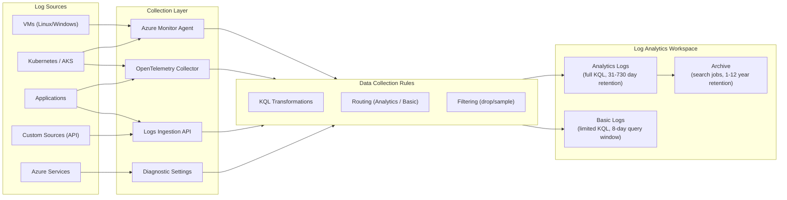

# Log Migration: Log Platforms to Azure Log Analytics

**Audience:** Platform Engineers, SREs, Security Engineers
**Source platforms:** Datadog Logs, New Relic Logs, Splunk Log Observer, Splunk Enterprise
**Target:** Azure Monitor Log Analytics workspace
**Last updated:** 2026-04-30

---

## Overview

Log management is typically the highest-volume and highest-cost component of an observability platform. This guide covers migrating centralized log ingestion, query patterns, and log-based alerting from third-party platforms to Azure Monitor Log Analytics.

Azure Log Analytics provides:

- **Unified log store** for application logs, infrastructure logs, security events, and Azure service diagnostics
- **KQL (Kusto Query Language)** for ad-hoc analysis, dashboards, and alert rules
- **Data Collection Rules (DCR)** for ingestion routing, transformation, and filtering
- **Azure Monitor Agent (AMA)** for agent-based log collection from VMs and containers
- **Logs Ingestion API** for custom log sources via REST API
- **Basic logs and archive tiers** for cost-optimized retention

---

## Architecture: Log ingestion pipeline



---

## Azure Monitor Agent (AMA) deployment

The Azure Monitor Agent replaces the legacy Log Analytics agent (MMA/OMS) and all vendor-specific agents (Datadog Agent, New Relic Infrastructure Agent, Splunk Universal Forwarder).

### Agent comparison

| Capability                        | Datadog Agent | NR Infrastructure Agent | Splunk UF/HF      | Azure Monitor Agent               |
| --------------------------------- | ------------- | ----------------------- | ----------------- | --------------------------------- |
| Syslog collection                 | Yes           | Yes                     | Yes               | Yes (DCR-based)                   |
| Windows Event Log                 | Yes           | Yes                     | Yes               | Yes (DCR-based)                   |
| Custom log files                  | Yes           | Yes                     | Yes               | Yes (DCR-based)                   |
| Performance counters              | Yes           | Yes                     | Yes               | Yes (DCR-based)                   |
| Process monitoring                | Yes           | Yes                     | Yes               | Yes (VM Insights)                 |
| Container logs                    | Yes           | Yes                     | Yes               | Yes (Container Insights)          |
| Custom metrics (StatsD/DogStatsD) | DogStatsD     | StatsD                  | StatsD            | Via OTel Collector                |
| Agent configuration               | datadog.yaml  | newrelic-infra.yml      | inputs.conf       | Data Collection Rules (Azure API) |
| Centralized management            | Datadog UI    | NR UI                   | Deployment Server | Azure Policy / DCR                |
| Auto-update                       | Yes           | Yes                     | Yes               | Yes (extension-managed)           |

### Deploying AMA via Data Collection Rules

AMA is configured entirely through Data Collection Rules (DCRs). A DCR specifies what to collect, how to transform it, and where to send it.

**Bicep example: Deploy AMA with syslog and custom log collection**

```bicep
resource dataCollectionRule 'Microsoft.Insights/dataCollectionRules@2023-03-11' = {
  name: 'dcr-linux-logs'
  location: location
  properties: {
    dataSources: {
      syslog: [
        {
          name: 'syslogDataSource'
          facilityNames: [
            'auth'
            'authpriv'
            'daemon'
            'kern'
            'syslog'
          ]
          logLevels: [
            'Warning'
            'Error'
            'Critical'
            'Alert'
            'Emergency'
          ]
          streams: ['Microsoft-Syslog']
        }
      ]
      logFiles: [
        {
          name: 'appLogFiles'
          filePatterns: ['/var/log/myapp/*.log']
          format: 'text'
          streams: ['Custom-AppLogs_CL']
          settings: {
            text: {
              recordStartTimestampFormat: 'ISO 8601'
            }
          }
        }
      ]
    }
    destinations: {
      logAnalytics: [
        {
          name: 'logAnalyticsWorkspace'
          workspaceResourceId: workspaceId
        }
      ]
    }
    dataFlows: [
      {
        streams: ['Microsoft-Syslog']
        destinations: ['logAnalyticsWorkspace']
      }
      {
        streams: ['Custom-AppLogs_CL']
        destinations: ['logAnalyticsWorkspace']
        transformKql: 'source | where RawData !contains "DEBUG" | extend Level = iif(RawData contains "ERROR", "Error", "Info")'
      }
    ]
  }
}
```

### DCR transformations

Data Collection Rules support KQL transformations at ingestion time. This replaces:

- Datadog log pipelines (Grok parsers, remappers, filters)
- New Relic log parsing rules
- Splunk Heavy Forwarder transforms (props.conf / transforms.conf)

**Common transformation patterns:**

```kusto
// Filter out debug logs before ingestion (reduces cost)
source | where SeverityText != "DEBUG"

// Parse JSON from raw log line
source | extend parsed = parse_json(RawData)
       | extend Timestamp = todatetime(parsed.timestamp)
       | extend Level = tostring(parsed.level)
       | extend Message = tostring(parsed.message)

// Mask sensitive data (PII)
source | extend RawData = replace_regex(RawData, @'\b\d{3}-\d{2}-\d{4}\b', '***-**-****')

// Add custom fields
source | extend Environment = "production"
       | extend Team = "platform"
```

---

## Custom log ingestion via REST API

For applications and services that cannot use AMA (SaaS platforms, custom collectors, serverless functions), use the Logs Ingestion API.

**HTTP request:**

```bash
curl -X POST \
  "https://<DCE-endpoint>/dataCollectionRules/<DCR-immutable-id>/streams/Custom-AppLogs_CL?api-version=2023-01-01" \
  -H "Authorization: Bearer $TOKEN" \
  -H "Content-Type: application/json" \
  -d '[
    {
      "TimeGenerated": "2026-04-30T10:00:00Z",
      "Level": "Error",
      "Message": "Connection timeout to database",
      "Service": "order-api",
      "TraceId": "abc123def456"
    }
  ]'
```

This replaces:

- Datadog HTTP log intake API
- New Relic Log API
- Splunk HTTP Event Collector (HEC)

---

## KQL query patterns for common log analysis

The most labor-intensive part of a log migration is converting queries from DQL/NRQL/SPL to KQL. Below are the 20 most common log analysis patterns.

### 1. Search logs by keyword

=== "KQL"

    ```kusto
    AppTraces
    | where TimeGenerated > ago(1h)
    | where Message contains "connection timeout"
    | project TimeGenerated, Message, AppRoleName, SeverityLevel
    | order by TimeGenerated desc
    | take 100
    ```

=== "Datadog (DQL)"

    ```
    service:order-api "connection timeout" @level:error
    ```

=== "Splunk (SPL)"

    ```spl
    index=app_logs sourcetype=json "connection timeout" | head 100
    ```

### 2. Count errors by service (last hour)

=== "KQL"

    ```kusto
    AppTraces
    | where TimeGenerated > ago(1h)
    | where SeverityLevel >= 3  // Warning and above
    | summarize ErrorCount = count() by AppRoleName
    | order by ErrorCount desc
    ```

=== "NRQL"

    ```sql
    SELECT count(*) FROM Log WHERE level = 'ERROR'
    FACET service SINCE 1 hour ago
    ```

### 3. Log volume over time (timechart)

=== "KQL"

    ```kusto
    AppTraces
    | where TimeGenerated > ago(24h)
    | summarize LogCount = count() by bin(TimeGenerated, 5m), AppRoleName
    | render timechart
    ```

=== "SPL"

    ```spl
    index=app_logs earliest=-24h | timechart span=5m count by service
    ```

### 4. Extract fields from unstructured logs

=== "KQL"

    ```kusto
    AppTraces
    | where Message matches regex @"status=(\d+) duration=(\d+)ms"
    | extend StatusCode = extract(@"status=(\d+)", 1, Message)
    | extend DurationMs = toint(extract(@"duration=(\d+)ms", 1, Message))
    | summarize avg(DurationMs) by StatusCode
    ```

=== "DQL"

    ```
    service:web-api | pattern "status=%{integer:status} duration=%{integer:duration}ms"
    ```

### 5. Top error messages

=== "KQL"

    ```kusto
    AppExceptions
    | where TimeGenerated > ago(1h)
    | summarize Count = count() by ProblemId, OuterMessage
    | order by Count desc
    | take 20
    ```

=== "NRQL"

    ```sql
    SELECT count(*) FROM Log WHERE level = 'ERROR'
    FACET message LIMIT 20 SINCE 1 hour ago
    ```

### 6. Correlate logs with traces

=== "KQL"

    ```kusto
    AppTraces
    | where OperationId == "abc123"
    | union (AppRequests | where OperationId == "abc123")
    | union (AppDependencies | where OperationId == "abc123")
    | union (AppExceptions | where OperationId == "abc123")
    | order by TimeGenerated asc
    | project TimeGenerated, ItemType, Name, Message, DurationMs, Success
    ```

### 7. Percentile analysis

=== "KQL"

    ```kusto
    AppRequests
    | where TimeGenerated > ago(1h)
    | summarize
        p50 = percentile(DurationMs, 50),
        p90 = percentile(DurationMs, 90),
        p99 = percentile(DurationMs, 99)
        by bin(TimeGenerated, 5m)
    | render timechart
    ```

### 8. Unique user count

=== "KQL"

    ```kusto
    AppPageViews
    | where TimeGenerated > ago(24h)
    | summarize UniqueUsers = dcount(UserId) by bin(TimeGenerated, 1h)
    | render timechart
    ```

---

## Basic logs vs Analytics logs

Azure Log Analytics offers two log tiers for cost optimization.

| Feature            | Analytics logs                     | Basic logs                               |
| ------------------ | ---------------------------------- | ---------------------------------------- |
| Price              | $2.76/GB (PAYG) or commitment tier | $0.88/GB                                 |
| KQL support        | Full                               | Limited (no joins, limited aggregations) |
| Query time range   | Up to retention period             | 8-day rolling window                     |
| Alert support      | Yes (log search alerts)            | Limited (basic search alerts)            |
| Dashboards         | Yes                                | Yes (limited queries)                    |
| Default retention  | 31 days                            | 8 days                                   |
| Extended retention | Up to 730 days                     | Not available (archive instead)          |
| Archive support    | Yes                                | Yes                                      |

**Recommended routing:**

| Log type                      | Tier      | Rationale                          |
| ----------------------------- | --------- | ---------------------------------- |
| Application exceptions        | Analytics | Active alerting and investigation  |
| Request/dependency traces     | Analytics | Performance analysis, SLO tracking |
| Security audit events         | Analytics | Compliance queries and alerting    |
| Infrastructure syslog (warn+) | Analytics | Operational alerting               |
| Debug/trace-level logs        | Basic     | High volume, rare investigation    |
| CDN/WAF access logs           | Basic     | Forensic investigation only        |
| Raw sensor/IoT telemetry      | Basic     | Compliance archive                 |

---

## Log archive and long-term retention

For compliance requirements (FedRAMP, HIPAA, PCI-DSS), logs often need 1-7 year retention.

### Archive configuration

```bicep
resource workspace 'Microsoft.OperationalInsights/workspaces@2023-09-01' = {
  name: workspaceName
  location: location
  properties: {
    retentionInDays: 90  // Interactive retention
    features: {
      enableDataExport: true
    }
  }
}

// Set table-level archive
resource tableArchive 'Microsoft.OperationalInsights/workspaces/tables@2022-10-01' = {
  parent: workspace
  name: 'AppTraces'
  properties: {
    retentionInDays: 90       // Interactive retention
    totalRetentionInDays: 2555 // 7 years total (archive beyond 90 days)
  }
}
```

### Searching archived data

Archived data is not directly queryable. Use search jobs or restore operations.

```kusto
// Create a search job (returns results to a temporary table)
.create async search job MySearchJob over AppTraces
  where TimeGenerated between(datetime(2025-01-01) .. datetime(2025-03-31))
    and Message contains "unauthorized"
```

---

## Migration checklist

- [ ] Deploy Log Analytics workspace(s) with appropriate commitment tier
- [ ] Deploy Azure Monitor Agent (AMA) on all VMs via Data Collection Rules
- [ ] Configure Container Insights for AKS clusters
- [ ] Enable diagnostic settings for all Azure services
- [ ] Create DCR transformations for structured log parsing
- [ ] Configure Basic log tier for high-volume, low-value log tables
- [ ] Set up archive retention for compliance-required log tables
- [ ] Migrate top-20 log queries from DQL/NRQL/SPL to KQL
- [ ] Convert log-based alert rules to Azure Monitor log search alerts
- [ ] Set up Logs Ingestion API for custom log sources
- [ ] Configure DCR filters to drop unnecessary log data at ingestion
- [ ] Validate log volume and cost against TCO projections
- [ ] Dual-ship logs via OpenTelemetry Collector during migration
- [ ] Remove vendor log agents after validation period

---

**Related:** [APM Migration](apm-migration.md) | [Metrics Migration](metrics-migration.md) | [Alerting Migration](alerting-migration.md) | [Tutorial: Log Analytics](tutorial-log-analytics.md)
