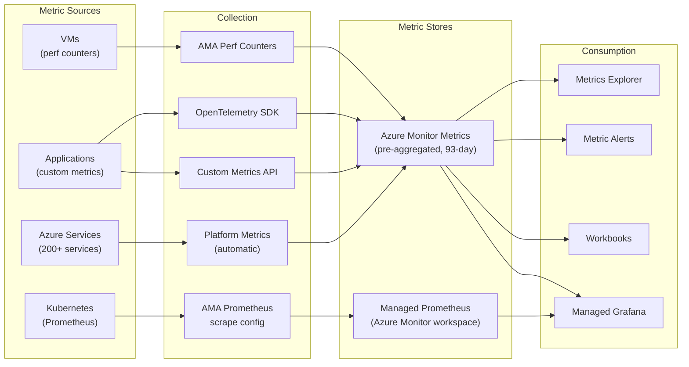

# Metrics Migration: Custom Metrics and Prometheus to Azure Monitor

**Audience:** Platform Engineers, SREs
**Source platforms:** Datadog Metrics, New Relic Dimensional Metrics, Splunk Infrastructure Monitoring (SignalFx), Prometheus
**Target:** Azure Monitor Metrics, Azure Monitor managed Prometheus
**Last updated:** 2026-04-30

---

## Overview

Metrics are the foundation of infrastructure monitoring, alerting, and capacity planning. This guide covers migrating custom application metrics, Prometheus workloads, and infrastructure metrics from third-party platforms to Azure Monitor.

Azure Monitor provides two metrics backends:

1. **Azure Monitor Metrics** -- native metric store for Azure platform metrics and custom application metrics. Pre-aggregated, low-latency (near real-time), 93-day retention, and zero additional cost for platform metrics.
2. **Azure Monitor managed service for Prometheus** -- fully managed Prometheus-compatible backend for Kubernetes and cloud-native workloads. Supports PromQL queries and Grafana dashboards.

---

## Architecture: Metrics collection



---

## Azure Monitor Metrics vs Managed Prometheus

| Feature        | Azure Monitor Metrics                                     | Managed Prometheus                                 |
| -------------- | --------------------------------------------------------- | -------------------------------------------------- |
| Query language | KQL (via Log Analytics) + Metrics Explorer                | PromQL                                             |
| Best for       | Azure platform metrics, custom app metrics                | Kubernetes, cloud-native, multi-cloud              |
| Retention      | 93 days                                                   | Configurable (default 18 months)                   |
| Granularity    | 1 minute (minimum)                                        | 15 seconds (typical scrape interval)               |
| Cost model     | Free for platform metrics; custom metrics per time series | Per million samples ingested                       |
| Dashboard tool | Metrics Explorer, Workbooks                               | Managed Grafana                                    |
| Alert support  | Azure Monitor metric alerts                               | Prometheus recording/alerting rules + Azure alerts |
| Multi-cloud    | Azure only                                                | Any Prometheus remote-write compatible source      |

**Recommendation:** Use Azure Monitor Metrics for Azure-native workloads and custom application metrics. Use Managed Prometheus for Kubernetes-centric environments and teams with existing PromQL expertise.

---

## Custom metrics migration

### Sending custom metrics from applications

**OpenTelemetry SDK (recommended):**

=== ".NET"

    ```csharp
    using System.Diagnostics.Metrics;

    var meter = new Meter("MyApp.Metrics");
    var requestCounter = meter.CreateCounter<long>("http_requests_total");
    var responseHistogram = meter.CreateHistogram<double>("http_response_duration_ms");

    // In request handler
    requestCounter.Add(1, new KeyValuePair<string, object?>("method", "GET"),
                           new KeyValuePair<string, object?>("endpoint", "/api/orders"));
    responseHistogram.Record(durationMs);
    ```

=== "Java"

    ```java
    import io.opentelemetry.api.metrics.Meter;
    import io.opentelemetry.api.metrics.LongCounter;
    import io.opentelemetry.api.metrics.DoubleHistogram;

    Meter meter = GlobalOpenTelemetry.getMeter("MyApp.Metrics");
    LongCounter requestCounter = meter.counterBuilder("http_requests_total").build();
    DoubleHistogram responseHistogram = meter.histogramBuilder("http_response_duration_ms").build();

    requestCounter.add(1, Attributes.of(
        AttributeKey.stringKey("method"), "GET",
        AttributeKey.stringKey("endpoint"), "/api/orders"));
    responseHistogram.record(durationMs);
    ```

=== "Python"

    ```python
    from opentelemetry import metrics

    meter = metrics.get_meter("MyApp.Metrics")
    request_counter = meter.create_counter("http_requests_total")
    response_histogram = meter.create_histogram("http_response_duration_ms")

    request_counter.add(1, {"method": "GET", "endpoint": "/api/orders"})
    response_histogram.record(duration_ms)
    ```

**Custom metrics REST API (for non-SDK sources):**

```bash
curl -X POST \
  "https://<region>.monitoring.azure.com/<resource-id>/metrics" \
  -H "Authorization: Bearer $TOKEN" \
  -H "Content-Type: application/json" \
  -d '{
    "time": "2026-04-30T10:00:00Z",
    "data": {
      "baseData": {
        "metric": "OrdersProcessed",
        "namespace": "MyApp",
        "dimNames": ["Region", "Priority"],
        "series": [
          {"dimValues": ["us-east", "high"], "count": 42, "sum": 42}
        ]
      }
    }
  }'
```

### Metric naming conventions

| Source platform | Naming convention                                   | Azure Monitor equivalent                       |
| --------------- | --------------------------------------------------- | ---------------------------------------------- |
| Datadog         | `http.request.duration` (dot-separated)             | `http_request_duration` (underscore-separated) |
| New Relic       | `httpRequestDuration` (camelCase)                   | `http_request_duration`                        |
| Splunk/SignalFx | `http.request.duration` (dot-separated)             | `http_request_duration`                        |
| Prometheus      | `http_request_duration_seconds` (snake_case + unit) | Same (Prometheus-compatible)                   |

Azure Monitor Metrics supports up to 10 custom dimensions per metric. Plan dimension cardinality carefully -- high-cardinality dimensions (user IDs, request IDs) should be logged, not metricated.

---

## Prometheus metrics migration

For teams running Prometheus or using Prometheus client libraries, Azure Monitor managed service for Prometheus provides a fully managed backend.

### Enabling Managed Prometheus for AKS

```bicep
resource azureMonitorWorkspace 'Microsoft.Monitor/accounts@2023-04-03' = {
  name: 'amw-observability'
  location: location
}

resource aksCluster 'Microsoft.ContainerService/managedClusters@2024-01-01' = {
  name: aksClusterName
  location: location
  properties: {
    azureMonitorProfile: {
      metrics: {
        enabled: true
        kubeStateMetrics: {
          metricLabelsAllowlist: '*'
          metricAnnotationsAllowList: '*'
        }
      }
    }
  }
}

resource dataCollectionRuleAssociation 'Microsoft.Insights/dataCollectionRuleAssociations@2022-06-01' = {
  name: 'dcra-prometheus'
  scope: aksCluster
  properties: {
    dataCollectionRuleId: prometheusDataCollectionRule.id
  }
}
```

### Custom Prometheus scrape configuration

For application-specific Prometheus endpoints, configure custom scrape targets via a ConfigMap.

```yaml
# ama-metrics-prometheus-config ConfigMap
apiVersion: v1
kind: ConfigMap
metadata:
    name: ama-metrics-prometheus-config
    namespace: kube-system
data:
    prometheus-config: |
        scrape_configs:
          - job_name: 'my-application'
            scrape_interval: 30s
            kubernetes_sd_configs:
              - role: pod
            relabel_configs:
              - source_labels: [__meta_kubernetes_pod_annotation_prometheus_io_scrape]
                action: keep
                regex: true
              - source_labels: [__meta_kubernetes_pod_annotation_prometheus_io_port]
                action: replace
                target_label: __address__
                regex: (.+)
                replacement: $1
```

### Querying with PromQL via Managed Grafana

```promql
# Request rate by service
rate(http_requests_total{namespace="production"}[5m])

# P99 latency
histogram_quantile(0.99, rate(http_request_duration_seconds_bucket[5m]))

# Error rate percentage
sum(rate(http_requests_total{status=~"5.."}[5m])) /
sum(rate(http_requests_total[5m])) * 100
```

---

## Metric retention and aggregation

| Metric type             | Retention                | Granularity               | Cost                        |
| ----------------------- | ------------------------ | ------------------------- | --------------------------- |
| Azure platform metrics  | 93 days                  | 1-minute                  | Free                        |
| Custom metrics (API)    | 93 days                  | 1-minute (pre-aggregated) | $0.258/1K time series/month |
| Managed Prometheus      | 18 months (configurable) | Scrape interval (15s-60s) | $0.08/million samples       |
| Log-based metrics (KQL) | Workspace retention      | Query-time aggregation    | Included with log ingestion |

### Cost optimization for metrics

1. **Reduce cardinality.** Drop high-cardinality labels (user_id, request_id) from metrics. These belong in logs/traces.
2. **Increase scrape intervals.** For non-critical services, use 60-second scrape intervals instead of 15-second.
3. **Use recording rules.** Pre-aggregate frequently queried metrics to reduce query cost and improve dashboard performance.
4. **Drop unused metrics.** Configure relabel rules to drop metrics that no dashboard or alert consumes.

```yaml
# Drop unused metrics via relabel config
relabel_configs:
    - source_labels: [__name__]
      regex: "go_gc_.*|process_.*"
      action: drop
```

---

## Metric alerts

Azure Monitor metric alerts evaluate at 1-minute minimum frequency (vs 10-second for Splunk Observability detectors).

**Static threshold alert (Bicep):**

```bicep
resource metricAlert 'Microsoft.Insights/metricAlerts@2018-03-01' = {
  name: 'high-cpu-alert'
  location: 'global'
  properties: {
    severity: 2
    evaluationFrequency: 'PT1M'
    windowSize: 'PT5M'
    criteria: {
      'odata.type': 'Microsoft.Azure.Monitor.SingleResourceMultipleMetricCriteria'
      allOf: [
        {
          name: 'HighCPU'
          metricName: 'Percentage CPU'
          operator: 'GreaterThan'
          threshold: 90
          timeAggregation: 'Average'
        }
      ]
    }
    actions: [
      { actionGroupId: actionGroup.id }
    ]
    scopes: [ vmResourceId ]
  }
}
```

**Dynamic threshold alert:** Azure Monitor learns the metric's normal pattern and alerts on deviations. This replaces Datadog's anomaly detection and Splunk's dynamic thresholds.

---

## Migration checklist

- [ ] Inventory all custom metrics (name, dimensions, source, consumers)
- [ ] Map metric naming conventions to Azure Monitor format
- [ ] Deploy Azure Monitor managed Prometheus for Kubernetes workloads
- [ ] Configure custom scrape targets for application Prometheus endpoints
- [ ] Migrate custom application metrics to OpenTelemetry SDK
- [ ] Configure metric alerts (static and dynamic thresholds)
- [ ] Set up Managed Grafana with Prometheus data source for PromQL dashboards
- [ ] Create recording rules for frequently queried aggregations
- [ ] Optimize metric cardinality (drop high-cardinality dimensions)
- [ ] Validate metric alert parity with source platform

---

**Related:** [APM Migration](apm-migration.md) | [Log Migration](log-migration.md) | [Alerting Migration](alerting-migration.md) | [Dashboard Migration](dashboard-migration.md)
