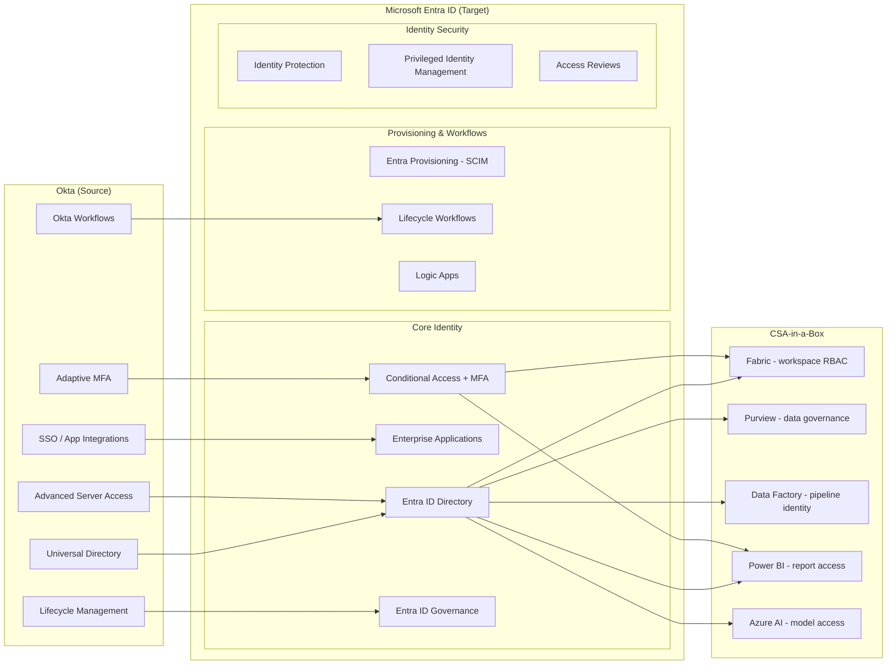

# Migrating from Okta to Microsoft Entra ID

**Status:** Authored 2026-04-30
**Audience:** Identity Architects, Security Engineers, IT Directors, Federal IAM Teams
**Scope:** Full migration from Okta Workforce Identity Cloud to Microsoft Entra ID with CSA-in-a-Box identity governance integration.

---

!!! tip "Expanded Migration Center Available"
This playbook is the concise migration reference. For the complete Okta-to-Entra ID migration package -- including executive briefs, TCO analysis, feature mapping, federation cutover tutorials, federal guidance, and benchmarks -- visit the **[Okta to Entra ID Migration Center](okta-to-entra-id/index.md)**.

    **Quick links:**

    - [Why Entra ID over Okta (Executive Brief)](okta-to-entra-id/why-entra-over-okta.md)
    - [Total Cost of Ownership Analysis](okta-to-entra-id/tco-analysis.md)
    - [Complete Feature Mapping (50+ features)](okta-to-entra-id/feature-mapping-complete.md)
    - [Federation Migration Guide](okta-to-entra-id/federation-migration.md)
    - [SSO Application Migration](okta-to-entra-id/sso-migration.md)
    - [MFA Migration Guide](okta-to-entra-id/mfa-migration.md)
    - [Federal Migration Guide](okta-to-entra-id/federal-migration-guide.md)
    - [Tutorials & Walkthroughs](okta-to-entra-id/index.md#tutorials)
    - [Benchmarks & Performance](okta-to-entra-id/benchmarks.md)
    - [Best Practices](okta-to-entra-id/best-practices.md)

    **Migration guides by domain:** [Federation](okta-to-entra-id/federation-migration.md) | [SSO](okta-to-entra-id/sso-migration.md) | [MFA](okta-to-entra-id/mfa-migration.md) | [Provisioning](okta-to-entra-id/provisioning-migration.md) | [Conditional Access](okta-to-entra-id/conditional-access-migration.md)

---

## 1. Executive summary

The identity provider market is consolidating around platforms that integrate natively with productivity, security, and compliance stacks. Okta's high-profile security breaches in 2022 and 2023 -- including the compromise of its customer support system and source code repositories -- have eroded confidence in Okta as a standalone identity provider, particularly in regulated and federal environments.

Microsoft Entra ID (formerly Azure Active Directory) is the identity platform underlying Microsoft 365, Azure, and the Microsoft security stack. For organizations already licensing Microsoft 365 E3 or E5, Entra ID P1 and P2 are included at no additional per-user cost -- eliminating the standalone identity provider line item entirely.

**CSA-in-a-Box extends the migration story.** Identity is foundational to every CSA-in-a-Box component -- Microsoft Fabric workspaces, Databricks clusters, Azure Data Factory pipelines, Purview governance policies, Azure AI services, and Power BI reports all authenticate through Entra ID. Consolidating identity to Entra ID simplifies access governance across the entire data platform, enables unified Conditional Access policies, and provides a single audit trail for compliance frameworks (FedRAMP, CMMC, HIPAA).

Microsoft has published a dedicated [Okta-to-Entra ID migration tutorial series](https://learn.microsoft.com/entra/identity/enterprise-apps/migrate-apps-from-okta) covering application SSO migration, sign-on policy migration, and provisioning migration.

---

## 2. Why migrate now

| Driver                           | Detail                                                                                                                                                                                                                       |
| -------------------------------- | ---------------------------------------------------------------------------------------------------------------------------------------------------------------------------------------------------------------------------- |
| **Okta security incidents**      | The 2022 Lapsus$ breach and 2023 customer support system compromise demonstrated systemic security gaps. Identity providers must meet the highest security bar; Okta's track record raises risk for regulated organizations. |
| **M365 licensing inclusion**     | Entra ID P1 is included with M365 E3; Entra ID P2 is included with M365 E5. Organizations already paying for M365 are paying twice for identity when they also license Okta.                                                 |
| **Unified security stack**       | Entra ID integrates natively with Defender XDR, Sentinel, Purview, and Security Copilot. Okta requires custom integrations for each Microsoft security service.                                                              |
| **Identity consolidation trend** | Gartner and Forrester recommend reducing identity provider sprawl. Organizations running both Okta and Entra ID maintain two policy engines, two MFA systems, and two audit trails.                                          |
| **Conditional Access richness**  | Entra Conditional Access provides device compliance, application protection policies, authentication context, continuous access evaluation, and GPS-based named locations that exceed Okta sign-on policies.                 |
| **Federal compliance**           | Entra ID is available in Azure Government with FedRAMP High and IL4/IL5 authorization. CSA-in-a-Box compliance matrices map identity controls across NIST 800-53, CMMC, and HIPAA.                                           |

---

## 3. Migration architecture overview

---

## 4. Migration phases

### Phase 0 -- Discovery and assessment (Weeks 1-3)

Inventory the Okta environment:

- **Directory:** users, groups, group rules, custom attributes, profile mappings
- **Applications:** all SSO integrations (SAML, OIDC, SWA), provisioning connectors
- **MFA:** enrolled factors per user (Okta Verify, FIDO2, SMS, voice)
- **Sign-on policies:** global and per-app policies, network zones, device trust
- **Lifecycle management:** joiner/mover/leaver workflows, provisioning rules
- **Okta Workflows:** custom automation flows (connectors, actions, tables)
- **API access:** OAuth authorization servers, custom scopes, API tokens
- **Advanced Server Access:** server enrollment, client configurations

**Artifacts:** Okta inventory spreadsheet, application-to-protocol mapping, MFA enrollment report, sign-on policy export, provisioning connector inventory.

### Phase 1 -- Entra ID foundation (Weeks 4-6)

1. Configure Entra ID tenant (or validate existing M365 tenant)
2. Establish hybrid identity if on-premises AD exists (Entra Connect Sync or Cloud Sync)
3. Configure custom domains (verify all domains currently in Okta)
4. Set up Entra ID administrative units for delegated administration
5. Establish Conditional Access baseline policies (block legacy auth, require MFA for admins)
6. Configure Identity Protection risk policies

### Phase 2 -- Application SSO migration (Weeks 7-14)

1. Categorize applications by protocol (SAML, OIDC, SWA, header-based)
2. Migrate gallery applications using Entra Enterprise Apps (map to Okta Integration Network equivalents)
3. Configure custom SAML and OIDC applications with claims mapping
4. Migrate SWA apps to Entra My Apps with password SSO or upgrade to SAML
5. Validate SSO for each application with pilot group
6. Migrate provisioning connectors (SCIM) to Entra provisioning

### Phase 3 -- MFA migration (Weeks 15-18)

1. Deploy Microsoft Authenticator to pilot group
2. Configure FIDO2 security key support in Entra ID
3. Establish MFA re-enrollment campaign (user communication, self-service registration)
4. Migrate phishing-resistant MFA (Okta FastPass to passkeys + Microsoft Authenticator)
5. Configure Conditional Access MFA policies (per-app, risk-based)

### Phase 4 -- Sign-on policy migration (Weeks 19-22)

1. Map Okta global sign-on policies to Entra Conditional Access policies
2. Map Okta per-app sign-on policies to application-scoped Conditional Access
3. Configure named locations (IP ranges, GPS-based, countries)
4. Configure device compliance integration (Intune)
5. Implement authentication context for step-up scenarios
6. Enable continuous access evaluation (CAE)

### Phase 5 -- Provisioning and lifecycle (Weeks 23-26)

1. Migrate HR-driven provisioning (Workday/SuccessFactors) to Entra provisioning
2. Configure Lifecycle Workflows for joiner/mover/leaver automation
3. Migrate Okta Workflows to Logic Apps or Lifecycle Workflows
4. Set up access reviews for periodic certification
5. Configure Privileged Identity Management (PIM) for admin roles

### Phase 6 -- Federation cutover and decommission (Weeks 27-32)

1. Execute staged rollover -- migrate pilot groups from Okta federation to Entra managed auth
2. Validate all applications, MFA, and policies for migrated users
3. Execute full federation cutover (remove Okta as IdP)
4. Parallel-run period for validation
5. Decommission Okta tenant
6. Update DNS, CNAME, and well-known endpoints

---

## 5. CSA-in-a-Box integration for identity governance

CSA-in-a-Box benefits directly from Entra ID consolidation:

| Capability                      | With Okta + Entra ID (dual IdP)                                                                                    | With Entra ID only                                                                       |
| ------------------------------- | ------------------------------------------------------------------------------------------------------------------ | ---------------------------------------------------------------------------------------- |
| **Fabric workspace access**     | Complex -- users authenticate via Okta federation, then Entra authorizes Fabric access; SSO gaps possible          | Native -- Entra groups map directly to Fabric workspace roles                            |
| **Purview data governance**     | Dual audit trail -- Okta logs identity events, Entra logs resource access; correlation requires custom integration | Single audit trail -- identity and resource access in one log stream for compliance      |
| **Conditional Access for data** | Limited -- Okta policies do not extend to Azure resource access                                                    | Full -- Conditional Access policies apply to Fabric, Power BI, Data Factory, AI services |
| **Power BI row-level security** | Group sync delay -- Okta group changes must propagate through federation before RLS updates                        | Real-time -- Entra group membership changes reflect immediately in Power BI RLS          |
| **Compliance evidence**         | Two identity systems to audit for FedRAMP, CMMC, HIPAA                                                             | Single identity control plane with unified compliance evidence                           |

---

## 6. Federal considerations

- **FedRAMP High:** Entra ID in Azure Government holds FedRAMP High authorization. Okta holds FedRAMP Moderate (Workforce Identity Cloud).
- **PIV/CAC support:** Entra ID supports certificate-based authentication (CBA) for PIV/CAC smartcards natively. Okta requires third-party SAML bridge for PIV.
- **CISA Zero Trust:** EO 14028 and OMB M-22-09 require phishing-resistant MFA and least-privilege access. Entra Conditional Access + PIM + FIDO2 passkeys provide the complete stack.
- **Identity provider consolidation:** Federal agencies are consolidating identity providers to reduce attack surface. Running Okta and Entra ID doubles the identity attack surface.
- **IL4/IL5:** Entra ID is available in Azure Government for IL4 and IL5 workloads. Okta does not have IL4/IL5 authorization.

---

## 7. Cost comparison (illustrative)

For a **typical enterprise** (5,000 users, M365 E5 licensed, currently using Okta Workforce Identity + Adaptive MFA):

| Cost element              | Okta (annual)                             | Entra ID (annual)                 |
| ------------------------- | ----------------------------------------- | --------------------------------- |
| Workforce Identity Cloud  | $150,000 - $200,000 ($2.50-$3.33/user/mo) | $0 (included in M365 E3/E5)       |
| Adaptive MFA              | $75,000 - $100,000 ($1.25-$1.67/user/mo)  | $0 (included in Entra ID P1/P2)   |
| Lifecycle Management      | $100,000 - $125,000 ($1.67-$2.08/user/mo) | $0 (Entra ID Governance in E5)    |
| Advanced Server Access    | $60,000 - $90,000 ($1.00-$1.50/user/mo)   | $0 (Entra ID + Azure RBAC)        |
| Admin FTE (Okta platform) | $150,000 - $200,000 (1-2 Okta admins)     | $0 (consolidated with M365 admin) |
| **Total annual**          | **$535,000 - $715,000**                   | **$0 incremental**                |

See [TCO Analysis](okta-to-entra-id/tco-analysis.md) for detailed 3-year projections.

---

## 8. Risk mitigation

| Risk                            | Mitigation                                                                                                   |
| ------------------------------- | ------------------------------------------------------------------------------------------------------------ |
| SSO disruption during migration | App-by-app migration with pilot group validation; Okta as SP during transition                               |
| MFA re-enrollment friction      | 30-day self-service enrollment window; IT help desk surge staffing; clear user communication                 |
| Conditional Access policy gaps  | Policy-by-policy mapping document; parallel policy enforcement during transition                             |
| Application compatibility       | Pre-migration testing with protocol-specific validation (SAML assertions, OIDC tokens, claims)               |
| Compliance re-certification     | CSA-in-a-Box compliance matrices provide control mapping continuity; unified audit trail simplifies evidence |
| Federation cutover failure      | Staged rollover with rollback capability; keep Okta tenant active for 90 days post-cutover                   |

---

## 9. Related resources

- **Migration index:** [docs/migrations/README.md](README.md)
- **Federation cutover tutorial:** [Tutorial](okta-to-entra-id/tutorial-federation-cutover.md)
- **App SSO migration tutorial:** [Tutorial](okta-to-entra-id/tutorial-app-sso.md)
- **Federal migration guide:** [Federal Guide](okta-to-entra-id/federal-migration-guide.md)
- **CSA-in-a-Box compliance matrices:**
    - `docs/compliance/nist-800-53-rev5.md`
    - `docs/compliance/fedramp-moderate.md`
    - `docs/compliance/cmmc-2.0-l2.md`
- **Microsoft Learn references:**
    - [Migrate apps from Okta to Entra ID](https://learn.microsoft.com/entra/identity/enterprise-apps/migrate-apps-from-okta)
    - [Migrate Okta sign-on policies to Entra Conditional Access](https://learn.microsoft.com/entra/identity/enterprise-apps/migrate-okta-sign-on-policies-conditional-access)
    - [Migrate Okta sync provisioning to Entra Connect](https://learn.microsoft.com/entra/identity/enterprise-apps/migrate-okta-sync-provisioning-to-azure-active-directory-connect-based-synchronization)
    - [Migrate Okta federation to Entra managed authentication](https://learn.microsoft.com/entra/identity/enterprise-apps/migrate-okta-federation-to-azure-active-directory)
    - [Microsoft Entra ID documentation](https://learn.microsoft.com/entra/identity/)

---

**Maintainers:** csa-inabox core team
**Last updated:** 2026-04-30
